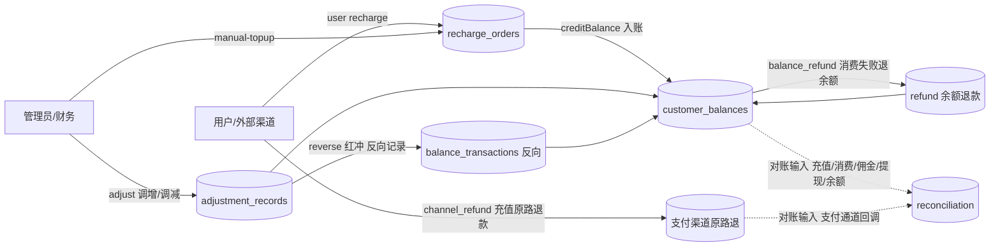

# 核心资金域总览

- 文档 ID：PRD-BILLING-000
- 状态：approved
- 生效版本：v1.0.0
- 主权威 ADR：ADR-0018（文档集）、ADR-0001–0004、0006、0008–0013、0020–0024、0029（统一决策）
- 定位：第一批核心资金需求（PRD）**跨主题总览**；只提供资金域主题地图、术语、依赖顺序、资金流向、金额上限与错误码汇总和追踪入口，**不重复定义各主题具体业务规则**（ADR-0018 §"finance-overview.md 只作地图和导航"）

> **关系**：本文件与 [README.md](README.md)（目录索引）互补——README 是 5 个主题 PRD 的文件索引，本文件是跨主题的**资金域全景**。各主题的权威规则见对应 PRD；本文件陈述的事实均来自这些已 `approved` 文档，不新增虚构规则。

## 1. 资金域全景

资金域是平台运营资金流入/流出/调整/核算的闭环。共 5 个核心主题，外加 5 项**横向统一决策域**（精度、权限、幂等、通知、迁移）。各主题由统一入账语义（`creditBalance`）与统一安全闸（金额上限 + 分级审批 + 24h 限额 + 状态守卫 + 2FA）串接。

| 主题 | PRD | 定位（角色 × 目标 × 边界一句话） |
|---|---|---|
| 充值 | [recharge.md](recharge.md) | 资金流入主链路：用户自助充值（支付宝/微信/对公，单笔 ≤¥1,000,000）与管理员人工上账共用 `recharge_orders`；目标是入账闭环 + 余额兜底 + 权限点鉴权 + 必通知；边界是**不做**退款展开（见退款主题）与负余额。 |
| 人工上账 | [manual-topup.md](manual-topup.md) | 管理员/财务为指定用户正规入账（线下/对公到账、赠送补偿），单笔 ≤¥50,000 且**超限不进终审档**；目标是分级审核闭环 + 自动建户兜底 + 24h 限额 + 2FA；边界是不开放一次性大额、不落 `platform_ledger`。 |
| 调账 | [balance-adjustment.md](balance-adjustment.md) | 平台对用户余额人工调整（调增/调减/红冲），允许赠送/补偿/纠错/扣减；目标是 R5–R7 统一资金风控（分级审批、拆分规避、操作级 2FA + 二次确认）；边界是仅 `admin`/`super_admin`（`finance.adjust`）、禁止负余额、纠错走红冲不走退款语义。 |
| 退款/红冲 | [refund-and-reversal.md](refund-and-reversal.md) | 按业务类型分流资金流出：消费/API 失败退**余额**、充值订单退**原路**、调账/人工上账纠错走**红冲**（独立反向记录）；目标是标准化/可审计/禁负；边界是同一事件不并行"原路+余额回滚"、不落 `platform_ledger`。 |
| 结算/对账 | [settlement-and-reconciliation.md](settlement-and-reconciliation.md) | 对账引擎（日切/实时/深度）交叉比对平台与外部凭据、差异分级处理 + 代理结算周期关账确认；目标是可持续对账闭环；边界是不作为资金写入口替代业务链路、本期仅 CNY 单币种。 |

> 主题边界遵循 ADR-0020（资金方向/负余额）、ADR-0012（`platform_ledger` 预留）、ADR-0024（角色枚举）。

## 2. 依赖与顺序

```
充值(recharge_orders 表) ──认证语义──► 人工上账(复用同表, method='manual')
        │                                        │  共用 creditBalance 建户/增额/流水 + 24h 限额
        ▼                                        ▼
   充值订单原路退款(refund 状态机) ◄──消费失败退余额──── 调账(红冲纠错认领人工上账/充值错误)
        │                                                        │
        ▼                                                        ▼
   结算/对账(现金流：充值/消费/佣金/提现/余额连续性) ◄──调账/退款/充值均为对账输入──┘
```

实现顺序依赖：先订**充值 + 人工上账**（共用 `recharge_orders` 与 `creditBalance`）→ 再**调账**（复用分级审批/24h 限额/2FA）→ **退款/红冲**（分型与纠错依赖前三者）→ 最后**结算/对账**（对账等式聚合前四主题资金链路）。横向决策域（精度/权限/幂等/通知/迁移）贯穿所有主题。

## 3. 资金流向图（mermaid）



> 图上所有资金变动均写 `balance_transactions`（内部 `numeric(18,8)`），入账/扣减/红冲遵循 ADR-0006 资金链路与 ADR-0020 方向约束。完整精度规范见 [billing-and-money-precision.md](../../06-data-and-architecture/billing-and-money-precision.md)。

## 4. 金额上限与错误码汇总

### 4.1 金额上限/阈值（来源各主题 PRD §金额与 ADR-0001/0013/0022）

| 指标 | 值 | 依据 |
|---|---|---|
| 用户自助充值单笔上限 | ¥1,000,000 | ADR-0001、recharge PRD |
| 人工上账单笔上限 | ¥50,000（超限拒绝，不进终审档） | ADR-0001 + `open-issues.md` 项 13 |
| 调账单笔上限 | ¥50,000 | ADR-0001 |
| 审批阈值 | ≤¥10,000 单人 / >¥10,000 且 ≤¥100,000 双人 / >¥100,000 `super_admin` 终审 | ADR-0001 |
| 24h 累计限额（operator/recipient） | 默认各 ¥50,000，`exceed_action`=`escalate`/`reject` | ADR-0013/0022 |
| 用户充值最低 / 人工上账最低 | ¥1 / ¥0.01 | ref-2.2.6、PRD-整改 |
| 精度 | 输入 ≤2 位小数；内部余额/流水 `numeric(18,8)`；佣金 `numeric(18,4)`；报告金额 `numeric(18,6)`；本期仅 CNY | ADR-0002 |

### 4.2 核心资金错误码（来源 `05-api/errors.md` 与各主题 SPEC 错误码表）

| 错误码 | HTTP | 含义 |
|---|---|---:|
| `VALIDATION_ERROR` | 400 | 参数/业务校验失败 |
| `PERMISSION_DENIED` | 403 | 无权限点/越权（统一，不 200 掩盖） |
| `OPERATION_2FA_REQUIRED`（及其 INVALID/EXPIRED/NOT_ENABLED） | 403 | 缺/错/过期/未启用操作级 2FA（**不用 401** 防误登出） |
| `BALANCE_NOT_FOUND` | 404 | 余额账户缺失（入账兜底前可能返回；兜底后不应出现） |
| `ORDER_ALREADY_PROCESSED` | 409 | 单据已处理/并发重复审核 |
| `DUPLICATE_BUSINESS_REFERENCE` | 409 | 业务凭证（转账单号等）重复 |
| `IDEMPOTENCY_CONFLICT` | 409 | 同 Key 对应不同请求摘要 |
| `CYCLE_ALREADY_CLOSED` / `SETTLEMENT_AMOUNT_NEGATIVE` | 409/400 | 结算重复关账 / 调整后金额为负 |
| `DAILY_LIMIT_EXCEEDED` / `OPERATION_2FA_LOCKED` | 429 | 24h 限额超限拒绝 / 2FA 锁定 |
| `INSUFFICIENT_BALANCE` | 422 | 余额不足（禁负余额受控业务错误） |
| `IDEMPOTENCY_UNAVAILABLE` | 503 | 幂等/并发基础设施不可用（不得静默绕过） |

> 完整错误码与兼容映射以 `05-api/errors.md` 及各主题 SPEC §错误码为准；本期仍在联合复核中的映射不在此伪造。

## 5. P1 帮助原则落地（不可降级）

按 `docs/PRODUCT-DESIGN-PRINCIPLES.md` P1：**每个功能页面标题旁 `[?]` 页面帮助 + 每个操作按钮旁 `[?]` 按钮级帮助**，不可降级。各主题合规落点与定制文案在对应 **SPEC §8/§9 `[?] 页面帮助与按钮级帮助对照表`**：

| 主题 | SPEC 帮助对照表所在章节 | 主要页面 |
|---|---|---|
| 充值 | [SPEC-BILLING-001 §8 `[?]` 对照表](../../03-functional-spec/03-billing-and-finance/recharge.md) | 用户端充值中心、管理端人工上账页 |
| 人工上账 | [SPEC-BILLING-002 §8 `[?]` 对照表](../../03-functional-spec/03-billing-and-finance/manual-topup.md) | `/admin/finance/manual-topup` |
| 调账 | [SPEC-BILLING-003 §8 `[?]` 对照表](../../03-functional-spec/03-billing-and-finance/balance-adjustment.md) | `/admin/finance/adjust`（finance-adjust）、`/admin/finance/risk-config` |
| 退款/红冲 | [SPEC-BILLING-004 §9 `[?]` 对照表](../../03-functional-spec/03-billing-and-finance/refund-and-reversal.md) | `admin/finance/refunds` |
| 结算/对账 | [SPEC-BILLING-005 §9 `[?]` 对照表](../../03-functional-spec/03-billing-and-finance/settlement-and-reconciliation.md) | `admin/finance/reconciliation`、`admin/finance/settlement` |

各 PRD 章节亦含 `[?] 页面帮助`/`[?] 按钮级帮助对照表`。缺失 → 不得进入开发/验收（AGENTS.md P1 红线）。

## 6. 通用资金安全闸（跨主题）

所有主题资金对象共用以下不可绕过的安全约束（依据 accepted ADR）：

1. **金额上限 + 精度**（ADR-0001/0002）：单笔上限与阈值如上；输入 ≤2 位小数，内部 `numeric(18,8)`，禁 JS `Number` 作最终计算。
2. **分级审批 + 职责分离**（ADR-0001/0004）：按金额档审批；创建人≠审批人、一级≠二级、终审≠前级。
3. **24h 滚动限额**（ADR-0013/0022）：operator/recipient 双维度，`now-24h ≤ created_at ≤ now`，`exceed_action` 处置；驳回/红冲不回退累计。
4. **操作级 2FA + 二次确认**（ADR-0008）：AND 关系，`super_admin` 不豁免；错误码不用 401。
5. **幂等 + 状态守卫**（ADR-0009）：创建类强制 `Idempotency-Key`；审批/执行状态条件更新（`WHERE status='…'` 守卫）；Redis 仅加速，DB 约束/事务/状态守卫为最终边界。
6. **禁止负余额**（ADR-0020）：任何退款/红冲/扣减/补账在余额不足时返回受控业务错误，不写入负余额。
7. **通知不出资金**（ADR-0010）：资金事务提交成功后才写 outbox 异步通知；通知失败不回滚资金事务；资金失败不得产生成功通知。

## 7. 未决事项

- 本总览不新列业务未决项；各主题的 `【待人工裁决】` 项以对应 PRD §未决事项为准。
- 跨主题未决（对账差异阈值口径、`platform_ledger` 启用、可调阈值冻结等）已登记 `docs/00-index/open-issues.md`（项 11 等）；本文件不将 CONFLICT 改写为正式规则。