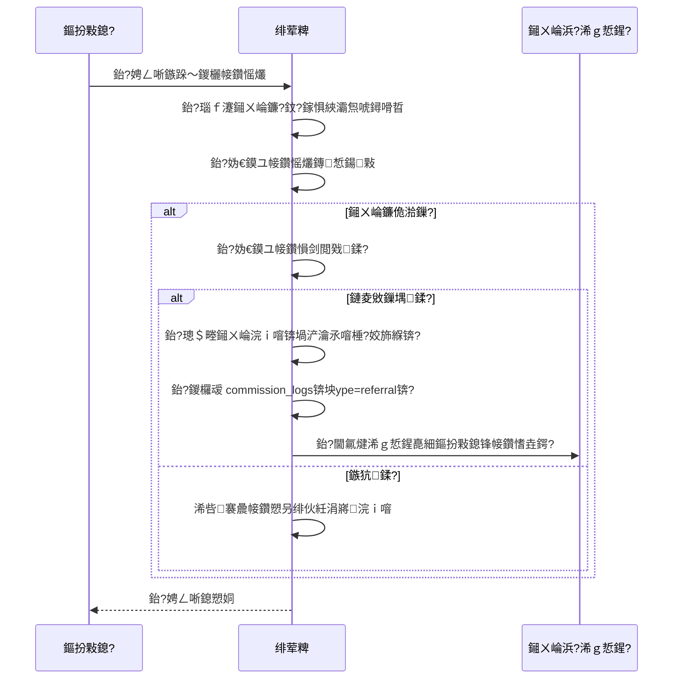


### 8.1 浠ｇ悊鍏戞崲鐮侀厤棰濅笌缁戝畾

> 馃搸 **杩愯惀鏂规鍙傝€?*锛歔`docs/ops-business-plan.md`](ops-business-plan.md) 搂3.3 鈥?浠ｇ悊鍟嗗厬鎹㈢爜鎷夋柊绛栫暐

#### 鑳屾櫙

浠ｇ悊鍟嗕綔涓轰富鍔涙嫇瀹㈡笭閬擄紝闇€瑕佸彲閲忓寲鐨勬媺鏂板伐鍏枫€傚綋鍓嶄唬鐞嗘棤娉曢€氳繃鍏戞崲鐮佽拷韪媺鏂版晥鏋滐紝瀵艰嚧浠ｇ悊鎷夋柊涓嶅彲杩芥函銆佷笉鍙縺鍔便€?

#### 鍔熻兘瑙勬牸

| 妯″潡 | 璇存槑 |
|------|------|
| 杩愯惀绔厤棰濋厤缃?| 涓烘瘡涓唬鐞嗚缃湀鍏戞崲鐮侀厤棰濓紙鏁伴噺 + 闈㈠€硷級锛屾敮鎸佹寜绛夌骇榛樿閰嶉 |
| 浠ｇ悊鐢宠娴佺▼ | 浠ｇ悊绔敵璇峰厬鎹㈢爜閰嶉 鈫?杩愯惀瀹℃牳 鈫?瀹℃牳閫氳繃鍚庡厬鎹㈢爜鍒拌处 |
| 鍏戞崲鐮佺粦瀹氫唬鐞?| 鐢熸垚鍏戞崲鐮佹椂缁戝畾 `agent_id`锛岀敤鎴峰厬鎹㈠悗鑷姩寤虹珛浠ｇ悊-鐢ㄦ埛鍏宠仈 |
| 浠ｇ悊绔粺璁?| 鍏戞崲鐮佷娇鐢ㄧ粺璁★細宸插彂鏀?/ 宸蹭娇鐢?/ 鍓╀綑棰濆害 / 鍏宠仈鐢ㄦ埛鍒楄〃 |
| 鍏呭€兼椿鍔ㄨ嚜鍔ㄥ叧鑱?| 鍏呭€兼椿鍔ㄧ敓鎴愮殑鍏戞崲鐮佸悓鏍锋敮鎸佷唬鐞嗙粦瀹?|

#### 鏁版嵁琛ㄥ彉鏇?

```typescript
// agent_redemption_quotas 鈥?浠ｇ悊鍏戞崲鐮侀厤棰?
export const agentRedemptionQuotas = pgTable("agent_redemption_quotas", {
  id: serial("id").primaryKey(),
  agentId: integer("agent_id").notNull().references(() => users.id),
  monthlyQuota: integer("monthly_quota").notNull().default(0),
  faceValue: numeric("face_value", { precision: 10, scale: 2 }).notNull(),
  usedQuota: integer("used_quota").notNull().default(0),
  period: varchar("period", { length: 7 }).notNull(),
  createdAt: timestamp("created_at", { withTimezone: true }).notNull().defaultNow(),
  updatedAt: timestamp("updated_at", { withTimezone: true }).notNull().defaultNow(),
});

// campaign_codes 琛ㄦ柊澧炲瓧娈?
agent_id: integer("agent_id").references(() => users.id),
```

#### API 鎺ュ彛

| 鏂规硶 | 璺緞 | 璇存槑 | 鏉冮檺 |
|------|------|------|------|
| `POST` | `/api/v1/admin/agents/:id/redemption-quota` | 璁剧疆浠ｇ悊鍏戞崲鐮侀厤棰?| agent_mgr 浠ヤ笂 |
| `GET` | `/api/v1/admin/agents/:id/redemption-quota` | 鏌ョ湅浠ｇ悊閰嶉 | agent_mgr 浠ヤ笂 |
| `POST` | `/api/v1/agent/redemption-codes/request` | 浠ｇ悊鐢宠鍏戞崲鐮?| agent 浠ヤ笂 |
| `GET` | `/api/v1/agent/redemption-codes` | 浠ｇ悊鏌ョ湅鍏戞崲鐮佸垪琛?| agent 浠ヤ笂 |
| `GET` | `/api/v1/agent/redemption-stats` | 浠ｇ悊鍏戞崲缁熻 | agent 浠ヤ笂 |

#### 鍓嶇鍙樻洿

| 椤甸潰 | 鍙樻洿 |
|------|------|
| 绠＄悊鍚庡彴 鈫?浠ｇ悊鍟嗚鎯?| 鏂板"鍏戞崲鐮侀厤棰?鏍囩椤碉紝閰嶇疆鏈堥厤棰濆拰闈㈠€?|
| 浠ｇ悊绔?鈫?鎺у埗鍙?| 鏂板"鎺ㄥ箍鍏戞崲鐮?鍏ュ彛锛屾煡鐪嬮厤棰濆拰宸插彂鏀惧厬鎹㈢爜 |
| 浠ｇ悊绔?鈫?缁熻 | 鏂板鍏戞崲鐮佷娇鐢ㄧ粺璁￠潰鏉?|
| 杩愯惀 鈫?娲诲姩绠＄悊 | 鍒涘缓娲诲姩鏃跺彲閫?鍒嗛厤缁欎唬鐞?妯″紡 |

---

### 8.2 鍏呭€兼椿鍔ㄨ嚜鍔ㄨ禒閫?

> 馃搸 **杩愯惀鏂规鍙傝€?*锛歔`docs/ops-business-plan.md`](ops-business-plan.md) 搂3.6 鈥?鍏呭€兼椿鍔ㄨ浆鍖?

#### 鑳屾櫙

褰撳墠鍏呭€兼椿鍔ㄩ渶瑕佺敤鎴锋墜鍔ㄨ緭鍏ュ厬鎹㈢爜锛岃浆鍖栫巼浣庛€傝嚜鍔ㄨ禒閫佹満鍒跺彲澶у箙鎻愬崌娲诲姩鍙備笌鐜囷紝鏇夸唬濂楅鐨勯浠樿垂浼樻儬鎰熺煡銆?

#### 鍔熻兘瑙勬牸

| 妯″潡 | 璇存槑 |
|------|------|
| 鑷姩璧犻€佽鍒?| 杩愯惀绔垱寤烘椿鍔ㄦ椂鍙€夋嫨"鑷姩璧犻€?妯″紡锛岄厤缃厖鍊奸噾棰濋棬妲涘拰璧犻€侀噾棰?|
| 瑙﹀彂鏃舵満 | 鐢ㄦ埛鍏呭€兼垚鍔?鈫?绯荤粺鑷姩鍒ゆ柇鏄惁绗﹀悎娲诲姩鏉′欢 鈫?鑷姩鍙戞斁鍏戞崲鐮佸埌鐢ㄦ埛璐︽埛 |
| 鐢ㄦ埛绔睍绀?| 鐢ㄦ埛鎺у埗鍙版柊澧?鎴戠殑浼樻儬鍒?椤甸潰锛屽睍绀哄凡鍒拌处鐨勫厬鎹㈢爜鍙婁娇鐢ㄧ姸鎬?|
| 浣欓涓嶈冻鎻愮ず | 浣欓涓嶈冻鏃朵紭鍏堝睍绀哄彲鐢ㄤ紭鎯犲埜锛屽紩瀵肩敤鎴蜂娇鐢?|
| 澶氭椿鍔ㄥ彔鍔?| 鏀寔鍚屾椂鍙備笌澶氫釜娲诲姩锛屾寜鏈€浼樿鍒欒嚜鍔ㄩ€夋嫨 |

#### 鏁版嵁琛ㄥ彉鏇?

```typescript
// campaigns 琛ㄦ柊澧炲瓧娈?
autoGrant: boolean("auto_grant").notNull().default(false),
minAmount: numeric("min_amount", { precision: 10, scale: 2 }),
grantAmount: numeric("grant_amount", { precision: 10, scale: 2 }),

// user_coupons 鈥?鐢ㄦ埛浼樻儬鍒歌〃锛堟柊澧烇級
export const userCoupons = pgTable("user_coupons", {
  id: serial("id").primaryKey(),
  userId: integer("user_id").notNull().references(() => users.id),
  campaignCodeId: integer("campaign_code_id").references(() => campaignCodes.id),
  amount: numeric("amount", { precision: 10, scale: 2 }).notNull(),
  status: varchar("status", { length: 20 }).notNull().default("active"),
  sourceCampaignId: integer("source_campaign_id"),
  sourceRechargeOrderId: integer("source_recharge_order_id"),
  expiresAt: timestamp("expires_at", { withTimezone: true }),
  usedAt: timestamp("used_at", { withTimezone: true }),
  createdAt: timestamp("created_at", { withTimezone: true }).notNull().defaultNow(),
});
```

#### API 鎺ュ彛

| 鏂规硶 | 璺緞 | 璇存槑 | 鏉冮檺 |
|------|------|------|------|
| `POST` | `/api/v1/admin/campaigns/:id/auto-grant` | 閰嶇疆鑷姩璧犻€佽鍒?| operator 浠ヤ笂 |
| `GET` | `/api/v1/me/coupons` | 鎴戠殑浼樻儬鍒稿垪琛?| 鐢ㄦ埛 |
| `POST` | `/api/v1/me/coupons/:id/redeem` | 浣跨敤浼樻儬鍒?| 鐢ㄦ埛 |
| `GET` | `/api/v1/me/coupons/available` | 鍙敤浼樻儬鍒革紙浣欓涓嶈冻鏃惰皟鐢級 | 鐢ㄦ埛 |

#### 鍓嶇鍙樻洿

| 椤甸潰 | 鍙樻洿 |
|------|------|
| 鐢ㄦ埛鎺у埗鍙?鈫?鏂板"浼樻儬鍒?鍏ュ彛 | 浼樻儬鍒稿垪琛ㄩ〉锛屽睍绀哄彲鐢?宸茬敤/宸茶繃鏈?|
| 鍏呭€兼垚鍔熼〉 | 灞曠ず鍒拌处鐨勪紭鎯犲埜锛?鎭枩鑾峰緱 楼10 浼樻儬鍒革紒" |
| 浣欓涓嶈冻鎻愮ず | 灞曠ず鍙敤浼樻儬鍒革細"鎮ㄦ湁 楼10 浼樻儬鍒稿彲鐢紝绔嬪嵆浣跨敤" |
| 杩愯惀 鈫?娲诲姩绠＄悊 鈫?鍒涘缓娲诲姩 | 鏂板"鑷姩璧犻€?寮€鍏冲拰閰嶇疆椤?|

---

### 8.3 鐢ㄦ埛鍒嗙兢鎺ㄩ€?

> 馃搸 **杩愯惀鏂规鍙傝€?*锛歔`docs/ops-business-plan.md`](ops-business-plan.md) 搂4.3 鈥?鐢ㄦ埛鍒嗙兢杩愯惀

#### 鑳屾櫙

褰撳墠閫氱煡鍙兘鍏ㄩ儴鎺ㄩ€侊紝鏃犳硶閽堝鐗瑰畾鐢ㄦ埛缇ょ簿鍑嗚Е杈撅紝瀵艰嚧杩愯惀娲诲姩杞寲鐜囦綆銆佺敤鎴锋敹鍒版棤鍏抽€氱煡浣撻獙宸€?

#### 鍔熻兘瑙勬牸

| 妯″潡 | 璇存槑 |
|------|------|
| 鍒嗙兢瑙勫垯寮曟搸 | 杩愯惀绔垱寤虹敤鎴峰垎缇わ紝鏀寔鎸夋敞鍐屾椂闂?娑堣垂閲戦/鏈€鍚庣櫥褰曟椂闂?鏈€鍚庤皟鐢ㄦ椂闂?鐢ㄦ埛绛夌骇/浠ｇ悊褰掑睘绛夌淮搴︾粍鍚堢瓫閫?|
| 鎺ㄩ€佷换鍔?| 鍩轰簬鍒嗙兢鍒涘缓鎺ㄩ€佷换鍔★紝閫夋嫨鎺ㄩ€佹笭閬擄紙绔欏唴閫氱煡+閭欢锛夊拰鍐呭妯℃澘 |
| 鍐呭妯℃澘鍙橀噺 | 鏀寔妯℃澘鍙橀噺锛歚{user_name}`, `{balance}`, `{last_model}` 绛?|
| 鎺ㄩ€佹晥鏋滅粺璁?| 鍙戦€侀噺 / 鎵撳紑鐜?/ 杞寲鐜?/ 鐐瑰嚮鐜?|
| 瀹氭椂鎺ㄩ€?| 鏀寔瀹氭椂鎵ц锛堢珛鍗?鎸囧畾鏃堕棿/鍛ㄦ湡鎬э級 |

#### 鏁版嵁琛ㄥ彉鏇?

```typescript
// user_segments 鈥?鐢ㄦ埛鍒嗙兢瀹氫箟
export const userSegments = pgTable("user_segments", {
  id: serial("id").primaryKey(),
  name: varchar("name", { length: 100 }).notNull(),
  description: text("description"),
  rules: jsonb("rules").notNull(),
  estimatedCount: integer("estimated_count"),
  createdBy: integer("created_by").references(() => users.id),
  createdAt: timestamp("created_at", { withTimezone: true }).notNull().defaultNow(),
  updatedAt: timestamp("updated_at", { withTimezone: true }).notNull().defaultNow(),
});

// segment_notifications 鈥?鍒嗙兢鎺ㄩ€佽褰?
export const segmentNotifications = pgTable("segment_notifications", {
  id: serial("id").primaryKey(),
  segmentId: integer("segment_id").notNull().references(() => userSegments.id),
  title: varchar("title", { length: 200 }).notNull(),
  content: text("content").notNull(),
  channel: jsonb("channel").notNull(),
  status: varchar("status", { length: 20 }).notNull().default("draft"),
  sentCount: integer("sent_count").default(0),
  openedCount: integer("opened_count").default(0),
  convertedCount: integer("converted_count").default(0),
  scheduledAt: timestamp("scheduled_at", { withTimezone: true }),
  sentAt: timestamp("sent_at", { withTimezone: true }),
  createdBy: integer("created_by").references(() => users.id),
  createdAt: timestamp("created_at", { withTimezone: true }).notNull().defaultNow(),
});
```

#### API 鎺ュ彛

| 鏂规硶 | 璺緞 | 璇存槑 | 鏉冮檺 |
|------|------|------|------|
| `POST` | `/api/v1/admin/user-segments` | 鍒涘缓鐢ㄦ埛鍒嗙兢 | operator 浠ヤ笂 |
| `GET` | `/api/v1/admin/user-segments` | 鍒嗙兢鍒楄〃 | operator 浠ヤ笂 |
| `POST` | `/api/v1/admin/user-segments/:id/estimate` | 棰勪及鍒嗙兢浜烘暟 | operator 浠ヤ笂 |
| `POST` | `/api/v1/admin/notifications/segment` | 鍒涘缓鍒嗙兢鎺ㄩ€佷换鍔?| operator 浠ヤ笂 |
| `GET` | `/api/v1/admin/notifications/segment` | 鎺ㄩ€佷换鍔″垪琛?| operator 浠ヤ笂 |
| `GET` | `/api/v1/admin/notifications/segment/:id/stats` | 鎺ㄩ€佹晥鏋滅粺璁?| operator 浠ヤ笂 |

#### 鍓嶇鍙樻洿

| 椤甸潰 | 鍙樻洿 |
|------|------|
| 杩愯惀 鈫?鏂板"鐢ㄦ埛鍒嗙兢"鍏ュ彛 | 鍒嗙兢鍒楄〃椤碉紝鏀寔鍒涘缓/缂栬緫/棰勮鍒嗙兢 |
| 杩愯惀 鈫?鍒嗙兢鍒涘缓 | 瑙勫垯閰嶇疆闈㈡澘锛屾敮鎸佸缁村害缁勫悎绛涢€?|
| 杩愯惀 鈫?鏂板"鍒嗙兢鎺ㄩ€?鍏ュ彛 | 鎺ㄩ€佷换鍔″垱寤洪〉锛岄€夋嫨鍒嗙兢+妯℃澘+娓犻亾+鏃堕棿 |
| 杩愯惀 鈫?鎺ㄩ€佹晥鏋?| 鎺ㄩ€佺粺璁￠潰鏉匡紝灞曠ず鍙戦€侀噺/鎵撳紑鐜?杞寲鐜?|

---

### 8.4 鑷姩鍖栨祦澶卞彫鍥?

> 馃搸 **杩愯惀鏂规鍙傝€?*锛歔`docs/ops-business-plan.md`](ops-business-plan.md) 搂4.2 鈥?娴佸け鍙洖绛栫暐

#### 鑳屾櫙

鐢ㄦ埛娴佸け鏄函鎸夐噺璁¤垂妯″紡鐨勬牳蹇冪棝鐐广€傚綋鍓嶆棤鑷姩鍖栧彫鍥炴満鍒讹紝娴佸け鐢ㄦ埛瀹屽叏闈犺繍钀ユ墜鍔ㄥ鐞嗭紝鏁堢巼浣庛€佽鐩栭潰绐勩€?

#### 鍔熻兘瑙勬牸

| 妯″潡 | 璇存槑 |
|------|------|
| 鍙洖瑙勫垯閰嶇疆 | 杩愯惀绔厤缃彫鍥炶鍒欙紝鏀寔澶氱骇瑙﹀彂鏉′欢锛?澶╂棤璋冪敤/14澶╂棤璋冪敤/30澶╂棤鐧诲綍 |
| 瑙﹀彂鏉′欢 | 鍩轰簬鏈€鍚庤皟鐢ㄦ椂闂村拰鏈€鍚庣櫥褰曟椂闂磋嚜鍔ㄦ娴?|
| 鍙戦€佸唴瀹?| 鍙厤缃偖浠舵ā鏉匡紝鏀寔鍙橀噺鏇挎崲 |
| 鍙戦€佹笭閬?| 閭欢 + 绔欏唴閫氱煡 |
| 浼樻儬鍒歌禒閫?| 鏀寔閰嶇疆鍙洖鏃惰嚜鍔ㄥ彂鏀惧厬鎹㈢爜鍒扮敤鎴疯处鎴?|
| 瑙勫垯绠＄悊 | 鍚敤/绂佺敤鍙洖瑙勫垯锛岃缃墽琛岄鐜?|
| 鏁堟灉缁熻 | 鍙戦€侀噺 / 鎵撳紑鐜?/ 鍙洖鐜?/ 鍙洖鍚?澶╃暀瀛樼巼 |

#### 鏁版嵁琛ㄥ彉鏇?

```typescript
// recall_rules 鈥?鍙洖瑙勫垯
export const recallRules = pgTable("recall_rules", {
  id: serial("id").primaryKey(),
  name: varchar("name", { length: 100 }).notNull(),
  triggerType: varchar("trigger_type", { length: 20 }).notNull(),
  triggerDays: integer("trigger_days").notNull(),
  channels: jsonb("channels").notNull().default(["email"]),
  emailTemplateName: varchar("email_template_name", { length: 100 }),
  notificationTitle: varchar("notification_title", { length: 200 }),
  notificationContent: text("notification_content"),
  grantCoupon: jsonb("grant_coupon"),
  cooldownDays: integer("cooldown_days").notNull().default(30),
  enabled: boolean("enabled").notNull().default(true),
  createdAt: timestamp("created_at", { withTimezone: true }).notNull().defaultNow(),
  updatedAt: timestamp("updated_at", { withTimezone: true }).notNull().defaultNow(),
});

// recall_logs 鈥?鍙洖鎵ц璁板綍
export const recallLogs = pgTable("recall_logs", {
  id: serial("id").primaryKey(),
  ruleId: integer("rule_id").notNull().references(() => recallRules.id),
  userId: integer("user_id").notNull().references(() => users.id),
  sentChannel: varchar("sent_channel", { length: 20 }),
  openedAt: timestamp("opened_at", { withTimezone: true }),
  returnedAt: timestamp("returned_at", { withTimezone: true }),
  grantCouponId: integer("grant_coupon_id"),
  createdAt: timestamp("created_at", { withTimezone: true }).notNull().defaultNow(),
});
```

#### API 鎺ュ彛

| 鏂规硶 | 璺緞 | 璇存槑 | 鏉冮檺 |
|------|------|------|------|
| `POST` | `/api/v1/admin/recall-rules` | 鍒涘缓鍙洖瑙勫垯 | operator 浠ヤ笂 |
| `GET` | `/api/v1/admin/recall-rules` | 鍙洖瑙勫垯鍒楄〃 | operator 浠ヤ笂 |
| `PATCH` | `/api/v1/admin/recall-rules/:id` | 鏇存柊鍙洖瑙勫垯 | operator 浠ヤ笂 |
| `POST` | `/api/v1/admin/recall-rules/:id/toggle` | 鍚敤/绂佺敤瑙勫垯 | operator 浠ヤ笂 |
| `GET` | `/api/v1/admin/recall-stats` | 鍙洖鏁堟灉缁熻 | operator 浠ヤ笂 |

#### 鍓嶇鍙樻洿

| 椤甸潰 | 鍙樻洿 |
|------|------|
| 杩愯惀 鈫?鏂板"娴佸け鍙洖"鍏ュ彛 | 鍙洖瑙勫垯鍒楄〃椤碉紝灞曠ず瑙勫垯鐘舵€佸拰鏁堟灉姒傝 |
| 杩愯惀 鈫?鍙洖瑙勫垯缂栬緫 | 瑙勫垯閰嶇疆琛ㄥ崟锛屾敮鎸佽Е鍙戞潯浠?鍙戦€佸唴瀹?浼樻儬鍒歌禒閫侀厤缃?|
| 杩愯惀 鈫?鍙洖鏁堟灉 | 缁熻鐪嬫澘锛氬彂閫侀噺/鎵撳紑鐜?鍙洖鐜囪秼鍔垮浘锛屽彫鍥炴垚鏈垎鏋?|

---

### 8.5 杩愯惀澧為暱妯″潡鎬昏

| 妯″潡 | 浼樺厛绾?| 棰勪及宸ヤ綔閲?| 鏍稿績浠峰€?|
|------|--------|-----------|---------|
| 浠ｇ悊鍏戞崲鐮侀厤棰濅笌缁戝畾 | P0 | 鍚庣3d+鍓嶇2d | 浠ｇ悊鍟嗗彲閲忓寲鐨勬媺鏂板伐鍏?|
| 鍏呭€兼椿鍔ㄨ嚜鍔ㄨ禒閫?| P0 | 鍚庣2d+鍓嶇2d | 鎻愬崌鍏呭€艰浆鍖栫巼30%+ |
| 鐢ㄦ埛鍒嗙兢鎺ㄩ€?| P0 | 鍚庣4d+鍓嶇3d | 绮惧噯瑙﹁揪锛岃繍钀ユ晥鐜囨彁鍗?|
| 鑷姩鍖栨祦澶卞彫鍥?| P0 | 鍚庣3d+鍓嶇2d | 鍙洖鐜?5%+锛岄檷浣庢祦澶?|

**鍚堣**锛氬悗绔?2浜哄ぉ + 鍓嶇9浜哄ぉ = 绾?.5鍛?

---

### 8.6 鎺ㄨ崘鐮佽惀閿€绯荤粺

> **鍏宠仈**锛氫唬鐞嗗晢鎺ㄨ崘鐮佺鐞?鈫?鍚庡彴钀ラ攢閰嶇疆 鈫?鎺ㄨ崘浣ｉ噾缁撶畻
> **浠ｇ爜宸插疄鐜?*锛歚api/src/services/agent-core/referral.ts`锛堟帹鑽愮爜鐢熸垚涓庤В鏋愶級
> **鏂板**锛氬悗鍙拌惀閿€閰嶇疆闈㈡澘 + 鎺ㄨ崘浣ｉ噾缁撶畻

#### 鑳屾櫙

绯荤粺宸插疄鐜颁唬鐞嗗晢鎺ㄨ崘鐮佸姛鑳斤紙Redis 鍙屽悜鏄犲皠 + 鏁版嵁搴撴寔涔呭寲锛夛紝浣嗙己灏戣繍钀ラ厤缃叆鍙ｅ拰鎺ㄨ崘浣ｉ噾缁撶畻閫昏緫銆傞渶瑕佸皢鎺ㄨ崘鐮佺撼鍏ュ畬鏁磋惀閿€閾捐矾锛氳繍钀ラ厤缃帹鑽愯鍒?鈫?浠ｇ悊鐢熸垚鎺ㄥ箍鐮?鈫?鏂扮敤鎴峰～鍐欐帹鑽愮爜 鈫?浠ｇ悊鑾峰緱鎺ㄨ崘鏀剁泭銆?

#### 鍔熻兘瑙勬牸

| 妯″潡 | 璇存槑 |
|------|------|
| 鎺ㄨ崘鐮佺敓鎴?| 浠ｇ悊鍟嗚嚜鍔ㄧ敓鎴?浣嶆帹鑽愮爜锛屾敮鎸佺鐞嗗憳鎵嬪姩璁剧疆锛堝悗鍙帮級 |
| 鎺ㄨ崘鐮佹寔涔呭寲 | 鎺ㄨ崘鐮佸啓鍏?`agents.referral_code` 瀛楁锛孯edis 缂撳瓨鍔犻€熸煡璇?|
| 鎺ㄨ崘鐮佸敮涓€鎬?| 绯荤粺鑷姩鏍￠獙鍞竴鎬э紝鎺掗櫎鏄撴贩娣嗗瓧绗?O0Il |
| 鎺ㄨ崘鐮佽В鏋?| 閫氳繃鎺ㄨ崘鐮佹煡璇㈠綊灞炰唬鐞嗗晢锛岀敤浜庢敞鍐屾祦绋嬬粦瀹氫唬鐞嗗叧绯?|
| 鎺ㄨ崘浣ｉ噾瑙勫垯閰嶇疆 | 鍦?`commission_rules` 涓柊澧?`ruleType='referral'`锛屾敮鎸佸浐瀹氶噾棰?姣斾緥 |
| 鎺ㄨ崘娉ㄥ唽浣ｉ噾 | 鏂扮敤鎴锋敞鍐屾椂濉啓鎺ㄨ崘鐮侊紝鑷姩瑙﹀彂 `processReferralCommission` 缁撶畻 |
| 钀ラ攢閰嶇疆绠＄悊 | 鍚庡彴绠＄悊绔細鎺ㄨ崘鐮佸惎鐢?绂佺敤銆佹帹鑽愮爜鍒嗛厤銆佹帹鑽愪剑閲戦厤缃?|

#### 鏁版嵁琛ㄥ彉鏇?

**agents 琛ㄦ柊澧炲瓧娈?*锛堝凡娣诲姞锛夛細

```typescript
referralCode: varchar("referral_code", { length: 16 }),  // 鎺ㄨ崘鐮?
```

**commission_rules 琛ㄦ柊澧?ruleType锛歚referral`**锛?

```typescript
// commission_rules 涓?ruleType 鏂板 'referral' 绫诲瀷
// 鍥哄畾閲戦锛歠ixedAmount = 楼10锛堟柊鐢ㄦ埛娉ㄥ唽鍗冲鍔憋級
// 姣斾緥妯″紡锛歳ate = 0.1锛堟柊鐢ㄦ埛棣栨鍏呭€奸噾棰濈殑10%锛?
```

**system_configs 鏂板钀ラ攢閰嶇疆椤?*锛?

| key | 鍊?| 璇存槑 |
|-----|-----|------|
| `referral_enabled` | `true` / `false` | 鎺ㄨ崘鐮佸姛鑳藉叏灞€寮€鍏?|
| `referral_commission_type` | `fixed` / `percentage` | 鎺ㄨ崘浣ｉ噾璁＄畻鏂瑰紡 |
| `referral_fixed_amount` | `10.000000` | 鍥哄畾鎺ㄨ崘浣ｉ噾锛堝厓锛?|
| `referral_commission_rate` | `0.1000` | 姣斾緥浣ｉ噾锛堟柊鐢ㄦ埛棣栧厖閲戦鐨勭櫨鍒嗘瘮锛?|
| `referral_coupon_enabled` | `true` / `false` | 鎺ㄨ崘浜烘槸鍚﹁幏寰椾紭鎯犲埜 |
| `referral_coupon_amount` | `5.00` | 鎺ㄨ崘浜鸿幏寰楃殑浼樻儬鍒搁潰棰?|

#### API 鎺ュ彛

| 鏂规硶 | 璺緞 | 璇存槑 | 鏉冮檺 |
|------|------|------|------|
| `GET` | `/api/v1/agent/referral-code` | 鑾峰彇/鐢熸垚鎴戠殑鎺ㄨ崘鐮?| 浠ｇ悊鍟?|
| `POST` | `/api/v1/agent/referral-code/regenerate` | 閲嶆柊鐢熸垚鎺ㄨ崘鐮?| 浠ｇ悊鍟?|
| `PUT` | `/api/v1/admin/agents/:id/referral-code` | 绠＄悊鍛樿缃帹鑽愮爜 | agent_mgr 浠ヤ笂 |
| `GET` | `/api/v1/admin/referral-codes` | 鎵€鏈変唬鐞嗗晢鎺ㄨ崘鐮佸垪琛?| agent_mgr 浠ヤ笂 |
| `GET` | `/api/v1/admin/referral-config` | 鑾峰彇鎺ㄨ崘鐮佽惀閿€閰嶇疆 | operator 浠ヤ笂 |
| `PUT` | `/api/v1/admin/referral-config` | 鏇存柊鎺ㄨ崘鐮佽惀閿€閰嶇疆 | operator 浠ヤ笂 |
| `POST` | `/api/v1/auth/register?ref=CODE` | 娉ㄥ唽鏃舵惡甯︽帹鑽愮爜 | 鍏紑 |

#### 鍓嶇鍙樻洿

| 椤甸潰 | 鍙樻洿 |
|------|------|
| 浠ｇ悊绔?鈫?鎺у埗鍙?| 鏂板"鎺ㄥ箍鐮?鍏ュ彛锛屽睍绀烘帹鑽愮爜鍜屾帹骞夸簩缁寸爜 |
| 浠ｇ悊绔?鈫?鎺ㄥ箍缁熻 | 鎺ㄨ崘娉ㄥ唽鐢ㄦ埛鏁?/ 鎺ㄨ崘浣ｉ噾鏀剁泭 / 瓒嬪娍鍥?|
| 绠＄悊鍚庡彴 鈫?钀ラ攢閰嶇疆 | 鏂板"鎺ㄨ崘鐮佽惀閿€"閰嶇疆椤碉紝寮€鍏?浣ｉ噾/浼樻儬鍒?|
| 绠＄悊鍚庡彴 鈫?浠ｇ悊鍟嗙鐞?| 浠ｇ悊鍟嗚鎯呴〉鏂板鎺ㄨ崘鐮佸瓧娈碉紙鍙紪杈戯級 |
| 娉ㄥ唽椤甸潰 | 鏂板"鎺ㄨ崘鐮?杈撳叆妗嗭紙鍙€夛級 |

#### 鎺ㄨ崘浣ｉ噾缁撶畻娴佺▼



#### 涓庡叾浠栨ā鍧楃殑鍏崇郴

| 鍏宠仈妯″潡 | 璇存槑 |
|---------|------|
| 搂8.1 浠ｇ悊鍏戞崲鐮侀厤棰?| 鎺ㄨ崘鐮佸拰鍏戞崲鐮佷簰琛ワ細鎺ㄨ崘鐮佺敤浜庢敞鍐屾媺鏂帮紝鍏戞崲鐮佺敤浜庡厖鍊间紭鎯?|
| 搂8.2 鍏呭€兼椿鍔ㄨ嚜鍔ㄨ禒閫?| 鎺ㄨ崘娉ㄥ唽鎴愬姛鍚庯紝鏂扮敤鎴烽鍏呭彲瑙﹀彂鑷姩璧犻€?|
| 搂9 璐㈠姟妯″潡 | 鎺ㄨ崘浣ｉ噾閫氳繃 `commission_logs` 璁″叆浠ｇ悊鍟嗗緟缁撶畻浣ｉ噾 |
| 搂19 浠ｇ悊鍟嗘敮鎾?| 浠ｇ悊绔帶鍒跺彴灞曠ず鎺ㄥ箍缁熻鍜屾帹鑽愪剑閲戞敹鐩?|

---

### 8.7 杩愯惀澧為暱妯″潡鎬昏锛堟洿鏂帮級

| 妯″潡 | 浼樺厛绾?| 棰勪及宸ヤ綔閲?| 鏍稿績浠峰€?|
|------|--------|-----------|---------|
| 浠ｇ悊鍏戞崲鐮侀厤棰濅笌缁戝畾 | P0 | 鍚庣3d+鍓嶇2d | 浠ｇ悊鍟嗗彲閲忓寲鐨勬媺鏂板伐鍏?|
| 鍏呭€兼椿鍔ㄨ嚜鍔ㄨ禒閫?| P0 | 鍚庣2d+鍓嶇2d | 鎻愬崌鍏呭€艰浆鍖栫巼30%+ |
| 鐢ㄦ埛鍒嗙兢鎺ㄩ€?| P0 | 鍚庣4d+鍓嶇3d | 绮惧噯瑙﹁揪锛岃繍钀ユ晥鐜囨彁鍗?|
| 鑷姩鍖栨祦澶卞彫鍥?| P0 | 鍚庣3d+鍓嶇2d | 鍙洖鐜?5%+锛岄檷浣庢祦澶?|
| **鎺ㄨ崘鐮佽惀閿€绯荤粺** | **P0** | **鍚庣2d+鍓嶇2d** | **浠ｇ悊鍟嗘媺鏂板彲杩芥函锛屾帹鑽愪剑閲戞縺鍔?* |

**鍚堣**锛氬悗绔?4浜哄ぉ + 鍓嶇11浜哄ぉ = 绾?鍛?

---



