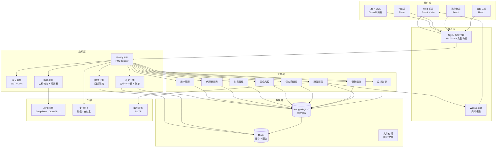
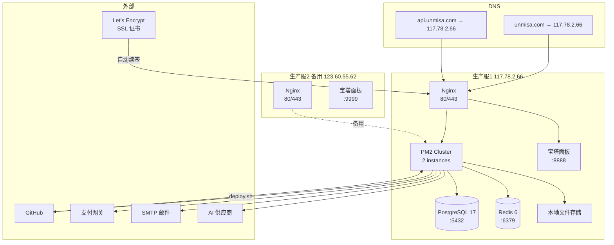
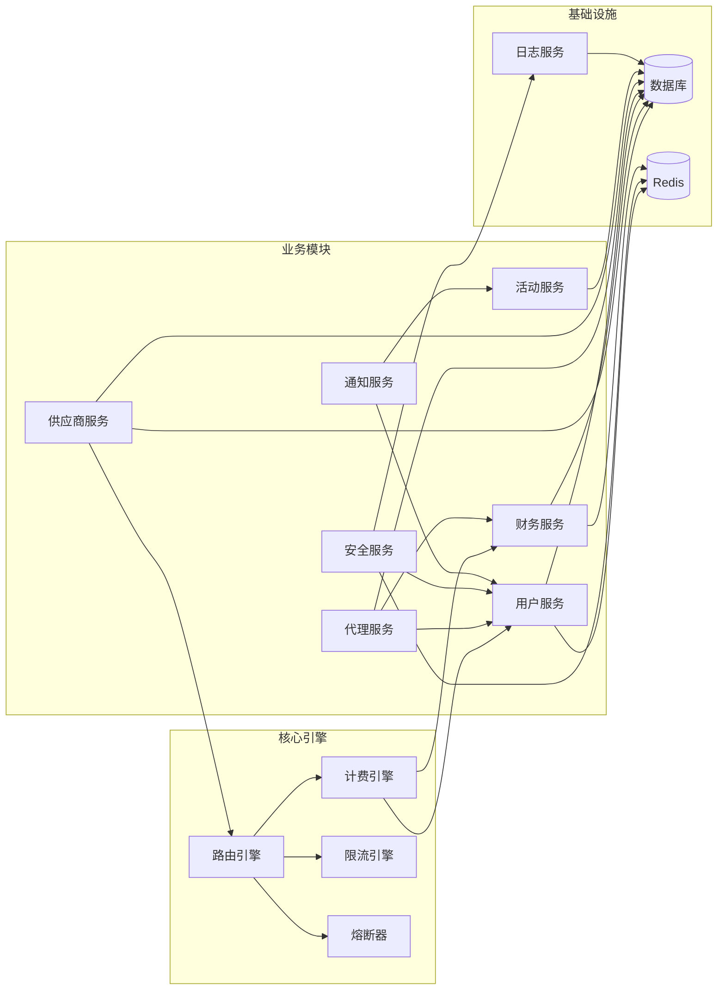
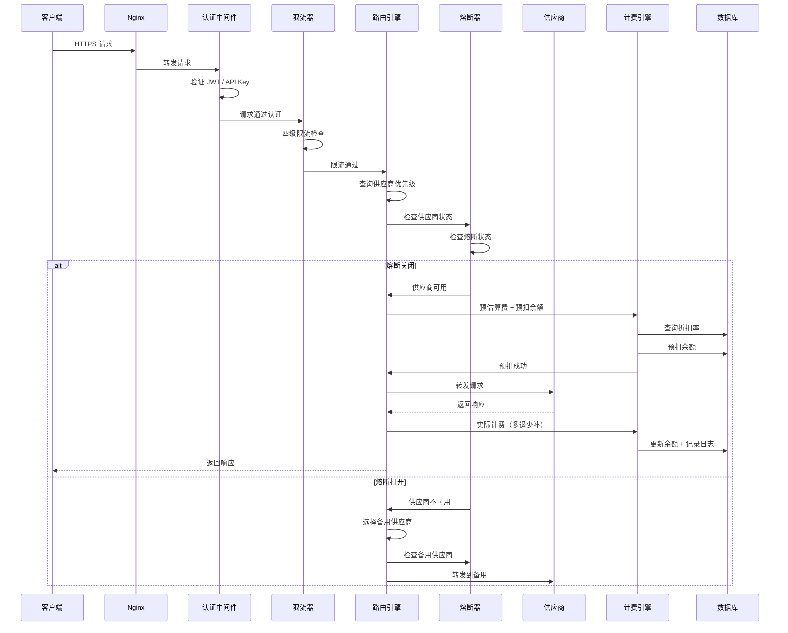
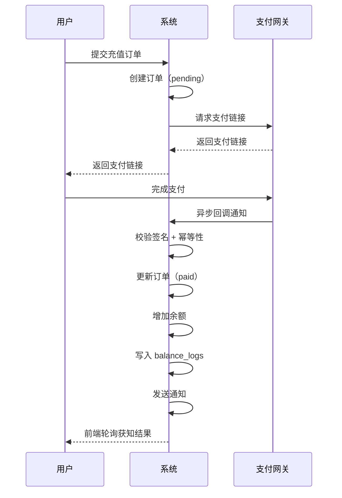
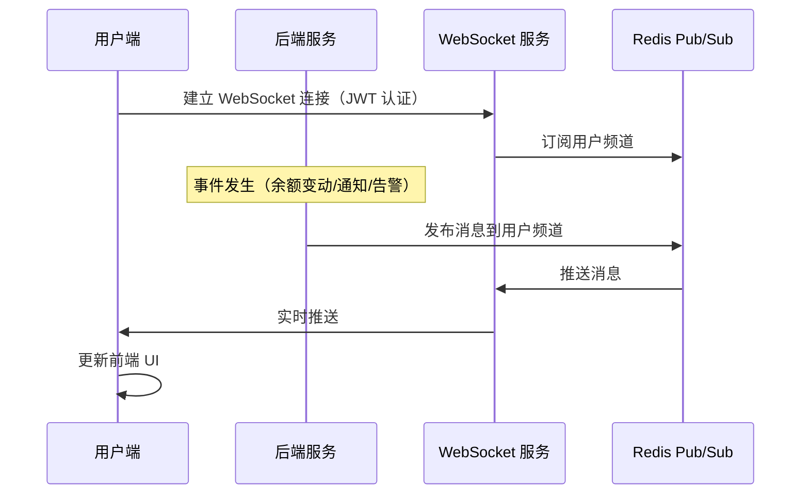
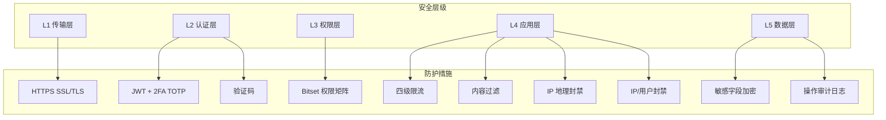

# 3cloud 系统架构概览

> **最后更新**：2026-08-12
> **版本**：v1.0
> **定位**：系统架构、部署架构、数据流、模块依赖关系的可视化参考

---

## 一、系统架构总览



---

## 二、部署架构



### 2.1 技术栈

| 层级 | 技术 | 版本 | 说明 |
|------|------|------|------|
| 前端框架 | React + TypeScript | 18+ | 组件化 UI |
| 构建工具 | Vite | 5+ | 开发/构建 |
| 后端框架 | Fastify | 4+ | Node.js 高性能框架 |
| ORM | Drizzle ORM | 最新 | TypeScript 优先 |
| 数据库 | PostgreSQL | 17 | 主数据库 |
| 缓存 | Redis | 6 | 缓存/限流/会话 |
| 反向代理 | Nginx | 1.30 | HTTPS + 静态资源 |
| 进程管理 | PM2 | 5+ | Node.js 进程守护 |
| 服务器 | Ubuntu | 22.04 | 生产环境 |

---

## 三、模块依赖关系



### 3.1 核心依赖说明

| 模块 | 依赖 | 说明 |
|------|------|------|
| 路由引擎 | 供应商服务、熔断器、限流引擎 | 请求转发前需知道供应商状态和限流限制 |
| 计费引擎 | 用户服务、财务服务 | 计费需要用户折扣率和定价配置 |
| 通知服务 | 用户服务、活动服务 | 通知需要知道用户订阅偏好 |
| 安全服务 | 用户服务、日志服务 | 安全检测需要用户行为和日志 |
| 代理商服务 | 财务服务、用户服务 | 佣金计算依赖财务数据 |

---

## 四、数据流

### 4.1 API 请求数据流



> **旁路：对话上下文留痕** — `/v1/chat/completions` 每笔请求（成功/失败/超时/402）在外层 `try/finally` 结束时异步落一条**完整上下文**到 `conversation_context_records`（上文 messages + 响应原文 + 路由/Key 指纹/计费明细，内容不脱敏）。写入为旁路（失败吞错、不影响主链路），供交易纠纷举证与政府调证；保留策略由调度器按 `system_config` 配置清理。详见 [`ref-12.9-conversation-records.md`](ref-12.9-conversation-records.md)。

### 4.2 充值数据流



### 4.3 实时推送数据流



---

## 五、服务拆分布局

> 后端服务已全部拆分完成（42 个目录，零残留大文件）

```
api/src/
├── routes/              ← 路由定义（按模块组织）
├── services/            ← 领域服务（已拆分为子目录）
│   ├── auth-service/    ← 认证服务（6 子文件）
│   ├── billing/        ← 计费服务（6 子文件）
│   ├── circuit-breaker/ ← 熔断器（6 子文件）
│   ├── stats-usage-service/ ← 统计服务（7 子文件）
│   ├── notification-service/ ← 通知服务（5 子文件）
│   ├── geo-check/      ← 地理检查（6 子文件）
│   ├── real-name-service/ ← 实名服务（7 子文件）
│   ├── invoice-service/ ← 发票服务（5 子文件）
│   ├── finance-service/ ← 财务服务（12 子文件）
│   ├── agent-finance/  ← 代理财务
│   ├── agent-core/     ← 代理核心
│   ├── agent-commission/ ← 代理佣金
│   ├── agent-withdraw/ ← 代理提现
│   ├── key-group/      ← Key 资源池
│   ├── recharge-service/ ← 充值服务
│   ├── config-version/ ← 配置版本（7 子文件）
│   ├── pricing/        ← 定价服务（5 子文件）
│   ├── email/          ← 邮件服务（4 子文件）
│   ├── refund/         ← 退款服务（2 子文件）
│   ├── rule-engine/    ← 规则引擎（2 子文件）
│   ├── session/        ← 会话管理（2 子文件）
│   ├── profit/         ← 利润分析（2 子文件）
│   ├── daily-summary/  ← 日汇总（3 子文件）
│   ├── alert-channel/  ← 告警通道（2 子文件）
│   ├── payment/        ← 支付适配（3 子文件）
│   ├── two-factor/     ← 双因素（2 子文件）
│   ├── security-event/ ← 安全事件（2 子文件）
│   ├── alert-service/  ← 告警服务（3 子文件）
│   └── operation-alert/ ← 运营告警
├── db/                 ← 数据库
│   ├── schema/         ← 42 个 Drizzle Schema 文件
│   ├── migrations/     ← 数据库迁移
│   └── seed/           ← 种子数据
└── middleware/          ← 中间件
```

---

## 六、安全性架构



---

## 七、交叉引用

| 其他文档 | 关联内容 |
|---------|---------|
| TOOLS.md | 本地开发环境架构 |
| ref-7-nfr.md | 可用性 SLA、灾备方案 |
| ops-guide.md | 部署架构详细配置 |
| frontend-routes.md | 前端页面路由结构 |
| ref-5.1-routing.md | 路由引擎架构 |
| ref-5.3-rate-limiter.md | 限流引擎架构 |
| ref-4.6-security.md | 安全架构详情 |