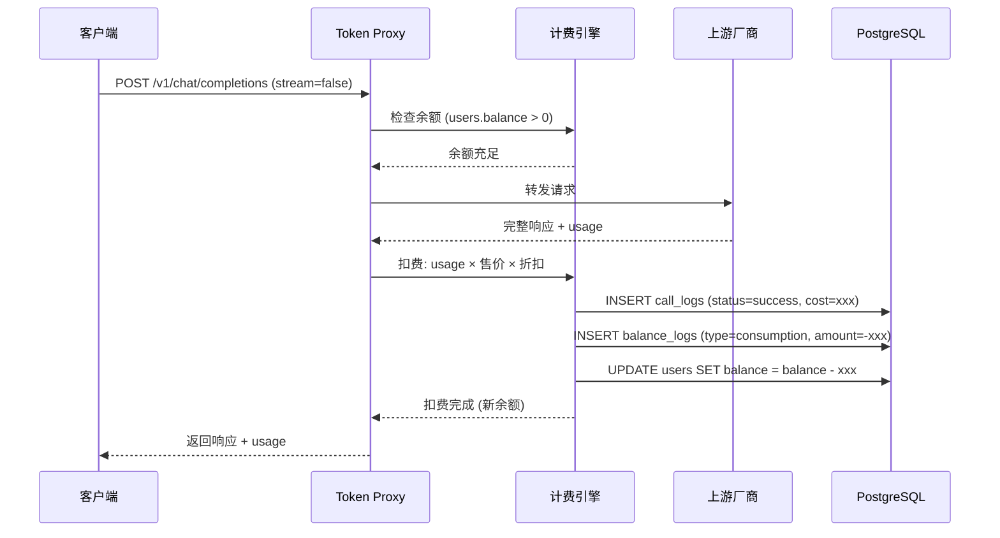
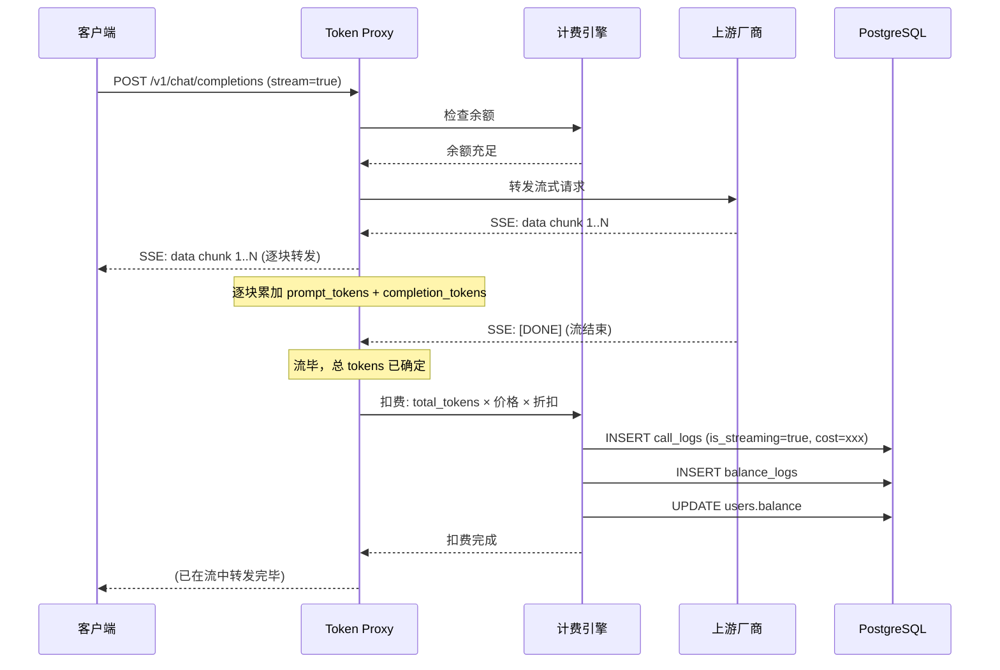
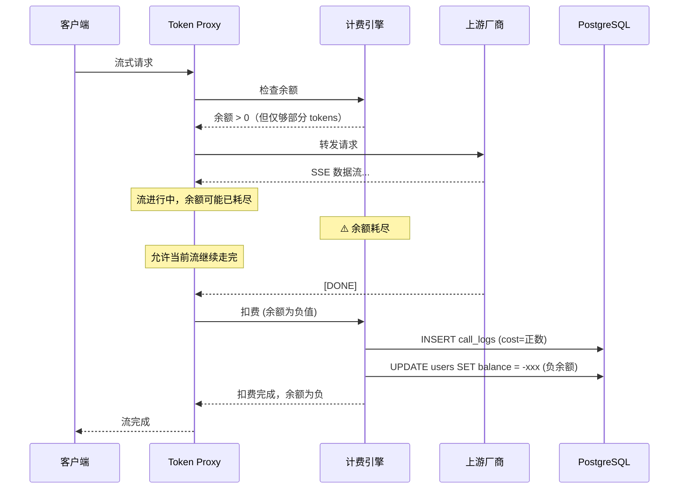
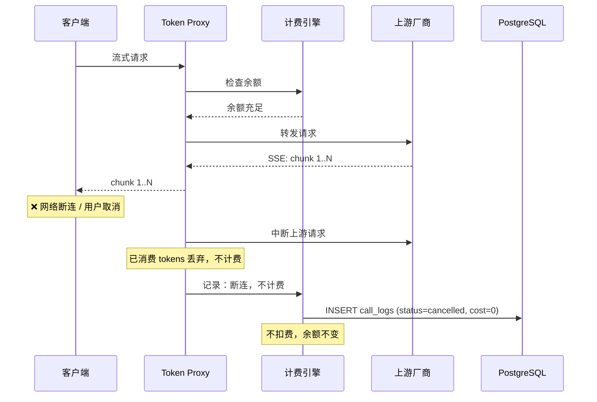
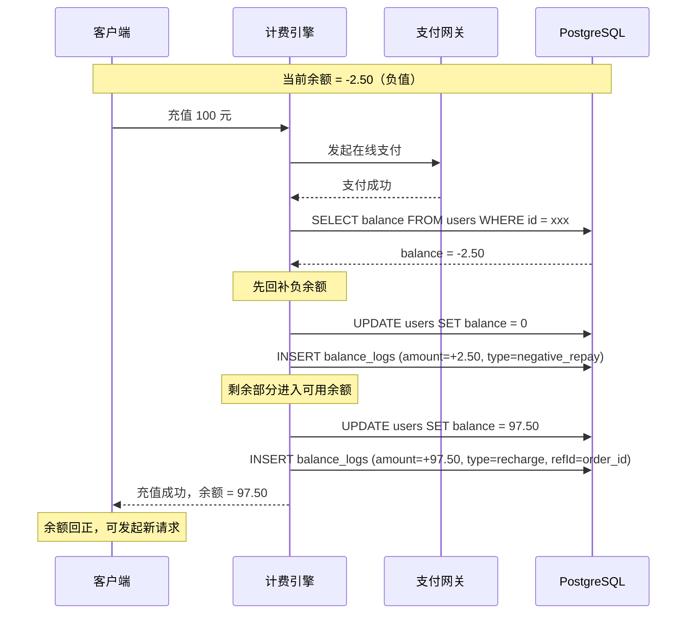

# 计费引擎 — 时序图

> 文件：`3cloud/docs/billing-engine-sequence.md`
> 关联实现：`api/src/services/billing.ts`

## 核心场景

### 场景 1：正常请求（余额充足）



### 场景 2：流式请求（正常结束）



### 场景 3：流式请求 — 中途余额耗尽（允许微超）



### 场景 4：流式请求 — 客户端中途断连（不计费）



### 场景 5：充值回补负余额



## 扣费公式

```
最终扣费 = (prompt_tokens × sellPriceInput + completion_tokens × sellPriceOutput)
          × pricingMultiplier
          × discountRate
```

| 变量 | 来源 |
|---|---|
| `sellPriceInput` / `sellPriceOutput` | `vendor_models` 表（每 token 售价） |
| `pricingMultiplier` | `system_configs` key `pricing_multiplier`，默认 1.33 |
| `discountRate` | 优先级：`user_discounts` > `users.discountRate` > `system_configs` 默认折扣 |

## 精度规则

- 所有金额字段使用 `DECIMAL(18,6)`（6 位小数）
- 每次扣费计算结果截断到 6 位小数（不四舍五入，防止累积溢收）
- 余额为负时，下次充值**必须**回补到 > 0 才能继续使用
