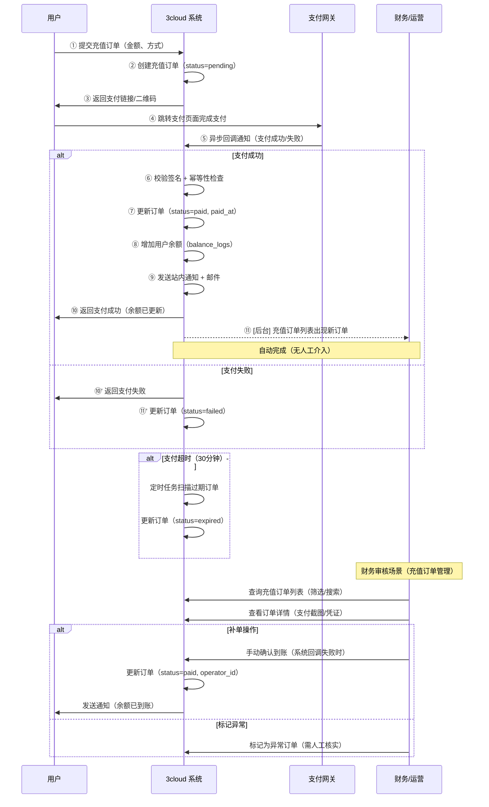

# 泳道图 1：充值流程

> **对应章节**：PRD-README.md §4.4 财务管理 — 充值模块
> **涉及角色**：用户 / 系统 / 支付网关 / 财务运营
> **状态机**：`pending → paid → processing → completed / failed`

## 关键决策点

| 步骤 | 决策 | 分支 | 说明 |
|------|------|------|------|
| ② | 订单重复？ | 幂等键去重 | 同一订单号不可重复创建 |
| ⑤ | 支付成功？ | 成功/失败 | 仅回调可作为最终状态 |
| ⑥ | 签名合法？ | 合法/不合法 | 不合法的回调直接丢弃 |
| 定时 | 超时？ | 30 分钟 | 过期订单自动关闭 |

## 可能的异常场景

1. **支付回调延迟**：用户已支付但回调未到 → 显示"支付中"，自动重试 3 次
2. **金额不一致**：回调金额与订单金额不符 → 触发告警，需人工干预
3. **支付网关异常**：支付成功但回调丢失 → 用户申诉 + 财务补单
4. **重复回调**：幂等性校验，同一 order_id 只处理一次