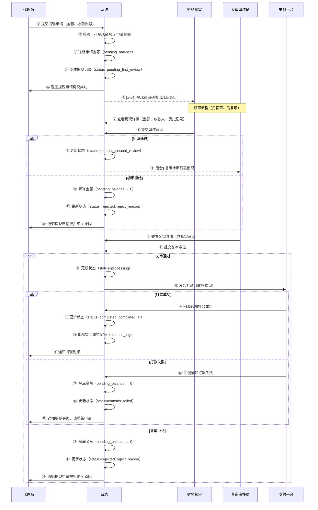

# 泳道图 2：代理提现双审流程

> **对应章节**：PRD-README.md §3 代理商体系 — 提现管理
> **涉及角色**：代理 / 系统 / 财务初审 / 复审审核员(角色可配置) / 支付平台
> **复审角色配置**：由 `site_configs.withdraw_second_review_role` 决定，可选 `agent_mgr`(代理管理岗) 或 `operator`(运营岗)
> **状态机**：`pending → pending_first_review → pending_second_review → processing → completed / rejected`

## 关键决策点

| 步骤 | 决策 | 分支 | 说明 |
|------|------|------|------|
| ② | 可提现余额充足？ | 是/否 | 不足直接拒绝 |
| ⑧ | 初审通过？ | 通过/拒绝 | 初审检查金额合理性、收款账号 |
| ⑬ | 复审通过？ | 通过/拒绝 | 复审核心检查（合规、风控），复审角色按系统配置 |
| ⑮ | 打款成功？ | 成功/失败 | 依赖支付平台回调 |

## 可能的异常场景

1. **初审通过后复审长时间未处理** → 超时告警（24h 未处理）
2. **打款回调超时** → 标记为 "打款中"，自动轮询（3 次/5 分钟）
3. **打款金额与申请金额不一致** → 紧急告警，需人工介入
4. **同一用户重复提现** → 限制最小间隔（24h cooldown）