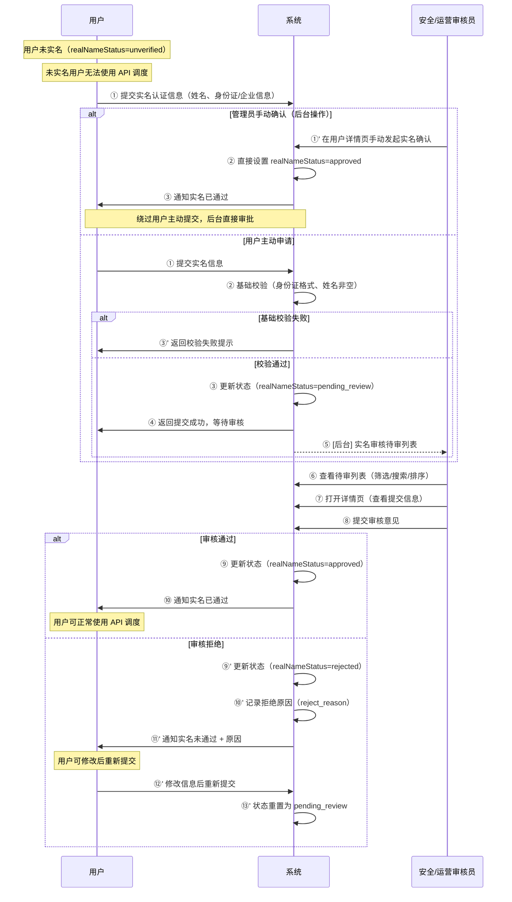

# 泳道图 3：实名审核流程

> **对应章节**：PRD-README.md §4.6 安全风控 — 实名认证
> **涉及角色**：用户 / 系统（自动校验） / 安全/运营审核
> **状态机**：`unverified → pending_review → approved / rejected`

## 关键决策点

| 步骤 | 决策 | 分支 | 说明 |
|------|------|------|------|
| ② | 基础校验通过？ | 通过/失败 | 身份证格式、信息准确性 |
| ⑧ | 审核通过？ | 通过/拒绝 | 人工核对身份证/企业信息真实性 |
| ⑪' | 重新提交？ | 允许重新提交 | 仅 rejected 状态可重新提交 |

## 可能的异常场景

1. **身份证照片与信息不符** → 拒绝并说明原因
2. **企业认证资料不完整** → 拒绝并提示补充材料
3. **重复提交** → 拒绝后重新提交，防止无限循环
4. **管理员绕过审核直接确认** → 操作日志记录，需审计追踪