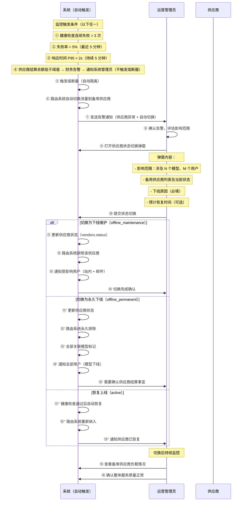

# 泳道图 4：供应商状态切换流程

> **对应章节**：PRD-README.md §4.3 供应商与模型管理
> **涉及角色**：系统（自动触发） / 运营管理员
> **状态机**：`active → offline_maintenance → offline_permanent → active`

## 关键决策点

| 步骤 | 决策 | 分支 | 说明 |
|------|------|------|------|
| ⑤ | 熔断器触发 | 自动隔离 | 连续失败 > 3 次自动熔断 |
| ④' | 余额不足 | 财务告警 | 不触发熔断器，走财务告警通道 → 通知 super_admin |
| — | 余额持续不足(24h) | 自动切换 | 系统管理员未处理 → 24h 后自动切换该供应商为维护模式 |
| ⑩ | 下线类型 | 维护/永久/恢复 | 影响范围不同 |
| ⑪'' | 自动恢复 | 健康检查通过 | 5 分钟恢复检查周期 |

## 可能的异常场景

1. **备用供应商也异常** → 全链路降级，仅返回缓存结果
2. **供应商自动恢复后仍有问题** → 二次熔断 + 自动转为 permanent
3. **关键供应商下线** → 高优先级告警，通知所有管理员
4. **用户投诉** → 客服安抚 + 解释原因 + 补偿方案（赠送额度）