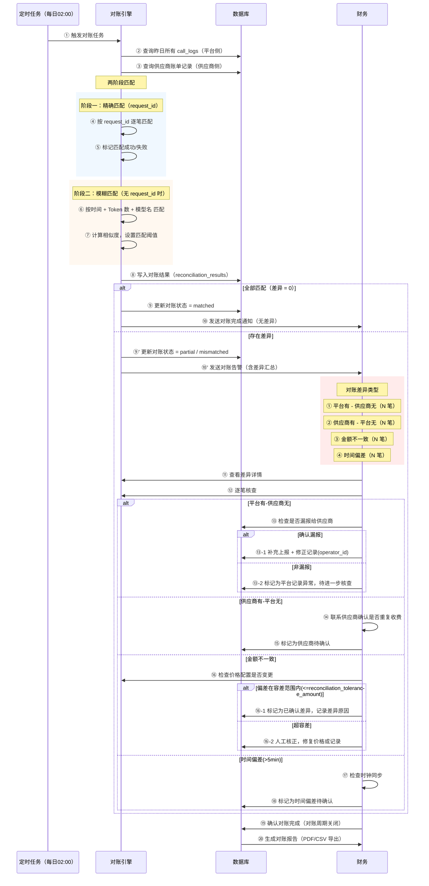

# 泳道图 5：自动对账流程

> **对应章节**：PRD-README.md §5.2.4 自动对账
> **涉及角色**：系统（定时任务） / 对账引擎 / 财务
> **运行频率**：每日 02:00（自动）

## 对账差异分类

| 差异类型 | 含义 | 处理方式 | 优先级 |
|---------|------|---------|--------|
| 平台有 - 供应商无 | 平台记录了消费，供应商账单中无此笔 | 检查是否漏报给供应商 | 🔴 高 |
| 供应商有 - 平台无 | 供应商账单中有记录，但平台无此消费 | 检查是否重复收费 | 🔴 高 |
| 金额不一致 | 双方都有记录但计费金额不同 | 检查价格配置是否变更 | 🟡 中 |
| 时间偏差 | 同一笔记录时间差 > 5 分钟 | 检查时钟同步 | 🟢 低 |
| 已确认差异 | 金额偏差在容差范围内(默认≤¥0.01) | 记录原因后确认不处理 | 🟢 低 |

## 可能的异常场景

1. **对账任务未按时执行** → 延迟告警，重试 3 次
2. **供应商账单格式变更** → 解析失败，标记为"需要人工导入"
3. **大量差异** → 超过 100 笔差异触发紧急告警
4. **对账报告中止** → 部分匹配后中止，标记为"部分完成"