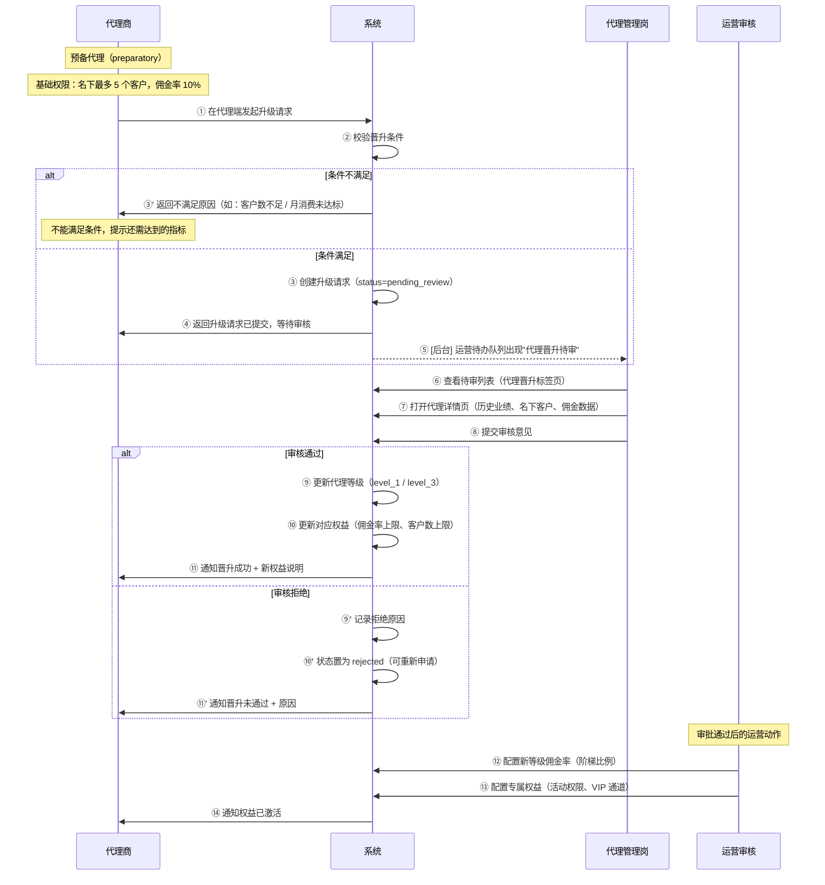

# 泳道图 6：代理晋升审核流程

> **对应章节**：PRD-README.md §3 代理商体系 — 层级与权益
> **涉及角色**：代理商 / 系统 / 代理管理 / 运营审核
> **状态机**：`preparatory → pending_review → level_1 / level_3 / rejected`

## 晋升条件配置

| 等级 | 晋升条件 | 佣金率 | 客户数上限 | 额外权益 |
|------|---------|--------|-----------|---------|
| 预备代理 | 注册即自动获得 | 10% | 5 | 基础代金券模板 |
| 一级代理 | 按系统配置（需实名+资质审核通过） | 可配置 | 可配置 | 专属客服、活动权限 |
| 高级代理 | 按系统配置 | 可配置 | 不限 | 专属经理、VIP 通道、定制报价 |

## 关键决策点

| 步骤 | 决策 | 分支 | 说明 |
|------|------|------|------|
| ② | 晋升条件满足？ | 是/否 | 系统自动校验硬性条件 |
| ⑧ | 审核通过？ | 通过/拒绝 | 人工审核（业绩真实性、合规性） |
| ⑩ | 佣金率配置 | 阶梯比例 | 在同一等级内可设置不同比例 |

## 可能的异常场景

1. **代理连续申请被拒** → 3 次拒绝后冻结 30 天
2. **晋升后业绩下滑** → 降级机制（连续 3 月不达标）
3. **代理等级与佣金率不匹配** → 佣金率需在等级范围内配置
4. **晋升审核超时** → 24h 未处理触发告警