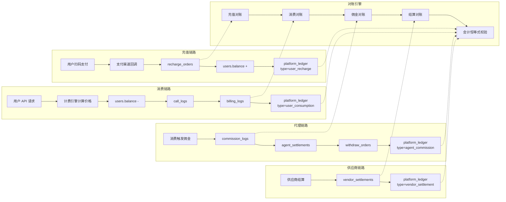

# 3cloud 运营手册（SOP）

> **最后更新**：2026-07-28
> **版本**：v1.0
> **定位**：面向运营/客服人员的日常操作 SOP，含用户管理、代理商管理、财务审核、异常处理、客服 FAQ

---

## 一、日常运营工作流

### 1.1 每日检查清单

```
□ 09:00 检查运营待办队列
  - 实名审核待办 → 24h 内处理完毕
  - 代理晋升待审 → 24h 内处理完毕
  - 提现待审（初审/复审）→ 24h 内处理完毕
  - 公告待推送 → 确认后推送

□ 10:00 检查异常指标
  - API 失败率 > 5% → 调查原因
  - 供应商可用率 < 95% → 确认是否需切换
  - 平台余额 < ¥100 → 通知 super_admin 充值

□ 14:00 检查财务
  - 充值订单是否有未处理（人工确认）
  - 对账结果是否有差异 → 处理差异

□ 17:00 检查安全事件
  - 是否有安全事件未处理
  - 是否有异常登录告警
  - 检查敏感操作日志

□ 每周一 检查全局
  - 上周期财务报表
  - 代理佣金结算
  - 供应商结算
  - 模型接入情况
```

### 1.2 运营待办队列

```
管理后台 → 总览 → 待办队列

┌─ 运营待办 ──────────────────────────────────────┐
│                                                   │
│ 🔴 紧急                                          │
│   ├── 提现待复审: 5 项 (超过 24h: 2 项)          │
│   └── 供应商异常: 1 个 (OpenAI 宕机中)            │
│                                                   │
│ 🟡 待处理                                         │
│   ├── 实名审核: 12 项 (待审 > 24h: 3 项)         │
│   ├── 代理晋升: 3 项                             │
│   ├── 充值人工确认: 2 项                         │
│   └── 公告待推送: 1 项                           │
│                                                   │
│ 🟢 例行                                           │
│   └── 今日对账: 已完成 (无差异)                   │
└───────────────────────────────────────────────────┘
```

---

## 二、用户管理 SOP

### 2.1 用户禁用

```
触发条件：
  - 用户违规使用 API（如爬虫、滥用）
  - 用户欠费超过 ¥50 且超过 30 天未充值
  - 用户涉及安全风险（如暴力破解、异地登录异常）

操作步骤：
  1. 管理后台 → 用户管理 → 搜索用户
  2. 点击用户 → 进入详情
  3. 点击 [禁用] 按钮
  4. 必填禁用原因（如：连续 30 天欠费未充值）
  5. 可选设置禁用时长（永久/指定日期）
  6. 确认 → 系统自动发送通知给用户

注意事项：
  - 禁用后用户可登录查看余额，不可调用 API
  - 禁用后该用户的 API Key 全部自动失效
  - 青少年用户禁用需 super_admin 审批
```

### 2.2 余额调整

```
触发条件：
  - 用户投诉充值未到账（需核实后补单）
  - 运营活动赠送
  - 系统错误导致的扣费异常

操作步骤：
  1. 管理后台 → 用户管理 → 搜索用户 → 详情
  2. 进入余额页 → 点击 [调整余额]
  3. 调整金额（正数增加，负数减少）
  4. 必填备注（如：充值回调丢失补单 #R20260728001）
  5. 确认 → 系统记录 balance_logs + 操作日志

注意事项：
  - 调整金额不得超过 ¥10,000（大额需 super_admin）
  - 减少余额时，减少后余额不可为负数（除非是欠费追补）
  - 每次调整都会记录操作人、操作时间、调整原因
```

### 2.3 实名审核审批

```
进入方式：管理后台 → 实名审核

审核要点：
  ✅ 身份证照片清晰可辨
  ✅ 身份证号与姓名匹配（系统自动校验）
  ✅ 姓名与注册信息一致
  ✅ 企业认证需营业执照清晰

审核通过：
  1. 点击 [审核通过]
  2. 用户可正常调度 API

审核拒绝：
  1. 点击 [审核拒绝]
  2. 必填拒绝原因（如：身份证照片模糊）
  3. 用户可重新提交

注意事项：
  - 审核超时 24h 自动升级告警
  - 同一用户 3 次拒绝后需管理员确认
```

---

## 三、代理商管理 SOP

### 3.1 代理晋升审批

```
进入方式：管理后台 → 代理商 → 晋升审核

系统自动校验条件：
  - 预备→一级：月消费 ≥ ¥10,000 或 客户 ≥ 20
  - 一级→高级：月消费 ≥ ¥100,000 或 客户 ≥ 200

人工审核要点：
  ✅ 客户数据真实性（是否刷单）
  ✅ 消费金额真实性（是否退款占比过高）
  ✅ 服务质量（客户投诉率是否过高）
  ✅ 合规性（是否有违规使用记录）

审批操作：
  通过 → 等级升级 + 权益更新 → 通知代理
  拒绝 → 填写原因 → 通知代理（可重新申请）
```

### 3.2 佣金率配置

```
进入方式：管理后台 → 代理商详情 → 佣金配置

配置规则：
  - 预备代理：固定 10%（不可修改）
  - 一级代理：15-25%（可在此范围内调整）
  - 高级代理：25-40%（可在此范围内调整）

操作步骤：
  1. 进入代理详情 → 佣金配置页
  2. 选择佣金类型（阶梯比例/固定金额/混合）
  3. 输入佣金率
  4. 确认 → 即时生效

注意事项：
  - 佣金率变更不影响历史佣金（仅影响变更后的消费）
  - 佣金率不可低于代理等级下限
  - 佣金率变更需记录变更日志
```

### 3.3 提现双审操作

```
进入方式：管理后台 → 财务 → 提现审核

初审（财务专员）：
  1. 查看提现申请详情
  2. 检查金额合理性（是否有异常大额提现）
  3. 检查收款账号一致性（与历史提现账号对比）
  4. 检查该代理是否有未处理的争议
  5. 通过 → 进入复审 / 拒绝 → 金额解冻

复审（财务主管/admin）：
  1. 查看初审意见
  2. 风控检查（提现频率、IP 异常、设备异常）
  3. 限额检查（单日提现总额上限）
  4. 通过 → 系统打款 / 拒绝 → 金额解冻

注意事项：
  - 初审和复审不可为同一人
  - 提现后 24h cooldown
  - 提现失败金额自动解冻，可重新申请
```

---

## 四、财务审核 SOP

### 4.1 充值人工确认

```
适用场景：
  - 对公转账（银行转账）需人工确认到账
  - 支付回调异常（用户已付款但未到账）

操作步骤：
  1. 管理后台 → 财务 → 充值订单 → 筛选"待确认"
  2. 查看订单详情（支付凭证截图）
  3. 核实银行流水或支付记录
  4. 确认到账 → 点击 [确认到账]
  5. 系统自动增加用户余额，发送通知
```

### 4.2 对账差异处理

```
进入方式：管理后台 → 财务 → 对账管理

差异类型处理：

平台有 - 供应商无（漏报）：
  1. 点击 [核查] → 查看 call_logs 原始记录
  2. 确认平台确实有此消费
  3. 联系供应商补录或折扣处理
  4. 标记为"已处理"

供应商有 - 平台无（超收）：
  1. 点击 [核查] → 查看是否有对应记录
  2. 检查是否为供应商重复计费
  3. 联系供应商冲正
  4. 标记为"已处理"

金额不一致：
  1. 检查定价配置是否在周期内变更
  2. 确认用户折扣率是否生效
  3. 按平台记录为准
  4. 标记为"已确认差异"
```

---

## 五、安全事件处理 SOP

### 5.1 安全事件分级

| 等级 | 示例 | 响应时间 | 处理人 |
|------|------|---------|--------|
| 🔴 紧急 | 供应商 API Key 泄露、用户数据泄露 | 15 分钟内 | super_admin |
| 🟡 告警 | 暴力破解、异常登录、批量异常请求 | 1 小时内 | 安全管理员 |
| 🟢 提醒 | 新设备登录、单用户失败率增加 | 24 小时内 | 运营 |

### 5.2 常见安全事件处理

```
暴力破解检测：
  1. 事件详情 → 查看来源 IP
  2. 确认是否为恶意攻击
  3. 封禁 IP（临时/永久）
  4. 通知受影响的用户

异常登录检测：
  1. 事件详情 → 查看登录 IP 和地点
  2. 与用户确认是否为本人操作
  3. 如非本人 → 强制登出所有会话 + 重置密码 + 通知用户

API Key 泄露：
  1. 立即禁用泄露的 Key
  2. 通知用户创建新 Key
  3. 检查是否有异常调用
  4. 如有异常调用 → 核算损失 → 用户补偿
```

---

## 六、客服 FAQ

### 6.1 常见问题

```
Q: 为什么我的 API 调用返回 402？
A: 余额不足。请充值后重试。

Q: 为什么我的 API Key 突然无法使用？
A: 可能原因：Key 已过期 / 被禁用 / IP 不在白名单 / 余额不足。
   请检查管理后台的 API Key 状态和余额。

Q: 充值后多久到账？
A: 微信/支付宝扫码支付：实时到账。对公转账：1-3 个工作日（人工确认）。

Q: 如何开具发票？
A: 管理后台 → 财务 → 发票管理 → 申请开票。
   需先完成实名认证（企业用户需企业认证）。

Q: 可以退款吗？
A: 未使用的余额可以申请退款。
   已消费的 Token 不支持退款。兑换码充值不退款。

Q: 忘记密码怎么办？
A: 登录页 → 忘记密码 → 输入注册邮箱 → 接收重置链接。

Q: 如何成为代理商？
A: 管理后台 → 账户设置 → 申请成为代理。
   提交申请后，系统自动审核条件。

Q: 提现多久到账？
A: 双审通过后，1-3 个工作日到账。
   审核时间：通常在 24 小时内完成双审。
```

### 6.2 升级流程

```
客服无法解决的问题，按以下流程升级：

普通问题（账户、充值、Key）：
  客服 → 运营（1 小时内响应）

技术问题（API 调用、模型、限流）：
  客服 → 技术（2 小时内响应）

财务问题（退款、发票、对账）：
  客服 → 财务（24 小时内响应）

安全问题（泄露、入侵、封禁）：
  客服 → 安全（15 分钟内响应）
```

---

## 七、节假日值班清单

```
节假日期间重点关注：

□ 监控面板（每小时检查一次）
  - API 错误率
  - 供应商可用性
  - 平台余额

□ 紧急联系人
  - 技术负责人: [待填写]
  - 运营负责人: [待填写]
  - 安全负责人: [待填写]

□ 应急预案
  - 服务器宕机 → 切换备用服务器
  - 数据库故障 → 从备份恢复
  - 供应商全挂 → 手动降级，返回缓存
  - 支付网关故障 → 临时关闭充值入口
```

---

## 八、交叉引用

| 其他文档 | 关联内容 |
|---------|---------|
| ref-4.2-user-management.md | 用户管理详细操作 |
| ref-3-agent-system.md | 代理商体系操作细节 |
| ref-4.4-finance.md | 财务操作细节 |
| ref-4.6-security.md | 安全事件处理 |
| flowcharts/02-agent-withdraw.md | 提现双审流程 |
| flowcharts/03-real-name-review.md | 实名审核流程 |
| flowcharts/06-agent-upgrade.md | 代理晋升流程 |
| test-cases.md | 各功能测试场景 |

---

## 九、运营日报/周报/月报数据定义

> **P1 补充**：2026-07-30 — 统一的数据定义和自动推送机制

### 9.1 日报内容

| 指标 | 计算公式 | 数据来源 |
|------|---------|---------|
| 日充值总额 | SUM(recharge_orders.amount WHERE status=success AND date=昨日) | recharge_orders |
| 日消费总额 | SUM(billing_logs.actual_cost WHERE status=settled AND date=昨日) | billing_logs |
| 日退款总额 | SUM(refund_orders.amount WHERE status=completed AND date=昨日) | refund_orders |
| 日净收入 | 日消费总额 - 日佣金总额 - 日退款总额 | 计算值 |
| 日毛利率 | (日消费总额 - 日供应商成本) / 日消费总额 × 100% | 计算值 |
| 日新增用户 | COUNT(users WHERE created_at = 昨日) | users |
| 日活跃用户 | COUNT(DISTINCT user_id FROM call_logs WHERE date=昨日) | call_logs |
| 日活跃代理 | COUNT(DISTINCT agent_id FROM agent_commissions WHERE date=昨日) | agent_commissions |
| 日 API 调用量 | COUNT(call_logs WHERE date=昨日) | call_logs |
| 日 Token 消耗 | SUM(call_logs.tokens WHERE date=昨日) | call_logs |
| 日限流命中数 | COUNT(rate_limit_hits WHERE date=昨日) | rate_limit_logs |
| 日安全事件数 | COUNT(security_events WHERE date=昨日) | security_events |

### 9.2 日报模板

```
3cloud 运营日报 — 2026-07-29

📊 核心指标
├── 充值总额：¥12,500（环比 +12.3%）
├── 消费总额：¥8,920（环比 -2.1%）
├── 净收入：¥7,520（环比 +8.5%）
├── 毛利率：42.3%（目标 > 40%，✅）

👥 用户
├── 新增用户：45 人（环比 +15%）
├── 活跃用户：1,234 人（环比 +3%）
├── 活跃代理：23 个（环比 0%）

🔧 系统
├── API 调用：234,567 次（环比 +5%）
├── Token 消耗：56,789,012（环比 +8%）
├── 限流命中：1,234 次（0.5%，正常）
├── 安全事件：3 件（L2: 0, L3: 2, L4: 1）

⚠️ 异常
├── 对账偏差：¥0.03（✅ 正常）
├── 供应商异常：0 个
├── 待处理工单：12 个（超 SLA: 1 个）

📈 趋势（近 7 天）
   充值: ▁▃▅▇▆▄▅
   消费: ▅▆▇▇▆▅▆
```

### 9.3 周报/月报差异化内容

| 内容 | 日报 | 周报 | 月报 |
|------|------|------|------|
| 核心指标 | ✅ | ✅ | ✅ |
| 趋势对比（环比） | 昨日 | 上周 | 上月 |
| 用户活跃度 | ✅ | ✅ | ✅ |
| 代理分析 | ❌ | ✅ | ✅ |
| 模型使用排行 | ❌ | ✅ | ✅ |
| 供应商结算 | ❌ | ❌ | ✅ |
| 财务对账 | ❌ | ❌ | ✅ |
| 活动效果 | ❌ | ✅ | ✅ |
| 安全事件汇总 | ❌ | ✅ | ✅ |

### 9.4 推送配置

```
日报：每天 09:00 推送
  - 渠道：飞书/企微/邮件
  - 接收人：运营团队 + 财务 + super_admin

周报：每周一 09:00 推送
  - 渠道：邮件
  - 接收人：运营团队 + 财务 + super_admin + 产品

月报：次月 1 日 10:00 推送
  - 渠道：邮件 + PDF 附件
  - 接收人：运营团队 + 财务 + super_admin + 产品 + 投资人（如配置）
```

### 9.5 推送 API

| 方法 | 路径 | 说明 | 权限 |
|------|------|------|------|
| POST | /api/v1/admin/reports/daily/generate | 生成日报 | ops_admin |
| POST | /api/v1/admin/reports/weekly/generate | 生成周报 | ops_admin |
| POST | /api/v1/admin/reports/monthly/generate | 生成月报 | ops_admin |
| POST | /api/v1/admin/reports/schedule | 配置推送计划 | ops_admin |
| GET | /api/v1/admin/reports/history | 历史报告列表 | ops_admin |
| data-dictionary.md | 字段定义参考 |

---

## 十、跨模块数据一致性保障机制

> **P1 补充**：2026-07-30 — 关键数据链路的完整性校验

### 10.1 数据一致性检查点

| 检查点 | 关联模块 | 校验方式 | 频率 | 告警 |
|--------|---------|---------|------|------|
| 充值→余额 | 充值 → 计费 | SUM(recharge.amount) = SUM(balance_logs.recharge) | 日 | ¥1 |
| 消费→余额 | 计费 → 用户 | SUM(billing.actual_cost) = SUM(balance_logs.consumption) | 实时 | ¥0.01 |
| 余额→总账 | 用户 → 财务 | SUM(users.balance) = 平台净余额 | 日 | ¥10 |
| 佣金→总账 | 代理 → 财务 | SUM(commission_logs.amount) = ledger.commission | T+1 | ¥1 |
| 提现→总账 | 代理 → 财务 | SUM(withdraw.paid) = ledger.withdraw | 实时 | ¥1 |
| 活动→总账 | 营销 → 财务 | SUM(campaign_prices) = ledger.promotion | T+1 | ¥1 |
| 退款→总账 | 退款 → 财务 | SUM(refund.amount) = ledger.refund | 实时 | ¥1 |

### 10.2 自动修复机制

| 偏差范围 | 自动修复 | 是否需要人工确认 |
|---------|---------|----------------|
| < ¥1 | 自动对平（调整平衡记录） | 否，写入日志 |
| ¥1 ~ ¥10 | 自动标记为待核实，运营确认后修复 | 是 |
| > ¥10 | 立即告警，人工介入 | 是，需 root cause |

### 10.3 日常数据一致性检查清单

```
每日 00:30 自动执行：
□ 充值→余额对账
□ 消费→余额对账
□ 佣金→总账对账
□ 活动→总账对账
□ 提现→总账对账

每周一 09:00 运营手动检查：
□ 用户余额总和 vs 平台总账
□ 会计恒等式校验
□ 各模块数据一致性报告

每月 1日 10:00 财务检查：
□ 上月完整会计恒等式
□ 月结锁账前置检查
□ 跨模块数据一致性审计报告
```

### 10.4 数据不一致处理 SOP

```
发现数据不一致时，运营按以下流程处理：

i1. 确认偏差范围和影响
2. 定位偏差来源模块
3. 按对应模块的异常修复流程处理
4. 修复后重新运行对账
5. 确认一致后关闭工单
6. 记录根因，更新文档

示例：
i问题：用户张三余额显示 ¥100，但累计充值减累计消费 = ¥99.50
i偏差：¥0.50
i处理：
  1. 检查 balance_logs 是否有缺失
  2. 发现一笔消费未记录 balance_logs（类型缺失）
  3. 补录 balance_logs
  4. 重新对账确认一致
```

---

## 十一、跨模块数据流地图（Data Flow Map）

> **Gap 报告建议**：2026-07-30 — 用图形展示充值→消费→结算→对账的完整链路及数据一致性校验点

### 11.1 资金全链路数据流



### 11.2 数据一致性校验点

```
┌─────────────────────────────────────────────────────────────────┐
│                   充值 → 消费 → 结算 → 对账 全链路              │
├─────────────────────────────────────────────────────────────────┤
│                                                                 │
│ ① 充值链路校验：                                                │
│   支付渠道 → recharge_orders → users.balance → platform_ledger  │
│   └── 校验点：三向一致（支付回调数 = 充值订单数 = 余额变动数）   │
│                                                                 │
│ ② 消费链路校验：                                                │
│   call_logs → billing_logs → users.balance → platform_ledger   │
│   └── 校验点：四向一致（请求数 = 计费数 = 余额扣减 = 总账记录） │
│                                                                 │
│ ③ 代理链路校验：                                                │
│   call_logs → commission_logs → agent_settlements → withdraw   │
│   └── 校验点：佣金计算 = 佣金记录 = 结算金额 = 提现金额         │
│                                                                 │
│ ④ 供应商链路校验：                                              │
│   call_logs → vendor_settlements → platform_ledger              │
│   └── 校验点：供应商成本 = 结算金额 = 总账支出                  │
│                                                                 │
│ ⑤ 会计恒等式：                                                  │
│   期初余额 + 收入 - 支出 = 期末余额                             │
│   收入：user_recharge + promotion                                │
│   支出：user_consumption + refund + agent_commission + withdraw │
│         + vendor_settlement + marketing_expense                 │
│                                                                 │
└─────────────────────────────────────────────────────────────────┘
```

### 11.3 各模块数据库表关系

```
┌──────────────┐     ┌──────────────┐     ┌──────────────┐
│  充值模块    │     │  计费模块    │     │  结算模块    │
│──────────────│     │──────────────│     │──────────────│
│ recharge_    │     │ call_logs    │     │ settlement_  │
│ orders       │────▶│ billing_logs │────▶│ cycles       │
│              │     │ balance_logs │     │ agent_settle │
│              │     │              │     │ ments        │
│              │     │              │     │ vendor_settle│
│              │     │              │     │ ments        │
└──────────────┘     └──────────────┘     └──────────────┘
       │                    │                    │
       ▼                    ▼                    ▼
┌──────────────────────────────────────────────────────┐
│                  platform_ledger                     │
│  统一账本：所有模块的资金变动最终汇总到此表           │
│  type: user_recharge | user_consumption |            │
│        agent_commission | agent_withdraw |           │
│        vendor_settlement | promotion | refund |      │
│        marketing_expense | adjustment               │
└──────────────────────────────────────────────────────┘
```

### 11.4 异常处理流程汇总

| 异常阶段 | 检测方式 | 运营处理流程 | 参考文档 |
|---------|---------|------------|---------|
| 充值回调失败 | 超时检测 + 轮询 | 手动补单 | ref-2.2.6-recharge.md §7.1 |
| 对公转账超时 | SLA 超时检测 | 升级通知 | ref-2.2.6-recharge.md §7.2 |
| 充值渠道熔断 | 支付渠道健康检查 | 临时关闭渠道 | ref-2.2.6-recharge.md §7.3 |
| 计费预扣回滚 | 事务回滚 | 检查 balance_logs | ref-5.2-billing.md §10 |
| 计费精度异常 | 数值校验 | 人工核查修正 | ref-5.2-billing.md §8.2 |
| 计费引擎降级 | 组件故障检测 | 自动降级 + 事后补计费 | ref-5.2-billing.md §8.1 |
| 结算边界争议 | T+1 规则检查 | 按请求发起时间归属 | ref-5.2-billing.md §8.3 |
| 供应商异常 | 健康检查 + 熔断器 | 自动切换 + 通知用户 | ref-4.3-vendor-model.md §7 |
| 佣金计算异常 | 自动化校验 | 批量重算 | ref-3-agent-system.md §7 |
| 提现失败 | 支付渠道返回结果 | 通知代理重新提交 | ref-3-agent-system.md §7.5 |
| 对账差异 | 自动对账引擎 | 差异处理工作台 | SPEC-§29 §29.3 |
| 财务锁账 | 月结前置检查 | 锁账确认 + 结转 | SPEC-§29 §29.4 |
| 安全事件 | 规则引擎触发 | 分级响应 + 用户通知 | ref-4.6-security.md §12 |
| 限流熔断 | 熔断器触发 | 运营通知面板 | ref-5.3-rate-limiter.md §10 |
| 配置变更 | 审批流程 | 审核 + 灰度 + 回滚 | ref-4.8-system-config.md §五 |
| 用户禁用 | 手动操作 | 一致性处理 | ref-4.2-user-management.md §11 |

---

## 十二、SOP 快速索引

> **补充**：2026-07-30 — 按场景分类索引，运营可快速定位操作 SOP

### 12.1 每日例行操作

| 时间 | 操作 | 参考 |
|------|------|------|
| 09:00 | 检查运营待办队列 | 本手册 §1.1 |
| 10:00 | 检查异常指标 | 本手册 §1.1 |
| 14:00 | 检查财务对账 | 本手册 §1.1 |
| 17:00 | 检查安全事件 | 本手册 §1.1 + ref-4.6-security.md §12 |
| 按需 | 检查日报推送 | 本手册 §9.5 |

### 12.2 充值相关操作

| 场景 | 操作 | 参考 |
|------|------|------|
| 充值回调超时 | 核查支付渠道，手动补单 | ref-2.2.6-recharge.md §7.1 |
| 对公转账超24h未确认 | 升级通知财务主管 | ref-2.2.6-recharge.md §7.2 |
| 充值渠道不可用 | 临时关闭渠道，切换备用 | ref-2.2.6-recharge.md §7.3 |
| 充值对账不平 | 运行对账，定位差异，修复 | SPEC-§29 §29.3 |

### 12.3 计费相关操作

| 场景 | 操作 | 参考 |
|------|------|------|
| 计费日志缺失 | 补录 billing_logs | ref-5.2-billing.md §10.5 |
| 定价缓存未刷新 | 手动刷新 Redis 缓存 | ref-5.2-billing.md §10.5 |
| 预扣未回滚 | 手动回滚预扣金额 | ref-5.2-billing.md §10.5 |
| 计费精度偏差 | 人工核查修正 | ref-5.2-billing.md §8.2 |
| 跨周期归属争议 | 按请求发起时间确认归属 | ref-5.2-billing.md §8.3 |

### 12.4 供应商相关操作

| 场景 | 操作 | 参考 |
|------|------|------|
| 供应商健康检查异常 | 确认检查结果，决定是否切换 | ref-4.3-vendor-model.md §7.3 |
| 供应商批量异常 | 一键降级，通知受影响用户 | ref-4.3-vendor-model.md §7.4 |
| Key 池耗尽 | 紧急补充 Key 或切换供应商 | ref-4.3-vendor-model.md §7.2 |
| 供应商入驻审核超时 | 升级通知运营主管 | ref-4.3-vendor-model.md §8.1.2 |
| 供应商价格变更审批 | 按变更级别走审批流程 | ref-4.3-vendor-model.md §8.2.1 |
| 供应商状态切换 | 使用管理后台弹窗操作 | ref-4.3-vendor-model.md §5.4 |

### 12.5 代理相关操作

| 场景 | 操作 | 参考 |
|------|------|------|
| 代理晋升审核 | 逐个或批量审核 | ref-3-agent-system.md §8.1 |
| 佣金计算异常 | 定位异常类型，批量重算 | ref-3-agent-system.md §7.3 |
| 提现失败 | 核查失败原因，通知代理重新提交 | ref-3-agent-system.md §7.5 |
| 代理降级 | 确认影响范围，通知用户 | ref-3-agent-system.md §7.6 |
| 佣金封顶处理 | 确认溢出金额自动结转到下月 | ref-3-agent-system.md §8.3 |
| 结算周期切换 | 确认自动结算正常，推送结算报告 | ref-3-agent-system.md §8.4.3 |
| 提现审核超时 | 按 SLA 升级 | ref-3-agent-system.md §8.4.3 |

### 12.6 营销相关操作

| 场景 | 操作 | 参考 |
|------|------|------|
| 活动预算耗尽 | 确认预算保护机制自动触发 | ref-4.5-marketing.md §8.1.2 |
| 活动效果评估 | 活动结束后导出评估报告 | ref-4.5-marketing.md §8.2 |
| 兑换码监控 | 查看兑换率，运营推送提醒 | ref-4.5-marketing.md §8.3 |
| 活动财务对账 | 确认活动发放与财务核算一致 | ref-4.5-marketing.md §8.4 |
| 公告推送 | 检查待推送队列，确认后推送 | 本手册 §1.2 |

### 12.7 安全相关操作

| 场景 | 操作 | 参考 |
|------|------|------|
| 安全事件 L1/L2 响应 | 15/30 分钟内响应，按模板报告 | ref-4.6-security.md §12.2 |
| 安全规则变更 | 确认回溯影响范围 | ref-4.6-security.md §12.5 |
| 用户安全通知 | 按模板通知受影响用户 | ref-4.6-security.md §12.4 |

### 12.8 客服相关操作

| 场景 | 操作 | 参考 |
|------|------|------|
| 工单 SLA 超时 | 按超时阶段升级 | SPEC-§27 §27.4.2 |
| 客服交接班 | 交接前 15 分钟提醒，系统自动重新分配 | SPEC-§27 §27.4.3 |
| 客服效能检查 | 查看效能指标，低于目标值的改进 | SPEC-§27 §27.4.4 |
| 技术问题升级 | 填写升级模板，按 SLA 通知技术团队 | ops-补充-客服升级与用户通知.md §2.3 |

### 12.9 系统配置相关操作

| 场景 | 操作 | 参考 |
|------|------|------|
| 配置变更（L1-L3） | 按级别走审批流程 | ref-4.8-system-config.md §5.1 |
| 配置变更回滚 | 在回滚窗口期内操作 | ref-4.8-system-config.md §5.3 |
| 限流配额调整 | 确认是否超过全局上限后调整 | ref-5.3-rate-limiter.md §10.6 |
| 数据迁移/升级 | 按检查清单执行灰度发布 | ops-补充-数据迁移运营影响.md §3 |

### 12.10 财务相关操作

| 场景 | 操作 | 参考 |
|------|------|------|
| 财务锁账 | 跑前置检查清单，确认后锁账 | SPEC-§29 §29.4.1 |
| 锁账后异常修改 | 临时解锁 + 双签审批 | SPEC-§29 §29.4.2 |
| 跨月结转 | 确认期初余额无误后操作 | SPEC-§29 §29.4.3 |
| 会计恒等式校验 | 确认等式平衡，不平衡时定位差异 | SPEC-§29 §29.3 |
| 余额不足通知 | 按通知模板发送，频率控制 | ops-补充-客服升级与用户通知.md §3.3 |
| Key 过期通知 | 提前 7 天/3 天/1 天推送 | ops-补充-客服升级与用户通知.md §3.2 |