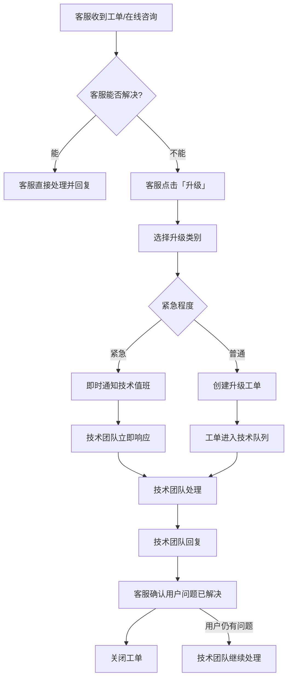

# 客服升级流程与用户通知策略（运营视角补充）

> **补充日期**：2026-07-30
> **关联文档**：PRD-客服支撑模块.md、SPEC-§26、SPEC-§27、SPEC-§28、ref-2.2.3-api-keys.md、ops-manual.md

---

## 1. 客服升级技术团队流程

### 1.1 升级条件

| 条件 | 触发场景 | 升级目标 |
|------|---------|---------|
| 计费异常 | 用户反馈计费错误、余额不符、充值未到账 | 财务/技术团队 |
| API 异常 | 接口返回异常、模型不可用、响应缓慢 | 技术团队 |
| 系统 Bug | 前端页面错乱、功能无法使用 | 技术团队 |
| 权限问题 | 角色权限异常、无法操作 | 管理员 |
| 安全事件 | 账号被盗、Key 泄露、异常登录 | 安全团队 |

### 1.2 升级流程



### 1.3 升级信息模板

复制以下模板填写，确保技术团队能直接复现问题：

```
升级工单模板：
---
标题：[升级] 用户ID - 问题简述
升级类别：计费异常 / API 异常 / 系统 Bug / 权限问题 / 安全事件
紧急程度：紧急（影响多用户/资金安全） / 普通（单个用户问题）

用户信息：
- 用户ID：u_xxxxx
- 用户名：xxx
- 关联订单号（如有）：RE2026xxx

问题描述：
（客服描述用户反馈的问题）

已做排查：
（客服已尝试的操作）

复现步骤：
1. ...
2. ...

截图/日志：
（附件或链接）

客服信息：
- 客服名称：xxx
- 工单号/会话ID：xxx
---
```

### 1.4 升级 SLA

| 紧急程度 | 技术团队首次响应 | 预计解决时间 |
|---------|---------------|------------|
| 紧急 | 15 分钟 | 2 小时内 |
| 普通 | 1 小时 | 24 小时内 |

超时升级：普通工单超过 24h 无响应 → 自动升级为紧急 → 升级到技术主管。

### 1.5 客服处理不了的技术问题分类

| 问题类型 | 建议动作 | 
|---------|---------|
| 用户问计费细节 | 查看 billing_logs 后解释 |
| 用户说余额不对 | 导出 balance_logs + recharge_orders 核对 |
| API 返回 429 | 查看 rate_limits 配置，解释限流规则 |
| 模型响应慢 | 检查供应商健康状态 |
| Key 无效 | 检查 api_keys 状态，协助用户重新生成 |
| 用户想退款 | 走退款流程（需财务复审） |
| 代理佣金不对 | 导出 commission_logs 核对 |
| 系统页面打不开 | 检查是否浏览器兼容性问题，升级到技术 |

---

## 2. Key 过期/余额不足的用户通知流程

### 2.1 通知触发条件

| 场景 | 触发条件 | 通知方式 | 通知频率 |
|------|---------|---------|---------|
| API Key 即将过期 | 过期前 7 天 | 站内信 + 邮件 | 每 24 小时一次 |
| API Key 即将过期 | 过期前 3 天 | 站内信 + 邮件 | 每 12 小时一次 |
| API Key 已过期 | 过期后即时 | 站内信 + 邮件 | 每天一次 |
| 余额低于告警阈值 | 余额 < 告警阈值（默认 ¥10） | 站内信 + 邮件 | 每次请求返回 header warning + 每天一次通知 |
| 余额低于停止阈值 | 余额 < -alert_stop_balance（默认 -¥10） | 站内信 + 邮件 + 短信（如配置） | 即时 + 每天一次 |
| 欠费超期 | 余额低于停止阈值超过 7 天 | 站内信 + 邮件 + 短信 | 每天一次 |
| 信用额度即将耗尽 | 信用额度使用率 > 80% | 站内信 + 邮件 | 每 24 小时一次 |
| 信用额度已耗尽 | 信用额度使用率 100% | 站内信 + 邮件 + 短信 | 即时 |

### 2.2 通知模板

**Key 即将过期：**

> 通知标题：您的 API Key 即将过期
> 通知内容：
> 您的 API Key（sk-xxx...xxx）将于 7 天后（2026-08-06）过期。
> 请及时登录控制台重新生成 Key，以免影响您的业务。
> [立即前往 Key 管理]

**余额不足：**

> 通知标题：您的账户余额不足
> 通知内容：
> 您的 3cloud 账户余额为 ¥2.50，已低于告警阈值 ¥10.00。
> 为保障您的业务连续性，请及时充值。
> [立即充值]

**账户已停用：**

> 通知标题：您的账户已因余额不足停用
> 通知内容：
> 您的 3cloud 账户余额已低于停止阈值，API 服务已暂停。
> 充值后服务将自动恢复。
> [立即充值]

### 2.3 通知频率控制

| 规则 | 说明 |
|------|------|
| 站内信去重 | 相同类型通知 24h 内不重复发送 |
| 邮件频率限制 | 相同类型邮件每天最多 1 封 |
| 短信频率限制 | 相同类型短信每 3 天最多 1 条 |
| 请求头 warning | 每次 API 请求返回 `X-Balance-Warning` header，不限制频率 |

### 2.4 通知模板管理

通知模板存储在 `email_templates` 表中，支持变量替换：

```typescript
// 模板变量示例
const keyExpiryTemplate = {
  key: "key_expiry_reminder",
  subject: "您的 API Key 即将过期",
  body: `您的 API Key（{key_prefix}...{key_suffix}）将于 {expiry_days} 天后（{expiry_date}）过期。
请及时登录控制台重新生成 Key，以免影响您的业务。
[立即前往 Key 管理]({key_management_url})`,
  variables: ["key_prefix", "key_suffix", "expiry_days", "expiry_date", "key_management_url"]
};
```

---

## 3. 活动效果评估标准

### 3.1 评估指标

| 指标 | 计算公式 | 数据来源 |
|------|---------|---------|
| 活动参与人数 | COUNT(活动期间首次消费的用户) | campaign_participants / call_logs |
| 新增用户数 | 活动期间注册的用户数 | users.created_at |
| 消费增量 | 活动期间消费总额 - 活动前同等时长均值 | billing_logs |
| ROI | (活动带来的毛利增长 - 活动成本) / 活动成本 × 100% | billing + campaign_costs |
| 活动预算使用率 | 已发放优惠金额 / 活动预算 × 100% | campaign_prices |
| 转化率 | 参与活动的用户中再次消费的比例 | call_logs |
| 活动退款率 | 参与活动后退款的用户比例 | refund_orders |
| 渠道效果 | 不同渠道带来用户的消费贡献 | user_register_source + billing |

### 3.2 评估报告模板

```
活动名称：2026-07 充值满 ¥100 送 ¥20
活动时间：2026-07-01 ~ 2026-07-31
评估时间：2026-08-01

核心数据：
- 参与人数：1,234 人
- 新增用户：345 人（占参与人数的 28%）
- 消费增量：¥45,000（vs 上月同期 ¥32,000，增长 40.6%）
- ROI：320%（活动成本 ¥11,000，毛利增长 ¥35,200）
- 预算使用率：78%
- 复购率：65%
- 退款率：2.3%

渠道分析：
- 官网：423 人（34%），人均消费 ¥120
- 代理商推广：567 人（46%），人均消费 ¥85
- 社交媒体：244 人（20%），人均消费 ¥65

结论：活动效果良好，建议下次类似活动可以考虑提高预算
```
