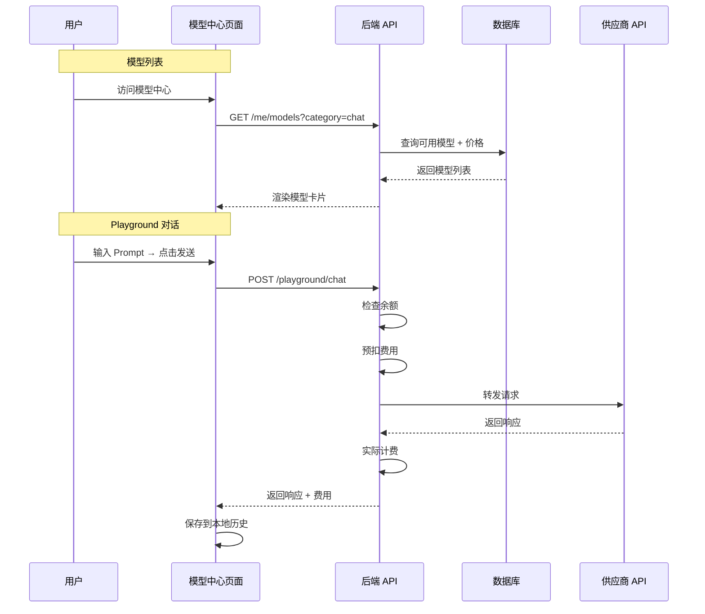

# 用户端模型中心深化文档

> **对应章节**：PRD-README.md §2.2.2 模型中心 `/console/models`
> **最后更新**：2026-07-28
> **定位**：用户端模型选择、搜索、对比、在线测试（Playground）的完整规格

---

## 一、页面组件树

```
ModelCenter
├── ModelFilterBar
│   ├── 分类页签（全部/文本生成/对话/图像/嵌入/代码/音频）
│   ├── 搜索框（模糊匹配模型名/供应商名）
│   └── 筛选面板
│       ├── 供应商多选
│       ├── 价格范围
│       └── 状态筛选
│
├── ModelGrid
│   ├── ModelCard × N（卡片网格，响应式 3-4 列）
│   │   ├── 模型名 + 供应商
│   │   ├── 上下文窗口
│   │   ├── 输入/输出价格
│   │   └── 状态标签（可用/维护中/已下线）
│   └── Pagination / InfiniteScroll
│
├── PriceDetailModal（点击价格区域弹出）
│   ├── 模型价格明细
│   ├── 供应商原始价格
│   └── 平台加价率
│
└── Playground（在线测试）
    ├── ModeSelector（对话模式 / 对比模式）
    ├── ChatPanel
    │   ├── SystemPrompt 输入
    │   ├── UserMessage 输入
    │   ├── ModelSelector
    │   └── SendButton
    ├── ResponsePanel
    │   ├── 单模型响应（对话模式）
    │   └── 多模型对比（对比模式）
    └── TestHistory（本地存储，最近 50 条）
```

---

## 二、前端组件 Props

```typescript
// ModelFilterBar 筛选栏
interface ModelFilterBarProps {
  categories: ModelCategory[];
  selectedCategory?: ModelCategory;
  onCategoryChange: (category: ModelCategory | undefined) => void;
  searchQuery: string;
  onSearchChange: (query: string) => void;
  filters: ModelFilters;
  onFilterChange: (filters: ModelFilters) => void;
}

interface ModelFilters {
  vendors: string[];           // 供应商多选
  minPrice?: number;           // 最低价格
  maxPrice?: number;           // 最高价格
  status?: 'available' | 'maintenance' | 'all';
}

// ModelCard 模型卡片
interface ModelCardProps {
  model: ModelInfo;
  onPriceClick?: (modelId: string) => void;
  onTryClick?: (modelId: string) => void;
}

interface ModelInfo {
  id: string;
  name: string;
  displayName: string;
  vendor: string;
  vendorLogo?: string;
  contextWindow: number;
  contextLabel: string;        // 格式化：128K
  inputPrice: string;          // ¥0.002/1K tokens
  outputPrice: string;
  status: 'available' | 'maintenance' | 'offline';
  capabilities: ModelCapability[];
}

type ModelCapability = 'text_generation' | 'chat' | 'image_generation' | 'embedding' | 'code' | 'audio';
type ModelCategory = 'all' | 'text_generation' | 'chat' | 'image_generation' | 'embedding' | 'code' | 'audio';

// PriceDetailModal 价格明细弹窗
interface PriceDetailModalProps {
  modelId: string;
  modelName: string;
  inputPrice: string;
  outputPrice: string;
  cacheHitPrice?: string;
  vendorInputPrice: string;
  vendorOutputPrice: string;
  markupRate: string;          // 平台加价率
  open: boolean;
  onClose: () => void;
}

// Playground 在线测试
interface PlaygroundProps {
  defaultModel?: string;
  userApiKeys: ApiKeyOption[];
}

interface ApiKeyOption {
  id: number;
  name: string;                // Key 别名
  keyPreview: string;          // sk-...abc
}

// ChatPanel 对话面板
interface ChatPanelProps {
  model: string;
  apiKey: string;
  systemPrompt?: string;
  onSend: (params: PlaygroundRequest) => void;
  onClear: () => void;
}

interface PlaygroundRequest {
  model: string;
  messages: { role: 'system' | 'user' | 'assistant'; content: string }[];
  apiKey: string;
}

// ComparisonPanel 对比面板
interface ComparisonPanelProps {
  models: string[];
  responses: ComparisonResponse[];
  loading: boolean;
}

interface ComparisonResponse {
  model: string;
  content: string;
  tokens: { input: number; output: number };
  cost: number;
  duration: number;            // 毫秒
  isCheapest?: boolean;
  isFastest?: boolean;
}

// TestHistoryItem 测试历史记录
interface TestHistoryItem {
  id: string;
  timestamp: number;
  model: string;
  prompt: string;
  response: string;
  tokens: { input: number; output: number };
  cost: number;
  duration: number;
}
```

---

## 三、API 接口

### 3.1 用户端

| 方法 | 路径 | 说明 | 分页 |
|------|------|------|------|
| `GET` | `/api/v1/me/models` | 用户可用模型列表（含价格） | ✅ 分页 |
| `GET` | `/api/v1/me/models/:id` | 模型详情（含价格明细） | — |
| `GET` | `/api/v1/me/models/:id/price` | 模型价格明细 | — |
| `POST` | `/api/v1/playground/chat` | Playground 对话 | — |
| `POST` | `/api/v1/playground/compare` | Playground 多模型对比 | — |

### 3.2 定价明细 API 响应

```json
GET /api/v1/me/models/deepseek-chat/price

{
  "model_id": "deepseek-chat",
  "model_name": "deepseek-chat",
  "vendor": "DeepSeek",
  "prices": {
    "input_price": "0.002000",
    "output_price": "0.008000",
    "cache_hit_price": "0.000500"
  },
  "original_prices": {
    "input_price": "0.001800",
    "output_price": "0.007000"
  },
  "markup_rate": "11.11%",
  "currency": "CNY",
  "unit": "per_1k_tokens"
}
```

### 3.3 Playground 请求/响应

```json
POST /api/v1/playground/chat
{
  "model": "deepseek-chat",
  "api_key_id": 1,
  "messages": [
    { "role": "system", "content": "You are a helpful assistant." },
    { "role": "user", "content": "Hello!" }
  ]
}

Response:
{
  "id": "call_xxx",
  "model": "deepseek-chat",
  "choices": [
    {
      "index": 0,
      "message": { "role": "assistant", "content": "Hello! How can I help you?" },
      "finish_reason": "stop"
    }
  ],
  "usage": {
    "prompt_tokens": 234,
    "completion_tokens": 567,
    "total_tokens": 801
  },
  "cost": "0.0034",
  "duration_ms": 1234
}
```

```json
POST /api/v1/playground/compare
{
  "models": ["deepseek-chat", "gpt-4o"],
  "api_key_id": 1,
  "messages": [
    { "role": "user", "content": "Explain quantum computing in simple terms." }
  ]
}

Response:
{
  "responses": [
    {
      "model": "deepseek-chat",
      "content": "...",
      "usage": { "prompt_tokens": 120, "completion_tokens": 345, "total_tokens": 465 },
      "cost": "0.0023",
      "duration_ms": 890
    },
    {
      "model": "gpt-4o",
      "content": "...",
      "usage": { "prompt_tokens": 130, "completion_tokens": 400, "total_tokens": 530 },
      "cost": "0.0156",
      "duration_ms": 650
    }
  ]
}
```

---

## 四、分类与搜索逻辑

### 4.1 分类匹配规则

| 分类 | 匹配条件 |
|------|---------|
| 全部 | `vendor_models.status != 'offline'` |
| 文本生成 | `models.capability = 'text_generation'` |
| 对话 | `models.capability = 'chat'` |
| 图像生成 | `models.capability = 'image_generation'` |
| 嵌入 | `models.capability = 'embedding'` |
| 代码 | `models.capability = 'code'` |
| 音频 | `models.capability = 'audio'` |

### 4.2 搜索逻辑

```
搜索范围：models.name（模糊匹配）+ vendors.name（模糊匹配）
搜索触发：输入 3 个字符后开始搜索（防过频）
空结果：展示 "未找到匹配的模型，试试其他关键词"
高亮：搜索结果中匹配文字高亮显示
```

### 4.3 筛选条件

| 维度 | 选项 | 交互 |
|------|------|------|
| 供应商 | 全部已接入供应商 | 多选下拉 |
| 价格范围 | 不限 / ¥0-0.01 / ¥0.01-0.05 / ¥0.05-0.10 / ¥0.10+ | 单选 |
| 状态 | 可用 / 维护中 / 全部 | 单选 |

---

## 五、Playground 规格

### 5.1 对话模式

| 特性 | 说明 |
|------|------|
| System Prompt | 可选输入，最长 8000 字符 |
| 多轮对话 | 支持连续对话，历史消息自动拼入上下文 |
| Token 计数 | 实时显示当前轮输入 Token 数 |
| 发送方式 | Ctrl+Enter 或点击发送按钮 |
| 清空对话 | 一键清空当前对话历史 |
| 最大上下文 | 受模型 context_window 限制 |

### 5.2 对比模式

| 特性 | 说明 |
|------|------|
| 并发请求 | 同时向多个模型发送同一 Prompt |
| 对比数量 | 2-4 个模型 |
| 并列展示 | 响应区域分栏并列展示各模型回答 |
| 对比指标 | Token 消耗、费用、耗时 |
| 自动标注 | "最低价"、"最快"标签 |

### 5.3 计费规则

| 场景 | 规则 |
|------|------|
| 费用 < ¥0.01 | 不弹确认，直接发送 |
| 费用 ≥ ¥0.01 | 弹确认弹窗，展示预估费用 |
| 费用 ≥ ¥0.10 | 弹确认弹窗 + 金额黄色高亮 |
| 余额不足 | 提示余额不足，禁止发送 |
| 计费方式 | 真实计费，计入正常消费流水 |

### 5.4 测试历史

| 特性 | 规格 |
|------|------|
| 存储方式 | localStorage |
| 容量 | 最近 50 条 |
| 保存内容 | Prompt、响应、Token 消耗、费用、耗时 |
| 回溯 | 可展开历史记录查看完整对话内容 |
| 重新测试 | 点击历史记录 → 自动填充 Prompt → 重新发送 |

---

## 六、数据流



---

## 七、交叉引用

| 其他文档 | 关联内容 |
|---------|---------|
| PRD-README.md §2.2.2 | 模型中心总纲 |
| ref-4.3-vendor-model.md | 后台模型管理（数据来源） |
| ref-5.2-billing.md | 计费规则（Playground 计费） |
| frontend-routes.md | 路由结构 |
| api-reference.md | 开发者 API 参考 |