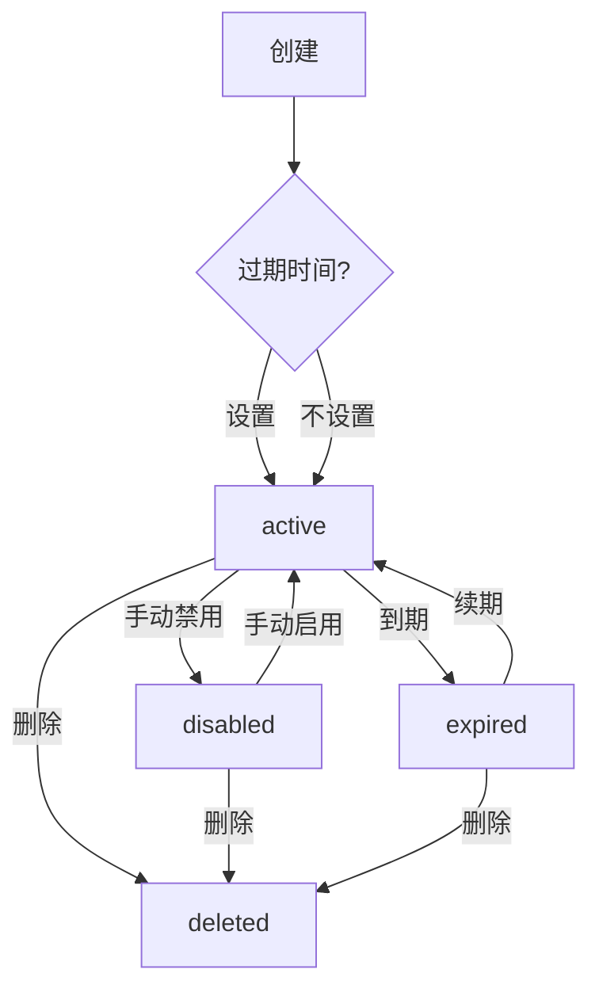
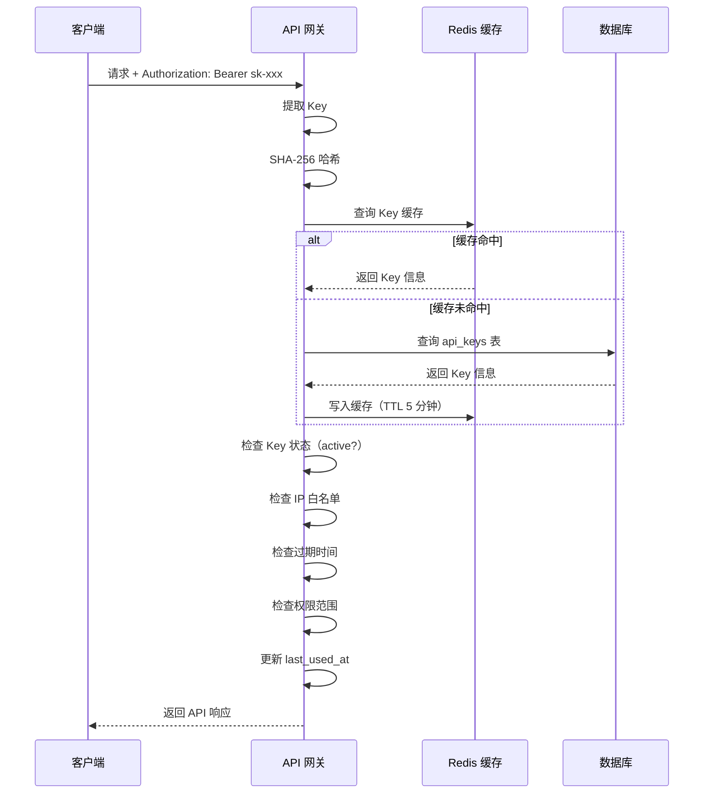

# 用户端 API Key 管理深化文档

> **对应章节**：PRD-README.md §2.2.3 API Key 管理 `/console/api-keys`
> **最后更新**：2026-07-28
> **定位**：API Key 全生命周期管理（创建/编辑/禁用/删除/权限/过期/统计）的完整规格

---

## 一、页面组件树

```
ApiKeyManagement
├── KeyToolbar
│   ├── SearchInput（按别名/Key 前缀搜索）
│   ├── FilterPanel
│   │   ├── 状态筛选（启用/禁用/过期）
│   │   ├── 创建时间范围
│   │   └── 权限范围（全部模型/限制模型）
│   └── CreateKeyButton
│
├── KeyTable
│   ├── SelectAllCheckbox（批量操作）
│   ├── KeyRow × N
│   │   ├── 别名（可编辑/点击进入编辑）
│   │   ├── Key 前缀（脱敏，sk-xxx****xxx）
│   │   ├── 创建时间
│   │   ├── 最后使用时间（"从未使用"标记）
│   │   ├── 状态标签（启用/禁用/过期）
│   │   ├── 权限范围（"全部模型" / "仅 N 个模型"）
│   │   ├── 今日调用量
│   │   └── 操作按钮组
│   └── Pagination
│
├── BatchActionBar（选中多个 Key 时出现）
│   ├── 批量启用 / 批量禁用 / 批量删除
│   └── 已选: N 项
│
├── CreateKeyModal
│   ├── 别名输入
│   ├── 权限范围选择器（全部模型/指定模型）
│   ├── 过期时间设置（快捷选项 + 自定义日期）
│   └── IP 白名单输入
│
├── KeyCreatedDialog（创建成功后）
│   ├── 完整 Key 展示
│   ├── 复制按钮
│   └── 安全提示
│
├── EditKeyModal
│   ├── 别名编辑
│   ├── 权限范围编辑
│   └── 过期时间编辑（延长/缩短/取消）
│
├── ConfirmDisableDialog（禁用确认）
│   ├── 影响范围提示
│   └── 确认/取消
│
├── ConfirmDeleteDialog（删除确认）
│   └── 不可恢复提示
│
├── PermissionScopeSelector（权限控制）
│   ├── 全部模型（默认）
│   ├── 指定模型多选（带搜索）
│   └── 操作粒度（读写/只读/自定义）
│
├── IpWhitelistEditor（IP 白名单）
│   ├── IP/CIDR 输入框（每行一个）
│   └── 格式校验提示
│
├── ExpiryDatePicker（过期时间设置）
│   ├── 快捷选项（7天/30天/90天/1年）
│   └── 自定义日期选择器
│
├── KeyStatsPanel（单个 Key 的统计面板）
│   ├── 今日调用量 / Token / 费用
│   ├── 近 7 天趋势折线图
│   ├── 本月累计
│   └── Key 排名
│
└── ExpiryNotificationBanner（过期提醒横幅）
    └── 过期天数倒计时
```

---

## 二、前端组件 Props

```typescript
// KeyTable 密钥列表
interface KeyTableProps {
  keys: ApiKey[];
  selectedIds: number[];
  onSelectChange: (ids: number[]) => void;
  onEdit: (keyId: number) => void;
  onToggleStatus: (keyId: number, action: 'enable' | 'disable') => void;
  onDelete: (keyId: number) => void;
  onStatsClick: (keyId: number) => void;
  loading?: boolean;
  pagination: Pagination;
}

interface ApiKey {
  id: number;
  alias: string;
  keyPrefix: string;           // sk-xxxx****xxxx
  keyHash: string;             // SHA-256（仅后端存储）
  createdAt: string;
  lastUsedAt: string | null;   // null = 从未使用
  status: 'active' | 'disabled' | 'expired';
  permissionScope: 'all' | 'restricted';
  restrictedModels?: string[]; // 限制的模型列表
  ipWhitelist: string[];       // IP 白名单
  expiresAt: string | null;    // null = 永不过期
  dailyStats: {
    calls: number;
    tokens: number;
    cost: string;
  };
  rank: number;                // 所有 Key 中的排名
  totalKeys: number;
}

// CreateKeyModal 创建密钥弹窗
interface CreateKeyModalProps {
  models: string[];             // 全部模型列表
  open: boolean;
  onClose: () => void;
  onCreate: (key: CreateKeyRequest) => void;
}

interface CreateKeyRequest {
  alias: string;
  permissionScope: 'all' | 'restricted';
  restrictedModels?: string[];
  expiresAt?: string;
  ipWhitelist?: string[];
}

// CreateKeyRequest 支持的操作粒度扩展
interface CreateKeyRequest {
  // ... 基础字段
  accessLevel?: 'read_write' | 'read_only' | 'custom';
  customEndpoints?: string[];
}

// KeyCreatedDialog 创建成功弹窗
interface KeyCreatedDialogProps {
  keyValue: string;             // 完整 Key 明文
  open: boolean;
  onClose: () => void;
  onCopied: () => void;
}

// PermissionScopeSelector 权限范围选择器
interface PermissionScopeSelectorProps {
  value: 'all' | 'restricted';
  selectedModels: string[];
  allModels: string[];
  accessLevel: 'read_write' | 'read_only' | 'custom';
  customEndpoints?: string[];
  onChange: (scope: PermissionScope) => void;
}

interface PermissionScope {
  type: 'all' | 'restricted';
  models?: string[];
  accessLevel: 'read_write' | 'read_only' | 'custom';
  customEndpoints?: string[];
}

// IpWhitelistEditor IP 白名单编辑器
interface IpWhitelistEditorProps {
  value: string[];
  onChange: (ips: string[]) => void;
  onValidate: (ip: string) => boolean;
}

// ExpiryDatePicker 过期时间选择器
interface ExpiryDatePickerProps {
  value: string | null;
  onChange: (date: string | null) => void;
  minDate: string;              // 当前时间
  maxDate: string;              // 当前时间 + 5 年
}

// KeyStatsPanel 密钥统计面板
interface KeyStatsPanelProps {
  keyId: number;
  alias: string;
  keyPrefix: string;
  stats: {
    todayCalls: number;
    todayTokens: number;
    todayCost: string;
    chart7d: ChartDataPoint[];  // 近 7 天趋势
    monthCalls: number;
    monthCost: string;
    rank: number;
    totalKeys: number;
  };
  loading?: boolean;
}

// ExpiryNotificationBanner 过期提醒横幅
interface ExpiryNotificationBannerProps {
  daysUntilExpiry: number;
  keyAlias: string;
  expiryDate: string;
}
```

---

## 三、API 接口

### 3.1 用户端

| 方法 | 路径 | 说明 |
|------|------|------|
| `GET` | `/api/v1/me/api-keys` | 获取 Key 列表 |
| `POST` | `/api/v1/me/api-keys` | 创建 Key |
| `GET` | `/api/v1/me/api-keys/:id` | 获取 Key 详情 |
| `PUT` | `/api/v1/me/api-keys/:id` | 编辑 Key（别名/权限/过期/IP） |
| `DELETE` | `/api/v1/me/api-keys/:id` | 删除 Key |
| `POST` | `/api/v1/me/api-keys/:id/toggle` | 启用/禁用 Key |
| `POST` | `/api/v1/me/api-keys/batch` | 批量操作（启用/禁用/删除） |
| `GET` | `/api/v1/me/api-keys/:id/stats` | 获取 Key 统计数据 |

### 3.2 请求/响应示例

```json
// 创建 Key
POST /api/v1/me/api-keys
{
  "alias": "生产环境-主Key",
  "permission_scope": "all",
  "expires_at": "2027-07-28T00:00:00Z",
  "ip_whitelist": ["192.168.1.0/24"]
}

Response 201:
{
  "id": 1,
  "alias": "生产环境-主Key",
  "key": "sk-d2x4k9m3p7q8r2v5y1w6b0n3c8f4h2j6",
  "warnings": ["密钥只会在创建时展示一次，请立即保存"]
}
```

```json
// 批量禁用
POST /api/v1/me/api-keys/batch
{
  "action": "disable",
  "ids": [1, 3, 5]
}

Response 200:
{
  "success": true,
  "affected_count": 3,
  "affected_keys": ["生产环境-主Key", "测试Key", "备用Key"]
}
```

### 3.3 安全约束

| 约束 | 说明 |
|------|------|
| Key 存储 | 后端只存储 SHA-256 哈希值 |
| 明文可见 | 仅创建时展示一次，管理员不可见 |
| 找回 | 不可找回，只能重新创建 |
| 禁用生效 | 即时生效（Redis 缓存 + 数据库） |
| 启用生效 | 即时生效 |
| 删除 | 物理删除，不可恢复 |

---

## 四、核心逻辑

### 4.1 Key 状态转换



### 4.2 过期提醒时间线

| 时间点 | 提醒方式 | 内容模板 |
|-------|---------|---------|
| T-7 天 | 站内通知 | "您的 Key「{alias}」将于 7 天后过期" |
| T-3 天 | 站内通知 + 邮件 | "您的 Key「{alias}」将于 3 天后过期，请及时续期" |
| T-1 天 | 站内通知 + 邮件 | "您的 Key「{alias}」将于明天过期，续期请点击" |
| T=0 | 站内通知 + 邮件 | "您的 Key「{alias}」已过期，已自动禁用" |

### 4.3 禁用/删除影响

| 操作 | 影响 | 恢复方式 |
|------|------|---------|
| 禁用 Key | 即时生效，请求返回 403 (key_disabled) | 手动启用 |
| 删除 Key | 不可恢复，请求返回 404 (key_not_found) | 不可恢复 |
| Key 过期 | 自动禁用，请求返回 403 (key_expired) | 续期 |

### 4.4 IP 白名单校验

```
校验规则：
  1. 白名单为空 → 不限 IP
  2. 白名单非空 → 检查请求来源 IP 是否匹配
  3. 格式支持：IPv4 / IPv6 / CIDR（如 192.168.1.0/24）
  4. 不匹配 → 返回 403 Forbidden

示例：
  白名单: ["192.168.1.0/24", "10.0.0.1"]
  允许 IP: 192.168.1.1, 192.168.1.255, 10.0.0.1
  拒绝 IP: 192.168.2.1, 172.16.0.1
```

---

## 五、Drizzle Schema

```typescript
export const apiKeys = pgTable("api_keys", {
  id: serial("id").primaryKey(),
  userId: integer("user_id").notNull().references(() => users.id),

  // 基础信息
  alias: varchar("alias", { length: 50 }).notNull(),
  keyHash: varchar("key_hash", { length: 64 }).notNull().unique(),  // SHA-256

  // 权限
  permissionScope: varchar("permission_scope", { length: 20 }).notNull().default("all"),
  restrictedModels: jsonb("restricted_models"),                      // ["deepseek-chat", ...]
  accessLevel: varchar("access_level", { length: 20 }).notNull().default("read_write"),

  // IP 白名单
  ipWhitelist: jsonb("ip_whitelist"),                                // ["192.168.1.0/24", ...]

  // 过期
  expiresAt: timestamp("expires_at", { withTimezone: true }),

  // 状态
  status: varchar("status", { length: 20 }).notNull().default("active"),

  // 时间
  createdAt: timestamp("created_at", { withTimezone: true }).notNull().defaultNow(),
  lastUsedAt: timestamp("last_used_at", { withTimezone: true }),
  updatedAt: timestamp("updated_at", { withTimezone: true }).notNull().defaultNow(),

  // 索引
  deletedAt: timestamp("deleted_at", { withTimezone: true }),
});
```

---

## 六、Key 生成与校验

### 6.1 Key 格式

```
格式: sk-{random_hex}
结构: sk- 前缀 + 32 位随机十六进制字符串
长度: 35 字符（含 sk- 前缀）
示例: sk-d2x4k9m3p7q8r2v5y1w6b0n3c8f4h2j6
```

### 6.2 Key 前缀脱敏

```
原始 Key: sk-d2x4k9m3p7q8r2v5y1w6b0n3c8f4h2j6
脱敏展示: sk-d2x4****h2j6（前 6 位 + **** + 后 4 位）
```

### 6.3 Key 校验流程



---

## 七、交叉引用

| 其他文档 | 关联内容 |
|---------|---------|
| PRD-README.md §2.2.3 | API Key 管理总纲 |
| ref-4.6-security.md | 安全风控（Key 泄露处理） |
| ref-5.3-rate-limiter.md | 限流引擎（Key 级别限流） |
| frontend-routes.md | 路由结构 |
| api-reference.md | 开发者 API 参考（认证方式） |