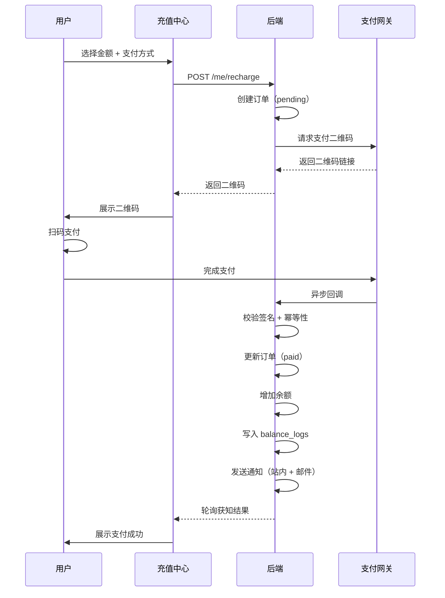
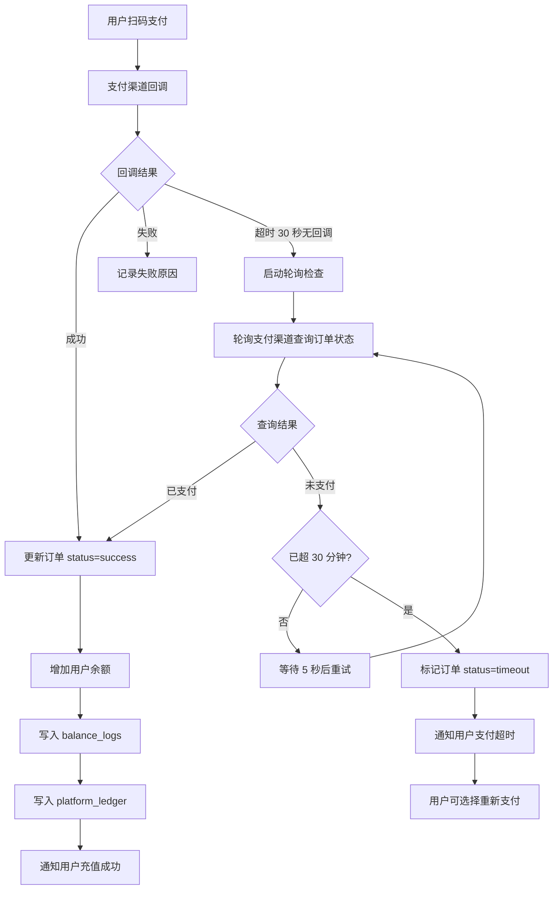

# 用户端充值中心深化文档

> **对应章节**：PRD-README.md §2.2.6 充值 `/console/recharge` + §2.2.7 消费明细
> **最后更新**：2026-07-28
> **定位**：充值流程、支付通道、对公转账、充值记录、优惠活动、余额变动明细的完整规格

---

## 一、页面组件树

```
RechargeCenter
├── CurrentBalance (当前余额卡片)
│   ├── 余额数值
│   └── [充值] 按钮
│
├── PaymentPanel
│   ├── AmountSelector
│   │   ├── 快捷金额按钮（¥50/¥100/¥200/¥500/¥1000/¥5000）
│   │   ├── CustomAmountInput（自定义金额，¥1-¥50000）
│   │   └── 充值后余额预览
│   ├── PaymentMethodSelector
│   │   ├── 支付宝扫码
│   │   ├── 微信支付
│   │   └── 对公转账（需审核）
│   ├── PromotionBanner（活动优惠提示）
│   └── ConfirmButton
│
├── PaymentQrCodeModal（扫码支付弹窗）
│   ├── 二维码展示
│   ├── 金额和支付方式
│   ├── 倒计时（30 分钟）
│   └── 支付状态轮询
│
├── PaymentResultDialog（支付结果弹窗）
│   ├── 成功/失败/超时状态
│   └── 操作按钮
│
├── RechargeRecordList（充值记录）
│   ├── RecordTable（订单号/金额/方式/时间/状态/操作）
│   └── Pagination
│
├── BankTransferModal（对公转账弹窗）
│   ├── 对公账户信息（户名/账号/开户行）
│   ├── 凭证上传
│   └── 审核说明
│
├── PromotionBanner（优惠信息横幅）
│   └── 活动倒计时/规则说明
│
└── TransactionHistory（消费明细）
    ├── FilterBar（时间范围/类型/模型）
    ├── TransactionTable（时间/类型/金额/余额/说明）
    └── Pagination
```

---

## 二、前端组件 Props

```typescript
// PaymentPanel 支付面板
interface PaymentPanelProps {
  balance: string;                     // 当前余额
  promotions: PromotionInfo[];         // 可用优惠
  onRecharge: (params: RechargeRequest) => Promise<RechargeResult>;
  loading?: boolean;
}

interface RechargeRequest {
  amount: number;
  paymentMethod: 'alipay' | 'wechat' | 'bank_transfer';
  promotionId?: number;
}

interface RechargeResult {
  orderId: string;
  qrCodeUrl?: string;                  // 扫码支付
  redirectUrl?: string;                // 跳转支付
  bankInfo?: BankTransferInfo;         // 对公转账
}

interface PromotionInfo {
  id: number;
  title: string;
  description: string;
  remainingDays: number;
  rule: string;                        // "首充满¥100送¥20"
  minAmount: number;                   // 最低参与金额
  benefit: string;                     // 优惠描述
}

// AmountSelector 金额选择器
interface AmountSelectorProps {
  presets: number[];                   // 快捷金额
  value: number | null;
  onChange: (amount: number | null) => void;
  minAmount: number;                   // 最小充值金额 ¥1
  maxAmount: number;                   // 最大充值金额 ¥50000
  promotions: PromotionInfo[];         // 用于显示优惠触发条件
}

// PaymentQrCodeModal 扫码支付弹窗
interface PaymentQrCodeModalProps {
  open: boolean;
  qrCodeUrl: string;
  amount: number;
  paymentMethod: 'alipay' | 'wechat';
  expiresAt: string;                   // 30 分钟后
  onClose: () => void;
  onPaymentSuccess: (orderId: string) => void;
  onPaymentFailed: (orderId: string) => void;
  onExpired: () => void;
}

// BankTransferModal 对公转账弹窗
interface BankTransferModalProps {
  open: boolean;
  bankInfo: {
    accountName: string;               // 户名
    accountNumber: string;             // 账号
    bankName: string;                  // 开户行
    branchName: string;                // 支行
  };
  amount: number;
  onUploadVoucher: (file: File) => Promise<void>;
  onClose: () => void;
}

// RechargeRecordList 充值记录
interface RechargeRecordListProps {
  records: RechargeRecord[];
  pagination: Pagination;
  loading?: boolean;
  onRetryPayment: (orderId: string) => void;
}

interface RechargeRecord {
  id: string;
  orderId: string;
  amount: string;
  paymentMethod: string;
  paidAt: string;
  status: 'success' | 'failed' | 'pending' | 'expired';
  promotion?: string;                  // 优惠信息
  canRetry: boolean;                   // 30 分钟内可重试
}

// TransactionHistory 消费明细
interface TransactionHistoryProps {
  transactions: TransactionRecord[];
  filters: TransactionFilters;
  onFilterChange: (filters: TransactionFilters) => void;
  pagination: Pagination;
  loading?: boolean;
}

interface TransactionRecord {
  id: number;
  timestamp: string;
  type: 'recharge' | 'consumption' | 'refund' | 'adjustment' | 'promotion';
  amount: string;                      // 正数=增加，负数=减少
  balanceBefore: string;
  balanceAfter: string;
  description: string;
  orderId?: string;
}

interface TransactionFilters {
  timeRange: '7d' | '30d' | '90d' | 'custom' | null;
  types: TransactionRecord['type'][];
}
```

---

## 三、API 接口

| 方法 | 路径 | 说明 |
|------|------|------|
| `GET` | `/api/v1/me/balance` | 查询余额 |
| `POST` | `/api/v1/me/recharge` | 发起充值（创建订单）|
| `GET` | `/api/v1/me/recharge-orders` | 充值记录列表 |
| `GET` | `/api/v1/me/recharge-orders/:id` | 订单详情 |
| `POST` | `/api/v1/me/recharge-orders/:id/pay` | 重新支付（过期订单）|
| `POST` | `/api/v1/me/recharge-orders/bank-transfer` | 上传对公转账凭证 |
| `GET` | `/api/v1/me/transactions` | 消费明细列表 |
| `GET` | `/api/v1/me/promotions` | 可用优惠列表 |

### 3.1 充值请求/响应

```json
POST /api/v1/me/recharge
{
  "amount": 100.00,
  "payment_method": "alipay",
  "promotion_id": 1
}

Response 201:
{
  "order_id": "recharge_20260728_xxxxx",
  "status": "pending",
  "amount": 100.00,
  "pay_amount": 100.00,
  "promotion": { "free_amount": 20.00 },
  "qr_code_url": "https://pay.unmisa.com/qr/xxx",
  "expires_at": "2026-07-28T14:00:00+08:00"
}
```

### 3.2 支付回调处理

```json
// 支付回调（异步通知）
POST /api/v1/me/recharge/callback
{
  "order_id": "recharge_20260728_xxxxx",
  "trade_no": "alipay_20260728_xxxxx",
  "pay_amount": 100.00,
  "status": "success",
  "signature": "..."
}
```

---

## 四、核心逻辑

### 4.1 支付流程



### 4.2 订单超时处理

| 场景 | 处理 |
|------|------|
| 30 分钟未支付 | 订单自动过期（status: expired） |
| 过期订单 | 不可支付，需重新发起充值 |
| 过期的二维码 | 支付渠道关闭，用户扫码会提示"订单已过期" |
| 过期后回调到达 | 拒绝回调，记录异常订单，通知管理员 |

### 4.3 对公转账流程

| 步骤 | 操作 | 状态 |
|------|------|------|
| ① 提交申请 | 用户填写金额，填写对公转账信息 | pending_review |
| ② 转账并上传凭证 | 用户转账后上传截图/回单 | pending_review |
| ③ 财务审核 | 管理员在后台审核凭证 | under_review / rejected |
| ④ 确认到账 | 财务确认银行流水到账 | success |
| ⑤ 通知 | 系统通知用户充值成功 | success |

### 4.4 充值金额约束

| 规则 | 值 |
|------|-----|
| 最低充值 | ¥1 |
| 最高充值 | ¥50,000（单笔）|
| 单日上限 | ¥100,000（对公不受限）|
| 自定义金额 | 支持到分（¥0.01）|

### 4.5 优惠计算

```
充值金额 = 用户支付金额 + 优惠赠送金额
优惠赠送金额 = 根据活动规则计算

示例：
  用户充值 ¥100，活动"首充满¥100送¥20"
  实际到账余额 = ¥100 + ¥20 = ¥120
  balance_logs 记录：
    - 类型: recharge, 金额: +¥100
    - 类型: promotion, 金额: +¥20
```

---

## 五、Drizzle Schema

```typescript
// 充值订单表
export const rechargeOrders = pgTable("recharge_orders", {
  id: serial("id").primaryKey(),
  userId: integer("user_id").notNull().references(() => users.id),

  orderId: varchar("order_id", { length: 64 }).notNull().unique(),  // recharge_20260728_xxxxx
  amount: numeric("amount", { precision: 18, scale: 2 }).notNull(),
  payAmount: numeric("pay_amount", { precision: 18, scale: 2 }),    // 实际支付（含优惠减免）
  actualAmount: numeric("actual_amount", { precision: 18, scale: 2 }), // 实际到账（含赠送）

  paymentMethod: varchar("payment_method", { length: 20 }).notNull(),
  tradeNo: varchar("trade_no", { length: 128 }),                    // 支付网关交易号
  status: varchar("status", { length: 20 }).notNull().default("pending"),

  promotionId: integer("promotion_id"),
  freeAmount: numeric("free_amount", { precision: 18, scale: 2 }),  // 赠送金额

  expiresAt: timestamp("expires_at", { withTimezone: true }),
  paidAt: timestamp("paid_at", { withTimezone: true }),
  createdAt: timestamp("created_at", { withTimezone: true }).notNull().defaultNow(),
  updatedAt: timestamp("updated_at", { withTimezone: true }).notNull().defaultNow(),
});
```

---

## 六、交叉引用

| 其他文档 | 关联内容 |
|---------|---------|
| PRD-README.md §2.2.6 | 充值总纲 |
| ref-4.4-finance.md | 财务管理（充值订单管理/对账） |
| ref-4.5-marketing.md | 活动管理（充值优惠配置） |
| data-dictionary.md §3.1 | 余额计算规则 |
| flowcharts/01-recharge.md | 充值流程泳道图 |

---

## 七、充值异常处理与运营流程（运营视角补充）

> **P0 补充**：2026-07-30 — 充值回调超时重试、对公转账确认流程、充值渠道熔断

### 7.1 充值回调超时/失败处理

#### 7.1.1 回调超时重试机制



#### 7.1.2 回调重试参数

| 参数 | 默认值 | 说明 |
|------|--------|------|
| 回调等待超时 | 30 秒 | 支付渠道回调的最大等待时间 |
| 轮询间隔 | 5 秒 | 主动查询支付状态的间隔 |
| 最大轮询次数 | 360 次（30 分钟） | 超过后标记超时 |
| 重试次数（回调失败） | 3 次 | 回调失败后重试 |
| 重试间隔 | 30 秒 | 重试之间的间隔 |

#### 7.1.3 人工补单 SOP

```
1. 运营接到用户反馈或系统告警："用户张三 2026-07-30 14:00 充值 ¥100 未到账"
2. 运营在管理后台查看充值订单（搜索 order_id 或用户ID）
3. 核实支付渠道后台的交易记录：
   a. 如果支付渠道显示已支付、平台未到账：
      - 点击「手动补单」
      - 填写补单原因（必填）
      - 系统自动增加用户余额
      - 写入 balance_logs（type=manual_fix）
      - 写入 operation_logs 审计
      - 通知用户到账
   b. 如果支付渠道显示未支付：
      - 告知用户未完成支付
      - 可提供支付链接供用户继续支付
4. 补单记录写入 operation_logs，财务对账时人工核实

#### 7.1.4 补单 API

| 方法 | 路径 | 说明 | 权限 |
|------|------|------|------|
| POST | /api/v1/admin/finance/recharge/manual-fix | 手动补单 | finance_admin |
| GET | /api/v1/admin/finance/recharge/manual-fix/history | 补单历史 | finance_admin |

### 7.2 对公转账确认流程

#### 7.2.1 全流程

```
用户提交 → 运营初审 → 财务复审 → 入账 → 通知用户

详细步骤：
1. 用户填写转账金额、上传凭证（JPG/PNG/PDF, ≤5MB）、备注
2. 订单状态 bank_pending
3. 运营收到待审提示（管理后台 → 财务 → 对公转账待审）
4. 运营查看凭证，登录网银核对银行流水
5. 确认金额和到账时间，填写财务备注
6. 规则：
   - 金额 ≤ ¥10,000：运营终审
   - 金额 > ¥10,000：需财务复审（双人）
   - 金额 > ¥100,000：需 super_admin 审批
7. 审核通过：系统自动增加余额、写入日志、通知用户
8. 审核驳回：填写原因、通知用户、用户可修改后重新提交
```

#### 7.2.2 对公转账 SLA

| 阶段 | SLA | 超时升级 |
|------|-----|---------|
| 用户提交→运营初审 | T+0.5（4 小时内） | 4h → 通知运营主管 |
| 运营初审→财务复审 | T+1（24 小时内） | 24h → 通知财务主管 |
| 全额到账确认 | T+1（工作日） | 超 2 个工作日 → 通知 super_admin |

### 7.3 充值渠道熔断处理

| 渠道故障 | 系统处理 | 运营操作 |
|---------|---------|---------|
| 微信支付不可用 | 自动隐藏微信，仅展示支付宝和转账 | 联系微信确认恢复时间 |
| 支付宝不可用 | 自动隐藏支付宝，仅展示微信和转账 | 联系支付宝确认恢复时间 |
| 双渠道不可用 | 仅展示对公转账 | 紧急联系双渠道，评估备用支付通道 |
| 部分接口降级（慢） | 展示延迟提示 | 监控恢复，考虑切换备用通道 |