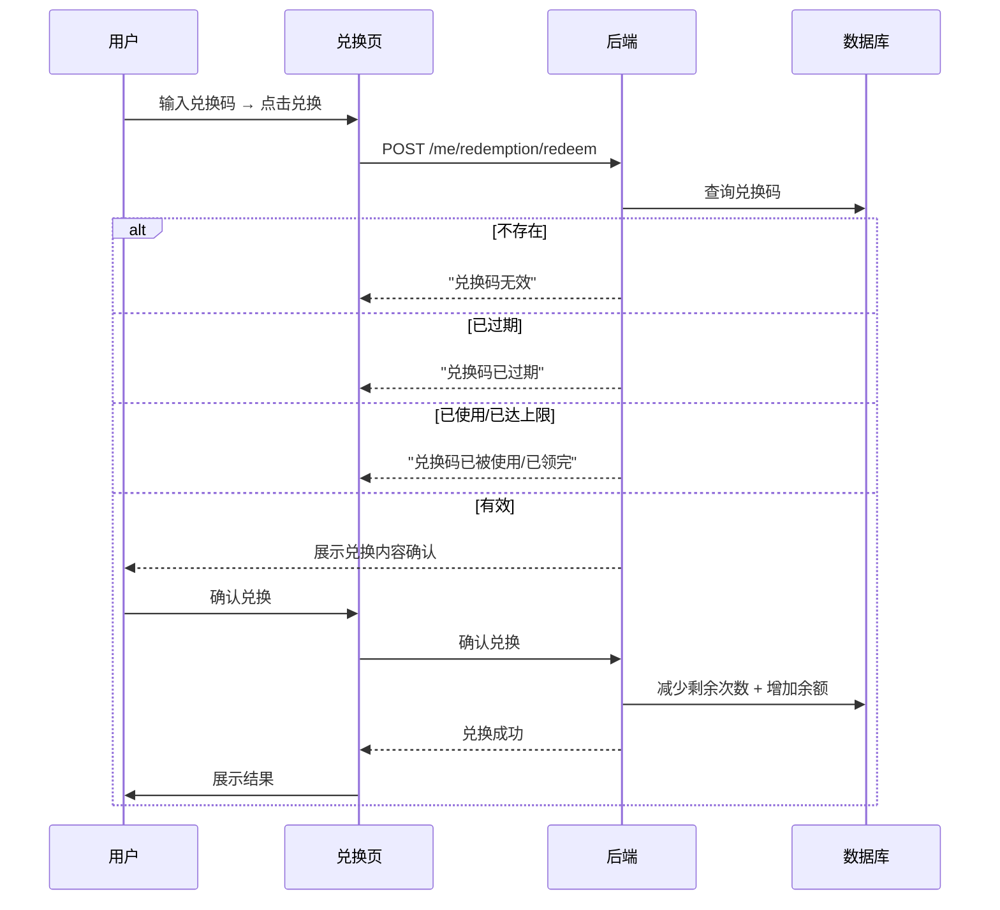
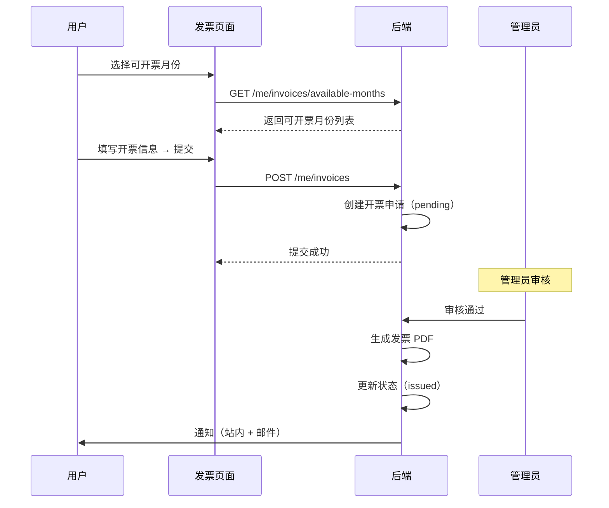

# 用户端兑换码与发票管理深化文档

> **对应章节**：PRD-README.md §2.2.8 兑换码 `/console/redemption` + §2.2.9 发票 `/console/invoices`
> **最后更新**：2026-07-28
> **定位**：兑换码兑换流程、类型、发票申请、开票规则、前端组件规格

---

## 一、兑换码管理

### 1.1 页面组件树

```
Redemption
├── RedemptionInput
│   ├── 兑换码输入框
│   └── [兑换] 按钮
│
├── RedemptionPreviewModal（兑换确认弹窗）
│   ├── 兑换内容详情
│   └── 确认/取消
│
├── RedemptionResultDialog（兑换结果弹窗）
│   ├── 成功/失败状态
│   └── 到账金额/权益说明
│
└── RedemptionHistory（兑换记录）
    ├── 记录列表（时间/兑换码/内容/状态）
    └── 空状态提示
```

### 1.2 前端组件 Props

```typescript
interface RedemptionInputProps {
  onRedeem: (code: string) => Promise<RedemptionResult>;
  loading?: boolean;
}

interface RedemptionResult {
  success: boolean;
  type: 'balance' | 'trial' | 'discount' | 'mixed';
  amount?: string;                     // 余额码：到账金额
  trialInfo?: {                        // 体验码
    duration?: string;                 // "7天"
    maxCalls?: number;                 // 1000
    maxTokens?: number;                // 100000
  };
  discountRate?: string;               // 折扣码：0.8
  items?: RedemptionItem[];            // 混合码：组合权益
  message?: string;                    // 错误信息
}

interface RedemptionPreviewModalProps {
  open: boolean;
  code: string;
  result: RedemptionResult;
  onConfirm: () => void;
  onCancel: () => void;
}

interface RedemptionHistoryProps {
  records: RedemptionRecord[];
  loading?: boolean;
}

interface RedemptionRecord {
  id: number;
  redeemedAt: string;
  code: string;                         // 脱敏：3C-SUMMER-****
  type: 'balance' | 'trial' | 'discount' | 'mixed';
  amount?: string;
  status: 'success' | 'expired' | 'used' | 'invalid';
}
```

### 1.3 API 接口

| 方法 | 路径 | 说明 |
|------|------|------|
| `POST` | `/api/v1/me/redemption/redeem` | 兑换兑换码 |
| `GET` | `/api/v1/me/redemption/history` | 兑换记录 |

### 1.4 兑换码验证流程



### 1.5 兑换码类型

| 类型 | 兑换内容 | 示例 |
|------|---------|------|
| 余额码 | 固定金额 | ¥10 / ¥20 / ¥50 / ¥100 |
| 体验码 | 限时/限量权益 | 7 天无限量 / 1000 次 / 10 万 Token |
| 折扣码 | 后续消费折扣 | 8 折 / 85 折 / 指定模型 |
| 混合码 | 组合权益 | 余额 ¥10 + 7 天体验 |

---

## 二、发票管理

### 2.1 页面组件树

```
InvoiceManagement
├── InvoiceablePeriods（可开票月份列表）
│   ├── MonthCard × N（月份/消费金额/是否已开票）
│   └── 合并开票入口
│
├── InvoiceApplicationForm（开票申请表单）
│   ├── 发票抬头
│   ├── 税号（企业必填，格式校验）
│   ├── 发票类型（普票/专票）
│   ├── 消费月份选择（多选，最多 12 个月）
│   ├── 开票金额（自动汇总）
│   ├── 收件邮箱
│   └── 收件地址（专票必填）
│
├── InvoiceHistory（已开发票列表）
│   ├── InvoiceRow × N（发票号/金额/类型/状态/时间）
│   └── 下载/查看操作
│
└── InvoiceDetailModal（发票详情弹窗）
    ├── 发票 PDF 预览
    └── 下载按钮
```

### 2.2 前端组件 Props

```typescript
interface InvoiceablePeriod {
  month: string;                       // "2026-07"
  totalConsumption: string;            // "¥890.50"
  isInvoiced: boolean;
  invoiceId?: number;
}

interface InvoiceApplicationFormProps {
  availableMonths: InvoiceablePeriod[];
  config: InvoiceConfig;
  onSubmit: (application: InvoiceApplication) => Promise<void>;
  submitting?: boolean;
}

interface InvoiceConfig {
  minAmount: number;                    // 最低开票金额 ¥50
  feePercent: number;                   // 手续费百分比
  maxMergeMonths: number;               // 最多合并月份 12
}

interface InvoiceApplication {
  title: string;                        // 发票抬头
  taxId: string;                        // 税号
  invoiceType: 'normal' | 'special';   // 普票/专票
  months: string[];                     // 消费月份 ["2026-07", "2026-06"]
  amount: string;                       // 自动汇总
  email: string;
  address?: string;                     // 专票必填
}

interface InvoiceHistoryProps {
  invoices: InvoiceRecord[];
  onDownload: (invoiceId: number) => void;
  loading?: boolean;
}

interface InvoiceRecord {
  id: number;
  invoiceNumber: string;                // 发票号
  amount: string;
  type: 'normal' | 'special';
  status: 'pending' | 'issued' | 'rejected';
  months: string[];
  createdAt: string;
  issuedAt?: string;
  pdfUrl?: string;
}
```

### 2.3 API 接口

| 方法 | 路径 | 说明 |
|------|------|------|
| `GET` | `/api/v1/me/invoices/available-months` | 可开票月份列表 |
| `POST` | `/api/v1/me/invoices` | 提交开票申请 |
| `GET` | `/api/v1/me/invoices` | 已开发票列表 |
| `GET` | `/api/v1/me/invoices/:id` | 发票详情 |
| `GET` | `/api/v1/me/invoices/:id/download` | 下载发票 PDF |

### 2.4 开票流程



### 2.5 配置项与约束

| 配置 | 默认值 | 说明 |
|------|--------|------|
| `min_invoice_amount` | ¥50.00 | 最低开票金额 |
| `invoice_fee_percent` | 0% | 开票手续费 |
| `max_merge_months` | 12 | 最多合并月份数 |

| 约束 | 规则 |
|------|------|
| 实名要求 | 需完成实名认证 |
| 企业发票 | 需完成企业认证 |
| 税号格式 | 15/18/20 位数字字母 |
| 专票地址 | 必填，用于邮寄纸质发票 |
| 开票范围 | 仅已消费的月份（充值不开发票） |
| 重复开票 | 已开票月份不可再次申请 |
| 发票取消 | 管理员审核前可取消申请 |

---

## 三、交叉引用

| 其他文档 | 关联内容 |
|---------|---------|
| PRD-README.md §2.2.8 | 兑换码总纲 |
| PRD-README.md §2.2.9 | 发票管理总纲 |
| ref-4.5-marketing.md | 兑换码系统配置（运营端） |
| ref-4.4-finance.md | 发票管理（财务端审核） |
| data-dictionary.md | 字段定义 |
| ref-4.6-security.md | 实名认证（开票前提） |