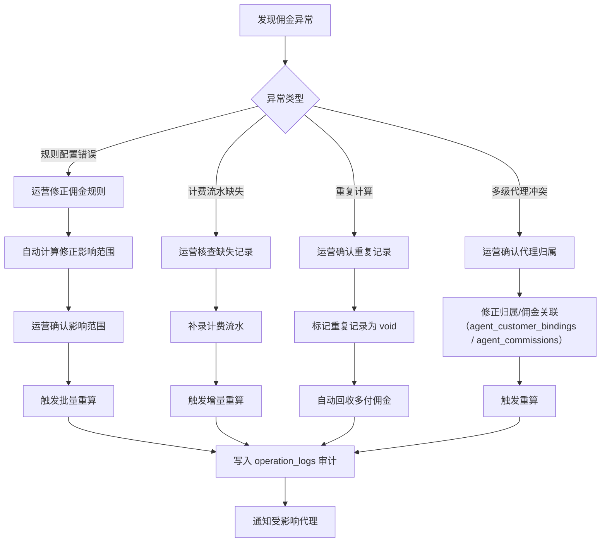

# 代理商体系 — 深化参考文档

> **对应章节**：[PRD-README.md §3 代理商体系](../PRD-README.md#三代理商体系精化摘要)
> **状态**：基于现有后端代码（`api/src/db/schema/agents.ts`、`api/src/routes/admin/agents.ts`、`api/src/routes/admin/finance/withdraws.ts`、`api/src/routes/agent/*.ts`）及前端组件分析生成
> **粒度**：Drizzle Schema → API 接口 → 前端组件 Props → 业务流程图 → 交叉引用

> ⚠️ **模型对齐（重要）**：本参考文档基于**旧版自助代理模型**（三级审核晋升、子代理/团队层级、邀请裂变绑定、多级抽成）分析生成，其中以下内容已被已定稿的 [`PRD-代理商体系-后台主导版.md`](PRD-代理商体系-后台主导版.md) 覆盖移除，**以后台主导版（报备划拨制）为准**：
> - **代理商准入**：无注册/升级入口；代理商身份由后台「设为代理商」创建，等级/佣金档位仅后台可调（D：单级、隐蔽）。
> - **客户归属**：唯一来源 = 报备划拨（代理商报备 → 后台审核 → 自动划拨）；归属唯一、变更留审计；**无邀请裂变/邀请码自助绑定**（D2）。
> - **佣金**：单级，按「消费时刻归属」解析计佣；**无多级抽成/团队分润**（D1）。
> - 本文档中「绑定客户」「邀请链接」「子代理」「团队佣金」等表述均为旧模型残留，读者请勿据此实现。

---

## 目录

1. [三级审核与等级晋升](#1-三级审核与等级晋升)
2. [佣金规则配置](#2-佣金规则配置)
3. [代理端仪表盘](#3-代理端仪表盘)
4. [提现双审流程](#4-提现双审流程)
5. [结算周期与对账](#5-结算周期与对账)
6. [跨模块数据流](#6-跨模块数据流)

---

## 1. 三级审核与等级晋升

### 1.1 等级体系（enum: `agent_level_enum`）

| 枚举值 | 层级 | 准入条件 | 权益 | 审核方 | 默认佣金率 |
|--------|------|---------|------|--------|-----------|
| 枚举值 | 层级 | 准入条件 | 权益 | 审核方 | 默认佣金率 | 状态（后台主导版） |
|--------|------|---------|------|--------|-----------|------|
| `preparatory` | 预备 | ~~注册+实名~~ **后台「设为代理商」** | 查看佣金规则，**不能提现** | ~~自动~~ **后台创建** | 0% | 等级仅后台可设，无自助获得 |
| `primary` | 一级 | ~~实名+资质审核~~ **后台「设为代理商」** | 全功能面板、自定义佣金、可提现 | ~~`agent_mgr` 审核~~ **后台** | 10% | 等级仅后台可设 |
| `advanced` | 高级 | ~~月调用 > 100 万 Token~~ **后台「设为代理商」** | 专属客户经理、优先支持、阶梯佣金 | ~~`super_admin` 审批~~ **后台** | 12-18% | 等级仅后台可设 |
| ~~`sub`~~ | ~~子代理~~ | ~~由一级代理创建~~ | — | — | — | **已移除（D1：单级，无子代理层级）** |

### 1.2 审核状态流转（enum: `agent_audit_status_enum`）

```
pending ──→ approved    (审核通过，升级)
     └──→ rejected      (审核拒绝，退回预备)
```

### 1.3 现有表结构（`agents` 表）

```typescript
// api/src/db/schema/agents.ts — agents 表（等级审核相关字段）
export const agents = pgTable("agents", {
  id: serial("id").primaryKey(),
  userId: integer("user_id").notNull().unique().references(() => users.id, { onDelete: "cascade" }),

  // 等级与审核
  level: agentLevelEnum("level").notNull().default("preparatory"),
  auditStatus: agentAuditStatusEnum("audit_status").notNull().default("approved"),
  auditRemark: text("audit_remark"),
  auditedBy: integer("audited_by").references(() => users.id),
  auditedAt: timestamp("audited_at", { withTimezone: true }),

  // 团队层级（子代理）—— ⚠️ 已移除（D1：单级分销，不实现）
  // parentAgentId: integer("parent_agent_id").references(...)  // 不实现
  // teamDepth: integer("team_depth").default(0)               // 不实现

  // 高级代理专有
  accountManager: varchar("account_manager", { length: 128 }),
  prioritySupport: boolean("priority_support").notNull().default(false),

  // ...财务字段见下文
}, (table) => ({
  userIdIdx: uniqueIndex("agents_user_id_idx").on(table.userId),
  // parentIdx: index("agents_parent_idx").on(table.parentAgentId),  // 已移除（D1：单级，无上下级）
  levelIdx: index("agents_level_idx").on(table.level),
}));
```

### 1.4 API 接口

#### POST `/api/v1/admin/agents/:id/audit` — 等级审核

**请求**：
```json
{
  "action": "approve" | "reject",
  "level": "primary" | "advanced",  // approve 时必填
  "remark": "审核备注（可选）"
}
```

**响应（approve）**：
```json
{
  "code": 0,
  "data": { "agentId": 123, "level": "primary", "auditStatus": "approved" },
  "message": "代理已晋升为 primary"
}
```

**响应（reject）**：
```json
{
  "code": 0,
  "data": { "agentId": 123, "auditStatus": "rejected" },
  "message": "已拒绝代理晋升申请"
}
```

**权限**：`AGENT_MANAGE`（agent_mgr/admin/super_admin）

**校验逻辑**：
1. 代理不存在 → 404
2. `auditStatus !== "pending"` → 400（不在待审核状态）
3. reject 时自动将 `level` 回退到 `preparatory`（**注意**：当前实现只改 `auditStatus` 不改 `level`，需补全）

#### GET `/api/v1/admin/agents/:agentId` — 代理详情

**响应扩展字段**：
```json
{
  "id": 123,
  "userId": 456,
  "level": "preparatory",
  "auditStatus": "pending",
  "auditRemark": null,
  "auditedBy": null,
  "auditedAt": null,
  "accountManager": null,
  "prioritySupport": false,
  "totalCommission": "0.000000",
  "settledCommission": "0.000000",
  "pendingWithdraw": "0.000000",
  "frozenAmount": "0.000000",
  "minWithdrawAmount": "10.000000",
  "withdrawCooldownHours": 24,
  "withdrawFreezeDays": 7
}
```

### 1.5 前端审核操作组件

```
AgentLevelTab.tsx (agent-detail/AgentLevelTab.tsx)
├── 审核状态标签（pending/approved/rejected）
├── 当前等级显示
├── 升级操作按钮（仅 pending 时启用）
│   ├── "通过并升级为一级代理"
│   ├── "通过并升级为高级代理"
│   └── "拒绝申请" + 备注输入框
└── 审核记录（auditedBy 用户名 / auditedAt 时间轴）
```

**Props**：
```typescript
interface AgentLevelTabProps {
  agent: {
    id: number;
    level: "preparatory" | "primary" | "advanced";
    auditStatus: "pending" | "approved" | "rejected";
    auditRemark?: string | null;
    auditedBy?: number | null;
    auditedAt?: string | null;
    accountManager?: string | null;
    prioritySupport?: boolean;
  };
  onAuditResult: () => void;  // 刷新回调
}
```

### 1.6 运营视角

- **预备 → 一级**：财务岗（`agent_mgr`）审核资质材料，需展示预备代理的注册时间、实名状态、邀请码来源
- **一级 → 高级**：`super_admin` 审批，需展示近 30 天消费趋势、客户数量、佣金产出
- **审核超时处理**：pending 超过 7 天自动降级为预备（或发通知提醒管理员）
- **批量审核**：当前无批量审核接口，运营建议增加 POST `/api/v1/admin/agents/batch-audit`

---

## 2. 佣金规则配置

### 2.1 现有表结构

#### `commission_rules` 表

```typescript
export const commissionRules = pgTable("commission_rules", {
  id: serial("id").primaryKey(),
  agentId: integer("agent_id").notNull().references(() => agents.id, { onDelete: "cascade" }),
  ruleType: varchar("rule_type", { length: 20 }).notNull(),
  // 'sale' | 'renewal' | 'team' | 'activity'

  rate: numeric("rate", { precision: 5, scale: 4 }).notNull().default("0.0000"),
  isEnabled: boolean("is_enabled").notNull().default(true),

  // 条件约束
  minTriggerAmount: numeric("min_trigger_amount", { precision: 18, scale: 6 }),
  maxCap: numeric("max_cap", { precision: 18, scale: 6 }),
  validFrom: timestamp("valid_from", { withTimezone: true }),
  validUntil: timestamp("valid_until", { withTimezone: true }),

  // 活动专用
  activityName: varchar("activity_name", { length: 255 }),
  activityType: varchar("activity_type", { length: 50 }),
  fixedAmount: numeric("fixed_amount", { precision: 18, scale: 6 }),

  // 团队专用
  teamLevelLimit: integer("team_level_limit").default(1),

  createdBy: integer("created_by").references(() => users.id),
  createdAt: timestamp("created_at", { withTimezone: true }).notNull().defaultNow(),
  updatedAt: timestamp("updated_at", { withTimezone: true }).notNull().defaultNow(),
}, (table) => ({
  agentTypeIdx: uniqueIndex("commission_rules_agent_type_idx").on(table.agentId, table.ruleType),
}));
```

### 2.2 四种计算方式（PRD §3.2 实现对照）

| 方式 | 实现 | 对应 `ruleType` | 关键字段 |
|------|------|----------------|---------|
| **固定比例** | `用户消费 × rate` | `sale` | `rate` |
| **阶梯比例** | 按月消费区间分段，`minTriggerAmount` 作为阶梯阈值 | `sale`（多条规则） | `rate` + `minTriggerAmount` + `maxCap` |
| **固定金额** | 每笔消费 × `fixedAmount` | `sale` | `fixedAmount`（替代 `rate`） |
| **混合** | 按模型/场景分别设置规则 | 多条不同 `ruleType` | 组合使用 |

**阶梯比例实现约定**：
- 同一代理多条 `ruleType='sale'` 的规则，通过 `minTriggerAmount` 分段
- 计算时：取 `minTriggerAmount <= 月消费` 的最大阶梯规则应用
- `maxCap` 表示该阶梯的最高佣金上限（防止大额单笔佣金过高）

### 2.3 API 接口

#### GET `/api/v1/admin/agents/:agentId/commission-rules` — 获取佣金规则列表

**响应**：
```json
{
  "code": 0,
  "data": [
    {
      "id": 1,
      "ruleType": "sale",
      "rate": "0.1000",
      "isEnabled": true,
      "minTriggerAmount": "0.000000",
      "maxCap": null,
      "validFrom": null,
      "validUntil": null,
      "fixedAmount": null,
      "createdAt": "2026-07-01T00:00:00.000Z"
    },
    {
      "id": 2,
      "ruleType": "sale",
      "rate": "0.1200",
      "isEnabled": true,
      "minTriggerAmount": "1000.000000",
      "maxCap": "500.000000"
    }
  ]
}
```

#### POST/PUT `/api/v1/admin/agents/:agentId/commission-rules` — 创建/更新佣金规则

**请求**（upsert 语义）：
```json
{
  "ruleType": "sale",
  "rate": "0.1000",
  "isEnabled": true,
  "minTriggerAmount": "0.000000",
  "maxCap": null,
  "validFrom": null,
  "validUntil": null
}
```

**响应**：
```json
{ "code": 0, "data": { "id": 1, ... }, "message": "佣金规则已保存" }
```

#### DELETE `/api/v1/admin/agents/:agentId/commission-rules/:ruleId` — 删除佣金规则

#### GET `/api/v1/agent/commission-rules` — 代理端查看自己的佣金规则

### 2.4 前端组件规格

#### 管理员佣金配置页

```
AgentDetail → CommissionTab.tsx / CommissionModal.tsx
├── 规则列表（表格）
│   ├── 规则类型（销售/续费/团队/活动）
│   ├── 费率/金额
│   ├── 阶梯阈值
│   ├── 上限
│   ├── 有效期
│   ├── 启用开关
│   └── 操作（编辑/删除）
│
├── 新增规则（CommissionModal.tsx）
│   ├── 规则类型下拉（sale/renewal/team/activity）
│   ├── 费率输入（百分比，格式 xxx.xxxx%）
│   ├── 阶梯阈值（仅 sale 显示）
│   ├── 上限金额（可选）
│   ├── 有效期起止（可选）
│   ├── 固定金额输入（仅 activity）
│   └── 团队层级限制（仅 team）
│
└── 规则变更审计日志（操作前→操作后，操作人，时间）
```

**CommissionModal Props**：
```typescript
interface CommissionModalProps {
  open: boolean;
  onClose: () => void;
  agentId: number;
  rule?: CommissionRule;            // 编辑模式；undefined 为新增
  onSaved: () => void;             // 保存成功回调
}

interface CommissionRule {
  id?: number;
  ruleType: "sale" | "renewal" | "team" | "activity";
  rate: number;                     // 百分比格式（0.1000 = 10%）
  isEnabled: boolean;
  minTriggerAmount?: number;        // 阶梯阈值
  maxCap?: number;                  // 上限
  validFrom?: string;
  validUntil?: string;
  fixedAmount?: number;             // 固定金额
  teamLevelLimit?: number;          // 团队层级限制
}
```

#### 代理端佣金设置页

```
agent/commissions/CommissionSettings.tsx
├── 当前生效规则摘要
│   ├── 销售佣金率：10%（阶梯：0-1000 5%, 1000+ 8%）
│   └── 续费佣金率：5%
├── 修改申请（二级代理 → 上级代理审批）
└── 规则生效时间："立即生效" / "下个结算周期"
```

### 2.5 佣金计算引擎要点（单级 · 按消费时刻归属解析）

> ⚠️ 依据后台主导版（D1/D7）：佣金**单级**、按**消费时刻的客户归属**解析，无 team/多级抽成。

```
用户消费产生 consumption_record → billing 模块扣费
  → 按消费时刻解析客户归属：agent_customer_bindings 中
    bound_at <= 消费时刻 < unbound_at（或 status=active 未解绑）的 active 记录
  → 命中归属代理 → 佣金 = 消费金额 × 该代理佣金率（commission_rate）
  → 写入 agent_commissions（幂等：consumption_record_id 唯一索引）
  → 同步更新 agents.available_balance / total_earnings（实时 settled）
  → 未命中归属 → 该消费不计佣金（客户无归属代理）
```

**归属解析（单级，无 team 优先级）**：
1. 归属唯一：同一客户同一时刻仅一条 active 归属（UNIQUE(customer, status)）
2. 佣金切分边界：以「划拨执行时刻（bound_at）」为界，之前归属原代理、之后归属新代理
3. 退款冲销：佣金 cancelled 并回冲代理余额（幂等）

---

## 3. 代理端仪表盘

### 3.1 现有 API

#### GET `/api/v1/agent/commissions/summary` — 佣金汇总

**响应**：
```json
{
  "code": 0,
  "data": {
    "totalCommission": "12345.678900",
    "settledCommission": "8000.000000",
    "pendingCommission": "3000.000000",
    "pendingWithdraw": "1000.000000",
    "frozenAmount": "345.678900",
    "monthCommission": "2500.000000",
    "monthConsumption": "25000.000000",
    "clientCount": 15,
    "monthNewClients": 2
  },
  "message": "ok"
}
```

#### GET `/api/v1/agent/commissions` — 佣金历史（带筛选）

**Query**：`page`, `pageSize`, `status`, `commissionType`, `startDate`, `endDate`, `customerSearch`

#### GET `/api/v1/agent/commissions/:id` — 佣金明细

#### GET `/api/v1/agent/commissions/export` — CSV 导出

### 3.2 前端仪表盘组件规格

```
agent/commissions/CommissionStatsCards.tsx
├── 总客户数（本月新增）
├── 本月总消费 ¥
├── 本月佣金收入 ¥
├── 待结算金额 ¥
├── 可提现余额 ¥
└── 概览走势图（近 7 天）
```

**Props**：
```typescript
interface AgentDashboardStats {
  clientCount: number;
  monthNewClients: number;
  monthConsumption: number;     // 本月总消费
  monthCommission: number;      // 本月佣金
  pendingCommission: number;    // 待结算
  pendingWithdraw: number;      // 提现中
  withdrawable: number;         // 可提现 = settledCommission - pendingWithdraw - frozenAmount
}

interface AgentDashboardProps {
  stats: AgentDashboardStats;
  trends?: {
    date: string;
    consumption: number;
    commission: number;
  }[];
  onRefresh: () => void;
}
```

### 3.3 趋势图规格

```
├── 近 7 日消费趋势（柱状图）
│   ├── X 轴：日期
│   ├── Y 轴：消费金额
│   └── Tooltip：当日消费 + 佣金
│
├── 近 7 日佣金趋势（折线图，叠在柱状图上）
│
└── 客户增长趋势（折线图）
    ├── X 轴：日期
    └── Y 轴：累计客户数
```

### 3.4 客户列表（代理端）

> ⚠️ 旧模型为「邀请绑定/解绑」，新模型（后台主导版）为「归属客户」：归属由报备划拨产生，代理端仅可查看与报备，**不可自助绑定/解绑**。

```
agent-clients list（归属客户）
├── 列表（表格）
│   ├── 客户名称
│   ├── 归属时间
│   ├── 累计消费
│   ├── 本月消费
│   └── 操作（查看详情）
│
├── 搜索/筛选（按名称、归属时间范围）
└── 「报备目标客户」入口（新增报备 → 后台审核 → 自动划拨）
```
```

---

## 4. 提现双审流程

### 4.1 状态机（enum: `withdraw_status_enum`）

```
pending_first_review ──→ pending_second_review ──→ pending_payment ──→ paid
                      └→ rejected                      └→ cancelled
                              ↑                               ↑
                        任一审核拒绝                   打款失败取消
```

### 4.2 一级审核流程

```
代理发起 → ① 系统风控检查（riskCheckResult → JSON 存储）
         → ② 财务岗初审（first_review）
             ├── 通过 → pending_second_review
             └── 拒绝 → rejected（冻结期+记录原因）

初审展示信息：
  - 代理信息：名称、等级、注册时间、总交易量
  - 账户状况：余额、可提现、冻结金额
  - 提现历史：已完成 N 笔，总额 ¥X
  - 本次提现：金额、银行卡号/银行名、微信企业付款号
  - 近 7 日消费趋势：是否有异常下降
```

### 4.3 二级审核流程

```
复审（second_review）
├── 通过 → pending_payment（需标记打款凭证 URL）
│   └── 财务岗标记"已打款"（mark_paid）
│       └── paid（更新 agent 余额：减少 pendingWithdraw、增加 settledCommission）
└── 拒绝 → rejected
```

### 4.4 现有 API

#### POST `/api/v1/agent/withdraw` — 代理发起提现

**请求**：
```json
{
  "amount": "500.000000",
  "bankCardNo": "6222021234567890",
  "bankName": "中国工商银行"
}
```

**校验**：
- 仅一级/高级代理可提现（`preparatory` 不允许）
- 提现金额 ≥ `agents.minWithdrawAmount`（默认 ¥10）
- 提现金额 ≤ 可提现余额
- 距上次提现 ≥ `withdrawCooldownHours`（默认 24h）
- 佣金产生后 ≥ `withdrawFreezeDays`（默认 7 天）

#### GET `/api/v1/agent/withdraws` — 提现记录

#### POST `/api/v1/admin/withdraws/:id/first-review` — 初审

**请求**：
```json
{ "action": "approve" | "reject", "rejectReason": "资质不全" }
```

#### POST `/api/v1/admin/withdraws/:id/second-review` — 复审

**请求**：
```json
{ "action": "approve" | "reject", "rejectReason": "", "bankVoucherUrl": "https://..." }
```

#### POST `/api/v1/admin/withdraws/:id/mark-paid` — 标记打款

#### POST `/api/v1/admin/withdraws/batch-review` — 批量审核

**请求**：
```json
{ "ids": [1, 2, 3], "action": "approve" | "reject", "rejectReason": "批量拒绝原因" }
```

**响应**：
```json
{ "code": 0, "data": { "approved": 2, "rejected": 1, "errors": [] }, "message": "..." }
```

#### GET `/api/v1/admin/withdraws/stats` — 按状态统计

```json
{
  "code": 0,
  "data": [
    { "status": "pending_first_review", "count": 5, "totalAmount": "3500.000000" },
    { "status": "pending_second_review", "count": 2, "totalAmount": "1200.000000" },
    { "status": "paid", "count": 20, "totalAmount": "15000.000000" }
  ]
}
```

#### GET `/api/v1/admin/withdraws/export` — CSV 导出

### 4.5 前端审核页面规格

#### 审核列表（Admin → 财务 → 提现审核）

```
WithdrawList.tsx / WithdrawReview.tsx
├── 状态筛选标签（全部/初审待审/复审待审/已完成/已拒绝）
├── 统计卡片（待审笔数 + 总金额）
├── 列表（表格）
│   ├── 提现单号（voucherNo）
│   ├── 代理名称
│   ├── 金额 / 手续费 / 实到
│   ├── 审核状态（标签：待初审/待复审/已完成）
│   ├── 创建时间
│   └── 操作（审核/详情）
│
├── 审核弹窗（详情 + 审核操作）
│   ├── 代理信息卡片
│   ├── 提现详情
│   ├── 账户状况
│   ├── 近 7 日消费趋势（折线图，异常标注）
│   └── 审核按钮（通过/拒绝 + 原因）
│
└── 批量操作工具栏（选中多笔 → 批量审核）
```

**WithdrawReviewModal Props**：
```typescript
interface WithdrawReviewModalProps {
  open: boolean;
  onClose: () => void;
  withdrawId: number;
  reviewLevel: "first" | "second";       // 初审/复审
  onReviewed: () => void;                 // 审核成功回调
}

interface WithdrawDetail {
  id: number;
  agentId: number;
  userId: number;
  email: string;
  nickname: string;
  voucherNo: string;
  amount: string;
  feeAmount: string;
  actualAmount: string;
  bankCardNo: string;
  bankName: string;
  bankVoucherUrl: string | null;
  wechatPayNo: string | null;
  status: WithdrawStatus;
  riskCheckResult: any | null;
  firstAuditorId: number | null;
  firstAuditedAt: string | null;
  secondAuditorId: number | null;
  secondAuditedAt: string | null;
  paidOperatorId: number | null;
  createdAt: string;
  paidAt: string | null;
}
```

### 4.6 提现限制配置

| 配置项 | 表字段 | 默认值 | 管理端操作 |
|-------|--------|--------|-----------|
| 最低提现金额 | `agents.minWithdrawAmount` | ¥10 | 管理员修改 |
| 提现冷却时间 | `agents.withdrawCooldownHours` | 24h | 管理员修改 |
| 佣金冻结期 | `agents.withdrawFreezeDays` | 7天 | 管理员修改 |

---

## 5. 结算周期与对账

### 5.1 结算表结构

#### `settlement_cycles` — 结算周期定义

```typescript
export const settlementCycles = pgTable("settlement_cycles", {
  id: serial("id").primaryKey(),
  periodStart: date("period_start").notNull(),
  periodEnd: date("period_end").notNull(),
  status: varchar("status", { length: 20 }).notNull().default("open"),
  // open / closed / settled
  generatedAt: timestamp("generated_at", { withTimezone: true }),
  settledAt: timestamp("settled_at", { withTimezone: true }),
  createdAt: timestamp("created_at", { withTimezone: true }).notNull().defaultNow(),
});
```

#### `agent_settlements` — 代理结算账单

```typescript
export const agentSettlements = pgTable("agent_settlements", {
  id: serial("id").primaryKey(),
  cycleId: integer("cycle_id").notNull().references(() => settlementCycles.id),
  agentId: integer("agent_id").notNull().references(() => agents.id),
  totalCommission: numeric("total_commission", { precision: 18, scale: 4 }),
  settledAmount: numeric("settled_amount", { precision: 18, scale: 4 }),
  adjustmentAmount: numeric("adjustment_amount", { precision: 18, scale: 4 }),
  adjustmentReason: text("adjustment_reason"),
  status: varchar("status", { length: 20 }).notNull().default("pending"),
  // pending / confirmed / auto_confirmed / settled
  confirmedAt: timestamp("confirmed_at", { withTimezone: true }),
  settledAt: timestamp("settled_at", { withTimezone: true }),
});
```

#### `settlement_details` — 结算明细

```typescript
export const settlementDetails = pgTable("settlement_details", {
  id: serial("id").primaryKey(),
  settlementId: integer("settlement_id").notNull().references(() => agentSettlements.id, { onDelete: "cascade" }),
  commissionId: integer("commission_id").notNull(),
  amount: numeric("amount", { precision: 18, scale: 4 }),
  clientUserId: integer("client_user_id").notNull().references(() => users.id),
  consumptionId: integer("consumption_id"),
  model: varchar("model", { length: 100 }),
  tokens: integer("tokens"),
  commissionRate: numeric("commission_rate", { precision: 5, scale: 2 }),
});
```

#### `settlement_confirm_logs` — 对账确认日志

```typescript
export const settlementConfirmLogs = pgTable("settlement_confirm_logs", {
  settlementId: integer("settlement_id").notNull().references(() => agentSettlements.id, { onDelete: "cascade" }),
  action: varchar("action", { length: 20 }).notNull(),
  // generate / confirm / auto_confirm / adjust / settle
  operatorId: integer("operator_id").references(() => users.id),
  operatorRole: varchar("operator_role", { length: 20 }),
  detail: text("detail"),
});
```

### 5.2 结算周期配置

代理的 `settlementCycle` 支持：

| 周期 | 值 | 说明 |
|------|----|------|
| 手动结算 | `manual` | 管理员手动触发 |
| 按周结算 | `weekly` | 每周一凌晨结算上周期 |
| 按月结算 | `monthly` | 每月 1 日结算上周期 |
| 按季结算 | `quarterly` | 每季度首日结算 |

### 5.3 结算流程

```
┌─────────┐     ┌───────────┐     ┌──────────┐     ┌──────────┐
│ 周期截止 │ →  │ 自动结账   │ →  │ 代理确认  │ →  │ 管理员确认│ → 完成
└─────────┘     └───────────┘     └──────────┘     └──────────┘
                     │                  │
                settlement_cycles  agent_settlements.status:
                .status → closed       pending → confirmed
                                       （48h 未操作 → auto_confirmed）
```

### 5.4 API 接口

#### POST `/api/v1/admin/agents/:id/settlement-config` — 配置结算周期

```json
{ "settlementCycle": "weekly" }
```

#### POST `/api/v1/admin/agents/:id/settle` — 手动结算

#### GET `/api/v1/admin/agents/settlement-history?agentId=123` — 结算历史

**响应**：
```json
{
  "code": 0,
  "data": {
    "list": [
      {
        "id": 1,
        "cycleId": 1,
        "periodStart": "2026-07-01",
        "periodEnd": "2026-07-07",
        "totalCommission": "1234.5600",
        "settledAmount": "1234.5600",
        "status": "settled",
        "confirmedAt": "2026-07-08T10:00:00.000Z"
      }
    ],
    "total": 5,
    "page": 1,
    "pageSize": 20
  }
}
```

### 5.5 前端结算管理页面

```
admin/finance/AgentSettlement.tsx
├── 结算周期筛选
├── 结算列表（表格）
│   ├── 结算周期
│   ├── 佣金总额
│   ├── 调整金额
│   ├── 结算金额
│   ├── 状态（pending/confirmed/settled）
│   └── 操作（确认/查看详情）
│
├── 结算详情弹窗
│   ├── 汇总信息
│   ├── 明细列表（模型/用户/Token/佣金率/金额）
│   ├── 调整功能（调整金额 + 原因）
│   └── 确认按钮
│
└── 结算确认日志时间线
```

**SettlementPage Props**：
```typescript
interface SettlementItem {
  id: number;
  cycleId: number;
  periodStart: string;
  periodEnd: string;
  totalCommission: number;
  settledAmount: number;
  adjustmentAmount: number;
  adjustmentReason?: string;
  status: "pending" | "confirmed" | "auto_confirmed" | "settled";
  confirmedAt?: string;
}

interface SettlementListProps {
  items: SettlementItem[];
  agentId: number;
  onConfirm: (settlementId: number) => void;
}
```

---

## 6. 跨模块数据流

### 6.1 核心调用链（单级 · 按消费时刻归属）

```
[consumption_record created]
      ↓
[billing/commission.ts]
  1. 按消费时刻解析客户归属（agent_customer_bindings：bound_at <= 消费时刻 < unbound_at 的 active 记录）
  2. 命中归属代理 → 佣金 = 消费金额 × 该代理 commission_rate
  3. 写入 agent_commissions（status=settled，实时入账；consumption_record_id 唯一索引幂等）
  4. 同步更新 agents.available_balance / total_earnings
  5. 未命中归属 → 该笔消费不计佣金
      ↓
[退款冲销]
  消费退款 → 对应佣金置 cancelled + 回冲代理余额（幂等）
      ↓
[结算/对账]
  按 agent_commissions 汇总生成结算单（月结），对账见 SPEC-§29
      ↓
[代理发起提现]
  1. 风控检查 → 提现单
  2. 初审 → 复审 → 打款
  3. 更新 agents.available_balance / 冻结金额
```

### 6.2 依赖模块

| 模块 | 依赖关系 | 说明 |
|------|---------|------|
| `billing/commission.ts` | → `agent_customer_bindings` / `agents.commission_rate` / `agent_commissions` | 每次消费按消费时刻归属触发佣金计算（单级） |
| `agent-finance.ts` | → `agents` / `agent_commissions` / `agent_withdrawals` | 代理财务摘要 |
| `agent-settlement.ts` | → `agent_commissions` / 结算单 | 结算引擎 |
| `agent-withdraw.ts` | → `agents` / `withdraw_orders` / `users` | 提现审核流 |
| `stats-usage-service/agent.ts` | → `consumption_records` / `agent_customer_bindings` | 代理端统计（归属客户） |

### 6.3 关联文档

| 文档 | 关联内容 |
|------|---------|
| [PRD-README.md §3](../PRD-README.md#三代理商体系精化摘要) | 代理商体系总纲 |
| [PRD-README.md §4.4 财务管理](../PRD-README.md#44-财务管理) | 充值/提现/发票 |
| [PRD-README.md §5.2 计费与结算精化](../PRD-README.md#52-计费与结算精化) | 计费链路、价格层级 |
| [ref-4.4-finance.md](ref-4.4-finance.md) | 财务深化（待创建）|
| [sprint-1/03-settlement-overview.md](sprint-1/03-settlement-overview.md) | 结算对账原始需求 |

### 6.4 关键约束

1. **佣金冻结期**：佣金产生后 `withdrawFreezeDays` 内不能提现，防止退款扣回（参见 [`ref-9.5-refund.md`](ref-9.5-refund.md) §4 佣金扣回策略）
2. **可提现余额公式**：`settledCommission - pendingWithdraw - frozenAmount - redemptionLocked`
3. **审核不可逆**：reject 操作需记录原因，且不自动恢复 agent 余额冻结
4. **结算独立于提现**：结算只是将佣金从 pending 转为 settled，提现是另一条审批链路
5. **佣金单级**：无 team/子代理分润（D1）；佣金仅按消费时刻归属的代理 × 自身佣金率计算

---

> **文档版本**：v1.0 — 2026-07-28  
> **编写依据**：`api/src/db/schema/agents.ts` + `api/src/db/schema/agent-settlement.ts` + `api/src/routes/admin/agents.ts` + `api/src/routes/admin/finance/withdraws.ts` + `api/src/routes/agent/*.ts`  
> **下一步建议**：补充 `commission_logs` 分区迁移脚本 + 结算自动化 cron job

---

## 7. 佣金计算异常处理（运营视角补充）

> **P0 补充**：2026-07-30 — 佣金计算异常检测、运营修复流程、批量重算

### 7.1 佣金计算异常检测

| 异常类型 | 检测方式 | 触发条件 | 严重程度 |
|---------|---------|---------|---------|
| 佣金规则配置错误 | 自动校验 | 阶梯阈值重叠、佣金率 > 100%、阶梯缺失 | P0 |
| 计费流水缺失 | 对账对比 | 消费记录存在但佣金记录缺失 | P0 |
| 佣金重复计算 | 幂等性检查 | 同一消费记录出现多笔佣金 | P0 |
| ~~多级代理重复计算~~ | ~~逻辑校验~~ | ~~同一用户在多个代理名下产生佣金~~ | **已废弃（D1：单级归属，UNIQUE(customer,status) 保证唯一）**；改为校验：同一消费时刻归属解析命中数 > 1 即异常 |
| 佣金率异常波动 | 环比检查 | 佣金率环比波动 > 20%（无规则变更） | P1 |
| 佣金封顶溢出 | 数值检查 | 佣金金额 > maxCap 但未截断 | P1 |

### 7.2 佣金规则配置自动校验

**规则配置时的实时校验：**

```
1. 阶梯阈值重叠检查：
   - 如果配置了阶梯佣金（如 0-1000 万: 10%, 1000-5000 万: 12%），检查阈值区间是否重叠
   - 发现重叠：提示运营修改，拒绝保存

2. 佣金率范围检查：
   - 佣金率必须在 0-100% 之间
   - 超出范围：提示运营，拒绝保存

3. 阶梯连续性检查：
   - 如果阶梯间隔不连续（如 0-500 万: 10%, 1000-2000 万: 12%），中间 500-1000 万无规则
   - 提示运营补充缺失阶梯，或明确使用上一阶梯的规则

4. 固定金额 + 比例混合检查：
   - 固定金额佣金 + 比例佣金同时存在时，检查总佣金是否超过消费金额
   - 超过 100% 消费金额：提示运营确认
```

### 7.3 佣金异常运营修复流程



### 7.4 批量重算 API

| 方法 | 路径 | 说明 | 权限 |
|------|------|------|------|
| POST | /api/v1/admin/agents/commissions/rebatch | 批量重算指定时间段内的佣金 | finance_admin |
| GET | /api/v1/admin/agents/commissions/rebatch/progress | 查询重算进度 | finance_admin |
| POST | /api/v1/admin/agents/commissions/void | 作废错误的佣金记录 | finance_admin |

**批量重算流程：**

```
1. 运营选择重算范围（时间 / 代理 / 模型）
2. 系统显示影响预估："将重算 2026-07-01 ~ 2026-07-30 期间 3 个代理的 12,345 条佣金记录"
3. 运营确认后触发异步重算任务
4. 重算过程中：
   - 原有佣金记录标记为 recalculating
   - 新消费继续产生佣金（不受影响）
   - 重算完成后新旧记录对比
5. 运营审核差异报告："重算前佣金 ¥50,000，重算后 ¥52,000，差异 ¥2,000"
6. 运营确认后生效
7. 通知代理（如有差异）
8. 差异金额自动计入下一结算周期
```

### 7.5 提现失败处理流程

| 失败原因 | 系统处理 | 运营操作 | 用户通知 |
|---------|---------|---------|---------|
| 银行卡信息错误 | 自动标记失败，冻结金额解冻 | 通知代理更新银行卡信息 | "打款失败，请核实银行卡信息" |
| 银行退票 | 自动标记失败，冻结金额解冻 | 核查退票原因 | "打款失败，请联系客服" |
| 风控拦截 | 自动标记风险，冻结金额保留 | 运营审核风控结果 | "提现正在审核中（风控）" |
| 余额不足 | 自动标记失败，保留提现单 | 确认平台账户余额 | "系统繁忙，请稍后重试" |
| 银行系统故障 | 自动重试（最多 3 次，每次间隔 30 分钟） | 监控重试状态 | "打款处理中，请稍候" |

**提现失败处理全流程：**

```
1. 提现单状态：初审通过 → 复审通过 → 打款中
2. 调用支付渠道打款
3. 如果失败：
   a. 记录失败原因到 withdraw_orders.fail_reason
   b. 更新 withdraw_orders.status = failed
   c. 释放冻结金额：agents.frozen_amount -= withdraw_amount
   d. 写入 operation_logs（提现失败事件）
   e. 代理收到通知："提现失败，原因：XX"
4. 运营收到告警："提现失败：代理王五，¥1,000，原因：银行卡信息错误"
5. 运营操作：
   a. 查看失败详情
   b. 联系代理核实信息
   c. 代理在提现页面重新提交（更新信息后）
   d. 重新走审核流程
6. 失败记录永远保留在提现历史中（不可删除）
```

### 7.6 代理降级后用户价格影响

| 场景 | 处理规则 | 通知策略 |
|------|---------|---------|
| 高级→一级 | 代理名下用户价格即时更新为一级代理折扣 | 提前 7 天通知代理，用户即时通知 |
| 一级→预备 | 代理名下用户价格变为标准价（无折扣） | 提前 7 天通知代理和用户 |
| 主动降级 | 即时生效，无过渡期 | 用户即时通知 |
| 违规降级 | 即时生效 + 冻结佣金 30 天 | 用户即时通知 + 提供替代方案 |

**价格切换规则：**

```
1. 代理降级后，其名下所有用户的折扣率自动更新为代理新等级的默认折扣率
2. 如果用户有自己的独立折扣率（不依赖代理），则不受影响
3. 价格变更在用户下一次 API 请求时生效（缓存 TTL 5 分钟内）
4. 降级前已产生的消费不受影响（不追溯）

通知模板（代理）：
  "您的代理等级已从高级降级为一级。
   - 生效时间：即时
   - 佣金率变化：18% → 12%
   - 名下用户折扣率：0.85 → 0.90
   - 如需申诉，请联系客服"

通知模板（用户）：
  "您的代理 xxxx 的代理等级已调整。
   - 您的价格将从 0.85 折调整为 0.90 折
   - 生效时间：即时
   - 如有疑问，请联系客服"

---

## 8. 代理运营场景补充（运营视角补充）

> **P1 补充**：2026-07-30 — 代理批量审核、佣金与财务总账对账、佣金封顶、结算提现周期 SOP

### 8.1 代理批量审核场景

#### 8.1.1 批量晋升审核

```
运营在管理后台 → 代理 → 等级审核

操作步骤：
1. 筛选待审核的代理晋升申请
2. 选择需要批量处理的代理（最多 50 个）
3. 点击「批量审核」
4. 系统弹出审核确认框，显示：
   - 待审核代理数：23 个
   - 涉及代理名列表
   - 各代理当前等级和目标等级
5. 运营选择批量操作：
   - 全部通过
   - 全部驳回
   - 按条件通过（如消费达标自动通过）
6. 填写批量审核备注（可选，对所有申请生效）
7. 确认提交
8. 系统逐条处理：
   - 写入 operation_logs（每条记录独立）
   - 通过：更新代理等级 + 通知代理
   - 驳回：保留原等级 + 通知代理
9. 处理完成后显示结果汇总：
   - 成功通过：20 个
   - 驳回：2 个
   - 处理失败：1 个（需人工干预）
```

#### 8.1.2 批量审核安全控制

| 保护措施 | 说明 |
|---------|------|
| 二次确认弹窗 | 展示批量操作的详细影响范围 |
| 操作预览 | 审核前预览所有申请的详细信息 |
| 单次上限 | 最多 50 个 |
| 操作可撤销 | 审核后 5 分钟内可批量撤销（需 super_admin） |
| 审计日志 | 每条申请独立记录 |

### 8.2 佣金与财务总账对账链路

| 对账点 | 校验规则 | 频率 | 告警阈值 |
|--------|---------|------|---------|
| commission_logs vs call_logs | 消费记录应有对应的佣金记录 | 实时 | 缺失率 > 0.1% |
| commission_logs vs agents.total_commission | SUM(commission_logs.amount) == agents.total_commission | 日结 | 偏差 ≥ ¥1 |
| commission_logs vs platform_ledger | SUM(佣金) == SUM(ledger WHERE type=agent_commission) | T+1 | 偏差 ≥ ¥1 |
| 佣金 vs 用户消费总额 | 佣金总额 ≤ 用户消费总额（合规检查） | 月结 | 超 100% |
| 佣金率合理性 | 各代理实际佣金率 vs 配置佣金率 | 周 | 偏差 > 5% |

**对账差异处理：**

```
发现偏差时，运营操作：
1. 查看佣金对账报告
2. 定位偏差来源（commission_logs 缺失 / 重复 / 金额不符）
3. 按 §7 佣金异常修复流程处理
4. 修复后重新对账确认
5. 对账结果写入 operation_logs
```

### 8.3 佣金封顶场景处理

| 封顶场景 | 处理规则 | 用户影响 |
|---------|---------|---------|
| 单笔佣金封顶 | maxCapPerOrder 截断，超出部分不计入 | 不影响用户 |
| 月度佣金封顶 | monthlyCap 截断，超出部分延期到下一月 | 不影响用户 |
| 消费金额封顶 | capConsumption 截断，超出消费不计佣金 | 不影响用户 |
| 多级代理封顶 | 各级代理独立封顶，不共享上限 | 不影响用户 |

**运营操作：**

```
1. 代理查看佣金明细时，封顶记录单独标注
2. 运营可在佣金明细中查看封顶历史
3. 封顶配置调整后，仅对新产生的佣金生效（不追溯）
4. 月度封顶溢出部分自动计入下月（不丢失）

示例：
  代理 A 配置 monthlyCap = ¥100,000
  本月佣金计算为 ¥120,000
  实际发放：¥100,000
  溢出：¥20,000 → 自动计入下月（下月佣金 +¥20,000）
  代理通知："您本月佣金已超过封顶限额 ¥100,000"
```

### 8.4 结算周期与提现周期 SOP

#### 8.4.1 结算周期时间线

```
以按月结算为例：

每月 1 日 00:00 — 上一结算周期自动关闭
  - commission_logs 中所有 settled 记录标记为已结算
  - 未结算的 commission_logs 继续累积

每月 1 日 01:00 — 结算自动触发
  - 拉取上月所有 status=settled 的佣金
  - 写入 settlement_cycles（周期 2026-07）
  - 写入 agent_settlements（各代理汇总）
  - 写入 settlement_details（明细）
  - 更新 agents.settled_commission

每月 1 日 02:00 — 代理确认窗口开启
  - 代理登录后可查看结算明细
  - 代理 48 小时内确认（或自动确认）
  - 确认后：可提现余额增加

每月 3 日 02:00 — 自动确认截止
  - 未手动确认的代理自动确认
  - 代理可开始提现

每月 3 日~月底 — 代理提现窗口
  - 代理在可提现余额范围内申请提现
  - 走提现双审流程
  - 打款到银行卡
```

#### 8.4.2 结算周期与提现周期关系

```
┌─────────────────────────────────────────────────────────┐
│  月份      | 佣金计算期 | 结算期     | 提现期          │
│────────────|────────────|───────────|─────────────────│
│ 2026-07    | 07-01~07-31 | 08-01~08-03 | 08-03~08-31   │
│ 2026-08    | 08-01~08-31 | 09-01~09-03 | 09-03~09-30   │
│ 2026-09    | 09-01~09-30 | 10-01~10-03 | 10-03~10-31   │
└─────────────────────────────────────────────────────────┘

关键规则：
1. 佣金计算期 ≠ 结算期（有 1-3 天的结算延迟）
2. 结算期 ≠ 提现期（代理确认后才可以提现）
3. 提现窗口期内可以多次提现（总额不超过可提现余额）
4. 未提现的佣金可以累积到下月（无过期限制）
5. 冻结期内的佣金不可提现（withdrawFreezeDays）
```

#### 8.4.3 运营操作节点

| 日期 | 运营操作 | 说明 |
|------|---------|------|
| 每月 1 日 09:00 | 检查结算是否正常完成 | 确认 settlement_cycles 状态 |
| 每月 1 日 10:00 | 处理结算异常 | 如有异常按 §7 修复流程处理 |
| 每月 1 日 14:00 | 推送结算报告 | 通知 super_admin 本月结算结果 |
| 每月 3 日 10:00 | 检查代理确认率 | 联系未确认代理确认 |
| 每月 5 日 10:00 | 检查提现审核待办 | 确保提现审核不积压 |

#### 8.4.4 提现窗口 SLA

| 阶段 | SLA | 超时升级 |
|------|-----|---------|
| 代理提交提现 → 初审 | T+0.5（12 小时内） | 通知运营主管 |
| 初审通过 → 复审 | T+0.5（12 小时内） | 通知财务主管 |
| 复审通过 → 打款 | T+1（24 小时内） | 通知 super_admin |
| 打款完成 → 通知 | 即时 | — |
```
