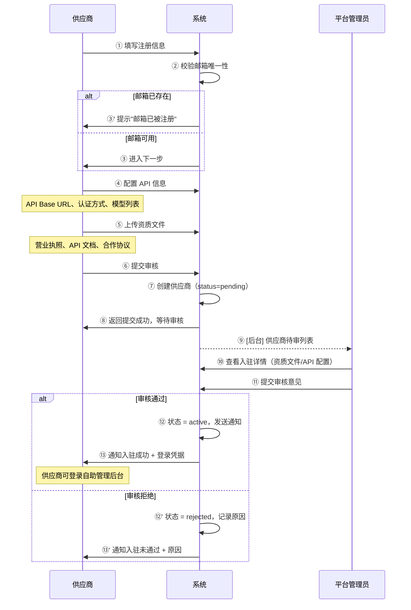

# 3cloud 供应商自助管理（Vendor Self-Service）深化文档

> **对应章节**：PRD-README.md §4.10 供应商自助管理
> **最后更新**：2026-07-28
> **定位**：供应商入驻、自助管理后台、模型管理、数据统计、结算对账的全链路规格

---

## 一、功能总览

```
供应商系统
├── 入驻流程
│   ├── 注册信息
│   ├── API 配置
│   ├── 资质上传
│   └── 提交审核
│
├── 供应商管理后台
│   ├── 仪表盘（今日调用量/收入/可用率/趋势）
│   ├── 模型管理（已接入列表/新增模型/价格修改）
│   ├── 数据统计（调用趋势/收入趋势/用户分布脱敏）
│   ├── 结算（结算单查看/对账）
│   └── 通知（平台通知列表）
│
├── 平台管理端
│   ├── 供应商入驻审核
│   ├── 供应商列表/详情/编辑
│   ├── 供应商状态管理
│   └── 供应商结算
│
└── 供应商 API
    ├── 供应商注册/登录
    └── 供应商自助 API
```

---

## 二、供应商入驻流程

### 2.1 入驻流程泳道图



### 2.2 注册表单字段

| 步骤 | 字段 | 必填 | 类型 | 校验规则 |
|------|------|------|------|---------|
| 1 | 供应商名称 | ✅ | 文本 | 1-100 字符 |
| 1 | 联系人姓名 | ✅ | 文本 | 2-50 字符 |
| 1 | 联系邮箱 | ✅ | 邮箱 | 格式校验 + 唯一性 |
| 1 | 联系电话 | ✅ | 手机 | 11 位数字 |
| 1 | 密码 | ✅ | 密码 | 8-128 位，含大小写+数字 |
| 2 | API Base URL | ✅ | URL | 必须以 https:// 开头 |
| 2 | 认证方式 | ✅ | 选择 | Bearer Token / API Key |
| 2 | 支持模型列表 | ✅ | 动态列表 | 至少 1 个模型 |
| 3 | 营业执照 | ✅ | 文件上传 | JPG/PNG/PDF，≤10MB |
| 3 | API 文档 | ✅ | 文件上传 | PDF，≤20MB |
| 3 | 合作协议 | ❌ | 文件上传 | 在线签署或上传 |

### 2.3 模型信息录入

```
供应商在入驻时需填写每个模型的信息：

┌─ 模型 1 ──────────────────────────────────────┐
│ 模型名称:  [gpt-4o            ]                │
│ 供应商模型名: [gpt-4o           ] (若不同)      │
│ 模型类型:  [chat           ▼ ]                 │
│ 输入价格:  [0.0100 ] ¥/1K tokens               │
│ 输出价格:  [0.0300 ] ¥/1K tokens               │
│ 最大并发:  [100             ]                   │
│ 备注:     [                                     │
│ └────────────────────────────────────────────────┘
│ [添加模型]                                        │
```

---

## 三、供应商管理后台

### 3.1 仪表盘

```
┌─ 供应商仪表盘 ──────────────────────────────────────┐
│                                                        │
│ 今日统计 (2026-07-28):                                 │
│  调用量: 1,234,567 次    收入: ¥12,345.67              │
│  可用率: 99.97%         平均响应: 1.2s                 │
│                                                        │
│ ┌─ 调用趋势 ───────────── ┌─ 收入趋势 ───────────────┐ │
│ │  ████▇▇▇▇▆▆▆▆▅▅▅▅▄▄▄▄  │ │  ████▇▇▇▇▆▆▆▆▅▅▅▅▄▄▄▄  │ │
│ └────────────────────────┘ └─────────────────────────┘ │
│                                                        │
│ 最近 7 天:                                              │
│  总调用: 8,765,432 次    总收入: ¥86,543.21             │
│  平均每日: 1,252,204 次   平均每日收入: ¥12,363.32       │
│                                                        │
│ 模型排行:                                               │
│  gpt-4o:     ████████████░░░░░░ 4,321,000 次 (49.3%)   │
│  claude-3:   ██████████░░░░░░░░ 3,210,000 次 (36.6%)   │
│  deepseek:  ████░░░░░░░░░░░░░░ 1,234,432 次 (14.1%)   │
└────────────────────────────────────────────────────────┘
```

### 3.2 模型管理

```
┌─ 模型管理 ─────────────────────────────────────────┐
│                                                      │
│ [新增模型]                                            │
│                                                      │
│ ┌─ 模型列表 ───────────────────────────────────────┐ │
│ │ 模型名称 | 状态   | 输入价格 | 输出价格 | 操作     │ │
│ │ gpt-4o   | ✅ 正常 | ¥0.0100 | ¥0.0300 | [编辑]   │ │
│ │ claude-3 | ✅ 正常 | ¥0.0150 | ¥0.0450 | [编辑]   │ │
│ │ deepseek | ⚠️ 待审核 | ¥0.0010 | ¥0.0020 | [编辑] │ │
│ │          |        |          |          | [删除]  │ │
│ └──────────────────────────────────────────────────┘ │
│                                                      │
│ 新增模型需平台审核后才能上线                           │
└──────────────────────────────────────────────────────┘
```

### 3.3 数据统计

```
┌─ 数据统计 ──────────────────────────────────────────┐
│                                                       │
│ 时间范围: [最近7天 ▼]                                  │
│                                                       │
│ ┌─ 调用趋势图 ─────────────────────────────────────┐  │
│ │  ████████████████████████████████████████████    │  │
│ │  ████████████████████████████░░░░░░░░░░░░░░░░    │  │
│ │  ██████████████░░░░░░░░░░░░░░░░░░░░░░░░░░░░░░░   │  │
│ │  ██████████░░░░░░░░░░░░░░░░░░░░░░░░░░░░░░░░░░░░  │  │
│ └─────────────────────────────────────────────────┘  │
│                                                       │
│ 模型分布:                                             │
│  gpt-4o:   ████████████████████ 49.3%                 │
│  claude-3: ██████████████████   36.6%                 │
│  deepseek: ███████              14.1%                 │
│                                                       │
│ 用户分布(脱敏):                                        │
│  ********a:  ████████████████ 23.4%                    │
│  ********b:  ██████████████   19.2%                    │
│  ********c:  ██████████       14.5%                    │
│  ... 其他 87 个用户                                   │
└───────────────────────────────────────────────────────┘
```

### 3.4 结算与对账

```
┌─ 结算管理 ──────────────────────────────────────────┐
│                                                       │
│ 结算周期: 上月 (2026-06-01 ~ 2026-06-30)              │
│                                                       │
│ ┌─ 结算汇总 ───────────────────────────────────────┐ │
│ │ 总调用量: 123,456,789 次                          │ │
│ │ 总金额: ¥1,234,567.89                             │ │
│ │ 平台佣金(10%): ¥123,456.79                        │ │
│ │ 应结算金额: ¥1,111,111.10                         │ │
│ │ 结算状态: ✅ 已结算 (2026-07-10)                   │ │
│ └──────────────────────────────────────────────────┘ │
│                                                       │
│ [查看结算单] [下载对账报告] [查看历史结算]              │
└───────────────────────────────────────────────────────┘
```

**结算流程**

```
每月 5 日：平台生成上月结算单
每月 5-10 日：供应商核对（可发起争议）
每月 10 日：自动打款（如无争议）
争议处理：供应商发起争议 → 平台客服介入 → 48 小时内处理
```

---

## 四、Drizzle Schema

### 4.1 vendors 表（供应商表）

```typescript
export const vendors = pgTable("vendors", {
  id: serial("id").primaryKey(),
  name: varchar("name", { length: 255 }).notNull(),
  contactName: varchar("contact_name", { length: 100 }).notNull(),
  contactEmail: varchar("contact_email", { length: 255 }).notNull().unique(),
  contactPhone: varchar("contact_phone", { length: 20 }),
  passwordHash: varchar("password_hash", { length: 255 }).notNull(),

  // API 配置
  apiBaseUrl: varchar("api_base_url", { length: 500 }),
  authType: varchar("auth_type", { length: 50 }).default("bearer_token"),

  // 状态
  status: vendorStatusEnum("status").notNull().default("pending"),
  rejectReason: text("reject_reason"),

  // 健康检查
  healthCheckUrl: varchar("health_check_url", { length: 500 }),
  lastHealthCheckAt: timestamp("last_health_check_at", { withTimezone: true }),
  lastHealthCheckResult: boolean("last_health_check_result"),

  // 路由配置
  priority: integer("priority").default(100),
  weight: integer("weight").default(10),

  // 文件
  businessLicense: varchar("business_license", { length: 500 }),
  apiDocFile: varchar("api_doc_file", { length: 500 }),
  agreementFile: varchar("agreement_file", { length: 500 }),

  // 结算
  settlementCycle: varchar("settlement_cycle", { length: 20 }).default("monthly"),
  commissionRate: numeric("commission_rate", { precision: 5, scale: 4 }).default("0.1000"),

  // 审计
  reviewedBy: integer("reviewed_by"),
  reviewedAt: timestamp("reviewed_at", { withTimezone: true }),
  createdAt: timestamp("created_at", { withTimezone: true }).notNull().defaultNow(),
  updatedAt: timestamp("updated_at", { withTimezone: true }).notNull().defaultNow(),
});
```

### 4.2 vendor_models 表（供应商模型映射）

```typescript
export const vendorModels = pgTable("vendor_models", {
  id: serial("id").primaryKey(),
  vendorId: integer("vendor_id").notNull().references(() => vendors.id),
  modelId: integer("model_id").references(() => models.id),

  // 供应商侧的模型名称
  vendorModelName: varchar("vendor_model_name", { length: 255 }).notNull(),
  modelType: modelTypeEnum("model_type").notNull().default("chat"),

  // 价格（供应商报价）
  inputPrice: numeric("input_price", { precision: 18, scale: 6 }).notNull().default("0"),
  outputPrice: numeric("output_price", { precision: 18, scale: 6 }).notNull().default("0"),

  // 平台成本价（基于 input_price + 平台加价率计算）
  costInputPrice: numeric("cost_input_price", { precision: 18, scale: 6 }),
  costOutputPrice: numeric("cost_output_price", { precision: 18, scale: 6 }),

  // 状态
  status: varchar("status", { length: 20 }).notNull().default("pending"), // pending / active / disabled
  rejectReason: text("reject_reason"),

  // 限流
  maxConcurrency: integer("max_concurrency").default(100),

  // 审核
  reviewedBy: integer("reviewed_by"),
  reviewedAt: timestamp("reviewed_at", { withTimezone: true }),
  createdAt: timestamp("created_at", { withTimezone: true }).notNull().defaultNow(),
  updatedAt: timestamp("updated_at", { withTimezone: true }).notNull().defaultNow(),
});
```

### 4.3 vendor_settlements（供应商结算表）

```typescript
export const vendorSettlements = pgTable("vendor_settlements", {
  id: serial("id").primaryKey(),
  vendorId: integer("vendor_id").notNull().references(() => vendors.id),
  period: varchar("period", { length: 7 }).notNull(), // YYYY-MM

  // 汇总
  totalCalls: bigint("total_calls", { mode: "number" }).notNull().default(0),
  totalAmount: numeric("total_amount", { precision: 18, scale: 6 }).notNull().default("0"),
  commissionRate: numeric("commission_rate", { precision: 5, scale: 4 }).notNull(),
  commissionAmount: numeric("commission_amount", { precision: 18, scale: 6 }).notNull().default("0"),
  settlementAmount: numeric("settlement_amount", { precision: 18, scale: 6 }).notNull().default("0"),

  // 状态：pending / settled / disputed / paid
  status: varchar("settlement_status", { length: 20 }).notNull().default("pending"),
  paidAt: timestamp("paid_at", { withTimezone: true }),
  disputedAt: timestamp("disputed_at", { withTimezone: true }),
  disputeReason: text("dispute_reason"),

  // 审计
  createdAt: timestamp("created_at", { withTimezone: true }).notNull().defaultNow(),
  updatedAt: timestamp("updated_at", { withTimezone: true }).notNull().defaultNow(),
});
```

---

## 五、API 接口

### 5.1 供应商注册/认证

| 方法 | 路径 | 说明 | 认证 |
|------|------|------|------|
| `POST` | `/api/v1/vendor/register` | 供应商注册（入驻申请） | 无 |
| `POST` | `/api/v1/vendor/login` | 供应商登录 | 无 |
| `POST` | `/api/v1/vendor/refresh` | 刷新 token | 供应商 JWT |
| `GET` | `/api/v1/vendor/profile` | 获取供应商信息 | 供应商 JWT |
| `PUT` | `/api/v1/vendor/profile` | 更新供应商信息 | 供应商 JWT |

### 5.2 供应商自助管理

| 方法 | 路径 | 说明 | 认证 |
|------|------|------|------|
| `GET` | `/api/v1/vendor/dashboard` | 仪表盘数据 | 供应商 JWT |
| `GET` | `/api/v1/vendor/models` | 模型列表 | 供应商 JWT |
| `POST` | `/api/v1/vendor/models` | 新增模型 | 供应商 JWT |
| `PUT` | `/api/v1/vendor/models/:id` | 修改模型价格 | 供应商 JWT |
| `GET` | `/api/v1/vendor/stats` | 数据统计 | 供应商 JWT |
| `GET` | `/api/v1/vendor/settlements` | 结算列表 | 供应商 JWT |
| `GET` | `/api/v1/vendor/settlements/:id` | 结算详情 | 供应商 JWT |
| `POST` | `/api/v1/vendor/settlements/:id/dispute` | 发起争议 | 供应商 JWT |
| `GET` | `/api/v1/vendor/notifications` | 通知列表 | 供应商 JWT |

### 5.3 平台管理端

| 方法 | 路径 | 说明 | 权限 |
|------|------|------|------|
| `GET` | `/api/v1/admin/vendors` | 供应商列表 | admin 以上 |
| `GET` | `/api/v1/admin/vendors/:id` | 供应商详情 | admin 以上 |
| `PUT` | `/api/v1/admin/vendors/:id` | 编辑供应商信息 | admin 以上 |
| `POST` | `/api/v1/admin/vendors/:id/approve` | 审核通过 | admin 以上 |
| `POST` | `/api/v1/admin/vendors/:id/reject` | 审核拒绝 | admin 以上 |
| `POST` | `/api/v1/admin/vendors/:id/status` | 切换状态 | admin 以上 |
| `GET` | `/api/v1/admin/vendor-models` | 供应商模型列表 | admin 以上 |
| `POST` | `/api/v1/admin/vendor-models/:id/approve` | 模型审核通过 | admin 以上 |
| `POST` | `/api/v1/admin/vendor-models/:id/reject` | 模型审核拒绝 | admin 以上 |
| `GET` | `/api/v1/admin/vendor-settlements` | 结算管理 | finance_ops 以上 |
| `POST` | `/api/v1/admin/vendor-settlements/:id/confirm` | 确认结算 | finance_ops 以上 |
| `POST` | `/api/v1/admin/vendor-settlements/:id/paid` | 标记已打款 | finance_ops 以上 |

---

## 六、前端组件

### 6.1 供应商入驻页

```typescript
interface VendorRegistrationFormProps {
  steps: 4;  // 4 步向导
  onComplete: (data: VendorRegistrationData) => Promise<void>;
  onCancel: () => void;
}

interface VendorRegistrationData {
  name: string;
  contactName: string;
  contactEmail: string;
  contactPhone: string;
  password: string;
  apiBaseUrl: string;
  authType: 'bearer_token' | 'api_key';
  models: VendorModelInput[];
  businessLicense: File;
  apiDocFile: File;
  agreementFile?: File;
}
```

### 6.2 供应商仪表盘

```typescript
interface VendorDashboardProps {
  todayStats: {
    calls: number;
    revenue: number;
    availability: number;
    avgResponseTime: number;
  };
  trendData: {
    date: string;
    calls: number;
    revenue: number;
  }[];
  modelRanking: {
    modelName: string;
    calls: number;
    percentage: number;
  }[];
}
```

### 6.3 供应商状态切换（平台端）

参考 `flowcharts/04-vendor-status-switch.md` 中的弹窗规范，影响范围包含：

```
下线确认弹窗：
┌─ 供应商状态切换 ────────────────────────────────┐
│                                                   │
│ 供应商: OpenAI                                    │
│ 当前状态: ✅ 正常                                 │
│ 目标状态: ❌ 下线维护                             │
│                                                   │
│ 影响范围:                                          │
│   - 关联模型: 3 个 (gpt-4o, gpt-4-turbo, gpt-3.5) │
│   - 影响用户: 1,234 个                            │
│   - 备用供应商: 已就绪                             │
│                                                   │
│ 下线原因: [___________________________] (必填)     │
│ 预计恢复时间: [2026-07-30 18:00] (可选)           │
│                                                   │
│ [取消] [确认下线]                                  │
└───────────────────────────────────────────────────┘
```

---

## 七、前端页面文件

| 页面 | 文件路径 | 说明 |
|------|---------|------|
| 供应商登录 | `pages/vendor/VendorLogin.tsx` | 供应商登录页 |
| 供应商注册 | `pages/vendor/VendorRegister.tsx` | 入驻申请页 |
| 注册成功 | `pages/vendor/VendorRegisterSuccess.tsx` | 提交成功提示页 |
| 供应商仪表盘 | `pages/vendor/VendorDashboard.tsx` | 仪表盘主页面 |
| 新手指引 | `pages/vendor/components/VendorOnboardingGuide.tsx` | 入驻后引导 |
| 供应商端布局 | `components/layout/VendorLayout.tsx` | 布局容器 |
| 供应商端侧栏 | `components/layout/VendorSidebar.tsx` | 侧栏导航 |
| 路由守卫 | `components/layout/VendorRoute.tsx` | 权限校验 |

---

## 八、审核流程

### 8.1 供应商入驻审核

```
供应商提交 → 平台收到通知
  → 管理员查看资质文件
  → 审核 API 配置是否合理
  → 审核模型定价是否合理
  → 审核通过/拒绝
  → 通知供应商
```

**审核要点**：
- 营业执照真实性
- API 文档完整性
- 模型定价合理性（成本价是否低于平台售价的 80%）
- 供应商资质是否齐全

### 8.2 模型上线审核

```
供应商新增模型 → 状态 = pending
  → 管理员查看模型信息
  → 检查模型定价是否合理
  → 可选：测试连通性
  → 审核通过/拒绝
  → 供应商收到通知
```

---

## 九、交叉引用

| 其他文档 | 关联内容 |
|---------|---------|
| PRD-README.md §4.3 | 供应商管理（平台端） |
| PRD-README.md §4.10 | 供应商自助管理总纲 |
| ref-4.3-vendor-model.md | 供应商模型管理深化 |
| ref-4.4.5-reconciliation-prd.md | 对账引擎 |
| flowcharts/04-vendor-status-switch.md | 供应商状态切换流程 |
| frontend-routes.md | 供应商端路由结构 |
| test-cases.md | 供应商相关测试用例 |