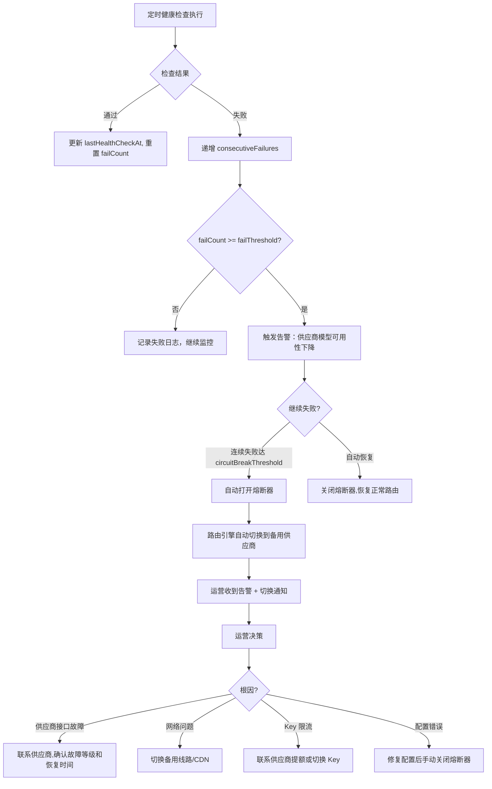

# 3cloud 供应商与模型管理 — 可编码深度规格

> **来源**：PRD-README.md §4.3 供应商与模型管理  
> **关联模块**：核心引擎 > 智能路由 | 财务 > 价格管理 | 监控 > 健康检查  
> **版本**：V1.0 | **日期**：2026-07-27  
> **前置依赖表**：`vendors`、`models`、`vendor_models`、`vendor_key_groups`、`vendor_key_group_items`、`vendor_key_group_model_prices`、`vendor_api_keys`

---

## 目录

1. [数据层：Drizzle Schema 全文](#1-数据层drizzle-schema-全文)
2. [API 接口清单](#2-api-接口清单)
3. [前端页面与组件](#3-前端页面与组件)
4. [Key 资源池完整规格](#4-key-资源池完整规格)
5. [供应商状态切换流程](#5-供应商状态切换流程)
6. [交叉引用与调用链](#6-交叉引用与调用链)

---

## 1. 数据层：Drizzle Schema 全文

```typescript
// ============================================================
//  vendors — 供应商主表
// ============================================================
export const vendors = pgTable("vendors", {
  id: serial("id").primaryKey(),
  name: varchar("name", { length: 100 }).notNull().unique(),
  baseUrl: varchar("base_url", { length: 500 }).notNull(),
  status: vendorStatusEnum("status").notNull().default("active"), // active | maintenance | offline
  description: text("description"),
  // 供应商自助注册字段
  userId: integer("user_id").references(() => users.id, { onDelete: "set null" }),
  companyName: varchar("company_name", { length: 255 }),
  contactName: varchar("contact_name", { length: 100 }),
  contactPhone: varchar("contact_phone", { length: 20 }),
  contactEmail: varchar("contact_email", { length: 255 }),
  email: varchar("email", { length: 255 }).unique(),
  passwordHash: varchar("password_hash", { length: 255 }),
  // 审核字段
  approvedAt: timestamp("approved_at", { withTimezone: true }),
  approvedBy: integer("approved_by").references(() => users.id, { onDelete: "set null" }),
  rejectReason: text("reject_reason"),
  createdAt: timestamp("created_at", { withTimezone: true }).notNull().defaultNow(),
  updatedAt: timestamp("updated_at", { withTimezone: true }).notNull().defaultNow(),
}, (table) => ({
  nameIdx: uniqueIndex("vendors_name_idx").on(table.name),
  userIdIdx: index("vendors_user_id_idx").on(table.userId),
}));

// ============================================================
//  models — 模型定义（全局统一模型名）
// ============================================================
export const models = pgTable("models", {
  id: serial("id").primaryKey(),
  name: varchar("name", { length: 100 }).notNull().unique(),     // 统一模型名，如 deepseek-v4-pro
  displayName: varchar("display_name", { length: 200 }),
  type: modelTypeEnum("type").notNull().default("chat"),
  description: text("description"),
  status: boolean("status").notNull().default(true),              // true=上架, false=下架
  createdAt: timestamp("created_at", { withTimezone: true }).notNull().defaultNow(),
  updatedAt: timestamp("updated_at", { withTimezone: true }).notNull().defaultNow(),
}, (table) => ({
  nameIdx: uniqueIndex("models_name_idx").on(table.name),
  typeStatusIdx: index("models_type_status_idx").on(table.type, table.status),
}));

modelTypeEnum: ["chat","embedding","image","audio","rerank","video","moderation","realtime"]

// ============================================================
//  vendor_models — 供应商-模型映射
// ============================================================
export const vendorModels = pgTable("vendor_models", {
  id: serial("id").primaryKey(),
  vendorId: integer("vendor_id").notNull().references(() => vendors.id, { onDelete: "cascade" }),
  modelId: integer("model_id").notNull().references(() => models.id, { onDelete: "cascade" }),
  upstreamModelName: varchar("upstream_model_name", { length: 200 }).notNull(), // 供应商侧的模型名
  // 定价（平台采购成本价）
  costPriceInput: numeric("cost_price_input", { precision: 18, scale: 6 }).notNull(),
  costPriceOutput: numeric("cost_price_output", { precision: 18, scale: 6 }).notNull(),
  // 定价（销售价，覆盖全局定价）
  sellPriceInput: numeric("sell_price_input", { precision: 18, scale: 6 }),
  sellPriceOutput: numeric("sell_price_output", { precision: 18, scale: 6 }),
  weight: integer("weight").notNull().default(10),
  priority: integer("priority").notNull().default(0),
  status: boolean("status").notNull().default(true),
  isDown: boolean("is_down").notNull().default(false),
  consecutiveFailures: integer("consecutive_failures").notNull().default(0),
  circuitState: circuitStateEnum("circuit_state").default("closed"),
  circuitOpenedAt: timestamp("circuit_opened_at", { withTimezone: true }),
  circuitRetryAfter: timestamp("circuit_retry_after", { withTimezone: true }),
  circuitFailCount: integer("circuit_fail_count").default(0),
  circuitSustained: boolean("circuit_sustained").default(false),
  // 健康检查
  lastHealthCheckAt: timestamp("last_health_check_at", { withTimezone: true }),
  healthCheckEndpoint: varchar("health_check_endpoint", { length: 500 }),
  healthCheckMethod: varchar("health_check_method", { length: 10 }).default("GET"),
  healthCheckIntervalSec: integer("health_check_interval_sec").default(30),
  healthCheckTimeoutMs: integer("health_check_timeout_ms").default(5000),
  healthCheckFailThreshold: integer("health_check_fail_threshold").default(3),
  healthCheckCircuitBreakThreshold: integer("health_check_circuit_break_threshold").default(10),
  // 速率限制
  rpmLimit: integer("rpm_limit"),
  tpmLimit: integer("tpm_limit"),
  // 时间戳
  createdAt: timestamp("created_at", { withTimezone: true }).notNull().defaultNow(),
  updatedAt: timestamp("updated_at", { withTimezone: true }).notNull().defaultNow(),
}, (table) => ({
  vendorModelIdx: uniqueIndex("vendor_models_vendor_model_idx").on(table.vendorId, table.modelId),
  modelIdIdx: index("vendor_models_model_id_idx").on(table.modelId),
  vendorDownIdx: index("vendor_models_vendor_down_idx").on(table.vendorId, table.isDown),
}));

// ============================================================
//  vendor_key_groups — 供应商 Key 资源池分组
// ============================================================
export const vendorKeyGroups = pgTable("vendor_key_groups", {
  id: serial("id").primaryKey(),
  vendorId: integer("vendor_id").notNull().references(() => vendors.id, { onDelete: "cascade" }),
  name: varchar("name", { length: 100 }).notNull(),
  strategy: varchar("strategy", { length: 20 }).notNull().default("round_robin"), // round_robin | weight_random
  description: text("description"),
  status: boolean("status").notNull().default(true),
  createdAt: timestamp("created_at", { withTimezone: true }).notNull().defaultNow(),
  updatedAt: timestamp("updated_at", { withTimezone: true }).notNull().defaultNow(),
}, (table) => ({
  vendorIdIdx: index("key_groups_vendor_idx").on(table.vendorId),
}));

// ============================================================
//  vendor_key_group_items — Key 资源池分组内的具体 Key
// ============================================================
export const vendorKeyGroupItems = pgTable("vendor_key_group_items", {
  id: serial("id").primaryKey(),
  groupId: integer("group_id").notNull().references(() => vendorKeyGroups.id, { onDelete: "cascade" }),
  apiKeyEncrypted: text("api_key_encrypted").notNull(),
  apiKeyPrefix: varchar("api_key_prefix", { length: 12 }),
  // 专属价格（可选，为空则沿用 vendor_models 定价）
  costPriceInput: numeric("cost_price_input", { precision: 18, scale: 6 }),
  costPriceOutput: numeric("cost_price_output", { precision: 18, scale: 6 }),
  sellPriceInput: numeric("sell_price_input", { precision: 18, scale: 6 }),
  sellPriceOutput: numeric("sell_price_output", { precision: 18, scale: 6 }),
  weight: integer("weight").notNull().default(1),
  priority: integer("priority").notNull().default(0),
  status: boolean("status").notNull().default(true),
  isDown: boolean("is_down").notNull().default(false),
  consecutiveFailures: integer("consecutive_failures").notNull().default(0),
  notes: text("notes"),
  deletedAt: timestamp("deleted_at", { withTimezone: true }),
  lastUsedAt: timestamp("last_used_at", { withTimezone: true }),
  totalCalls: integer("total_calls").notNull().default(0),
  successCalls: integer("success_calls").notNull().default(0),
  createdAt: timestamp("created_at", { withTimezone: true }).notNull().defaultNow(),
}, (table) => ({
  groupIdIdx: index("key_group_items_group_idx").on(table.groupId),
}));

// ============================================================
//  vendor_key_group_model_prices — Key-模型交叉价格
// ============================================================
export const vendorKeyGroupModelPrices = pgTable("vendor_key_group_model_prices", {
  id: serial("id").primaryKey(),
  keyGroupItemId: integer("key_group_item_id").notNull().references(() => vendorKeyGroupItems.id, { onDelete: "cascade" }),
  vendorModelId: integer("vendor_model_id").notNull().references(() => vendorModels.id, { onDelete: "cascade" }),
  type: varchar("type", { length: 10 }).notNull().default("percent"),  // percent | absolute
  inputValue: numeric("input_value", { precision: 18, scale: 6 }),
  outputValue: numeric("output_value", { precision: 18, scale: 6 }),
  createdAt: timestamp("created_at", { withTimezone: true }).notNull().defaultNow(),
  updatedAt: timestamp("updated_at", { withTimezone: true }).notNull().defaultNow(),
}, (table) => ({
  uniqueKeyModel: uniqueIndex("key_model_prices_key_model_idx").on(table.keyGroupItemId, table.vendorModelId),
  modelIdx: index("key_model_prices_model_idx").on(table.vendorModelId),
}));

// ============================================================
//  vendor_api_keys — 供应商自助管理的 API Key
// ============================================================
export const vendorApiKeys = pgTable("vendor_api_keys", {
  id: serial("id").primaryKey(),
  vendorId: integer("vendor_id").notNull().references(() => vendors.id, { onDelete: "cascade" }),
  keyHash: varchar("key_hash", { length: 64 }).notNull(),
  keyPrefix: varchar("key_prefix", { length: 10 }).notNull(),
  permissions: jsonb("permissions").notNull().default(["vendor:*"]),
  status: boolean("status").notNull().default(true),
  createdAt: timestamp("created_at", { withTimezone: true }).notNull().defaultNow(),
}, (table) => ({
  hashIdx: uniqueIndex("vendor_api_keys_hash_idx").on(table.keyHash),
  vendorIdIdx: index("vendor_api_keys_vendor_id_idx").on(table.vendorId),
}));
```

---

## 2. API 接口清单

### 2.1 供应商管理

#### `GET /api/v1/admin/vendors` — 供应商列表

**查询参数**

| 参数 | 类型 | 默认值 | 说明 |
|------|------|--------|------|
| page | int | 1 | — |
| pageSize | int | 20 | — |
| status | string | — | active / maintenance / offline |
| search | string | — | 模糊搜索名称 |
| sortBy | string | `name` | name / status / createdAt |
| sortDir | string | `asc` | asc / desc |

**响应 200**

```json
{
  "status": "ok",
  "data": {
    "items": [
      {
        "id": 1, "name": "DeepSeek", "baseUrl": "https://api.deepseek.com",
        "status": "active", "description": "DeepSeek AI",
        "healthScore": 99.8, "todayCalls": 56789, "todayCost": 234.50,
        "modelCount": 5, "keyGroupCount": 2,
        "createdAt": "2026-06-01T00:00:00Z"
      }
    ],
    "total": 12, "page": 1, "pageSize": 20
  }
}
```

#### `POST /api/v1/admin/vendors` — 创建供应商

```json
{
  "name": "新供应商",
  "baseUrl": "https://api.new-vendor.com",
  "description": "描述"
}
```

**响应 201**

```json
{ "status": "ok", "data": { "id": 13 } }
```

#### `PUT /api/v1/admin/vendors/:id` — 编辑供应商

```json
{
  "baseUrl": "https://api.new-url.com",
  "description": "更新描述",
  "status": "maintenance"
}
```

#### `POST /api/v1/admin/vendors/:id/test-connection` — 测试连通性

```json
{ "endpoint": "/v1/models", "method": "GET" }
```

**响应 200**

```json
{
  "status": "ok",
  "data": { "success": true, "latencyMs": 45, "statusCode": 200, "message": "连通性正常" }
}
```

失败时：

```json
{
  "status": "ok",
  "data": { "success": false, "latencyMs": 5000, "statusCode": 0, "error": "连接超时" }
}
```

#### `POST /api/v1/admin/vendors/:id/toggle-status` — 状态切换

```json
{
  "status": "maintenance",
  "reason": "计划内维护，预计 2 小时",
  "affectedModelIds": [1, 2, 5]
}
```

**响应 200**

```json
{
  "status": "ok",
  "data": {
    "status": "maintenance",
    "switchoverVendors": [
      { "vendorId": 2, "vendorName": "OspreyAI", "models": ["deepseek-chat", "deepseek-v4-flash"] }
    ]
  }
}
```

### 2.2 模型管理

#### `GET /api/v1/admin/models` — 模型列表

**查询参数**：页面/搜索/类型/状态过滤

**响应 200**

```json
{
  "status": "ok",
  "data": {
    "items": [
      {
        "id": 1, "name": "deepseek-chat", "displayName": "DeepSeek Chat",
        "type": "chat", "contextWindow": "128K",
        "sellPriceInput": 0.002, "sellPriceOutput": 0.008,
        "status": true, "vendorCount": 2
      }
    ],
    "total": 30
  }
}
```

#### `POST /api/v1/admin/models` — 创建模型

```json
{
  "name": "deepseek-chat",
  "displayName": "DeepSeek Chat",
  "type": "chat",
  "description": "DeepSeek 对话模型"
}
```

#### `PUT /api/v1/admin/models/:id` — 编辑模型

```json
{
  "displayName": "DeepSeek Chat V2",
  "status": false
}
```

### 2.3 供应商-模型映射

#### `GET /api/v1/admin/vendors/:id/models` — 获取供应商的模型映射列表

**响应 200**

```json
{
  "status": "ok",
  "data": {
    "items": [
      {
        "id": 1, "vendorId": 1, "vendorName": "DeepSeek",
        "modelId": 1, "modelName": "deepseek-chat", "upstreamModelName": "deepseek-chat",
        "costPriceInput": 0.0012, "costPriceOutput": 0.0048,
        "sellPriceInput": 0.0020, "sellPriceOutput": 0.0080,
        "weight": 10, "priority": 1,
        "status": true, "isDown": false,
        "circuitState": "closed",
        "healthScore": 99.8
      }
    ],
    "total": 5
  }
}
```

#### `POST /api/v1/admin/vendors/:id/models` — 添加映射

```json
{
  "modelId": 1,
  "upstreamModelName": "deepseek-chat",
  "costPriceInput": 0.0012, "costPriceOutput": 0.0048,
  "sellPriceInput": 0.0020, "sellPriceOutput": 0.0080,
  "weight": 10, "priority": 1
}
```

#### `PUT /api/v1/admin/vendor-models/:id` — 更新映射

```json
{
  "upstreamModelName": "deepseek-chat-v2",
  "costPriceInput": 0.0010, "costPriceOutput": 0.0040,
  "weight": 15, "priority": 2,
  "status": false
}
```

#### `POST /api/v1/admin/vendor-models/batch-update-prices` — 批量改价

```json
{
  "ids": [1, 2, 5],
  "operation": "percent_decrease",
  "value": 10
}
```

或

```json
{
  "ids": [1, 2, 5],
  "operation": "set_fixed",
  "inputPrice": 0.0015,
  "outputPrice": 0.0060
}
```

**响应 200**

```json
{
  "status": "ok",
  "data": {
    "updated": 3,
    "preview": [
      { "id": 1, "oldSellInput": 0.0020, "newSellInput": 0.0018 },
      { "id": 2, "oldSellInput": 0.0015, "newSellInput": 0.00135 }
    ]
  }
}
```

### 2.4 Key 资源池管理

#### `GET /api/v1/admin/vendors/:vendorId/key-groups` — 获取分组列表（含统计）

**响应 200**

```json
{
  "status": "ok",
  "data": {
    "groups": [
      {
        "id": 1, "name": "高优先级组", "strategy": "round_robin",
        "status": true, "description": "",
        "itemCount": 3, "activeCount": 2, "downCount": 1,
        "createdAt": "2026-07-17T00:00:00Z"
      }
    ]
  }
}
```

#### `POST /api/v1/admin/vendors/:vendorId/key-groups` — 创建分组

```json
{
  "name": "高优先级组",
  "strategy": "round_robin",
  "description": "采购价较高但稳定的 Key"
}
```

#### `PUT /api/v1/admin/vendor-key-groups/:id` — 更新分组

```json
{
  "name": "高优先级组 V2",
  "strategy": "weight_random",
  "status": false
}
```

#### `DELETE /api/v1/admin/vendor-key-groups/:id` — 删除分组（软删除，标记 deleted_at）

#### `GET /api/v1/admin/vendor-key-groups/:groupId/items` — 分组内 Key 列表

**响应 200**

```json
{
  "status": "ok",
  "data": {
    "items": [
      {
        "id": 1,
        "apiKeyPrefix": "sk-xxxx1",
        "weight": 5, "priority": 0,
        "status": true, "isDown": false,
        "costPriceInput": null, "costPriceOutput": null,
        "sellPriceInput": null, "sellPriceOutput": null,
        "consecutiveFailures": 0,
        "totalCalls": 12345, "successCalls": 12300,
        "lastUsedAt": "2026-07-27T22:00:00Z",
        "createdAt": "2026-07-17T00:00:00Z"
      }
    ]
  }
}
```

#### `POST /api/v1/admin/vendor-key-groups/:groupId/items` — 添加 Key

```json
{
  "apiKey": "sk-xxxxxxxxxxxx",
  "weight": 5,
  "priority": 0,
  "costPriceInput": 0.0010, "costPriceOutput": 0.0040,
  "sellPriceInput": null, "sellPriceOutput": null,
  "notes": "高优先级采购价 ¥0.001/输入"
}
```

#### `PUT /api/v1/admin/vendor-key-group-items/:id` — 更新 Key

```json
{
  "weight": 3, "priority": 1,
  "sellPriceInput": 0.0018, "sellPriceOutput": 0.0070,
  "notes": "调整权重"
}
```

#### `DELETE /api/v1/admin/vendor-key-group-items/:id` — 移除 Key（软删除）

#### `POST /api/v1/admin/vendor-key-groups/:groupId/test-all` — 测试分组内所有 Key

**响应 200**

```json
{
  "status": "ok",
  "data": {
    "results": [
      { "itemId": 1, "prefix": "sk-xxxx1", "success": true, "latencyMs": 45, "error": null },
      { "itemId": 2, "prefix": "sk-xxxx2", "success": true, "latencyMs": 67, "error": null },
      { "itemId": 3, "prefix": "sk-xxxx3", "success": false, "latencyMs": 5000, "error": "请求超时" }
    ]
  }
}
```

### 2.5 价格变更历史

#### `GET /api/v1/admin/vendor-models/:id/price-history`

**响应 200**

```json
{
  "status": "ok",
  "data": {
    "history": [
      {
        "changedAt": "2026-07-26T11:30:00Z",
        "changedBy": "admin@3cloud.ai",
        "field": "sell_price_input",
        "oldValue": "0.0020", "newValue": "0.0018",
        "reason": "供应商降价，同步调整"
      }
    ]
  }
}
```

---

## 3. 前端页面与组件

### 3.1 路由映射

| 路由 | 组件 | 权限 |
|------|------|------|
| `/admin/vendors` | VendorListPage | `MODEL_MANAGE` |
| `/admin/vendors/:id` | VendorDetailPage | `MODEL_MANAGE` |
| `/admin/models` | ModelListPage | `MODEL_MANAGE` |
| `/admin/models/:id` | ModelDetailPage | `MODEL_MANAGE` |
| `/admin/vendor-models` | VendorModelListPage | `MODEL_MANAGE` |
| `/admin/vendor-key-groups` | KeyGroupListPage | `MODEL_MANAGE` |
| `/admin/vendor-key-groups/:id` | KeyGroupDetailPage | `MODEL_MANAGE` |

### 3.2 核心组件 Props

```typescript
// VendorListPage
interface VendorListState { loading: boolean; vendors: VendorItem[]; total: number; page: number; search: string; statusFilter: string; }

// VendorDetailPage — 读/写分离
interface VendorDetailPageProps { vendorId: number; }
interface VendorDetailState {
  vendor: VendorDetail | null;
  models: VendorModelItem[];
  keyGroups: KeyGroupSummary[];
  healthHistory: HealthCheckPoint[];
  loading: boolean; tab: 'info' | 'models' | 'keys' | 'health';
}

// 供应商状态切换弹窗
interface VendorStatusToggleDialogProps {
  open: boolean; vendorName: string; currentStatus: VendorStatus;
  onConfirm: (newStatus: VendorStatus, reason: string) => void; onCancel: () => void;
}
interface VendorStatusToggleDialogState {
  targetStatus: VendorStatus;
  reason: string;
  impactAnalysis: { affectedModels: number[]; switchoverVendors: string[] } | null;
  loading: boolean;
}

// ModelListPage
interface ModelListState { loading: boolean; models: ModelItem[]; total: number; page: number; typeFilter: string; }

// KeyGroupDetailPage
interface KeyGroupDetailPageState {
  group: KeyGroup | null;
  items: KeyGroupItem[];
  loading: boolean;
}

// 连通性测试结果
interface ConnectionTestResult {
  itemId: number; prefix: string;
  success: boolean; latencyMs: number; error: string | null;
}
interface ConnectionTestDialogProps {
  open: boolean; results: ConnectionTestResult[];
  onClose: () => void; onRetry: () => void;
}
```

---

## 4. Key 资源池完整规格

### 4.1 分组内 Key 的加权轮询算法

```typescript
function selectKey(items: KeyGroupItem[], strategy: string): KeyGroupItem | null {
  const activeItems = items.filter(i => i.status && !i.isDown && !i.deletedAt);
  if (activeItems.length === 0) return null;

  if (strategy === 'round_robin') {
    // 按优先级排序，同优先级轮流
    activeItems.sort((a, b) => a.priority - b.priority);
    const totalWeight = activeItems.reduce((sum, i) => sum + i.weight, 0);
    // 使用平滑加权轮询（Smooth Weighted Round-Robin）
    return smoothWeightedRoundRobin(activeItems, totalWeight);
  }

  // weight_random: 按权重随机选择
  const totalWeight = activeItems.reduce((sum, i) => sum + i.weight, 0);
  let random = Math.random() * totalWeight;
  for (const item of activeItems) {
    random -= item.weight;
    if (random <= 0) return item;
  }
  return activeItems[0];
}

// 平滑加权轮询状态（需跨请求保持）
const RRState = new Map<number, { current: Map<number, number> }>();
function smoothWeightedRoundRobin(items: KeyGroupItem[], totalWeight: number): KeyGroupItem {
  // 参考 Nginx upstream smooth weighted round-robin
  // 每次选中后该选项的 currentWeight = currentWeight - totalWeight
  // 所有选项每次 currentWeight = currentWeight + weight
  // 选 currentWeight 最大的
}
```

### 4.2 Key 与 Model 交叉价格规则

```
Key 定价优先级（高 → 低）：
  1. vendor_key_group_model_prices（Key-模型交叉折扣）
  2. vendor_key_group_items.sellPrice*（Key 专属售价）
  3. vendor_models.sellPrice*（供应商-模型映射售价）
  4. 全局价格表（pricing 服务）
```

### 4.3 连接测试流程

```
[管理员点击"测试连通性"]
  → 后端解密 API Key
  → 向供应商 baseUrl + endpoint 发送请求
  → 记录响应时间 / HTTP 状态码
  → 解密后 5 秒内清除内存中的明文 Key
  → 返回结果（成功/失败 + 延迟 + 错误信息）
```

---

## 5. 供应商状态切换流程

### 5.1 状态机

```
active ─────┬──→ maintenance     ← 管理员手动切换
            └──→ offline          ← 管理员手动切换 / 熔断触发

maintenance ──→ active            ← 维护完毕恢复
              → offline           ← 确认下线

offline ──────→ active            ← 重新上线（需审核）
```

### 5.2 切换时的影响范围计算

```typescript
// 供应商状态切换时，后端自动计算影响范围
interface SwitchoverImpact {
  affectedModelIds: number[];        // 哪些模型会受影响
  switchoverVendors: SwitchoverVendor[];  // 各模型的备用供应商
  estimatedTrafficRedirect: number;  // 预计重定向的流量百分比
}

// 前端弹窗展示影响范围 + 备用供应商就绪状态
// 管理员填写下线原因后才允许确认切换
```

### 5.3 切换确认弹窗 Props

```typescript
interface VendorStatusToggleDialogProps {
  open: boolean;
  vendorName: string;
  currentStatus: VendorStatus;
  onConfirm: (newStatus: VendorStatus, reason: string) => Promise<void>;
  onCancel: () => void;
}

// 弹窗内显示：
//   "将 DeepSeek 切换为维护模式"
//   "影响：约 50% 的请求将路由到备用供应商"
//   "备用供应商就绪：OspreyAI（已验证）"
//   "说明：[文本框——必填]"
//   "备用供应商待切换模型：deepseek-chat, gpt-4o"
```

---

## 6. 交叉引用与调用链

### 6.1 跨模块数据流

```
供应商管理
├── vendor-models 定价 → 路由引擎选择供应商（ref-5.1-routing.md）
├── vendor-models circuitState → 熔断器状态影响路由选择
├── key-groups 配置 → 路由引擎 Key 分配
├── 价格变更 → 同步更新 billing 价格快照（PRD-README §5.2）
├── 健康检查 → monitoring 告警规则触发（ref-5.4-alert-rules.md）
└── vendor_api_keys → 供应商自助管理验证（ref-4.10 供应商自助）

模型管理
├── model 定义 → 用户端模型中心（ref-2.2-user-dashboard 区域 6）
├── model 状态 → 用户端告警"模型下线"（ref-2.2 区域 12）
└── model 价格 → 成本优化建议（ref-2.2 区域 15）
```

### 6.2 依赖的外部模块

| 供应商模块 | 外部模块 | 依赖类型 | 说明 |
|-----------|---------|---------|------|
| vendor-models | 路由引擎 | 强 | 路由选择时读取映射 |
| vendor-models | 熔断器 | 强 | circuitState 由熔断器写入 |
| key-groups | 路由引擎 | 强 | Key 选择时读分组 |
| 供应商管理 | 监控 > 健康检查 | 弱 | health_check* 字段 |
| 价格变更 | 财务 > 价格 | 强 | 批量改价影响定价 |
| status 切换 | 告警模块 | 弱 | 下线触发告警 |

---

> **关联文档**
> - `PRD-README.md` §4.3 — 供应商与模型管理（本文件的基础）
> - `ref-5.1-routing.md` — 智能路由系统
> - `ref-5.4-alert-rules.md` — 告警规则配置
> - `ref-2.2-user-dashboard.md` — 用户端仪表盘
> - `ref-5.2-billing.md` — 计费价格变更同步
> - `ref-5.4-alert-rules.md` §6.3 — 供应商模块API告警
> - `ops-manual.md` §十一.4 — 供应商链路异常处理
> - `SPEC-§29-资金与对账管理.md` — 供应商结算对账

---

## 7. 供应商异常场景运营处理（运营视角补充）

> **P0 补充**：2026-07-30 — 供应商上下线用户影响处理、Key 耗尽通知、健康检查驱动运营决策、批量异常降级

### 7.1 供应商上下线对用户的影响处理

#### 7.1.1 供应商主动下线流程

```
运营发起下线 → 系统检查影响范围 → 通知受影响的用户 → 执行下线 → 确认路由切换完成

详细步骤：

1. 运营在管理后台发起供应商下线申请
2. 系统自动检查下线影响范围：
   - 该供应商提供哪些模型
   - 有多少用户正在使用这些模型
   - 这些模型是否有可用备用供应商
3. 系统生成影响报告供运营确认：
   "下线 DeepSeek 将影响：
    - 模型 5 个（deepseek-chat / deepseek-coder / ...）
    - 活跃用户 128 人
    - 该模型组可用备用供应商：OspreyAI（已连接）/ 阿里云（已验证）"
4. 运营填写下线原因（必填）、设置下线时间（立即/定时）
5. 系统执行下线：
   a. 先将该供应商所有模型标记为"切换中"（30 秒内不接受新请求）
   b. 路由引擎自动将流量切换到备用供应商
   c. 确认所有备用供应商连通性正常
   d. 将供应商状态改为 offline
6. 路由切换成功后，向受影响用户发送站内通知：
   "deepseek-chat 模型已切换至 OspreyAI 供应，价格和服务质量不变"
   （仅在该模型有备用供应商时通知；无备用供应商时通知用户该模型已下线）
```

#### 7.1.2 供应商被动熔断流程

```
熔断器触发 → 自动切换 → 记录事件 → 运营确认

1. 熔断器检测到供应商连续失败超过阈值（默认 10 次）
2. 自动打开熔断器：vendor_models.circuitState = 'open'
3. 路由引擎自动将流量切换到备用供应商
4. 系统记录熔断事件到 security_events
5. 运营收到告警通知："DeepSeek 熔断器已打开，已自动切换到 OspreyAI"
6. 运营核查根因后，手动或自动恢复熔断器
```

**切换中的请求处理：**

| 请求状态 | 处理方式 |
|---------|---------|
| 已发送到供应商等待响应 | 等待完成（允许最多 30s 超时）
| 排队中但未发送 | 重新路由到备用供应商
| 新到达 | 直接路由到备用供应商

#### 7.1.3 供应商 Key 耗尽/过期处理

```
检测 → 通知运营 → 切换 Key / 供应商

1. 系统检测到供应商 API Key 返回 401/403（过期或无效）
2. 自动将该 Key 标记为 isDown=true，切换到该 Key 分组内下一个可用 Key
3. 若整个 Key 分组都不可用：
   a. 自动切换到该供应商的备用 Key 分组
   b. 若无可用的 Key 分组：切换到备用供应商
4. 记录事件到 security_events（type=vendor_key_exhausted）
5. 告警通知运营："DeepSeek API Key 已失效（分组：主库-1），建议立即续费"
6. 运营收到通知后：
   a. 核实 Key 状态
   b. 续费或更新 Key
   c. 在 Key 资源池中更新 Key
   d. 验证连通性后恢复
```

### 7.2 健康检查驱动的运营决策

#### 7.2.1 健康检查→告警→决策流程



#### 7.2.2 告警→运营通知延迟指标

| 阶段 | 目标延迟 | 说明 |
|------|---------|------|
| 健康检查发现异常→告警触发 | ≤ 30s | 从检查失败到告警写入 |
| 告警触发→运营通知送达 | ≤ 2min | 通过飞书/企微/短信通知运营 |
| 运营通知→运营响应确认 | ≤ 15min | 运营确认已收到并开始处理（SLA） |
| 运营确认→切换执行 | ≤ 5min | 运营手动切换或确认自动切换 |
| 熔断器打开→自动切换完成 | ≤ 10s | 自动切换无需运营干预 |

#### 7.2.3 运营操作面板

管理后台 → 供应商管理 → 异常处理

```
┌─ 供应商异常处理 ─────────────────────────────────────┐
│                                                         │
│ 实时状态: ✅ 正常   ⚠️ 异常 1   ❌ 熔断 2              │
│                                                         │
│ ┌─ 异常供应商列表 ─────────────────────────────────┐   │
│ │ 供应商   | 模型      | 状态    | 持续   | 操作    │   │
│ │ DeepSeek | deepseek  | ⚠️ 告警  | 5min  | [查看]  │   │
│ │ OspreyAI | gpt-4o    | ❌ 熔断  | 1min  | [切换]  │   │
│ │ 阿里云   | qwen      | ✅ 备用  | —     | [设置]  │   │
│ └────────────────────────────────────────────────────┘   │
│                                                         │
│ 一键切换备选供应商: [选中异常项] [一键切换]              │
│                                                         │
│ 最近异常事件:                                           │
│ 14:23 DeepSeek 健康检查失败 ×5，告警触发                 │
│ 14:20 OspreyAI 熔断器打开，流量已切换至阿里云             │
│ 12:00 阿里云备用 Key 耗尽，已自动切换到 DeepSeek          │
└─────────────────────────────────────────────────────────┘
```

### 7.3 供应商批量异常降级策略

#### 7.3.1 多供应商同时故障降级分级

| 故障范围 | 降级策略 | 运营操作 |
|---------|---------|---------|
| 1 个供应商中 1 个模型 | 自动切换到该模型的其他供应商 | 无需干预 |
| 1 个供应商中多个模型 | 自动批量切换 + 通知运营 | 确认切换状态 |
| 多个供应商中相同模型 | 按优先级选择剩余可用供应商，若无则下线该模型 | 通知受影响的用户 |
| 关键供应商全站宕机 | 自动切换到所有备用供应商 + 紧急通知 | 联系关键供应商确认 |
| **所有同类型供应商故障** | **模型下线 + 用户通知 + 触发 BCP（业务连续性计划）** | **运营按 BCP 手册执行** |

#### 7.3.2 批量异常降级执行时序

```mermaid
flowchart TD
    A[检测到多个供应商/模型异常] --> B[系统评估故障范围]
    B --> C[按降级分级执行]
    C --> D{所有受影响模型
    都有备用供应商?}
    D -->|是| E[自动切换到备用供应商]
    E --> F[记录切换日志]
    F --> G[通知运营:切换完成]
    
    D -->|否| H[部分模型无备用供应商]
    H --> I[有备用供应商的模型:自动切换]
    I --> J[无备用供应商的模型:标记为"暂时不可用"]
    J --> K[通知受影响用户:模型不可用]
    K --> L[运营评估新增供应商可行性]
```

#### 7.3.3 供应商切换后用户通知模板

**场景 1：模型已切换到备用供应商（价格和服务不变）**

> 通知标题：deepseek-chat 模型已切换供应商
> 通知内容：为保障您的服务稳定性，deepseek-chat 模型已自动从 DeepSeek 切换至 OspreyAI 供应。
> - 价格：不变（¥0.0150/1K tokens）
> - 服务质量：不变
> - 生效时间：即时
> - 无需任何操作

**场景 2：模型暂时不可用（无备用供应商）**

> 通知标题：deepseek-chat 模型暂时不可用
> 通知内容：因供应商故障，deepseek-chat 模型暂时不可用。我们正在紧急处理中。
> - 预计恢复时间：请关注后续通知
> - 替代方案：您可切换到以下替代模型：[列出替代模型]
> - 影响评估：不影响您的账户余额和其他模型

#### 7.3.4 降级策略配置

| 配置项 | 默认值 | 说明 |
|--------|--------|------|
| 自动切换开关 | true | 是否自动切换到备用供应商 |
| 批量异常触发阈值 | 3 个模型同时异常 | 多少模型同时异常视为批量异常 |
| 自动切换冷却期 | 5 分钟 | 切换后 5 分钟内不再自动切换（防抖动） |
| 备选供应商健康检查前置 | true | 切换前先验证备用供应商连通性 |
| 用户通知开关 | true | 切换后是否通知用户 |

---

## 8. 供应商入驻审核与价格变更流程（运营视角补充）

> **P1 补充**：2026-07-30 — 供应商入驻审核超时处理、修改价格审批流程

### 8.1 供应商入驻审核流程

#### 8.1.1 审核时序

```
供应商提交入驻 → 资料初审（运营）→ 技术对接验证 → 正式上线

1. 供应商填写入驻信息：
   - 供应商名称、联系方式、合同信息
   - API 地址、认证方式（API Key / OAuth / 自定义）
   - 模型清单及定价方案
   - 服务协议签署

2. 运营初审（T+1 内完成）：
   - 审核供应商资质文件
   - 确认合同条款完整
   - 填写运营审核意见

3. 技术对接验证（T+3 内完成）：
   - 建立 API 连接
   - 测试模型连通性和响应质量
   - 验证定价计算准确性
   - 运行 24 小时健康监测

4. 正式上线：
   - 设置供应商状态为 active
   - 配置路由权重（初始值较低，逐步调高）
   - 通知运营和产品团队
```

#### 8.1.2 审核超时处理

| 阶段 | 超时时间 | 升级路径 |
|------|---------|---------|
| 运营初审 | T+1 未处理 | 通知运营主管 |
| 技术对接 | T+3 未完成 | 通知技术负责人 |
| 上线审批 | T+5 未上线 | 通知 super_admin |

**超时影响：**

- 超过 T+7 未完成入驻 → 供应商状态自动标记为 stalled
- 超过 T+14 未完成入驻 → 自动关闭入驻申请，通知供应商
- 超时原因记录到 operation_logs

#### 8.1.3 审核驳回规则

| 驳回原因 | 可重新提交 | 重新提交限制 |
|---------|-----------|-------------|
| 资料不完整 | ✅ | 补充后立即重新提交 |
| 资质不符合要求 | ❌（需补充材料） | 30 天后可重新申请 |
| 技术对接失败 | ✅ | 修复后立即重新提交 |
| 定价不合理 | ✅ | 调整定价后重新提交 |
### 8.2 供应商修改价格审批流程

#### 8.2.1 价格变更分级

| 变更类型 | 审批流程 | 生效时间 | 用户影响 |
|---------|---------|---------|---------|
| 降价 | 运营审核（自动通过） | 即时生效 | 用户受益，无通知需求 |
| 涨价 ≤ 10% | 运营审核 + 财务审核 | 7 天后生效 | 通知所有使用该模型的用户 |
| 涨价 10%-30% | 运营审核 + 财务审核 + super_admin 审批 | 14 天后生效 | 提前通知 + 建议替换模型 |
| 涨价 > 30% | super_admin + 产品负责人 | 30 天后生效 | 提前通知 + 自动推荐替代方案 |
| 新增模型定价 | 运营审核 | 即时生效 | 仅新增，不影响现有用户 |

#### 8.2.2 价格变更执行流程

```
1. 供应商提交价格变更申请
2. 系统自动判断变更级别
3. 根据级别路由到对应审批人
4. 审批通过后：
i   a. 新价格存入 vendor_price_history
   b. 新价格生效时间按级别规则设定
   c. 自动通知受影响用户
   d. 更新计费引擎中的价格缓存
5. 审批驳回：通知供应商驳回原因

用户通知模板（涨价场景）：

"尊敬的 3cloud 用户，
供应商 DeepSeek 的 DeepSeek-V3 模型将于 2026-08-06 起调整价格：
  输入：¥1.00/1M tokens → ¥1.20/1M tokens
  输出：¥2.00/1M tokens → ¥2.40/1M tokens
您可考虑切换到以下替代模型：[DeepSeek-V4 | GLM-5-Pro | Qwen3.5]
"
```

#### 8.2.3 价格变更后用户影响评估

| 检查项 | 说明 |
|--------|------|
| 受影响用户数 | 过去 30 天使用该模型的用户数 |
| 受影响代理商 | 该模型在代理分组中的使用情况 |
| 月消费影响 | 假设用量不变，月消费变动金额 |
| 平台毛利影响 | 涨价/降价对平台毛利率的影响 |
| 替代方案可用性 | 是否有同级别的替代模型可用 |
| 自动切换建议 | 系统推荐是否自动为用户切换替代模型 |
