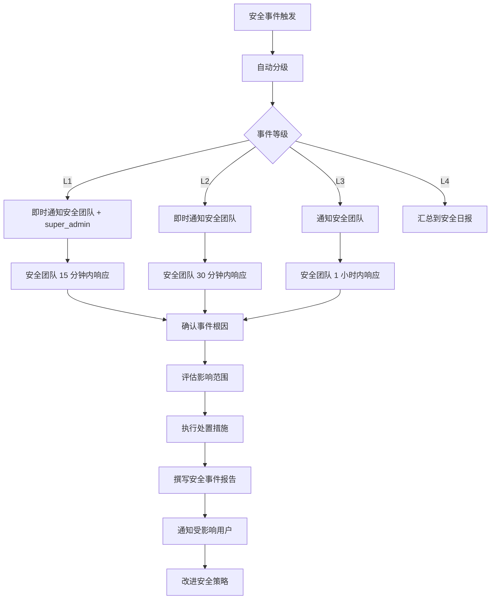

# 安全与风控 — 深化参考文档

> **对应章节**：[PRD-README.md §4.6 安全与风控精化](../PRD-README.md#46-安全与风控精化)
> **状态**：基于现有后端代码（`api/src/db/schema/security.ts`、`api/src/services/security-event/`、`api/src/services/rule-engine/`、`api/src/services/login-security/`、`api/src/services/two-factor/`、`api/src/routes/admin/threat-intel.ts`、`api/src/routes/admin/risk-control.ts`、`api/src/middleware/auth.ts`）生成
> **粒度**：Schema 字段定义 → API 接口 → 前端组件 Props → 安全架构 → 交叉引用

---

## 目录

1. [安全架构总览](#1-安全架构总览)
2. [角色与权限体系](#2-角色与权限体系)
3. [安全事件系统](#3-安全事件系统)
4. [安全自动规则引擎](#4-安全自动规则引擎)
5. [AI 风控模型](#5-ai-风控模型)
6. [威胁情报管理](#6-威胁情报管理)
7. [安全配置中心](#7-安全配置中心)
8. [内容过滤系统](#8-内容过滤系统)
9. [登录安全与2FA](#9-登录安全与2fa)
10. [审计日志](#10-审计日志)
11. [跨模块数据流](#11-跨模块数据流)

---

## 1. 安全架构总览

### 1.1 安全层次

```
Layer 1: IP/网络层
  ├── 地理封禁（国家/IP段黑白名单）
  ├── 全局 IP 黑名单（Redis SET + TTL）
  └── 异地登录检测（GeoIP 经纬度校验）

Layer 2: 认证层
  ├── API Key 认证（SHA256 hash + 权限校验）
  ├── JWT Session 认证（用户登录态）
  ├── 双因素认证（TOTP + 备用码）
  └── 登录安全限制（失败锁定/时段限制）

Layer 3: 行为层
  ├── 安全规则引擎（阈值触发 → 自动处置）
  ├── AI 风控模型（12维特征 → 风险评分）
  └── 内容过滤（关键字/正则 → 拦截/替换）

Layer 4: 审计层
  ├── 安全事件记录（security_events 表）
  ├── 操作审计日志（audit_logs 表，含 diff）
  └── 内容过滤日志（filter_logs 表）

Layer 5: 威胁情报层
  ├── 外部威胁情报源（AbuseIPDB/VirusTotal/OTX）
  ├── 内部威胁聚合（近30天活跃安全事件维度）
  └── 黑名单自动同步
```

### 1.2 安全相关数据表总览

| 表名 | 用途 | 引擎层 |
|------|------|--------|
| `security_events` | 安全事件记录 | Layer 4 |
| `security_auto_rules` | 自动处置规则 | Layer 3 |
| `user_login_sessions` | 用户登录会话 | Layer 2 |
| `login_security_configs` | 登录安全配置（KV） | Layer 2 |
| `content_filters` | 内容过滤规则 | Layer 3 |
| `filter_logs` | 内容过滤日志 | Layer 4 |
| `circuit_history` | 熔断器历史记录 | Layer 1 |
| `audit_logs` | 操作审计日志 | Layer 4 |

### 1.3 Redis 实时风控键空间

| 键模式 | 用途 | TTL |
|--------|------|-----|
| `risk:ban:ip:{ip}` | IP 封禁 | 3600s（可配置）|
| `risk:ban:user:{userId}` | 用户封禁 | 86400s（可配置）|
| `risk:limit:login:{userId}` | 登录锁定 | 30min（可配置）|
| `perm:user:{userId}` | 用户权限缓存 | 60s |
| `threat:intel:config` | 威胁情报源配置 | 86400s |

---

## 2. 角色与权限体系

### 2.1 权限模型（Bitset）

权限使用 **BigInt bitset** 实现，每个 bit 表示一项权限：

```typescript
export const Perm = {
  NONE:                0n,
  DASHBOARD_VIEW:      1n << 0n,
  USER_LIST:           1n << 1n,
  USER_VIEW:           1n << 2n,
  USER_EDIT:           1n << 3n,
  USER_DELETE:          1n << 4n,
  USER_CREATE:          1n << 5n,
  USER_RESET_PWD:       1n << 6n,
  USER_CHANGE_ROLE:     1n << 7n,
  USER_BALANCE:         1n << 8n,
  USER_IMPERSONATE:     1n << 9n,
  REVIEW_LIST:          1n << 10n,
  REVIEW_ACTION:        1n << 11n,
  MODEL_MANAGE:         1n << 12n,
  FINANCE_VIEW:         1n << 13n,
  FINANCE_COMMISSION:   1n << 14n,
  FINANCE_WITHDRAW:     1n << 15n,
  FINANCE_RECHARGE:     1n << 16n,
  CONFIG_VIEW:          1n << 17n,
  CONFIG_EDIT:          1n << 18n,
  SECURITY_VIEW:        1n << 19n,
  SECURITY_ACTION:      1n << 20n,
  AUDIT_VIEW:           1n << 21n,
  AGENT_LIST:           1n << 22n,
  AGENT_MANAGE:         1n << 23n,
  LOG_VIEW:             1n << 24n,
  OPS_READ:             1n << 25n,
  RECONCILIATION_VIEW:  1n << 26n,
  SECURITY_EDIT:        1n << 27n,
  AUDIT_REVIEW:         1n << 28n,
  RECONCILIATION_MANAGE: 1n << 29n,
} as const;
```

### 2.2 内置角色权限矩阵

| 角色 | 标识 | 安全相关权限 | 其他核心权限 |
|------|------|-------------|-------------|
| 超级管理员 | `super_admin` | 全部（~0n） | 全部 |
| 管理员 | `admin` | SECURITY_VIEW + ACTION + EDIT, AUDIT_VIEW + REVIEW | 用户/模型/财务/代理/日志/配置 |
| 财务专员 | `finance_ops` | AUDIT_VIEW, LOG_VIEW | 全部财务 + 用户查看 + 代理查看 |
| 运维工程师 | `ops` | SECURITY_VIEW + ACTION + EDIT, CONFIG_VIEW + EDIT, AUDIT_VIEW | 用户查看、模型管理、日志、代理查看 |
| 客服/审核 | `support` | LOG_VIEW, REVIEW_LIST + ACTION | 用户管理(不含删除/改角色)、实名审核 |
| 审计员 | `auditor` | AUDIT_VIEW + REVIEW, RECONCILIATION_VIEW | 用户查看、日志查看、代理查看 |
| 用户 | `user` | 无管理员权限 | 基础用户权限 |

### 2.3 权限计算优先级

```
user_permission_overrides（最高）
  → user_role_assignments（中级）
  → users.role 内置（最低）
```

支持细粒度的 `grantPerms` / `denyPerms` 覆盖。

### 2.4 API 接口

#### GET `/api/v1/admin/roles` — 角色列表

```json
{
  "code": 0,
  "data": [
    { "id": 1, "name": "super_admin", "label": "超级管理员", "permissions": "..." }
  ]
}
```

#### POST `/api/v1/admin/roles` — 创建角色

```json
{ "name": "security_ops", "label": "安全运维", "permissions": "SECURITY_VIEW|SECURITY_ACTION|SECURITY_EDIT|AUDIT_VIEW|AUDIT_REVIEW|CONFIG_VIEW|OPS_READ" }
```

#### POST `/api/v1/admin/users/:id/permissions` — 权限覆盖

```json
{ "grantPerms": ["SECURITY_VIEW", "SECURITY_ACTION"], "denyPerms": ["FINANCE_VIEW"] }
```

---

## 3. 安全事件系统

### 3.1 安全事件表结构（`security_events`）

```typescript
export const securityEvents = pgTable("security_events", {
  id: serial("id").primaryKey(),
  userId: integer("user_id").references(() => users.id, { onDelete: "set null" }),
  eventType: securityEventTypeEnum("event_type").notNull(),
  riskLevel: riskLevelEnum("risk_level").notNull(),
  ip: varchar("ip", { length: 45 }),
  userAgent: varchar("user_agent", { length: 500 }),
  city: varchar("city", { length: 100 }),
  country: varchar("country", { length: 100 }),
  detail: jsonb("detail"),              // 事件详情（JSON，支持任意额外字段）
  acknowledged: boolean("acknowledged").notNull().default(false),
  acknowledgedBy: integer("acknowledged_by").references(() => users.id),
  acknowledgedAt: timestamp("acknowledged_at", { withTimezone: true }),
  createdAt: timestamp("created_at", { withTimezone: true }).notNull().defaultNow(),
});
```

**索引**：
- `security_events_type_idx` — 按事件类型筛选
- `security_events_user_id_idx` — 关联用户查询
- `security_events_risk_idx` — 严重等级排序
- `security_events_created_at_idx` — 时间范围查询
- `security_events_unack_idx` — 未处置事件

### 3.2 事件类型枚举

```typescript
export const securityEventTypeEnum = pgEnum("security_event_type", [
  "brute_force",        // 暴力破解
  "unusual_location",   // 异地登录
  "new_device",         // 新设备
  "ip_banned",          // IP 被封禁
  "user_banned",        // 用户被封禁
  "user_captcha",       // 验证码挑战
  "circuit_trip",       // 熔断器触发
  "circuit_recovery",   // 熔断器恢复
  "vendor_failure",     // 供应商故障
  "test_alert",         // 测试告警
]);
```

### 3.3 风险等级枚举

```typescript
export const riskLevelEnum = pgEnum("risk_level", [
  "low",      // 🟢 提醒
  "medium",   // 🟡 告警
  "high",     // 🟠 高危
  "critical", // 🔴 紧急
]);
```

### 3.4 API 接口

#### GET `/api/v1/admin/security-events` — 事件列表

**Query**: `page`, `pageSize`, `eventType`, `riskLevel`, `acknowledged`, `userId`, `startDate`, `endDate`

**响应**：
```json
{
  "code": 0,
  "data": {
    "list": [
      {
        "id": 1001,
        "userId": 10086,
        "eventType": "brute_force",
        "riskLevel": "high",
        "ip": "47.95.164.33",
        "city": "北京市",
        "country": "中国",
        "detail": { "failCount": 12, "windowSeconds": 300, "targetAccount": "test@example.com" },
        "acknowledged": false,
        "createdAt": "2026-07-27T11:35:00.000Z"
      }
    ],
    "total": 234,
    "page": 1,
    "pageSize": 20
  }
}
```

#### POST `/api/v1/admin/security-events/:id/acknowledge` — 处置事件

**请求**：
```json
{ "action": "ban_key | ban_user | ban_ip | mark_false | ignore" }
```

#### GET `/api/v1/admin/security-events/overview` — 首页概览

**响应**：
```json
{
  "unacknowledgedCritical": 3,
  "unacknowledgedHigh": 12,
  "totalToday": 45,
  "topTypes": [
    { "eventType": "brute_force", "count": 234 },
    { "eventType": "unusual_location", "count": 56 }
  ]
}
```

### 3.5 前端安全事件页面

```
admin → 安全 → 安全事件
├── 顶部概览卡片
│   ├── 待处理紧急事件（🔴 计数）
│   ├── 待处理高危事件（🟠 计数）
│   └── 今日事件总数
│
├── 筛选栏（事件类型 / 风险等级 / 状态 / 时间范围 / 用户搜索）
│
├── 事件列表（表格）
│   ├── 风险等级（🔴 🟠 🟡 🟢 色标）
│   ├── 事件类型
│   ├── 关联用户（可点击跳转）
│   ├── 来源 IP + 城市
│   ├── 时间
│   └── 处置状态（未处置 ✓已处置）
│
└── 事件详情弹窗
    ├── 基本信息（类型/等级/IP/UA/时间）
    ├── 事件描述（基于 detail JSON 渲染）
    ├── 关联记录（API Key / 用户操作）
    ├── 处置操作按钮
    │   ├── 禁用 Key（调用 Key 禁用 API）
    │   ├── 封禁用户（调用用户封禁）
    │   ├── 封禁 IP（写入 Redis ban set）
    │   └── 标记误报 / 忽略
    └── 处置日志时间线
```

**SecurityEventListProps**：
```typescript
interface SecurityEventListProps {
  filters?: {
    eventType?: string;
    riskLevel?: string;
    acknowledged?: boolean;
    userId?: number;
    startDate?: string;
    endDate?: string;
  };
  onEventAcknowledged: (id: number) => void;
}
```

**SecurityEventDetailModalProps**：
```typescript
interface SecurityEventDetailModalProps {
  open: boolean;
  eventId: number;
  onClose: () => void;
  onAction: (id: number, action: 'ban_key' | 'ban_user' | 'ban_ip' | 'mark_false' | 'ignore') => Promise<void>;
}
```

---

## 4. 安全自动规则引擎

### 4.1 规则表结构（`security_auto_rules`）

```typescript
export const securityAutoRules = pgTable("security_auto_rules", {
  id: serial("id").primaryKey(),
  name: varchar("name", { length: 200 }).notNull(),
  description: text("description"),
  eventType: varchar("event_type", { length: 50 }).notNull(),   // 关联 securityEventType
  countThreshold: integer("count_threshold").notNull().default(5), // 在 timeWindowSeconds 内触发阈值
  timeWindowSeconds: integer("time_window_seconds").notNull().default(300),
  action: varchar("action", { length: 50 }).notNull().default("notify_admin"),
  // ban_ip | ban_user | notify_admin | limit_login
  actionParams: jsonb("action_params").default({}),
  // { durationSeconds: 3600, lockMinutes: 30 }
  enabled: boolean("enabled").notNull().default(true),
  createdBy: integer("created_by").references(() => users.id),
  updatedBy: integer("updated_by").references(() => users.id),
  createdAt: timestamp("created_at", { withTimezone: true }).notNull().defaultNow(),
  updatedAt: timestamp("updated_at", { withTimezone: true }).notNull().defaultNow(),
});
```

**索引**：
- `auto_rules_event_type_idx` — 按事件类型查找规则
- `auto_rules_enabled_idx` — 启用/禁用筛选

### 4.2 规则动作效果

| 动作 | 效果 | 默认参数 | 实现方式 |
|------|------|---------|---------|
| `ban_ip` | 封禁来源 IP | durationSeconds: 3600 | Redis `risk:ban:ip:{ip}` SETEX |
| `ban_user` | 封禁用户账号 | durationSeconds: 86400 | Redis `risk:ban:user:{userId}` SETEX |
| `notify_admin` | 通知所有管理员 | — | 创建 `user_notifications` 记录 |
| `limit_login` | 限制登录 | lockMinutes: 30 | Redis `risk:limit:login:{userId}` SETEX |

### 4.3 规则执行引擎流程

```
checkAndExecuteRules():
1. 查询 security_auto_rules WHERE enabled=true
2. 对每条规则：
   a. 统计安全事件数（eventType + timeWindowSeconds 窗口内）
   b. if count >= countThreshold：
      → 提取 uniqueIps / uniqueUserIds
      → 执行 action（ban_ip / ban_user / notify_admin / limit_login）
      → 通知所有管理员
      → 写入 audit_logs
   c. else：跳过
```

### 4.4 API 接口

#### GET `/api/v1/admin/security/rules` — 规则列表

#### POST `/api/v1/admin/security/rules` — 创建规则

```json
{
  "name": "暴力破解防护",
  "eventType": "brute_force",
  "countThreshold": 5,
  "timeWindowSeconds": 300,
  "action": "ban_ip",
  "actionParams": { "durationSeconds": 3600 }
}
```

#### PUT `/api/v1/admin/security/rules/:id` — 更新规则

#### PATCH `/api/v1/admin/security/rules/:id/toggle` — 启用/禁用

```json
{ "enabled": false }
```

#### POST `/api/v1/admin/security/rules/execute` — 手动触发规则检查

#### GET `/api/v1/admin/security/rules/stats` — 规则命中统计

```json
{
  "data": [
    {
      "ruleId": 1,
      "ruleName": "暴力破解防护",
      "triggeredCount": 234,
      "lastTriggeredAt": "2026-07-27T11:35:00.000Z",
      "actions": { "ban_ip": 198 }
    }
  ]
}
```

### 4.5 前端规则配置页面

```
admin → 安全 → 规则引擎
├── 预设规则列表
│   ├── 暴力破解防护（启用/禁用开关）
│   ├── 异地登录检测
│   ├── Key 泄露检测
│   ├── 大额消费预警
│   ├── 夜间敏感操作
│   └── 余额异常减少
│
├── 规则编辑弹窗
│   ├── 规则名称
│   ├── 触发条件
│   │   ├── 事件类型（下拉选择 eventType）
│   │   ├── 阈值次数
│   │   └── 时间窗口（秒）
│   ├── 执行动作（单选：封禁IP/封禁用户/通知管理员/限制登录）
│   └── 动作参数（封禁时长/锁定时长）
│
└── 命中统计面板
    ├── 规则命中次数趋势（近7天柱状图）
    ├── 每次触发详情列表（时间/动作/影响范围）
```

---

## 5. AI 风控模型

### 5.1 五维风险策略

| 策略 | Key | 权重 | 默认阈值 | 说明 |
|------|-----|------|---------|------|
| 敏感词检测 | `sensitive_word` | 40 | 25 | 检测操作内容中的敏感关键词 |
| 重复操作检测 | `repeat_operation` | 35 | 3 | 短时间内相同操作重复提交 |
| 异常 IP 检测 | `abnormal_ip` | 20 | 1 | 不在常用 IP 列表中的访问 |
| 批量操作检测 | `batch_operation` | 40 | 10 | 短期大量操作 |

### 5.2 检测流程

```
detectRisk(text, context):
1. 敏感词检测 → 命中计数 score1
2. 重复操作检测 → 相同操作频次 score2
3. 异常 IP 检测 → 是否首次出现 score3
4. 批量操作检测 → 操作频率 score4

总分 = Σ(score_i × weight_i) / Σweight_i

if 总分 >= threshold → 创建 securityEvent（riskLevel 依存分）
if 存在策略得分超标 → 创建 securityEvent
```

### 5.3 API 接口

#### POST `/api/v1/admin/risk-control/detect` — 手动风控检测

```json
{
  "text": "测试内容",
  "userId": 10086,
  "action": "manual_check",
  "ip": "117.78.2.66"
}
```

**响应**：
```json
{
  "code": 0,
  "data": {
    "overallScore": 35,
    "threshold": 25,
    "isRisk": true,
    "details": [
      { "strategy": "sensitive_word", "score": 40, "detail": "命中敏感词: 测试" }
    ]
  }
}
```

#### GET `/api/v1/admin/risk-control/strategies` — 策略配置

#### PUT `/api/v1/admin/risk-control/strategies/:key` — 更新策略

```json
{ "enabled": true, "weight": 50, "threshold": 30 }
```

### 5.4 前端风控页面

```
admin → 安全 → AI 风控
├── 策略配置面板
│   ├── 敏感词检测（权重滑动条 / 阈值 / 启用开关）
│   ├── 重复操作检测
│   ├── 异常 IP 检测
│   └── 批量操作检测
│
└── 手动检测工具
    ├── 内容输入框
    ├── 用户/IP 选择
    └── 检测结果展示（评分/详情/是否风险）
```

---

## 6. 威胁情报管理

### 6.1 内置威胁情报源

| 源 | Key | 说明 | 默认启用 |
|----|-----|------|---------|
| AbuseIPDB | `abuseipdb` | 全球 IP 黑名单数据库 | ❌ |
| VirusTotal | `virustotal` | 多引擎威胁检测平台 | ❌ |
| AlienVault OTX | `alienvault` | 开源威胁情报社区 | ❌ |

情报源配置存储在 Redis（`threat:intel:config`，TTL 86400s）。

### 6.2 威胁分类标签

```typescript
const THREAT_CATEGORIES = {
  brute_force:     { name: "暴力破解",   severity: "high" },
  unusual_location:{ name: "异地登录",   severity: "medium" },
  new_device:      { name: "新设备登录", severity: "low" },
  ip_banned:       { name: "IP 封禁",    severity: "high" },
  user_banned:     { name: "账号封禁",   severity: "high" },
  user_captcha:    { name: "验证码挑战", severity: "low" },
  circuit_trip:    { name: "厂商熔断",   severity: "high" },
  circuit_recovery:{ name: "熔断恢复",   severity: "low" },
  vendor_failure:  { name: "厂商失败",   severity: "medium" },
  risk_detected:   { name: "风控检测",   severity: "medium" },
  sensitive_word:  { name: "敏感词触发", severity: "medium" },
  abnormal_ip:     { name: "异常IP",     severity: "medium" },
  batch_operation: { name: "批量操作",   severity: "low" },
  repeat_operation:{ name: "重复操作",   severity: "low" },
  risk_control:    { name: "风控模型",   severity: "medium" },
};
```

### 6.3 API 接口

#### GET `/api/v1/admin/threat-intel/overview` — 威胁情报概览

**响应**：
```json
{
  "code": 0,
  "data": {
    "totalEvents": 1234,
    "threatByType": [
      { "eventType": "brute_force", "count": 234 },
      { "eventType": "unusual_location", "count": 56 }
    ],
    "uniqueIps": 89,
    "uniqueUsers": 45,
    "topIps": [
      { "ip": "47.95.164.33", "count": 34, "riskLevel": "high" }
    ],
    "sources": [
      { "key": "abuseipdb", "name": "AbuseIPDB", "enabled": false }
    ]
  }
}
```

#### POST `/api/v1/admin/threat-intel/sources/:key/toggle` — 启用/禁用情报源

#### GET `/api/v1/admin/threat-intel/ip/:ip` — 查询 IP 信誉

### 6.4 前端威胁情报页面

```
admin → 安全 → 威胁情报
├── 概览卡片
│   ├── 近 30 天事件总数
│   ├── 唯一恶意 IP 数
│   ├── 受影响用户数
│   └── 按类型分布（堆叠柱状图）
│
├── 威胁类型分布（饼图）
│
├── 情报源配置
│   ├── AbuseIPDB（启用开关 + API Key 配置）
│   ├── VirusTotal（启用开关 + API Key 配置）
│   └── AlienVault OTX（启用开关 + API Key 配置）
│
└── IP 查询工具
    ├── IP 输入框
    └── 查询结果（威胁等级/关联事件/情报源报告）
```

---

## 7. 安全配置中心

### 7.1 登录安全配置表（`login_security_configs`）

```typescript
export const loginSecurityConfigs = pgTable("login_security_configs", {
  id: serial("id").primaryKey(),
  key: varchar("key", { length: 100 }).notNull().unique(),      // 配置键
  value: jsonb("value").notNull(),                               // 配置值（JSON）
  description: text("description"),
  updatedAt: timestamp("updated_at", { withTimezone: true }).notNull().defaultNow(),
});
```

**内置配置键**：
```json
{
  "login.failure.lockout": { "attempts": 5, "windowMinutes": 5, "lockMinutes": 15 },
  "login.failure.lockout.severe": { "attempts": 10, "windowMinutes": 5, "lockMinutes": 60 },
  "login.time.restriction": { "enabled": false, "startHour": 6, "endHour": 23, "timezone": "Asia/Shanghai" },
  "login.new.device.verify": { "enabled": true, "method": "email" },
  "login.new.ip.verify": { "enabled": false, "method": "email" }
}
```

### 7.2 IP 黑白名单

```
Redis 键空间：
  - risk:ban:ip:{ip}          → IP 封禁（自动规则）
  - risk:ban:user:{userId}    → 用户封禁（自动规则）
  - risk:whitelist:admin:ip   → 管理后台白名单（持久配置）
  - risk:blacklist:global:ip  → 全局黑名单（持久配置）
```

### 7.3 地理封禁

**原理**：调用 `geo-check` 服务，通过 GeoIP 数据库查询请求来源的经纬度与国家，与封禁列表比对。

```typescript
// geo-check 核心接口
async function lookupGeo(ip: string): Promise<GeoInfo>
async function assessBlockRisk(ip: string, userId: number): Promise<GeoRiskResult>
// GeoRiskResult: { isBlocked, reason?, blockedBy?, country?, city? }
```

**封禁维度**：
- 国家级别封禁（如：朝鲜、叙利亚、伊朗）
- 封禁范围：仅控制台 / 仅 API / 全部
- 例外用户白名单

### 7.4 API 接口

#### GET `/api/v1/admin/security/config` — 获取全部安全配置

#### PUT `/api/v1/admin/security/config/:key` — 更新配置项

```json
{
  "value": { "attempts": 3, "windowMinutes": 5, "lockMinutes": 30 }
}
```

#### POST `/api/v1/admin/security/ip-block` — 添加 IP 黑名单

```json
{ "ip": "47.95.164.33", "reason": "暴力破解", "durationSeconds": 86400 }
```

#### DELETE `/api/v1/admin/security/ip-block/:ip` — 解除 IP 封禁

#### POST `/api/v1/admin/security/geo-block` — 配置地理封禁

```json
{ "countries": ["KP", "SY", "IR", "CU"], "scope": "all", "excludeUserIds": [10086] }
```

### 7.5 前端安全配置页面

```
admin → 安全 → 安全配置
├── 登录安全配置
│   ├── 登录失败锁定阈值（尝试次数/时间窗口/锁定时长）
│   ├── 严重锁定阈值
│   ├── 登录时段限制（启用/时段选择）
│   └── 新设备/新 IP 验证（启用/验证方式）
│
├── IP 黑白名单
│   ├── 全局黑名单列表（IP/CIDR/原因/过期时间）
│   ├── 管理后台白名单列表
│   └── 添加 IP 表单
│
└── 地理封禁
    ├── 封禁国家选择器（多选）
    ├── 封禁范围（仅控制台/仅API/全部）
    └── 例外用户列表
```

---

## 8. 内容过滤系统

### 8.1 内容过滤表结构

#### `content_filters` — 过滤规则

```typescript
export const contentFilters = pgTable("content_filters", {
  id: serial("id").primaryKey(),
  name: varchar("name", { length: 100 }).notNull(),
  description: text("description"),
  stage: varchar("stage", { length: 20 }).notNull().default("pre_request"),  // pre_request | post_response
  scope: varchar("scope", { length: 20 }).notNull().default("request_body"), // request_body | response_body | headers
  matchType: varchar("match_type", { length: 20 }).notNull().default("keyword"), // keyword | regex | exact
  pattern: text("pattern").notNull(),     // 匹配模式（关键字/正则）
  action: varchar("action", { length: 20 }).notNull().default("block"),       // block | replace | log
  replacement: text("replacement"),       // 替换内容（action=replace 时）
  applyTo: varchar("apply_to", { length: 10 }).array().notNull(),             // ['all'] | ['model-a', 'model-b']
  priority: integer("priority").notNull().default(100),
  hitCount: integer("hit_count").notNull().default(0),
  lastHitAt: timestamp("last_hit_at", { withTimezone: true }),
  status: boolean("status").notNull().default(true),
  createdBy: integer("created_by"),
  createdAt: timestamp("created_at", { withTimezone: true }).notNull().defaultNow(),
  updatedAt: timestamp("updated_at", { withTimezone: true }).notNull().defaultNow(),
});
```

#### `filter_logs` — 过滤日志

```typescript
export const filterLogs = pgTable("filter_logs", {
  id: serial("id").primaryKey(),
  filterId: integer("filter_id").notNull().references(() => contentFilters.id),
  callLogId: integer("call_log_id"),
  userId: integer("user_id"),
  apiKeyId: integer("api_key_id"),
  action: varchar("action", { length: 20 }).notNull(),        // block | replace | log
  matchContent: text("match_content"),
  matchedPattern: text("matched_pattern"),
  stage: varchar("stage", { length: 20 }).notNull(),
  requestSummary: text("request_summary"),
  createdAt: timestamp("created_at", { withTimezone: true }).notNull().defaultNow(),
});
```

### 8.2 前端内容过滤页面

```
admin → 安全 → 内容过滤
├── 规则列表（表格）
│   ├── 规则名称
│   ├── 匹配模式
│   ├── 动作（拦截/替换/记录）
│   ├── 阶段（请求前/响应后）
│   ├── 命中次数
│   └── 状态开关
│
├── 规则编辑弹窗
│   ├── 规则名称
│   ├── 匹配类型（关键字/正则/精确）
│   ├── 匹配模式
│   ├── 动作（拦截/替换/记录）
│   ├── 替换内容（当动作为"替换"时）
│   ├── 作用范围（全部/指定模型）
│   └── 优先级
│
└── 过滤日志
    ├── 日志列表（时间/规则/用户/动作/匹配内容）
    ├── 日志搜索
    └── 命中趋势图
```

### 8.3 API

#### POST `/api/v1/admin/content-filters` — 创建过滤规则

```json
{
  "name": "敏感词屏蔽",
  "matchType": "keyword",
  "pattern": "测试",
  "action": "block",
  "applyTo": ["deepseek-chat", "gpt-4"]
}
```

#### GET `/api/v1/admin/content-filters/logs` — 过滤日志查询

**Query**: `filterId`, `userId`, `action`, `startDate`, `endDate`, `page`, `pageSize`

---

## 9. 登录安全与 2FA

### 9.1 双因素认证

#### 核心实现（`two-factor/`）

```typescript
// generateSecret(email) → { secret, otpauth }
//   生成 TOTP 密钥 + otpauth:// URI（可生成二维码）
// verifyTOTP(secret, token) → boolean
//   验证 TOTP 令牌（window=1 容差）
// generateBackupCodes(10) → string[]
//   生成 10 个 8 位 Hex 备份码
// verifyBackupCode(userId, code) → { valid, remainingCodes }
//   验证备用码，一次性使用后删除
```

#### 用户登录会话表（`user_login_sessions`）

```typescript
export const userLoginSessions = pgTable("user_login_sessions", {
  sessionToken: varchar("session_token", { length: 255 }).notNull().unique(),
  userId: integer("user_id").notNull(),
  ip: varchar("ip", { length: 45 }).notNull(),
  userAgent: varchar("user_agent", { length: 500 }),
  deviceFingerprint: varchar("device_fingerprint", { length: 255 }),
  city: varchar("city", { length: 100 }),
  country: varchar("country", { length: 100 }),
  isActive: boolean("is_active").notNull().default(true),
  lastActivity: timestamp("last_activity", { withTimezone: true }).notNull().defaultNow(),
  expiredAt: timestamp("expired_at", { withTimezone: true }),
});
```

### 9.2 异地登录检测（`geo-check/detect.ts`）

```typescript
// detectUnusualLogin(userId, ip, userAgent)
//   1. 查用户上次登录地理位置
//   2. 查当前 IP 地理位置
//   3. 计算距离（km）和时间差（小时）
//   4. 判断是否物理可行（distance / time < maxSpeed）
//   5. 如果不可行 → 记录 securityEvent (unusual_location)
//   6. 更新 lastGeo
```

### 9.3 API

#### POST `/api/v1/me/2fa/enable` — 开启 2FA

**响应**（返回密钥及二维码 URI）：
```json
{ "secret": "JBSWY3DPEHPK3PXP", "otpauth": "otpauth://totp/3Cloud:user@example.com?secret=...&issuer=3Cloud", "backupCodes": ["A1B2C3D4", ...] }
```

#### POST `/api/v1/me/2fa/verify` — 验证并启用

```json
{ "token": "123456" }
```

#### POST `/api/v1/me/2fa/disable` — 关闭 2FA（需密码验证）

#### POST `/api/v1/auth/login` — 登录（含异地检测）

#### POST `/api/v1/auth/login/2fa` — 2FA 二次验证

### 9.4 登录安全中间件

**中间件层级**：

```
请求 → authenticateApiKey (proxy 层)
    → API Key 验证（Hash匹配/权限/额度/IP地理封禁/冻结检查）
    → 返回 authResult（isValid/keyId/userId/permissions/quotas）

请求 → authenticateJWT (admin 层)
    → JWT Token 验证 → 用户身份解析 → 异地登录检测 → 会话活跃更新
```

---

## 10. 审计日志

### 10.1 审计日志表（`audit_logs`）

```typescript
export const auditLogs = pgTable("audit_logs", {
  id: serial("id").primaryKey(),
  operatorId: integer("operator_id"),                  // 操作人（0 = 系统）
  action: auditActionEnum("action").notNull(),          // 操作类型
  targetType: varchar("target_type", { length: 50 }),  // 目标类型（user/vendor/model/...）
  targetId: integer("target_id"),                      // 目标 ID
  description: text("description"),                    // 描述
  before: jsonb("before"),                             // 操作前状态（diff 对比用）
  after: jsonb("after"),                               // 操作后状态
  ip: varchar("ip", { length: 45 }),
  metadata: jsonb("metadata"),
  createdAt: timestamp("created_at", { withTimezone: true }).notNull().defaultNow(),
});
```

**已审计的操作类型（40+ 种）**：用户创建/禁用/启用/重置密码/余额调整/角色变更、实名审核、提现审核（初审/复审/打款）、充值确认、订单取消、代理创建/编辑、系统配置修改、厂商创建/编辑、模型创建/编辑、安全规则触发、内容过滤创建/更新/删除等。

### 10.2 API

#### GET `/api/v1/admin/audit-logs` — 审计日志列表

**Query**: `page`, `pageSize`, `operatorId`, `action`, `targetType`, `targetId`, `startDate`, `endDate`

**响应**：
```json
{
  "code": 0,
  "data": {
    "list": [
      {
        "id": 5000,
        "operatorId": 1,
        "action": "user_disable",
        "targetType": "user",
        "targetId": 10086,
        "description": "禁用用户 张三 (违规操作)",
        "before": { "status": "active", "role": "user" },
        "after": { "status": "disabled", "role": "user" },
        "ip": "117.78.2.66",
        "createdAt": "2026-07-27T11:35:00.000Z"
      }
    ],
    "total": 50000,
    "page": 1,
    "pageSize": 20
  }
}
```

### 10.3 审计 Diff 渲染

`before` 和 `after` JSON 字段支持在前端渲染为差异对比视图（JSON diff）。

### 10.4 前端审计日志页面

```
admin → 安全 → 审计日志
├── 筛选栏（操作人/操作类型/目标类型/时间范围/关键词搜索）
├── 日志列表（表格）
│   ├── 时间
│   ├── 操作人
│   ├── 操作类型（中文标签）
│   ├── 目标描述
│   └── 详情（展开查看 before/after diff）
└── 详情展开行
    ├── 操作描述
    ├── 变更前状态（JSON 格式化）
    ├── 变更后状态（JSON 格式化）
    ├── 来源 IP
    └── 元数据（如有）
```

---

## 11. 跨模块数据流

### 11.1 安全事件触发链路

```
外部事件触发
├── 用户登录失败（login-security.ts）
│   └── → recordSecurityEvent({ eventType: "brute_force", riskLevel: "high" })
│       → checkAndExecuteRules() 检查自动规则
│       → 如果触发：ban_ip / notify_admin / 写入 audit_logs
│
├── 异地登录检测（geo-check/detect.ts）
│   └── → recordSecurityEvent({ eventType: "unusual_location", riskLevel: "medium" })
│
├── API 调用异常（api-key-auth.ts）
│   └── → 触发 quota 限制 → recordSecurityEvent({ eventType: "user_captcha" })
│
├── 熔断器（circuit-breaker）
│   └── → recordSecurityEvent({ eventType: "circuit_trip" | "circuit_recovery" })
│
└── AI 风控检测（risk-control/detect.ts）
    └── → 检测结果高于阈值 → recordSecurityEvent({ eventType: "risk_detected" || "risk_control" })

管理员手动操作
└── 安全事件处置（acknowledge）
    ├── ban_key   → 调用 Key API 禁用
    ├── ban_user  → Redis SETEX risk:ban:user
    ├── ban_ip    → Redis SETEX risk:ban:ip
    ├── mark_false → 标记事件为误报
    └── ignore     → 关闭事件
```

### 11.2 权限校验链路

```
管理后台请求
  → authenticateJWT() 中间件
     → JWT 解析 → 用户身份
     → user_session 校验（是否活跃/是否过期）
     → 异地登录检测（可选）
  → requirePerm(Perm.XXX) 中间件
     → getUserPermissions(userId) → Redis 缓存（TTL 60s）
     → bitset 校验：perm & requiredPerm !== 0n
     → 通过 → 继续请求

API 请求
  → authenticateApiKey() 中间件
     → SHA256(apiKey) → keyHash
     → api_key_auth_service.validateApiKey()
        → Key Hash 匹配 → 找到 Key 记录
        → 权限校验（model 白名单/IP 白名单）
        → 额度校验（日/月已用）
        → Key 状态校验（是否启用/冻结）
        → 地理封禁校验（geo-check）
     → 通过 → 转发请求
```

### 11.3 依赖模块

| 模块 | 路径 | 类型 | 说明 |
|------|------|------|------|
| `security-event/` | `services/security-event/` | 核心 | 安全事件记录与查询 |
| `rule-engine/` | `services/rule-engine/` | 核心 | 自动规则触发引擎 |
| `login-security/` | `services/login-security/` | 核心 | 登录限制配置 |
| `geo-check/` | `services/geo-check/` | 核心 | GeoIP + 异地检测 |
| `two-factor/` | `services/two-factor/` | 安全 | TOTP + 备用码 |
| `permission-engine.ts` | `services/permission-engine.ts` | 权限 | 权限计算（Redis 缓存）|
| `payment-security.ts` | `services/payment-security.ts` | 支付 | 支付回调签名校验 |
| `risk-control/` | `services/risk-control/` | AI | AI 风控检测 |
| `content-filter/` | `services/content-filter/` | 过滤 | 内容过滤规则引擎 |
| `api-key-auth-service.ts` | `services/api-key-auth-service.ts` | 认证 | API Key 认证中间件 |
| `adminKeyAuth.ts` | `middleware/adminKeyAuth.ts` | 认证 | 管理后台 Key 认证 |
| `model-permission.ts` | `middleware/model-permission.ts` | 权限 | 模型访问权限控制 |

### 11.4 关联文档

| 文档 | 关联内容 |
|------|---------|
| [PRD-README.md §4.6](../PRD-README.md#46-安全与风控精化) | 安全总纲 |
| [PRD-README.md §2.1](../PRD-README.md#21-角色与权限体系) | 角色权限矩阵 |
| [ref-5.4-alert-rules.md](ref-5.4-alert-rules.md) | 告警规则（监控联动）|
| [ref-4.4-finance.md](ref-4.4-finance.md) | 支付安全 |
| [ref-4.3-vendor-model.md](ref-4.3-vendor-model.md) | 熔断器 |

### 11.5 关键约束

1. **安全事件不可删除**：只能处置（acknowledge），不能物理删除
2. **Redis 封禁优先于数据库**：IP/用户封禁先查 Redis，再查数据库
3. **异地检测不可阻断请求**：只记录事件 + 通知，不阻断正常用户
4. **权限最多缓存 60s**：更新权限后最多 60 秒生效
5. **规则执行幂等**：同一规则在同一 window 内多次调用只触发一次处置
6. **2FA 备用码一次有效**：验证后立即消耗，剩余码数返还
7. **内容过滤分阶段**：`pre_request` 拦截 > `post_response` 仅记录/替换

---

> **文档版本**：v1.0 — 2026-07-28
> **编写依据**：`api/src/db/schema/security.ts`, `api/src/services/security-event/`, `api/src/services/rule-engine/`, `api/src/services/login-security/`, `api/src/services/two-factor/`, `api/src/services/geo-check/`, `api/src/routes/admin/threat-intel.ts`, `api/src/routes/admin/risk-control.ts`, `api/src/routes/admin/audit-logs.ts`, `api/src/middleware/auth.ts`, `api/src/middleware/api-key-auth.ts`
> **下一步建议**：安全事件处置页面前端实现、自动规则测试用例、GeoIP 库文件集成检查

---

## 12. 安全事件运营处理流程（运营视角补充）

> **P1 补充**：2026-07-30 — 安全事件响应后的运营沟通流程、安全规则变更回溯影响、安全事件报告模板

### 12.1 安全事件分级与响应

| 事件等级 | 描述 | 示例 | 响应时间 | 通知对象 |
|---------|------|------|---------|---------|
| L1-紧急 | 影响用户资金/数据安全 | 批量账号被盗、Key 泄露、支付漏洞 | 15 分钟内 | 安全团队 + super_admin |
| L2-高 | 影响平台正常运行 | DDoS 攻击、暴力破解、异常爬虫 | 30 分钟内 | 安全团队 + 运维 |
| L3-中 | 影响部分用户 | 异地登录、异常 IP 扫描、弱密码检测 | 1 小时内 | 安全团队 |
| L4-低 | 信息收集级别 | 可疑请求、非致命告警 | 24 小时内 | 安全团队（日报汇总） |

### 12.2 安全事件响应流程



### 12.3 安全事件报告模板

安全事件处置完成后，需在 24 小时内提交以下报告：

```
三cloud 安全事件报告

---

一、事件概述
  - 事件编号：SEC-2026-07-30-001
  - 事件等级：L2（高）
  - 发现时间：2026-07-30 14:00:00
  - 处置完成时间：2026-07-30 14:45:00
  - 处置人：安全_张三

二、事件描述
  （事件的详细描述，包括触发条件、表现现象）

三、根因分析
  （导致事件发生的根本原因）

四、影响范围
  - 受影响用户数：N 人
  - 受影响 IP 数：N 个
  - 是否涉及资金损失：是/否（金额 ¥XX）
  - 是否涉及数据泄露：是/否（数据类型）

五、处置措施
  1. 立即阻断：...
  2. 临时修复：...
  3. 永久修复：...

六、用户沟通
  - 通知时间：2026-07-30 15:00
  - 通知方式：站内信 + 邮件
  - 通知模板：见附件

七、改进计划
  1. 短期（24h 内）：...
  2. 中期（1 周内）：...
  3. 长期（1 月内）：...

八、经验教训
  （总结本次事件的关键教训）
```

### 12.4 用户通知模板

**安全事件通知（通用）：**

> 通知标题：安全事件通知
> 通知内容：
> 尊敬的 3cloud 用户，
> 我们检测到您的账户存在异常登录行为（IP: xxx.xxx.xxx.xxx，时间：2026-07-30 14:00）。
> 建议您立即修改密码，并检查 API Key 是否需要重新生成。
> 如有疑问，请联系客服。[安全中心]

**需用户操作的通知：**

> 通知标题：您的账户安全需要您确认
> 通知内容：
> 尊敬的 3cloud 用户，
> 近期我们检测到一次安全事件，可能影响您的账户安全。
> 为了您的安全，建议您：
> 1. 立即修改密码
> 2. 重新生成所有 API Key
> 3. 启用双因素认证（2FA）
> 如有疑问，请联系客服。

### 12.5 安全规则变更回溯影响

| 变更类型 | 回溯处理 | 通知策略 |
|---------|---------|---------|
| 新增安全规则 | 新规则只对变更后的事件生效 | 不追溯，通知安全团队 |
| 修改规则阈值 | 已触发未处置的事件按新规则重新评估 | 通知安全团队重审 |
| 修改规则处置动作 | 已触发未处置的事件按新处置动作执行 | 通知安全团队确认 |
| 删除规则 | 已触发未处置的事件保持不变 | 通知安全团队处理滞留事件 |

**规则变更记录示例：**

```
变更前：同一 IP 5 分钟内登录失败 10 次 → 封禁 1 小时
变更后：同一 IP 5 分钟内登录失败 5 次 → 封禁 24 小时

回溯影响：
- 当前已触发但未处置的事件：3 件（封禁状态仍为 1 小时，不变）
- 所有已处置完成的事件：不追溯
- 新触发的事件：按新规则执行

通知：安全团队确认当前 3 件未处置事件是否需要重新评估
```

### 12.6 运营操作面板

管理后台 → 安全 → 安全事件

```
┌─ 安全事件列表 ──────────────────────────────────────┐
│                                                         │
│ ┌─ 待处理事件 ───────────────────────────────────┐    │
│ │ 时间    | 等级 | 类型       | 状态   | 操作    │    │
│ │ 14:00  | L2   | 暴力破解   | 待处理 | [处置]  │    │
│ │ 13:00  | L1   | 批量 Key 泄露 | 处置中 | [跟进]│    │
│ │ 12:00  | L3   | 异地登录   | 已确认 | [查看]  │    │
│ └────────────────────────────────────────────────────┘    │
│                                                         │
│ 统计：24h 内 L1: 0  L2: 1  L3: 5  L4: 23              │
│                                                         │
│ [导出安全报告] [查看安全趋势]                              │
└─────────────────────────────────────────────────────────┘
```

---

## 边界条件

### 模块概述

安全管理模块涵盖安全架构总览、角色权限体系、安全事件系统、自动规则引擎、AI 风控模型、威胁情报管理、安全配置中心、内容过滤系统、登录安全与 2FA、审计日志等。

### 边界条件清单

| # | 场景 | 触发条件 | 预期行为 | 影响范围 | 优先级 |
|---|------|---------|---------|---------|--------|
| SEC-001 | 安全规则引擎递归匹配 | 安全自动规则触发后又满足另一条规则的触发条件，形成递归 | 规则引擎设置最大执行深度（默认 5 层），超过深度后停止递归并记录日志；禁止在同一事件上循环触发同一条规则 | 安全规则评估 | P0 |
| SEC-002 | 规则变更对已检测事件的影响 | 安全规则被修改或删除，但之前已触发待处理的安全事件仍存在 | 已触发的事件保持原有规则评估结果，不受规则变更影响；规则变更仅影响后续新事件 | 待处理安全事件 | P0 |
| SEC-003 | 威胁情报 API 不可用 | 外部的威胁情报源（如 VirusTotal、AbuseIPDB）服务不可用 | 系统降级运行：使用本地缓存的威胁情报数据（最长缓存 24 小时）；缓存过期后暂停基于该源的检测并记录告警 | 威胁情报检测 | P1 |
| SEC-004 | 风控模型冷启动 | 新用户或新场景下风控模型缺乏历史数据 | 使用保守策略（最严格的默认风控配置）度过冷启动期；配置"学习模式"参数，累计 100 条记录后切换到正常模式 | 新用户/新场景 | P1 |
| SEC-005 | 安全事件风暴 | 安全事件检测系统在短时间内生成大量安全事件（如 DDoS 攻击时） | 自动聚合相似事件（相同来源 IP、相同规则 ID），每 5 分钟发送聚合摘要；风暴期间暂停次要规则的事件生成 | 全部安全事件 | P1 |
| SEC-006 | 内容过滤误杀 | 正常用户请求被内容过滤系统错误拦截 | 用户端收到 `CONTENT_FILTERED` 错误 + 申诉入口；管理员可在 24 小时内复审误拦截内容并放行 | 该用户请求 | P1 |
| SEC-007 | 2FA 设备丢失 | 用户丢失了已绑定的 2FA 认证设备 | 提供备用恢复码（注册时生成 8 个一次性恢复码）；管理员可协助重置 2FA（需经过安全验证流程） | 该用户 | P1 |
| SEC-008 | 审计日志写入延迟过高 | 高并发场景下审计日志写入影响主业务流程性能 | 审计日志使用异步批量写入（缓冲队列最大 1000 条/秒）；若队列积压超过 5000 条，临时降级为采样记录（1/10 比例） | 审计日志 | P1 |

### 详细边界说明

#### SEC-001: 规则引擎递归防护

**设计**:
- 每条规则触发时检查调用栈深度
- 调用栈深度最大 5 层，每层记录 `rule_id → timestamp → triggered_by`
- 若检测到递归循环（同一规则 ID 出现两次），立即终止并记录 `RULE_RECURSION` 安全事件
- 管理员可配置"允许级联规则"（默认关闭）

#### SEC-003: 威胁情报降级

**处理策略**:
```
威胁情报源 API 不可用 → 检查本地缓存
  → 缓存未过期 → 使用缓存数据 → 正常检测
  → 缓存已过期 →
     轻度场景（如可疑登录）：使用最后有效的缓存（标记为"过期数据"）
     严重场景（如提权攻击）：拒绝决策 + 交给人工审核
  → 缓存老化超过 7 天：暂停该情报源的检测功能
  → 记录告警到安全运营中心
```

### 异常流程汇总

| 场景 | 恢复策略 | 是否通知 |
|------|---------|---------|
| 规则递归 | 深度限制 + 终止 | P1 安全运营 |
| 规则变更影响旧事件 | 旧事件保持原结果 | 无 |
| 威胁情报 API 不可用 | 缓存降级 + 暂停检测 | P1 运维通知 |
| 风控冷启动 | 保守模式 + 学习模式 | 无 |
| 事件风暴 | 聚合摘要 | 仅发摘要 |
| 内容过滤误杀 | 申诉 + 复审 | 用户收到错误码 |
