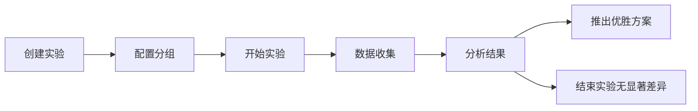

# 报告与测试 — 深化参考文档

> **对应章节**：[PRD-README.md §4.9 报告与测试精化](../PRD-README.md#49-报告与测试精化)
> **状态**：基于现有后端代码（`api/src/routes/admin/custom-reports.ts`、`api/src/routes/admin/finance/export.ts`、`api/src/routes/admin/operation-logs.ts` 的导出能力、`api/src/routes/admin/log-analysis.ts`）生成
> **粒度**：API 接口 → 前端组件 Props → 报表维度定义 → 导出格式规格 → 交叉引用

---

## 目录

1. [财务报表导出](#1-财务报表导出)
2. [自定义报表引擎](#2-自定义报表引擎)
3. [A/B 测试管理](#3-ab-测试管理)
4. [压力测试方案](#4-压力测试方案)
5. [操作日志导出](#5-操作日志导出)
6. [跨模块数据流](#6-跨模块数据流)

---

## 1. 财务报表导出

### 1.1 支持类型

| 导出类型 | 数据源 | 列数 | 支持格式 | 典型使用场景 |
|---------|-------|------|---------|------------|
| **充值记录** | `recharge_orders` | 10+ | CSV / JSON | 财务对账、审计 |
| **提现记录** | `withdraw_orders` | 12+ | CSV / JSON | 佣金结算核对 |
| **佣金记录** | `commission_logs` | 10+ | CSV / JSON | 代理结算 |
| **余额变动** | `balance_logs` | 8+ | CSV / JSON | 用户余额审计 |

### 1.2 API

#### POST `/api/v1/admin/finance/export/:type` — 生成导出文件

**参数**：`type` = `recharge` | `withdraw` | `commission` | `balance`

**请求体**：
```json
{
  "dateRange": { "start": "2026-07-01T00:00:00.000Z", "end": "2026-07-28T23:59:59.000Z" },
  "format": "csv",
  "userId": 10086
}
```

**响应**：
```json
{
  "code": 0,
  "data": { "fileId": "abc123xyz", "expiresAt": "2026-07-28T11:00:00.000Z" }
}
```

#### GET `/api/v1/admin/finance/export/download/:fileId` — 下载文件

**响应**：文件下载（Content-Type 根据格式设置 `text/csv` 或 `application/json`）

### 1.3 导出列定义

#### 充值记录

| 列 | 说明 | 来源 |
|----|------|------|
| id | 订单 ID | recharge_orders.id |
| userId | 用户 ID | recharge_orders.userId |
| userName | 用户名 | users 关联 |
| amount | 充值金额（元）| recharge_orders.amount |
| method | 支付方式 | alipay / wechat / bank_transfer |
| status | 状态 | pending / success / failed / first_confirm / second_confirm |
| createdAt | 创建时间 | recharge_orders.createdAt |
| confirmedAt | 确认时间 | recharge_orders.confirmedAt |
| remark | 备注 | recharge_orders.remark |

#### 提现记录

| 列 | 说明 |
|----|------|
| id / agentId / agentName | 代理信息 |
| amount | 提现金额 |
| fee | 手续费 |
| bankInfo | 银行信息 |
| status | pending / first_approve / second_approve / rejected / paid |
| firstReviewer / secondReviewer | 审单人 |
| createdAt / paidAt | 时间 |

#### 佣金记录

| 列 | 说明 |
|----|------|
| id / agentId / agentName | 代理信息 |
| amount | 佣金金额 |
| ruleType | 规则类型（percentage / fixed / mixed / tiered）|
| status | pending / settled / cancelled |
| periodStart / periodEnd | 结算周期 |
| settledAt | 结算时间 |

#### 余额变动

| 列 | 说明 |
|----|------|
| id / userId / userName | 用户信息 |
| changeAmount | 变动金额（正=增加，负=减少）|
| balanceAfter | 变动后余额 |
| changeType | 变动类型（recharge / consumption / refund / commission / admin_adjust）|
| refType / refId | 关联类型和 ID |
| createdAt | 变动时间 |

### 1.4 CSV 生成逻辑

```typescript
// 典型实现
function makeCsv(rows: Record<string, any>[], columns: string[]): string {
  const header = columns.map(c => JSON.stringify(c)).join(",");
  const data = rows.map(r =>
    columns.map(c => {
      const v = r[c];
      if (v === null || v === undefined) return "";
      const s = String(v);
      return s.includes(",") || s.includes('"') || s.includes("\n")
        ? JSON.stringify(s)
        : s;
    }).join(",")
  );
  return [header, ...data].join("\n");
}
```

### 1.5 前端财务报表导出

```
admin → 财务 → 报表导出
├── 导出类型选择（充值/提现/佣金/余额变动）
├── 时间范围选择器
├── 可选筛选（用户/代理/状态）
├── 导出格式（CSV / JSON）
└── 导出按钮 → 文件下载

=== 导出结果弹窗 ===
└── 导出成功
    ├── 文件名称：3cloud_export_2026-07-28.csv
    ├── 包含 N 条记录
    └── [下载]
```

**FinanceExportProps**：
```typescript
interface FinanceExportProps {
  exportType: 'recharge' | 'withdraw' | 'commission' | 'balance';
  filters?: {
    dateRange: { start: string; end: string };
    userId?: number;
    status?: string;
  };
  onDownload: (fileId: string) => Promise<void>;
}
```

---

## 2. 自定义报表引擎

### 2.1 可用维度

| 维度 | 说明 | 分组依据 | 指标 |
|------|------|---------|------|
| `by_user` | 按用户 | user_id | 总操作数/成功数/失败数 |
| `by_action` | 按操作类型 | action | 总操作数/成功数/失败数/独立用户数 |
| `by_date` | 按日期 | to_char(created_at, 'YYYY-MM-DD') | 总操作数/成功数 |
| `by_hour` | 按小时 | EXTRACT(HOUR FROM created_at) | 总操作数 |
| `by_api_key` | 按 API Key | key_name | 总操作数/独立用户数 |
| `by_ip` | 按 IP | ip | 总操作数/独立用户数 |
| `by_status` | 按状态 | status | 总操作数 |

### 2.2 API

#### GET `/api/v1/admin/custom-reports` — 自定义报表查询

**Query**: `dimension`, `days`（默认 30，最大 365）, `limit`（默认 1000）

**响应**：
```json
{
  "code": 0,
  "data": {
    "dimension": "by_action",
    "days": 30,
    "from": "2026-06-28T10:00:00.000Z",
    "to": "2026-07-28T10:00:00.000Z",
    "total": 150000,
    "rows": [
      { "action": "login", "total": 45000, "success": 44000, "failure": 1000, "unique_users": 5000 },
      { "action": "api_key_create", "total": 12000, "success": 11900, "failure": 100, "unique_users": 3000 }
    ]
  }
}
```

### 2.3 前端自定义报表页面

```
admin → 报告 → 自定义报表
├── 维度选择（用户/操作类型/日期/小时/API Key/IP/状态）
├── 时间范围（预设：近7天/30天/90天/自定义）
├── 结果展示
│   ├── 表格（行 = 分组值，列 = 指标）
│   ├── 柱状图（可选切换）
│   └── 汇总行（总计/平均值）
└── 导出（CSV）
```

**CustomReportProps**：
```typescript
interface CustomReportProps {
  dimension: 'by_user' | 'by_action' | 'by_date' | 'by_hour' | 'by_api_key' | 'by_ip' | 'by_status';
  days?: number;
  limit?: number;
  onExport?: (data: ReportResult) => Promise<void>;
}
```

---

## 3. A/B 测试管理

### 3.1 A/B 测试生命周期



### 3.2 A/B 测试要素

| 要素 | 说明 | 示例 |
|------|------|------|
| **实验名称** | 唯一标识 | "登录页改版测试" |
| **分组配置** | 对照组 vs 实验组 | 50% 用户看到 A 版本，50% 看到 B 版本 |
| **指标** | 衡量标准 | 转化率 / 点击率 / 完成率 |
| **持续时间** | 测试周期 | 7 天 |
| **样本量** | 最低样本要求 | 每组至少 1000 个样本 |
| **显著水平** | 统计显著性 | p < 0.05 |

### 3.3 API

| 方法 | 路径 | 说明 | 权限 |
|------|------|------|------|
| GET | `/api/v1/admin/ab-tests` | 实验列表 | CONFIG_VIEW |
| POST | `/api/v1/admin/ab-tests` | 创建实验 | CONFIG_EDIT |
| PATCH | `/api/v1/admin/ab-tests/:id` | 更新实验 | CONFIG_EDIT |
| PATCH | `/api/v1/admin/ab-tests/:id/status` | 变更状态 | CONFIG_EDIT |
| GET | `/api/v1/admin/ab-tests/:id/results` | 实验结果 | CONFIG_VIEW |

### 3.4 前端 A/B 测试页面

```
admin → 报告 → A/B 测试
├── 实验列表（卡片）
│   ├── 实验名称
│   ├── 状态（草稿/运行中/已结束）
│   ├── 分组比例
│   ├── 当前样本数
│   └── 操作（编辑/开始/结束/查看结果）
│
├── 创建实验弹窗
│   ├── 实验名称
│   ├── 分组配置（对照组比例/实验组比例）
│   ├── 指标选择
│   └── 持续时间
│
└── 实验结果面板
    ├── 组 A vs 组 B 指标对比（柱状图）
    ├── 置信区间
    ├── 显著水平
    └── 结论（推荐方案/无显著差异）
```

---

## 4. 压力测试方案

### 4.1 测试维度

| 维度 | 说明 | 工具/方法 |
|------|------|----------|
| **API 吞吐** | 系统能承受的并发请求数 | k6 / wrk / autocannon |
| **计费性能** | 批量消费计费时的延迟和吞吐 | 模拟 1000 并发调用 |
| **路由延迟** | 智能路由策略的决策时间 | 基准测试 + 各策略对比 |
| **数据库性能** | 查询/写入延迟 | pgbench / 慢查询分析 |
| **缓存命中率** | Redis 缓存效果 | 统计缓存命中/未命中 |

### 4.2 性能基线

| 指标 | 目标值 | 预警值 | 临界值 |
|------|-------|-------|-------|
| API 平均响应时间 | < 1000ms | 2000ms | 5000ms |
| 并发支持 | 500 QPS | 300 QPS | 800 QPS |
| 计费处理延迟 | < 200ms | 500ms | 1000ms |
| 路由决策时间 | < 50ms | 100ms | 200ms |
| 数据库写入延迟 | < 50ms | 100ms | 200ms |
| 缓存命中率 | > 90% | 80% | 70% |

### 4.3 测试场景

**场景 1：正常负载**
- 200 并发用户，每个用户每 3 秒发送 1 次请求
- 持续时间：10 分钟
- 预期：平均响应时间 < 1000ms，无错误

**场景 2：峰值负载**
- 从 100 并发逐步增加到 500 并发
- 持续时间：15 分钟
- 预期：无级联失败，熔断器正常触发

**场景 3：长时间运行**
- 300 并发，持续 1 小时
- 监控内存泄漏和连接池耗尽

**场景 4：计费冲击**
- 1000 个请求同时触发计费结算
- 持续时间：2 分钟
- 预期：计费队列正常消费，无重复计费

---

## 5. 操作日志导出

### 5.1 API

#### GET `/api/v1/admin/operation-logs/export` — 导出操作日志

**权限**：`AUDIT_VIEW`

**Query**: 与日志列表相同的过滤条件（`userId`, `category`, `action`, `startDate`, `endDate`, `keyword`）+ `format=csv|json`

**响应**：文件下载

### 5.2 导出约束

- **单次导出上限**：10000 条
- **超限处理**：提示用户缩小时间范围
- **超大数据方案**：走后台任务生成（基于定时任务），完成后通知下载

---

## 6. 跨模块数据流

### 6.1 数据源依赖

```
财务报表导出
  ├── recharge_orders ← finance schema
  ├── withdraw_orders ← finance schema
  ├── commission_logs ← agents schema
  └── balance_logs    ← billing schema

自定义报表
  └── operation_logs ← system schema（按维度分组聚合）

A/B 测试
  └── 独立表（待实现）

日志导出
  └── operation_logs ← system schema
```

### 6.2 导出存储生命周期

```
请求导出
  → 生成文件到临时目录（os.tmpdir()/3cloud-exports/）
  → 文件有效时间：30 分钟
  → 通过 fileId（SHA256 哈希）访问
  → 过期后自动清理（下次导出时清理所有过期文件）
```

### 6.3 依赖模块

| 模块 | 路径 | 说明 |
|------|------|------|
| `finance/export.ts` | `routes/admin/finance/` | 财务报表导出 |
| `custom-reports.ts` | `routes/admin/custom-reports.ts` | 自定义报表 |
| `operation-logs.ts` | `routes/admin/operation-logs.ts` | 操作日志导出 |
| `ab-testing` | — | A/B 测试（待实现）|

### 6.4 关联文档

| 文档 | 关联内容 |
|------|---------|
| [PRD-README.md §4.9](../PRD-README.md#49-报告与测试精化) | 报告与测试总纲 |
| [ref-4.4-finance.md](ref-4.4-finance.md) | 财务数据源 |
| [ref-4.7-monitor-logs.md](ref-4.7-monitor-logs.md) | 操作日志数据源 |
| [ref-3-agent-system.md](ref-3-agent-system.md) | 佣金数据源 |

### 6.5 关键约束

1. **导出上限 10000 条**：超量需缩小条件或走异步导出
2. **临时文件 30 分钟清理**：导出文件不长期保留
3. **自定义报表缓存 5 分钟**：减轻多次相同查询的数据库压力
4. **财务报表导出不可导出已删除数据**：软删除保护
5. **CSV 列值转义**：含逗号/引号/换行的字段自动 JSON.stringify

---

> **文档版本**：v1.0 — 2026-07-28
> **编写依据**：`api/src/routes/admin/finance/export.ts`、`api/src/routes/admin/custom-reports.ts`、`api/src/routes/admin/operation-logs.ts`
> **下一步建议**：A/B 测试表创建和 API 实现、大文件异步导出方案、压力测试自动化脚本

---

## 边界条件

### 报表导出与测试场景

| # | 场景 | 触发条件 | 预期行为 |
|---|------|---------|---------|
| RPT-001 | 报表导出超大数据量 | 用户选择导出超过 10000 条记录的数据集且未走异步导出 | 接口返回 413 错误，提示「导出条数过多，请缩小时间范围或选择异步导出」|
| RPT-002 | 压力测试并发过高导致服务雪崩 | 压测场景中 500+ 并发请求超出系统熔断阈值 | 熔断器触发，拒绝新请求并返回 503；已有请求继续处理；熔断器半开 60 秒后尝试恢复 |
| RPT-003 | 测试环境与生产环境数据混淆 | 压测脚本误连接生产数据库，或自定义报表查询未指定测试环境过滤条件 | A/B 测试和自定义报表默认绑定当前环境标识；API 层校验 `x-environment` 头，跨环境查询返回 400 并提示「请切换到正确的环境」|
| RPT-004 | 自定义报表维度查询响应过慢 | 按 `by_date` 维度查询 365 天数据，数据量级超过百万条 | 查询超时熔断（超时阈值 10 秒），降级为按天分批聚合 + 缓存结果，前端展示 Loading 进度条 |
| RPT-005 | A/B 测试样本量不足 | 实验运行期限已到但单组样本量低于最低要求（< 1000） | 结果面板展示「样本不足，结论不可靠」（灰色标注），不提供显著水平判断 |

### 异常流程

| 场景 | 恢复策略 |
|------|---------|
| 异步导出任务超时（> 30 分钟） | 标记任务为 failed，清理已生成的临时文件，通知用户重新发起导出 |
| 操作日志导出 CSV 行数据包含特殊字符 | CSV 生成逻辑自动转义（JSON.stringify 包裹含逗号/引号/换行的字段）|
| 压测期间计费缓存穿透导致双倍计费 | 计费模块使用幂等性 token，重复请求仅处理一次 |
