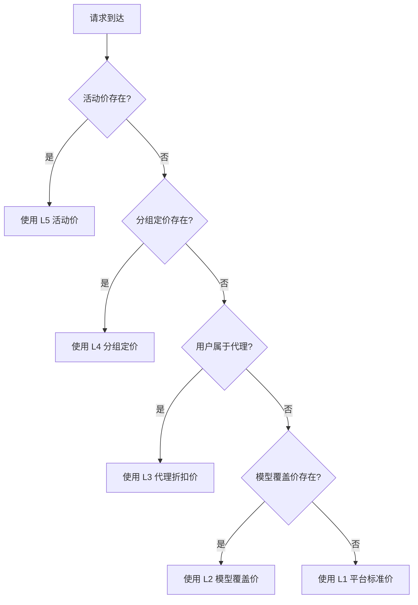
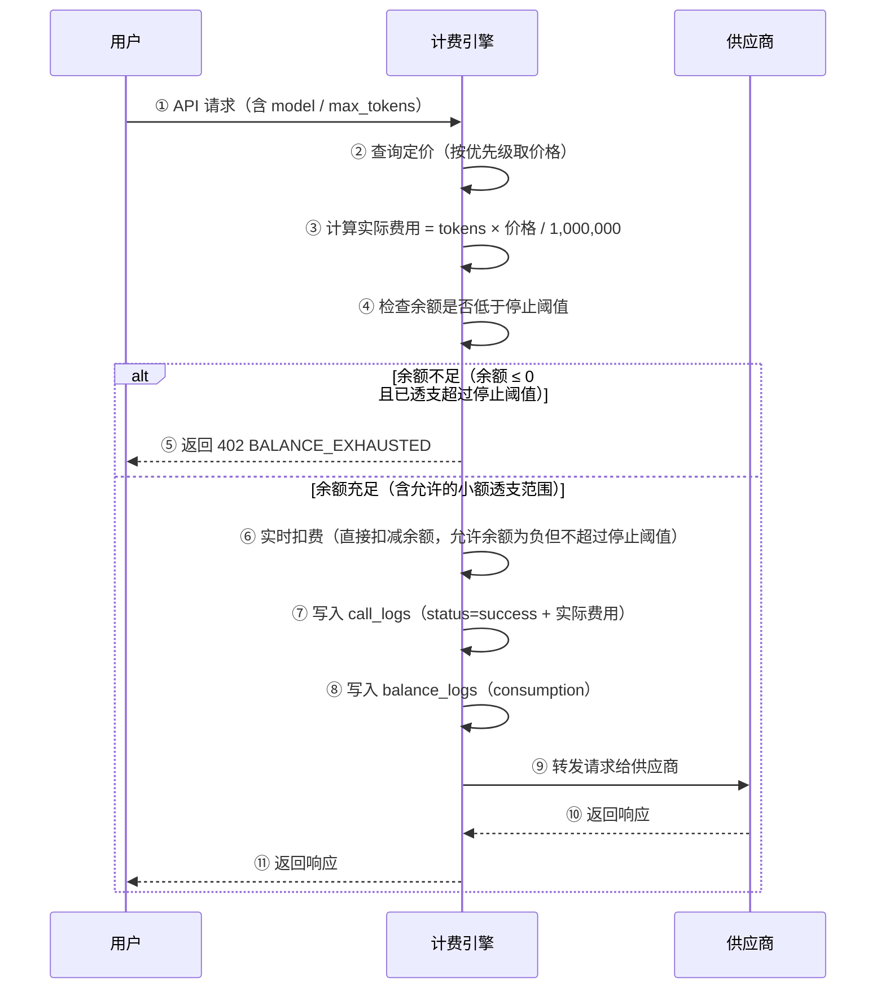

# 3cloud 计费与结算精化（Billing & Settlement）深化文档

> **对应章节**：PRD-README.md §5.2 计费与结算精化
> **最后更新**：2026-07-28
> **定位**：计费引擎的全链路规格，含价格层级、实时计费、预扣退款、账单周期、自动对账、结算结算

---

## 一、架构总览

```
计费引擎
├── 价格引擎（定价查询）
│   ├── L0 供应商成本价
│   ├── L1 平台标准价
│   ├── L2 模型覆盖价
│   ├── L3 代理折扣价
│   ├── L4 分组定价
│   └── L5 活动价
│
├── 实时计费（请求链路）
│   ├── 计算实际费用
│   ├── 实时扣费
│   ├── 写入日志
│   └── 余额检查（允许小额透支）
│
├── 账单周期（月度）
│   ├── 账单生成
│   ├── PDF 生成
│   └── 通知推送
│
├── 自动对账
│   ├── 精确匹配
│   ├── 模糊匹配
│   └── 差异处理
│
└── 供应商结算
    ├── 结算周期
    ├── 佣金计算
    └── 打款流程
```

---

## 二、价格层级

### 2.1 六层定价体系

| 层级 | 名称 | 说明 | 存储位置 | 优先级 |
|------|------|------|---------|-------|
| L0 | 供应商成本价 | 上游原始报价 | `vendor_models.input_price / output_price` | — |
| L1 | 平台标准价 | L0 × (1 + 全局加价率) | 运行时计算 | 最低 |
| L2 | 模型覆盖价 | 特定模型独立售价 | `models.override_input_price / override_output_price` | 中 |
| L3 | 代理折扣价 | 代理名下用户的专属价格 | `agent_commission.discount_rate` | 中高 |
| L4 | 分组定价 | Key 组专属价格 | `key_group_pricing.unit_price` | 高 |
| L5 | 活动价 | 活动期间临时价格 | `campaign_prices.discount_rate` | 最高 |

### 2.2 定价查询流程



### 2.3 加价率配置

```
全局加价率：site_configs 中配置 "billing.default_markup_rate"

计算公式：
  标准输入价 = 供应商成本输入价 × (1 + 全局加价率)
  标准输出价 = 供应商成本输出价 × (1 + 全局加价率)

示例：
  供应商成本价: input=¥0.0100, output=¥0.0300
  全局加价率: 50%
  标准价: input=¥0.0150, output=¥0.0450
  
  用户折扣率: 0.8（八折）
  实际扣费: input=¥0.0120, output=¥0.0360
```

---

## 三、实时计费流程

### 3.1 计费执行流程



### 3.2 计费计算公式

```
Prompt 费用 = prompt_tokens × input_price / 1,000,000
Completion 费用 = completion_tokens × output_price / 1,000,000
总费用 = Prompt 费用 + Completion 费用
实际扣费 = 总费用 × discount_rate（用户折扣率）
```

**精度规则**：
- 费用计算保留 6 位小数
- 最低扣费 ¥0.000001（不足 1 token 的场景）
- 余额以 0 为边界：`Math.max(0, balanceBefore - cost)` 确保余额不会低于 0 写入
- 但请求检查允许小额透支：余额低于 0 但高于 `-alert_stop_balance`（默认 -10 元）时仍可继续消费
- 余额低于 `-alert_stop_balance` 时返回 402 BALANCE_EXHAUSTED

### 3.3 缓存策略

```
价格缓存：LRU 缓存，最多 1000 条
缓存 key：user_id:model_id:key_group_id:campaign_id
TTL：5 分钟（价格变更后最多 5 分钟生效）
```

---

## 四、账单周期

### 4.1 周期定义

| 项目 | 值 |
|------|-----|
| 周期 | 每月 1 日 00:00 ~ 月底 23:59:59 (UTC+8) |
| 生成时间 | 次月 5 日 00:00 |
| 通知方式 | 站内通知 + 邮件（PDF 附件） |
| 下载格式 | PDF（打印版）/ CSV（分析版）|

### 4.2 账单内容结构

```json
{
  "bill": {
    "user_id": 10086,
    "user_name": "张三",
    "period": "2026-07",
    "generated_at": "2026-08-05T00:00:00+08:00",
    "summary": {
      "total_cost": 890.50,
      "total_calls": 123456,
      "total_tokens": 56789012,
      "total_prompt_tokens": 34567890,
      "total_completion_tokens": 22221122
    },
    "by_model": [
      { "model": "deepseek-chat", "cost": 450.20, "percentage": 50.6 },
      { "model": "gpt-4o", "cost": 280.30, "percentage": 31.5 }
    ],
    "by_day": [
      { "date": "2026-07-01", "cost": 12.30, "calls": 1234 },
      { "date": "2026-07-02", "cost": 45.60, "calls": 4567 }
    ],
    "details": [
      { "date": "2026-07-01 10:30", "model": "gpt-4o", "tokens": 1234, "cost": 0.12 }
    ]
  }
}
```

### 4.3 账单 PDF 布局

```
┌────────────────────────────────────────────┐
│  3cloud 账单                                │
│  Bill for July 2026                         │
├────────────────────────────────────────────┤
│  用户: 张三 (user_10086)                     │
│  周期: 2026-07-01 ~ 2026-07-31              │
│  生成时间: 2026-08-05                       │
├────────────────────────────────────────────┤
│  汇总                                       │
│  总消费:  ¥890.50                           │
│  总调用:  123,456 次                        │
│  总 Token: 56,789,012                       │
│  平均单价: ¥0.0000157 / token                │
├────────────────────────────────────────────┤
│  按模型汇总                                  │
│  deepseek-chat (50.6%)  ¥450.20             │
│   调用: 62,345 次    Token: 28,734,567       │
│  gpt-4o (31.5%)       ¥280.30               │
│   调用: 31,234 次    Token: 17,890,123       │
│  deepseek-coder(18.0%) ¥160.00              │
│   调用: 29,877 次    Token: 10,164,322       │
├────────────────────────────────────────────┤
│  按日汇总                                    │
│  07-01  ¥12.30   07-02  ¥45.60  07-03  ¥... │
│  07-04  ...                                 │
├────────────────────────────────────────────┤
│  🔗 下载 CSV 完整明细: [链接]                 │
│  ** 如有疑问请于 2026-08-15 前联系客服 **     │
└────────────────────────────────────────────┘
```

### 4.4 对账差异处理

```
差异类型 → 处理流程：

平台有 - 供应商无（漏报）：
  1. 系统自动标记
  2. 财务逐笔核查 call_logs 原始记录
  3. 确认平台确实有此消费
  4. 联系供应商补录或折扣处理

供应商有 - 平台无（超收）：
  1. 系统自动标记
  2. 检查是否为供应商重复计费
  3. 联系供应商冲正
  4. 记录为供应商待确认

金额不一致：
  1. 检查定价配置是否在周期内变更
  2. 确认用户折扣率是否生效
  3. 按平台记录为准发起争议
```

---

## 五、Drizzle Schema

### 5.1 价格相关字段

```typescript
// vendor_models 表中的价格字段
inputPrice: numeric("input_price", { precision: 18, scale: 6 }).notNull().default("0"),
outputPrice: numeric("output_price", { precision: 18, scale: 6 }).notNull().default("0"),
costInputPrice: numeric("cost_input_price", { precision: 18, scale: 6 }),   // L0 供应商成本
costOutputPrice: numeric("cost_output_price", { precision: 18, scale: 6 }),

// models 表中的覆盖价格
overrideInputPrice: numeric("override_input_price", { precision: 18, scale: 6 }),  // L2 模型覆盖价
overrideOutputPrice: numeric("override_output_price", { precision: 18, scale: 6 }),

// users 表中的折扣率
discountRate: numeric("discount_rate", { precision: 5, scale: 4 }).default("1.0000"),
```

### 5.2 计费日志表

```typescript
export const billingLogs = pgTable("billing_logs", {
  id: serial("id").primaryKey(),
  userId: integer("user_id").notNull().references(() => users.id),
  callLogId: integer("call_log_id").references(() => callLogs.id),

  // 定价信息
  priceSource: varchar("price_source", { length: 20 }),    // model_price / key_price / campaign
  inputPrice: numeric("input_price", { precision: 18, scale: 6 }),
  outputPrice: numeric("output_price", { precision: 18, scale: 6 }),
  discountRate: numeric("discount_rate", { precision: 5, scale: 4 }),

  // 费用
  estimatedCost: numeric("estimated_cost", { precision: 18, scale: 6 }),  // 预扣金额
  actualCost: numeric("actual_cost", { precision: 18, scale: 6 }),        // 实际费用
  refundAmount: numeric("refund_amount", { precision: 18, scale: 6 }),    // 退还金额

  // 余额
  balanceBefore: numeric("balance_before", { precision: 18, scale: 6 }),
  balanceAfter: numeric("balance_after", { precision: 18, scale: 6 }),

  // 元数据
  status: varchar("status", { length: 20 }).notNull().default("pending"),  // pending / settled / refunded
  createdAt: timestamp("created_at", { withTimezone: true }).notNull().defaultNow(),
});
```

### 5.3 账单表

```typescript
export const invoices = pgTable("invoices", {
  id: serial("id").primaryKey(),
  userId: integer("user_id").notNull().references(() => users.id),
  period: varchar("period", { length: 7 }).notNull(),  // YYYY-MM

  // 汇总
  totalCost: numeric("total_cost", { precision: 18, scale: 6 }).notNull(),
  totalCalls: bigint("total_calls", { mode: "number" }).notNull().default(0),
  totalTokens: bigint("total_tokens", { mode: "number" }).notNull().default(0),

  // PDF
  pdfUrl: varchar("pdf_url", { length: 500 }),
  csvUrl: varchar("csv_url", { length: 500 }),

  // 状态
  status: varchar("invoice_status", { length: 20 }).notNull().default("pending"), // pending / generated / sent
  sentAt: timestamp("sent_at", { withTimezone: true }),
  
  createdAt: timestamp("created_at", { withTimezone: true }).notNull().defaultNow(),
  updatedAt: timestamp("updated_at", { withTimezone: true }).notNull().defaultNow(),
});
```

---

## 六、API 接口

### 6.1 用户端

| 方法 | 路径 | 说明 |
|------|------|------|
| `GET` | `/api/v1/me/balance` | 查询余额 |
| `GET` | `/api/v1/me/balance-logs` | 余额变动流水 |
| `GET` | `/api/v1/me/invoices` | 账单列表 |
| `GET` | `/api/v1/me/invoices/:id/pdf` | 下载账单 PDF |
| `GET` | `/api/v1/me/invoices/:id/csv` | 下载账单 CSV |

### 6.2 管理端

| 方法 | 路径 | 说明 | 权限 |
|------|------|------|------|
| `GET` | `/api/v1/admin/billing/prices` | 价格配置列表 | finance_ops 以上 |
| `PUT` | `/api/v1/admin/billing/markup-rate` | 修改全局加价率 | admin 以上 |
| `PUT` | `/api/v1/admin/billing/model-price` | 修改模型价格 | finance_ops 以上 |
| `GET` | `/api/v1/admin/billing/invoices` | 全部账单列表 | finance_ops 以上 |
| `POST` | `/api/v1/admin/billing/invoices/generate` | 手动生成账单 | finance_ops 以上 |
| `GET` | `/api/v1/admin/billing/reconciliation` | 对账结果 | finance_ops 以上 |
| `GET` | `/api/v1/admin/billing/reconciliation/detail` | 对账差异详情 | finance_ops 以上 |
| `POST` | `/api/v1/admin/billing/reconciliation/resolve` | 处理对账差异 | finance_ops 以上 |

---

## 七、前端组件

### 7.1 价格配置页

```
┌─ 价格管理 ──────────────────────────────────────────┐
│                                                       │
│ 全局加价率: [50%] (L0 → L1 的计算系数)                │
│ 修改后影响全部模型的标准售价                            │
│                                                       │
│ ┌─ 供应商价格 ─────────────────────────────────────┐ │
│ │ 模型名称   | 成本价(in/out) | 标准价(in/out) | 覆盖价 | │
│ │ gpt-4o     | 0.01/0.03     | 0.015/0.045   | —    │ │
│ │ deepseek   | 0.001/0.002   | 0.0015/0.003  | —    │ │
│ │ claude-3   | 0.015/0.045   | 0.0225/0.0675 | —    │ │
│ └──────────────────────────────────────────────────┘ │
│                                                       │
│ 编辑模型覆盖价:                                       │
│ 模型: [gpt-4o                     ▼]                 │
│ 覆盖输入价: [0.0200] ¥/1K tokens（空=使用标准价）     │
│ 覆盖输出价: [0.0500] ¥/1K tokens                     │
│ [保存]                                                │
└──────────────────────────────────────────────────────┘
```

### 7.2 对账结果展示

```
┌─ 对账结果 (2026-07-27) ─────────────────────────────┐
│                                                       │
│ 对账状态: ✅ 已完成  |  运行时间: 2026-07-28 02:00:03 │
│                                                       │
│ ┌─ 汇总 ──────────────────────────────────────────┐  │
│ │ 总匹配: 12,345 笔                               │  │
│ │ ✅ 精确匹配: 12,200 笔 (98.8%)                   │  │
│ │ ✅ 模糊匹配: 100 笔 (0.8%)                       │  │
│ │ ❌ 存在差异: 45 笔 (0.4%)                        │  │
│ └────────────────────────────────────────────────┘  │
│                                                       │
│ ┌─ 差异明细 ─────────────────────────────────────┐   │
│ │ 类型         | 笔数 | 金额      | 操作            │  │
│ │ 平台有-供应商无 | 23   | ¥123.45  | [核查]  [确认]  │  │
│ │ 供应商有-平台无 | 15   | ¥89.00   | [核查]  [忽略]  │  │
│ │ 金额不一致   | 7     | ¥12.30   | [查看]  [修正]  │  │
│ └────────────────────────────────────────────────┘  │
│                                                       │
│ [导出对账报告]                                         │
└──────────────────────────────────────────────────────┘
```

---

## 八、计费偏差与异常处理

| 场景 | 检测方式 | 处理流程 |
|------|---------|---------|
| 计费金额异常（> 预估 2 倍） | 实时检查 | 记录告警，冻结该比交易，人工核查 |
| 计费引擎异常 | 事务回滚 | 自动回滚，不扣费 |
| 价格为负数 | 更新时校验 | 拒绝更新，触发告警 |
| 用户折扣率变动影响历史计费 | 版本控制 | 折扣率仅在变动后生效（timestamp） |
| 供应商价格变动同步延迟 | 版本控制 | 价格在配置时生效，不追溯历史 |

### 8.1 计费引擎 SLA（P1 补充）

| 指标 | 目标 | 说明 |
|------|------|------|
| 计费计算延迟（P50） | ≤ 10ms | 请求完成到计费记录写入 |
| 计费计算延迟（P99） | ≤ 50ms | 最慢 1% 的计费完成时间 |
| 计费引擎可用性 | ≥ 99.99% | 不阻塞 API 请求 |
| 数据一致性 | 0 偏差 | 余额变动 = 计费金额 |
| 计费失败率 | ≤ 0.01% | 计费写入失败比率 |

**降级策略：**
1. 计费引擎不可用 → 放行但不计费，事后 cron 补计费
2. Redis 不可用 → 切换到内存缓存
3. 数据库写入超时 → 异步写入队列

### 8.2 精度与舍入处理（P1 补充）

| 场景 | 处理规则 |
|------|---------|
| Token 级别精度 | 精确计算，金额保留 4 位小数 |
| 余额精度 | 保留 2 位小数，四舍五入 |
| 批量消费精度 | 按每笔分别计算后汇总 |
| 佣金精度 | 保留 4 位小数 |

**精度溢出保护：**
1. 金额字段使用 numeric(18,4)，不用 float
2. 舍入误差累计超过 ¥0.01 时在最后一笔调整
3. 前端展示 toFixed(2)，不丢失原始精度

### 8.3 T+1 结算边界场景（P1 补充）

| 场景 | 处理规则 |
|------|---------|
| 跨日消费（23:59:59 ~ 00:00:01） | 按请求发起时间（created_at）归属 |
| 结算切换中的消费 | 归属原周期 |
| 补计费记录 | 归属原始请求时间 |
| 退款跨周期 | 从当前周期扣除，不影响已锁账周期 |

---

## 九、交叉引用

| 其他文档 | 关联内容 |
|---------|---------|
| PRD-README.md §5.2 | 计费结算精化总纲 |
| ref-4.4-finance.md | 财务管理深化（充值/发票/退款） |
| ref-4.4.5-reconciliation-prd.md | 对账引擎深化 |
| ref-5.3-rate-limiter.md | 限流引擎（影响计费的限流判定） |
| ref-4.5-marketing.md | 活动价（L5） |
| data-dictionary.md §2.2 | call_logs 字段定义 |
| data-dictionary.md §3.1 | 余额计算规则 |
| flowcharts/05-auto-reconciliation.md | 自动对账泳道图 |
| SPEC-§29-资金与对账管理.md | 财务锁账SOP（§29.4） |
| ref-3-agent-system.md §8.2 | 佣金与总账对账链路 |
| ops-manual.md §十 | 跨模块数据一致性检查 |
| ref-5.4-alert-rules.md §6.1 | 计费模块API告警 |

---

## 十、计费预扣与回滚机制（运营视角）

> **P0 补充**：2026-07-30 — 运营视角的计费预扣失败回滚、并发扣款防护、异常干预流程

### 10.1 预扣时序定义

当前计费1 预扣时序定义\n\n当前计费流程为"预扣后转发"模式。以下定义完整的预扣→确认→回滚时序：\n\n```mermaid\nsequenceDiagram\n    participant U as 用户请求\n    participant BE as 计费引擎\n    participant DB as 数据库\n    participant V as 供应商\n\n    U->>BE: ① API 请求\n    BE->>BE: ② 查询定价、计算预估费用\n    BE->>DB: ③ 预扣余额（行锁 UPDATE users SET balance = balance - estimated_cost WHERE user_id = ? AND balance >= estimated_cost - overdraft_limit）\n    DB-->>BE: ④ 返回预扣结果（成功/失败）\n    \n    alt 预扣失败（余额不足）\n        BE-->>U: 返回 402 BALANCE_EXHAUSTED\n    else 预扣成功\n        BE->>DB: ⑤ 写入 billing_logs（status=pending, estimated_cost, balance_before, balance_after）\n        BE->>V: ⑥ 转发请求到供应商\n        \n        alt 供应商响应成功（正常返回 tokens）\n            V-->>BE: ⑦ 返回响应\n            BE->>BE: ⑧ 计算实际费用 = actual_tokens × price / 1,000,000\n            \n            alt 实际费用 ≤ 预扣金额\n                BE->>DB: ⑨a 回滚差额：余额 = 余额 + (estimated_cost - actual_cost)\n                BE->>DB: ⑨b 更新 billing_logs：status=settled, actual_cost, refund_amount\n            else 实际费用 > 预扣金额（需追扣）\n                BE->>DB: ⑨a 追扣差额：余额 = 余额 - (actual_cost - estimated_cost)\n                BE->>DB: ⑨b 更新 billing_logs：status=settled, actual_cost, extra_charge\n            end\n            \n            BE-->>U: ⑩ 返回响应\n            \n        else 供应商超时/异常（无有效 tokens 返回）\n            V--xBE: ⑦ 超时或错误\n            BE->>DB: ⑧ 回滚预扣金额：余额 = 余额 + estimated_cost\n            BE->>DB: ⑨ 更新 billing_logs：status=refunded, refund_amount=estimated_cost, error_reason\n            BE->>DB: ⑩ 写入 operation_logs（计费回滚事件）\n            BE-->>U: ⑪ 返回 502/504 错误\n        end\n    end\n```\n\n### 10.2 预扣回滚关键参数\n\n| 参数 | 默认值 | 说明 |\n|------|--------|------|\n| 预扣超时等待 | 30 秒 | 供应商响应超时后自动回滚预扣 |\n| 预扣释放定时器 | 60 秒 | 兜底定时器，确保超时后预扣自动释放（防止死锁） |\n| 透支上限 | -10 元 | 余额为负时的透支上限，超过后返回 402 |\n| 最大追扣倍数 | 2x | 实际费用超过预扣金额 2 倍时触发异常告警，冻结该笔交易 |\n\n### 10.3 预扣金额计算规则\n\n```\n预估费用 = 预估 max_tokens × 输入价格 / 1,000,000\n\n注意：\n- 若请求未指定 max_tokens，按模型默认值（如 4096）计算预估费用\n- 流式请求（stream=true）：按 max_tokens × 输入价格 预扣，最终按实际返回 tokens 结算\n- 非流式请求：按 max_tokens 预扣，最终按返回 tokens 结算\n\n例外情况：\n- 图片输入（vision 模型）：提前估算图片 token 数（按 768×768 ≈ 2000 tokens/图）\n- 工具调用（function calling）：额外预扣 1000 tokens 的 tool_call 开销\n- embedding 请求：按 input 字符数 × 模型系数 预扣\n```\n\n### 10.4 并发扣款保护机制\n\n| 保护层 | 实现方式 | 说明 |\n|--------|---------|------|\n| 行级锁 | `UPDATE ... WHERE balance >= amount` | 数据库层面的乐观锁，确保扣款不超卖 |\n| 重试机制 | 预扣冲突时最多重试 3 次（间隔 10ms） | 高并发下少量冲突自动重试 |\n| 死锁检测 | 数据库自动死锁检测，回滚后重试 | 跨表更新时的死锁防护 |\n| 监控告警 | 预扣冲突率 > 1% 触发告警 | 运营介入判断是否需要扩容 |\n\n**并发场景举例：**\n\n```\n用户 A 余额：¥100.00\n\n请求 1：预扣 ¥50.00 → UPDATE users SET balance = 50.00 WHERE id = A AND balance >= 50.00 → 成功\n请求 2：预扣 ¥60.00 → UPDATE users SET balance = 40.00 WHERE id = A AND balance >= 60.00 → 失败（余额不足）\n\n保护效果：请求 2 返回 402，不会出现余额为负的异常状态\n```\n\n### 10.5 计费异常运营干预流程\n\n当计费异常（计费日志缺失、定价缓存未刷新、对账差异）发生时，运营按以下流程处理：\n\n```mermaid\nflowchart TD\n    A[发现计费异常] --> B{异常类型?}\n    \n    B -->|计费日志缺失| C[核查 call_logs 原始记录]\n    C --> D{缺失原因?}\n    D -->|计费引擎未写入| E[补录 billing_logs]\n    D -->|定价查询失败| F[人工计算费用并补录]\n    D -->|系统 Bug| G[记录 Bug 并修复 + 批量补录]\n    \n    B -->|定价缓存未刷新| H[检查缓存 TTL 和刷新策略]\n    H --> I[手动刷新缓存（Redis DEL）]\n    I --> J[验证刷新后定价是否正确]\n    J --> K[对受影响用户进行补偿计算]\n    \n    B -->|对账差异| L[参见 §4.4 对账差异处理]\n    \n    E --> M[补录后执行余额校准]\n    F --> M\n    G --> M\n    M --> N[通知受影响用户]\n    N --> O[写入 operation_logs 审计]\n```\n\n**运营操作面板：**\n\n管理后台 → 财务 → 计费异常处理\n\n```\n┌─ 计费异常处理工作台 ──────────────────────────────┐\n│                                                     │\n│ 筛选: [全部类型 ▼] [最近 24 小时 ▼] [搜索用户]       │\n│                                                     │\n│ ┌─ 待处理异常列表 ───────────────────────────────┐ │\n│ │ 时间       | 用户 | 异常类型       | 金额  | 操作 │ │\n│ │ 14:23:45  | 张三 | 计费日志缺失   | ¥0.50 | [补录]│ │\n│ │ 14:20:12  | 李四 | 定价缓存偏差   | ¥1.20 | [校准]│ │\n│ │ 12:00:00  | 王五 | 预扣未回滚     | ¥3.00 | [回滚]│ │\n│ └────────────────────────────────────────────────┘ │\n│                                                     │\n│ 批量操作: [选中全部] [补录选中] [校准选中] [导出]    │\n│                                                     │\n│ 操作日志:                                           │\n│ 2026-07-30 14:25  admin_张三  补录了 3 笔计费日志    │\n│ 2026-07-30 14:24  admin_李四  校准了用户 42 的余额    │\n└─────────────────────────────────────────────────────┘\n```\n\n### 10.6 精度与舍入规则\n\n| 规则 | 说明 |\n|------|------|\n| 存款精度 | 18,6（数据库存储） |\n| 中间计算 | 使用 JavaScript Number（IEEE 754 双精度），最后一步四舍五入到 6 位 |\n| 舍入方式 | 四舍五入（Math.round），非银行家舍入 |\n| 最低扣费 | ¥0.000001（不足 1 token 的场景按 0 计费） |\n| 偏差累积检查 | 每月对账时检查计费总和与余额变动总和之差 ≤ ¥0.01 才通过 |\n\n### 10.7 计费引擎可用性 SLA\n\n| 指标 | 目标 | 测量方式 |\n|------|------|---------|\n| 计费引擎可用性 | 99.99% | （总请求 - 计费失败请求）/ 总请求 |\n| 计费延迟 P95 | ≤ 50ms | 从请求到达计费引擎到扣款完成 |\n| 计费延迟 P99 | ≤ 200ms | 含定价查询 + 余额扣减 + 日志写入 |\n| 预扣回滚延迟 | ≤ 60s | 供应商超时后自动回滚的最长时间 |\n\n**降级策略：**\n\n| 组件故障 | 降级策略 |\n|---------|---------|\n| Redis 不可用 | 定价查询降级到 DB（查询延迟增加，但可用） |\n| 计费引擎死锁 | 自动检测后重启，重启期间请求排队（最多 30s） |\n| 数据库主库故障 | 计费暂停（不扣费但返回错误），避免数据不一致 |\n\n### 10.8 T+1 结算周期边界规则\n\n| 场景 | 归属规则 |\n|------|---------|\n| 请求 23:59:59 发起，供应商 00:00:01 返回 | 按请求发起时间归属到前一日 |\n| 流式请求跨日（streaming） | 按首个 chunk 返回时间归属 |\n| 手动补录计费日志 | 按补录时间归属，但关联原始请求时间 |\n\n### 10.9 计费与财务总账同步\n\n```\n同步方式：T+1 批量归集\n\n每日 00:30 执行：\n  1. 统计前一日所有 billing_logs（status=settled）\n  2. 按用户汇总：total_consumption = SUM(actual_cost)\n  3. 汇总写入 platform_ledger（type=user_consumption）\n  4. 核对：SUM(billing_logs.actual_cost) == SUM(ledger.amount)（笔数 + 金额双重校验）\n  5. 校验失败触发告警：运营介入核查\n\n同步验证：\n  - 笔数校验：SUM(billing_logs.id count) == SUM(ledger entries count)\n  - 金额校验：SUM(billing_logs.actual_cost) == SUM(ledger.amount)\n  - 余额校验：系统总余额 + 总消费 + 总提现 - 总充值 = 0（会计恒等式）\n```"}]