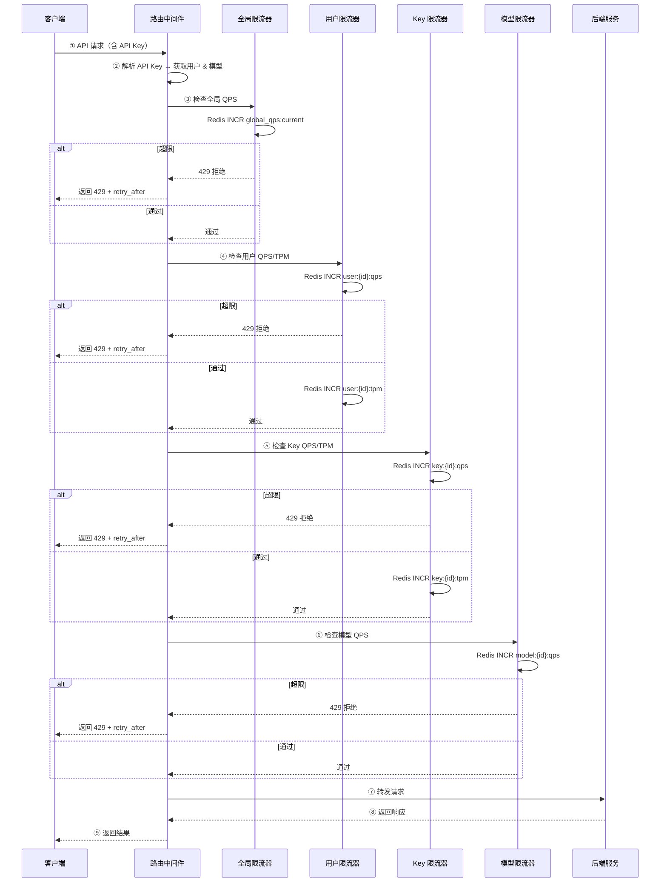

# 3cloud 限流引擎（Rate Limiter）深化文档

> **对应章节**：PRD-README.md §5.3 限流引擎精化
> **最后更新**：2026-07-28
> **定位**：四级限流架构、算法实现、隔离策略、降级策略、配额管理、可视化

---

## 一、架构总览

```
请求入口
  │
  ├─ L1 全局限流 ──┐
  │  site_configs   │  Redis 计数器 (全局 key)
  │                 │
  ├─ L2 用户限流 ──┤
  │  user_quotas   │  Redis 计数器 (user_id)
  │                 │
  ├─ L3 Key 限流 ───┤
  │  api_keys       │  Redis 计数器 (api_key_id)
  │                 │
  ├─ L4 模型限流 ───┤
  │  rate_limits    │  Redis 计数器 (model_id)
  │                 │
  └→ 通过 → 转发请求
```

**规则**：前三级串联，取最小值。L1 不可超越，L2-L4 按配置生效。

### 1.1 限流生效公式

```
有效 QPS = min(L1.global_qps, L2.user_qps, L3.key_qps, L4.model_qps)
有效 TPM = min(L1.global_tpm, L2.user_tpm, L3.key_tpm, L4.model_tpm)
```

- L1 全局限制是硬上限，任何请求不可超越
- L2/L3/L4 若有 NULL 值表示不限制该级别，跳过取最小
- 日调用限制单独判断，不参与 min 取小

### 1.2 限流命中响应

```json
{
  "error": {
    "code": "rate_limit_exceeded",
    "message": "请求频率超限，请稍后重试",
    "limit_type": "user_qps",
    "limit_value": 100,
    "current_value": 156,
    "retry_after": 30
  }
}
```

- `limit_type`：被命中级别的名称（`global_qps` / `user_qps` / `key_qps` / `model_qps` 等）
- `retry_after`：建议等待秒数，客户端可据此实现退避

---

## 二、限流算法

### 2.1 滑动窗口计数器（默认）

```
窗口大小：1 秒（QPS）/ 1 分钟（TPM）
粒度：100ms 子槽

判断逻辑：
  当前窗口计数 = 当前子槽 + 前 1 秒内所有子槽计数
  如果当前窗口计数 ≥ 阈值 → 拒绝
  否则 → 计数 +1，允许
```

**优势**：避免固定窗口的"突刺"问题，精度高
**存储**：Redis Sorted Set (ZADD + ZREMRANGEBYSCORE)，TTL 自动过期

### 2.2 Token Bucket（备用，适用于突发流量场景）

```
桶容量 = 阈值 × 2（允许短时突发到 2 倍阈值）
补充速率 = 阈值 / 60（每秒补充）

判断逻辑：
  如果桶中 Token 数 ≥ 需要消耗的 Token → 消耗，允许
  否则 → 拒绝
```

**使用场景**：模型级限流（L4），允许模型突发调用
**切换方式**：`site_configs` 中配置 `rate_limit_algorithm = "token_bucket"`

### 2.3 并发请求限制（额外）

```
限制维度：同一用户最大并发请求数
默认值：20（用户级）/ 10（Key 级）
计数器：Redis INCR/DECR（请求开始 +1，结束 -1）
```

**作用**：防止单个用户用慢查询耗尽连接池

---

## 三、Drizzle Schema

### 3.1 user_quotas（用户配额表）

```typescript
export const userQuotas = pgTable(
  "user_quotas",
  {
    id: serial("id").primaryKey(),
    userId: integer("user_id")
      .notNull()
      .references(() => users.id)
      .unique(),
    // QPS 限制
    qpsLimit: integer("qps_limit").default(100),           // 默认 100 QPS
    tpmLimit: integer("tpm_limit").default(600000),         // 默认 600K TPM
    dailyCallLimit: integer("daily_call_limit"),             // NULL = 不限
    // 并发限制
    concurrentLimit: integer("concurrent_limit").default(20),
    // 配额类型
    quotaType: quotaTypeEnum("quota_type").default("monthly"), // monthly / total / per_key
    // 月度剩余配额（quotaType=monthly 时有效）
    monthlyQuotaRemaining: bigint("monthly_quota_remaining", { mode: "number" }),
    monthlyQuotaTotal: bigint("monthly_quota_total", { mode: "number" }),
    // 元数据
    setBy: setByRoleEnum("set_by").default("admin"),        // agent / admin
    note: text("note"),
    createdAt: timestamp("created_at", { withTimezone: true }).notNull().defaultNow(),
    updatedAt: timestamp("updated_at", { withTimezone: true }).notNull().defaultNow(),
  },
  (table) => ({
    userIdIdx: uniqueIndex("user_quotas_user_id_idx").on(table.userId),
  })
);
```

### 3.2 rate_limits（模型限流规则表）

```typescript
export const rateLimits = pgTable(
  "rate_limits",
  {
    id: serial("id").primaryKey(),
    modelId: integer("model_id")
      .notNull()
      .references(() => models.id)
      .unique(),
    // 模型全局 QPS
    modelQps: integer("model_qps").default(2000),
    // 模型用户级 QPS（每用户对该模型）
    modelUserQps: integer("model_user_qps").default(50),
    // 并发请求数
    modelConcurrency: integer("model_concurrency").default(10),
    // 最大 Prompt Token 数
    maxPromptTokens: integer("max_prompt_tokens"),
    // 最大 Completion Token 数
    maxCompletionTokens: integer("max_completion_tokens"),
    // 启用/禁用
    enabled: boolean("enabled").notNull().default(true),
    createdAt: timestamp("created_at", { withTimezone: true }).notNull().defaultNow(),
    updatedAt: timestamp("updated_at", { withTimezone: true }).notNull().defaultNow(),
  },
  (table) => ({
    modelIdIdx: uniqueIndex("rate_limits_model_id_idx").on(table.modelId),
  })
);
```

### 3.3 site_configs（全局限流配置，部分）

```typescript
// 全局限流相关配置项（site_configs 表的一部分）
key: "rate_limit.global_qps"        // 值：10000
key: "rate_limit.global_tpm"        // 值：60000000
key: "rate_limit.algorithm"         // 值："sliding_window" | "token_bucket"
key: "rate_limit.default_user_qps"  // 值：100
key: "rate_limit.default_user_tpm"  // 值：600000
key: "rate_limit.default_key_qps"   // 值：50
key: "rate_limit.default_key_tpm"   // 值：300000
```

---

## 四、限流执行流程



---

## 五、API 接口

### 5.1 用户配额管理

| 方法 | 路径 | 说明 | 权限 |
|------|------|------|------|
| `GET` | `/api/v1/admin/user-quotas` | 用户配额列表 | admin 以上 |
| `GET` | `/api/v1/admin/user-quotas/:userId` | 指定用户配额详情 | admin 以上 |
| `PUT` | `/api/v1/admin/user-quotas/:userId` | 更新用户配额 | admin 以上 |
| `DELETE` | `/api/v1/admin/user-quotas/:userId` | 重置为系统默认 | admin 以上 |

**PUT 请求体**

```json
{
  "qps_limit": 200,
  "tpm_limit": 1200000,
  "daily_call_limit": 50000,
  "concurrent_limit": 50,
  "note": "VIP 用户，提升配额"
}
```

### 5.2 模型限流规则

| 方法 | 路径 | 说明 | 权限 |
|------|------|------|------|
| `GET` | `/api/v1/admin/rate-limits` | 模型限流规则列表 | admin 以上 |
| `GET` | `/api/v1/admin/rate-limits/:modelId` | 指定模型限流规则 | admin 以上 |
| `PUT` | `/api/v1/admin/rate-limits/:modelId` | 更新模型限流规则 | admin 以上 |

**PUT 请求体**

```json
{
  "model_qps": 5000,
  "model_user_qps": 100,
  "model_concurrency": 20,
  "max_prompt_tokens": 128000,
  "max_completion_tokens": 4096
}
```

### 5.3 系统限流配置

| 方法 | 路径 | 说明 | 权限 |
|------|------|------|------|
| `GET` | `/api/v1/admin/site-configs/rate-limit` | 获取全局限流配置 | admin 以上 |
| `PUT` | `/api/v1/admin/site-configs/rate-limit` | 更新全局限流配置 | super_admin |

---

## 六、前端组件

### 6.1 用户配额编辑弹窗

```
┌──────────────────────────────┐
│ 编辑用户配额 — 张三 (u_10086) │
├──────────────────────────────┤
│ QPS 限制:    [100   ] 次/秒  │
│ TPM 限制:    [600000] 次/分  │
│ 日调用限制:  [      ] (空=不限)│
│ 并发限制:    [20    ] 个     │
│ 配额类型:    [Monthly ▼]     │
│ 备注:        [VIP 用户      ]│
│                              │
│  [取消]  [重置为默认]  [保存] │
└──────────────────────────────┘
```

**Props**

```typescript
interface UserQuotaEditDialogProps {
  userId: number;
  userName: string;
  currentQuota: UserQuota | null;
  defaultQuota: DefaultQuotaConfig;
  onSave: (quota: UpdateUserQuotaRequest) => Promise<void>;
  onReset: () => Promise<void>;
  onClose: () => void;
}
```

### 6.2 模型限流配置页

```
┌─ 模型限流规则 ─────────────────────────────┐
│                                             │
│ 模型: [gpt-4o           ▼] [搜索]           │
│                                             │
│ 全局 QPS:     [2000] 次/秒                   │
│ 用户级 QPS:   [50  ] 次/秒                   │
│ 并发限制:     [10  ] 个                      │
│ 最大 Prompt:  [128000] Tokens                │
│ 最大 Completion: [4096] Tokens               │
│                                             │
│ 状态: [✅ 已启用]                             │
│                                             │
│  [重置]  [保存]                              │
└─────────────────────────────────────────────┘
```

### 6.3 限流状态监控面板

```
┌─ 限流命中统计 (最近 24h) ───────────────────┐
│                                              │
│ 总请求: 1,234,567  命中: 12,345 (1.0%)       │
│                                              │
│ 按级别分布:                                    │
│ 全局: ████████░░░░░░░░ 232 次 (1.9%)         │
│ 用户: ████████████████ 4,202 次 (34.0%)      │
│ Key:  ██████████████░░ 3,912 次 (31.7%)      │
│ 模型: ████████████░░░░ 3,999 次 (32.4%)      │
│                                              │
│ 按模型分布:                                    │
│ gpt-4o:   ████████████░░ 4,001 次            │
│ claude-3: ██████████░░░░ 3,234 次            │
│ deepseek: ██████░░░░░░░░ 2,100 次            │
│ ...                                         │
└──────────────────────────────────────────────┘
```

---

## 七、隔离策略与降级

### 7.1 限流隔离

| 隔离维度 | 措施 | 目的 |
|---------|------|------|
| 用户隔离 | 每个用户独立计数器 | 防止大用户影响小用户 |
| Key 隔离 | 每个 Key 独立计数器 | 防止 Key 共享导致互相影响 |
| 模型隔离 | 每个模型独立计数器 | 防止热门模型拖垮冷门模型 |
| 资源隔离 | 模型级并发限制 | 防止慢查询耗尽 Worker |

### 7.2 限流降级策略

| 命中级别 | 降级行为 | 响应码 |
|---------|---------|-------|
| L1 全局 | 直接拒绝，返回 429 | 429 |
| L2 用户 | 降级到该用户其他活跃 Key 或等待 | 429 |
| L3 Key | 返回 429，提示切换到其他 Key | 429 |
| L4 模型 | 提示切换到同类型其他模型 | 429 |

### 7.3 配额超限处理

```
配额类型: monthly / total / per_key

monthly（月度配额）：
  - 每月 1 日重置
  - 超过配额后，按量计费（超出部分按标准价）
  - 超出部分可设置上限：max_overage = 配额 × 50%

total（总量配额）：
  - 一次性配额，用完即停
  - 可补充（管理员调整 recharge）

per_key（Key 独立配额）：
  - 每个 Key 独立计算
  - 与用户余额分开计费
```

---

## 八、配置项汇总

| 配置项 | 类型 | 默认值 | 说明 |
|-------|------|-------|------|
| `rate_limit.global_qps` | number | 10000 | 全局 QPS 上限 |
| `rate_limit.global_tpm` | number | 60000000 | 全局 TPM 上限 |
| `rate_limit.algorithm` | string | `sliding_window` | 限流算法 |
| `rate_limit.default_user_qps` | number | 100 | 新用户默认 QPS |
| `rate_limit.default_user_tpm` | number | 600000 | 新用户默认 TPM |
| `rate_limit.default_key_qps` | number | 50 | 新 Key 默认 QPS |
| `rate_limit.default_key_tpm` | number | 300000 | 新 Key 默认 TPM |
| `rate_limit.default_model_qps` | number | 2000 | 新模型默认 QPS |
| `rate_limit.default_model_concurrency` | number | 10 | 默认并发数 |

---

## 九、交叉引用

| 其他文档 | 关联内容 |
|---------|---------|
| PRD-README.md §5.3 | 限流引擎精化（总纲） |
| ref-4.6-security.md | 安全限流联动（IP 封禁、暴力破解检测） |
| ref-4.8-system-config.md | 全局配置管理（site_configs） |
| ref-5.1-routing.md | 路由引擎与限流联动（熔断+限流组合） |
| data-dictionary.md §3.4 | 四级限流规则定义 |
| ref-7-nfr.md §3.3 | 限流防护安全要求 |