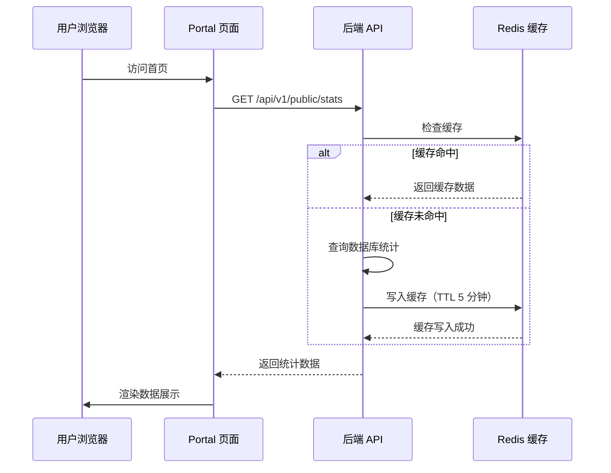

# 3cloud Portal 门户官网深化文档

> **对应章节**：PRD-README.md §6 Portal 门户官网精化
> **最后更新**：2026-07-28
> **定位**：Portal 首页、定价页、模型目录、开发者文档、系统状态页面的组件规格、数据流、前端 Props

---

## 一、页面总览

```
Portal 公开页面（无需登录）
├── /              → 首页（Hero + 特性 + 数据展示 + 快速接入）
├── /models        → 模型目录（全部模型列表 + 筛选）
├── /pricing       → 定价方案（定价表 + FAQ）
├── /docs          → 开发者文档（快速开始 + API 参考 + 代码示例）
└── /status        → 系统状态（服务健康状态 + 历史记录）
```

---

## 二、首页 `/`

### 2.1 页面组件树

```
Home
├── PortalHeader（导航栏）
│   ├── Logo
│   ├── 导航链接（首页/模型/定价/文档/状态）
│   └── CTA 按钮（登录/注册）
│
├── HeroSection（主视觉区）
│   ├── 标语文字
│   ├── 副标题
│   ├── CTA 按钮组
│   └── 背景动画/装饰
│
├── StatsBanner（实时数据展示）
│   ├── 已接入模型数（130+）
│   ├── 服务用户数（813+）
│   ├── 累计处理 Token（5.96 亿+）
│   └── 供应商数（40+）
│
├── FeatureGrid（功能特性）
│   ├── FeatureCard 1: 统一接入
│   ├── FeatureCard 2: 智能路由
│   ├── FeatureCard 3: 精细运营
│   └── FeatureCard 4: 安全可靠
│
├── ModelCatalog（精选模型展示）
│   ├── 分类标签（对话/嵌入/图像/音频）
│   ├── 模型卡片网格
│   └── [查看全部模型] 链接
│
├── HowItWorks（快速接入流程）
│   ├── 步骤 1: 注册账号
│   ├── 步骤 2: 创建 API Key
│   ├── 步骤 3: 首次调用
│   └── 步骤 4: 监控管理
│
├── QuickConnectPanel（快速接入引导）
│   ├── 语言选择器（cURL/Python/Node.js）
│   ├── 代码示例展示
│   └── 复制按钮
│
├── PricingTable（定价预览）
│   ├── 热门模型价格对比
│   └── [查看完整定价] 链接
│
├── CTASection（底部行动号召）
│   ├── 注册引导文案
│   └── [立即免费注册] 按钮
│
└── PortalFooter（页脚）
    ├── 产品链接
    ├── 法律信息（隐私政策/服务条款）
    ├── 联系方式
    └── 版权信息
```

### 2.2 StatsBanner 数据流



### 2.3 前端组件 Props

```typescript
// StatsBanner 实时数据展示
interface StatsBannerProps {
  stats: {
    modelCount: number;        // 已接入模型数
    userCount: number;         // 服务用户数
    totalTokens: string;       // 累计 Token 数（格式化）
    vendorCount: number;       // 供应商数
  };
  loading?: boolean;
}

// HeroSection 主视觉区
interface HeroSectionProps {
  title: string;               // 主标语
  subtitle: string;            // 副标题
  ctaButtons: {
    label: string;
    href: string;
    variant: 'primary' | 'secondary';
  }[];
  stats?: StatsBannerProps['stats'];
}

// FeatureCard 功能特性卡片
interface FeatureCardProps {
  icon: string;                // 图标名称
  title: string;               // 特性标题
  description: string;         // 特性描述
  features: string[];          // 功能点列表
}

// FeatureGrid 特性网格
interface FeatureGridProps {
  cards: FeatureCardProps[];
  columns?: 2 | 3 | 4;         // 列数，默认 3
}

// QuickConnectPanel 快速接入
interface QuickConnectPanelProps {
  codeSnippets: {
    language: string;
    label: string;
    code: string;
  }[];
  defaultLanguage?: string;
}

// HowItWorks 步骤流程
interface HowItWorksProps {
  steps: {
    step: number;
    title: string;
    description: string;
    icon?: string;
  }[];
}
```

---

## 三、模型目录页 `/models`

### 3.1 页面布局

```
┌─ 模型目录 ──────────────────────────────────────────────────┐
│                                                                │
│ 搜索: [搜索模型名称..........................]                 │
│                                                                │
│ 分类筛选: [全部 ▼] [对话] [嵌入] [图像] [音频] [重排序] [视频]│
│                                                                │
│ ┌─ 模型卡片网格 ────────────────────────────────────────────┐ │
│ │                                                           │ │
│ │ ┌───────┐ ┌───────┐ ┌───────┐                            │ │
│ │ │gpt-4o │ │deepseek│ │claude-3│                            │ │
│ │ │OpenAI  │ │DeepSeek│ │Anthropic│                           │ │
│ │ │对话模型│ │对话模型│ │对话模型│                            │ │
│ │ │¥0.01/1K│ │¥0.001/│ │¥0.015/│                            │ │
│ │ └───────┘ └───────┘ └───────┘                            │ │
│ │                                                           │ │
│ │ ┌───────┐ ┌───────┐ ┌───────┐                            │ │
│ │ │text-  │ │gpt-4o │ │claude-3│                            │ │
│ │ │embed-3 │ │vision │ │haiku  │                            │ │
│ │ │OpenAI  │ │OpenAI  │ │Anthropic│                           │ │
│ │ │嵌入模型│ │图像模型│ │对话模型│                            │ │
│ │ └───────┘ └───────┘ └───────┘                            │ │
│ │                                                           │ │
│ └───────────────────────────────────────────────────────────┘ │
│                                                                │
│ 共 130+ 个模型  第 1/22 页 [页码]                              │
└────────────────────────────────────────────────────────────────┘
```

### 3.2 模型卡片内容

```
┌──────────────────┐
│  gpt-4o           │  ← 模型名称
│  OpenAI           │  ← 供应商
│  ████████████     │  ← 模型类型标签
│                    │
│  输入: ¥0.0100/1K  │  ← 价格
│  输出: ¥0.0300/1K  │
│  最大 128K tokens  │  ← 能力
│                    │
│  [查看详情] [开始使用]│  ← 操作
└──────────────────┘
```

### 3.3 API 接口

| 方法 | 路径 | 说明 | 缓存 |
|------|------|------|------|
| `GET` | `/api/v1/public/models` | 公开模型列表 | 5 分钟 |
| `GET` | `/api/v1/public/models/:id` | 模型详情 | 5 分钟 |

### 3.4 前端组件 Props

```typescript
interface ModelCardProps {
  model: {
    id: string;
    name: string;
    displayName: string;
    vendor: string;
    type: ModelType;
    inputPrice: string;
    outputPrice: string;
    contextLength: number;
    description?: string;
    features?: string[];       // 支持的特性（如 vision, function_call）
  };
}

interface ModelCatalogPageProps {
  defaultFilter?: ModelType;
  onModelClick?: (modelId: string) => void;
}

interface ModelFiltersProps {
  types: ModelType[];
  selectedType?: ModelType;
  onTypeChange: (type: ModelType | undefined) => void;
  searchQuery: string;
  onSearchChange: (query: string) => void;
}
```

---

## 四、定价页 `/pricing`

### 4.1 页面布局

```
┌─ 定价方案 ─────────────────────────────────────────────────────┐
│                                                                  │
│ 标题: "简单透明的定价"                                           │
│ 副标题: "按量计费，用多少付多少，无隐藏费用"                      │
│                                                                  │
│ 分类标签: [全部模型] [对话] [嵌入] [图像] [音频]                 │
│                                                                  │
│ ┌─ 定价表格 ─────────────────────────────────────────────────┐  │
│ │ 模型名称 | 供应商 | 输入价格 | 输出价格 | 上下文长度        │  │
│ │──────────|────────|─────────|─────────|──────────         │  │
│ │ gpt-4o   | OpenAI | ¥0.0100 | ¥0.0300 | 128K             │  │
│ │ deepseek |DeepSeek| ¥0.0010 | ¥0.0020 | 64K              │  │
│ │ claude-3 |Anthro..| ¥0.0150 | ¥0.0450 | 200K             │  │
│ │ ...      | ...    | ...     | ...     | ...               │  │
│ └──────────────────────────────────────────────────────────┘  │
│                                                                  │
│ ┌─ FAQ ──────────────────────────────────────────────────────┐  │
│ │ Q: 如何计费？                                               │  │
│ │ A: 按 Token 计费，输入和输出分别计价。                       │  │
│ │ Q: 有套餐吗？                                               │  │
│ │ A: 按量计费，用多少付多少。可联系销售获取企业定制方案。       │  │
│ │ Q: 有免费额度吗？                                           │  │
│ │ A: 注册即送 ¥5 试用额度。                                    │  │
│ │ Q: 如何查看详细账单？                                       │  │
│ │ A: 登录后可在控制台查看详细调用日志和月度账单。               │  │
│ └──────────────────────────────────────────────────────────┘  │
│                                                                  │
│ [立即注册，免费试用]                                              │
└──────────────────────────────────────────────────────────────────┘
```

### 4.2 前端组件 Props

```typescript
interface PricingTableProps {
  models: PricingModel[];
  filterType?: ModelType;
  onTypeChange: (type: ModelType | undefined) => void;
  showVendorColumn?: boolean;  // 默认显示
}

interface PricingModel {
  id: string;
  name: string;
  vendor: string;
  type: ModelType;
  inputPrice: string;
  outputPrice: string;
  contextLength: number;
  isHighlighted?: boolean;     // 热门模型高亮
}

interface PricingFaqProps {
  faqs: {
    question: string;
    answer: string;
  }[];
}
```

---

## 五、开发者文档页 `/docs`

### 5.1 页面布局

```
┌─ 开发者文档 ───────────────────────────────────────────────────┐
│                                                                  │
│ 搜索: [搜索文档内容............................] 跳转至: [▼]    │
│                                                                  │
│ ┌─ 侧边栏 ─────────── ┌─ 内容区 ────────────────────────────┐  │
│ │                      │                                      │  │
│ │ 快速开始（3 分钟）    │ (渲染当前选中的文档内容)              │  │
│ │   ├─ 注册账号        │                                      │  │
│ │   ├─ 创建 API Key    │ # 快速开始                            │  │
│ │   ├─ 首次调用        │                                      │  │
│ │   └─ 常见问题        │ ## 1. 注册账号                        │  │
│ │                      │ 访问 unmisa.com 注册账号...           │  │
│ │ API 参考             │                                      │  │
│ │   ├─ 认证方式        │ ## 2. 创建 API Key                    │  │
│ │   ├─ Chat Completions│ 登录后进入控制台 → API Keys → 创建... │  │
│ │   ├─ 模型列表        │                                      │  │
│ │   ├─ 错误码参考      │ ## 3. 首次调用                        │  │
│ │   └─ 速率限制        │ ```bash                               │  │
│ │                      │ curl https://api.unmisa.com/...       │  │
│ │ 代码示例             │ ```                                   │  │
│ │   ├─ cURL            │                                      │  │
│ │   ├─ Python          │ ## 4. 常见问题                        │  │
│ │   ├─ Node.js         │ ...                                   │  │
│ │   ├─ Java            │                                      │  │
│ │   ├─ Go              │                                      │  │
│ │   └─ Rust            │                                      │  │
│ │                      │                                      │  │
│ │ 最佳实践             │                                      │  │
│ │   ├─ 错误重试        │                                      │  │
│ │   ├─ 成本优化        │                                      │  │
│ │   └─ 安全配置        │                                      │  │
│ └──────────────────────└──────────────────────────────────────┘  │
└──────────────────────────────────────────────────────────────────┘
```

### 5.2 文档内容来源

文档内容通过 `pages/portal/docs/` 下的组件渲染，支持：

- **Markdown 渲染**：使用 `ContentRenderer` 组件解析 Markdown
- **代码块高亮**：`CodeBlock` 组件，支持多语言语法高亮
- **搜索功能**：`SearchBar` 组件，全文搜索索引
- **侧边栏导航**：`Sidebar` 组件，根据文档结构自动生成

### 5.3 前端组件 Props

```typescript
interface DocsPageProps {
  defaultSection?: string;    // 默认打开的文档章节
}

interface ContentRendererProps {
  content: string;             // Markdown 内容
  basePath?: string;           // 内容资源基础路径
}

interface SidebarProps {
  sections: DocSection[];      // 文档结构
  activeSection: string;       // 当前激活的章节
  onSectionClick: (id: string) => void;
}

interface DocSection {
  id: string;
  title: string;
  children?: DocSection[];
}

interface SearchBarProps {
  placeholder?: string;
  onSearch: (query: string) => void;
  results?: SearchResult[];
}

interface SearchResult {
  id: string;
  title: string;
  content: string;
  section: string;
}
```

---

## 六、系统状态页 `/status`

### 6.1 页面布局

```
┌─ 系统状态 ─────────────────────────────────────────────────────┐
│                                                                  │
│ 当前状态: ✅ 所有系统正常运行                                     │
│ 最后更新: 2026-07-28 13:00:00                                   │
│                                                                  │
│ ┌─ 服务状态列表 ────────────────────────────────────────────┐  │
│ │ 服务名称          | 状态   | 可用率  | 响应时间   | 负载  │  │
│ │───────────────────|────────|────────|-----------|-------│  │
│ │ API 服务          | ✅ 正常 | 99.99% | 120ms     | 低    │  │
│ │ 数据库            | ✅ 正常 | 100%   | 5ms       | 低    │  │
│ │ 缓存服务          | ✅ 正常 | 100%   | 2ms       | 低    │  │
│ │ 供应商: OpenAI    | ✅ 正常 | 99.95% | 1.2s      | 正常  │  │
│ │ 供应商: DeepSeek  | ✅ 正常 | 99.98% | 0.8s      | 正常  │  │
│ │ 供应商: Anthropic | ✅ 正常 | 99.90% | 1.5s      | 正常  │  │
│ └──────────────────────────────────────────────────────────┘  │
│                                                                  │
│ ┌─ 历史记录 (最近 30 天) ─────────────────────────────────┐    │
│ │ 日期       | 事件              | 持续时间 | 解决时间    │    │
│ │───────────|───────────────────|---------|-------------│    │
│ │ 07-25     | 供应商 OpenAI 宕机 | 12 分钟  | 自动恢复   │    │
│ │ 07-20     | 数据库连接池满    | 3 分钟   | 自动恢复   │    │
│ │ 07-15     | 计划内维护        | 0 分钟   | 零宕机部署 │    │
│ │ ...       | ...               | ...      | ...        │    │
│ └──────────────────────────────────────────────────────────┘  │
│                                                                  │
│ 订阅状态更新: [RSS] [邮件通知]                                     │
└──────────────────────────────────────────────────────────────────┘
```

### 6.2 API 接口

| 方法 | 路径 | 说明 | 缓存 |
|------|------|------|------|
| `GET` | `/api/v1/public/status` | 系统状态概览 | 1 分钟 |
| `GET` | `/api/v1/public/status/history` | 状态历史记录 | 5 分钟 |
| `GET` | `/api/v1/public/status/incidents` | 最近事故记录 | 5 分钟 |

### 6.3 前端组件 Props

```typescript
interface StatusPageProps {
  services: ServiceStatus[];
  history: StatusIncident[];
}

interface ServiceStatus {
  name: string;
  status: 'operational' | 'degraded' | 'down' | 'maintenance';
  uptime: string;              // 可用率
  responseTime: string;        // 响应时间
  load: 'low' | 'normal' | 'high';
}

interface StatusIncident {
  date: string;
  event: string;
  duration: string;
  resolvedAt: string;
  type: 'incident' | 'maintenance' | 'deployment';
}
```

---

## 七、Portal 路由配置

```typescript
// 路由结构（基于 App.tsx）
<Route element={<PublicLayout />}>
  <Route path="/" element={<Home />} />
  <Route path="/models" element={<Models />} />
  <Route path="/pricing" element={<Pricing />} />
  <Route path="/docs" element={<Docs />} />
  <Route path="/status" element={<Status />} />
</Route>
```

---

## 八、API 接口完整列表

| 方法 | 路径 | 说明 | 缓存 TTL | 是否需要登录 |
|------|------|------|---------|------------|
| `GET` | `/api/v1/public/stats` | 平台统计数据 | 5 分钟 | ❌ |
| `GET` | `/api/v1/public/models` | 公开模型列表 | 5 分钟 | ❌ |
| `GET` | `/api/v1/public/models/:id` | 模型详情 | 5 分钟 | ❌ |
| `GET` | `/api/v1/public/pricing` | 公开定价信息 | 5 分钟 | ❌ |
| `GET` | `/api/v1/public/status` | 系统状态 | 1 分钟 | ❌ |
| `GET` | `/api/v1/public/status/history` | 状态历史 | 5 分钟 | ❌ |
| `GET` | `/api/v1/public/status/incidents` | 事故记录 | 5 分钟 | ❌ |

---

## 九、交叉引用

| 其他文档 | 关联内容 |
|---------|---------|
| PRD-README.md §6 | Portal 门户官网精化总纲 |
| frontend-routes.md | Portal 路由结构 |
| api-reference.md | API 文档内容（开发者文档引用） |
| ref-4.4-finance.md | 定价数据来源 |
| ref-4.3-vendor-model.md | 模型数据来源 |
| architecture.md | 公开 API 数据流 |