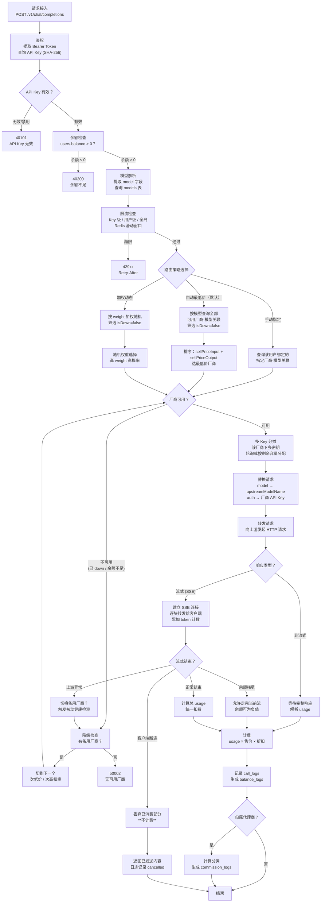

# Token 代理路由引擎 — 流程图

> 文件：`3cloud/docs/routing-engine-flow.md`
> 关联实现：`api/src/services/router.ts`

## 状态说明

| 状态 | 含义 |
|---|---|
| `active` | 厂商正常 |
| `degraded` | 降级（近 50 次成功率 < 70%，权重降至 50%） |
| `down` | 宕机（近 50 次成功率 < 30%，权重归零） |

## 健康检查

### 被动检查（主要）
- 每次调用后更新 `healthSamples` 和 `healthScore`
- 近 50 次采样：成功率 < 70% → 降级；< 30% → 宕机

### 主动检查（辅助）
- 每 5 分钟对 `isDown=true` 的厂商发轻量请求
- 连续成功 3 次 → 恢复 `active`

## 超时策略

| 场景 | 处理 |
|---|---|
| 上游响应 > 10s | AbortController.timeout 中断 → 告警 + 切备用 |
| 上游 HTTP 429 / 5xx | 触发被动检测 → 切备用 |
| 流式响应中途超时 | 中断流 → 不计费 → 切备用 |
