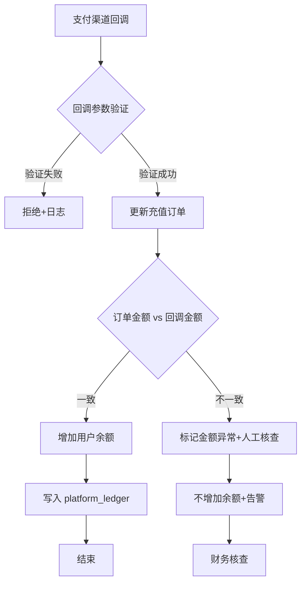

# 对账差异处理定量规则

> **补充对象**：SPEC-§29-资金与对账管理.md §29.3
> **定位**：定义对账差异的精确分类、自动处理策略、人工介入条件、差异追踪全流程
> **重写参考**：本文件是重写时对账模块的最终规格依据

---

## 一、对账类型与范围

| 对账类型 | 对比双方 | 对比维度 | 执行频率 | 归属模块 |
|---------|---------|---------|---------|---------|
| 供应商消费对账 | 平台 billing_logs vs 供应商账单 | 模型、Token 数、费用 | 每日 T+1 | 计费引擎 |
| 供应商结算对账 | 平台应结 vs 供应商已结 | 结算金额、笔数 | 每月结算日 | 供应商结算 |
| 代理佣金对账 | 平台佣金计算 vs 代理实际提现 | 佣金金额、用户维度 | 每日 T+1 | 代理商体系 |
| 充值对账 | 支付渠道回调 vs 平台充值订单 | 金额、支付单号 | 实时 | 充值模块 |
| 余额对账 | billing_logs vs users.balance | 用户余额变动 | 每日 T+1 | 计费引擎 |

---

## 二、差异自动分类体系

### 2.1 差异类型编码

| 编码 | 名称 | 含义 | 自动处理策略 |
|------|------|------|-------------|
| DIFF-001 | 平台有-对方无（漏报） | 平台有消费记录，供应商账单无 | 标记为"待确认"，自动重查 1 次 |
| DIFF-002 | 对方有-平台无（超收） | 供应商账单有，平台无对应记录 | 标记为"待核实"，需人工介入 |
| DIFF-003 | 金额不一致 | 双方都有记录但金额不同 | 自动比对定价配置，标记差异原因 |
| DIFF-004 | Token 数不一致 | 双方 Token 计数不同 | 自动取平台记录（token 由平台计算）|
| DIFF-005 | 重复记录 | 同一笔在对方出现 2+ 次 | 自动去重，标记多余记录 |
| DIFF-006 | 时间归属差异 | 请求跨自然日 | 按平台请求发起时间归属 |

### 2.2 差异严重程度分级

| 级别 | 偏差范围 | 处理方式 | 通知 |
|------|---------|---------|------|
| INFO | 偏差 ≤ ¥1 或笔数 ≤ 3 | 自动归集到对账报告，无需人工处理 | 对账报告内标注 |
| WARN | ¥1 < 偏差 ≤ ¥100 | 自动归集 + 推送对账报告提醒 | 站内通知 + 邮件 |
| CRITICAL | 偏差 > ¥100 或笔数 > 50 | 立即告警 + 人工介入 | P0 通知（短信/电话）|

### 2.3 差异自动处理矩阵

| 差异类型 | 自动对比方式 | 置信度 | 自动处理动作 | 人工介入条件 |
|---------|-------------|--------|-------------|-------------|
| DIFF-001（漏报） | 按流水号/时间+金额 模糊匹配 | 高 | 自动重查 1 次。确认平台有 → 标记为"待确认" | 累计漏报笔数 > 10 |
| DIFF-002（超收） | 对方记录 vs 平台 call_logs | 中 | 无法自动处理 → 标记"待核实" | 每笔都需要 |
| DIFF-003（金额不一致） | 比对定价快照 vs 当前定价 | 高 | 定价变动时间点快照对比。若定价变更导致 → 自动标记为定价变更 | 非定价变更导致的差异 |
| DIFF-004（Token 数不一致） | 取平台 Token 计数 | 高 | 以平台计数为准，自动标记对方偏差 | 累计偏差 Token > 1M |
| DIFF-005（重复记录） | 流水号去重检测 | 高 | 自动忽略（去重），标记日志 | 重复率 > 5% |
| DIFF-006（跨日归属） | 按平台请求发起时间 | 高 | 自动按平台时间归属 | 无需 |

---

## 三、差异处理工作流

### 3.1 状态机

```
new（新发现差异）
  │
  ▼
pending_auto（自动分析中）──(分析完成)──→ pending_review（待人工审核）
  │
  ▼
resolved（已解决）
  ├── resolved_as_platform_valid  → 以平台为准（平台记录正确）
  ├── resolved_as_vendor_valid    → 以对方为准（补登对方记录）
  ├── resolved_as_auto_match      → 自动匹配成功（无需人工）
  ├── resolved_as_price_change    → 定价变更导致，已自动修正
  ├── resolved_as_duplicate       → 重复记录，已忽略
  └── resolved_as_write_off       → 差异过小，已核销
   │
   ▼
confirmed（确认无误，终态）
```

### 3.2 差异处理操作

| 处理方式 | 含义 | 数据库操作 | 财务影响 |
|---------|------|-----------|---------|
| `以平台为准` | 平台记录正确，无需修正 | 更新差异表 status=resolved_as_platform_valid | 无 |
| `以对方为准` | 对方账单正确，补登平台记录 | INSERT platform_ledger（调账记录）+ 更新差异表 | 影响平台总账 |
| `核销` | 差异过小（≤¥1）或特殊情况，不做修正 | 更新差异表 status=resolved_as_write_off | 写入 operation_logs 备注 |
| `待核实` | 无法确定，需要进一步调查 | 保持差异表 status=pending_review + 添加备注 | 暂不影响 |

### 3.3 差异汇总报告（每日生成）

```
┌────────────────────────────────────────────┐
│  对账差异日报 — 2026-07-28                  │
├────────────────────────────────────────────┤
│                                            │
│  📊 总览                                     │
│  对账期间: 2026-07-28                        │
│  总笔数: 23,456                              │
│  精确匹配: 23,380 (99.68%)                   │
│  模糊匹配: 62   (0.26%)                      │
│  存在差异: 14   (0.06%)                      │
│  差异金额: ¥345.50                           │
│                                            │
│  🔴 待处理差异 (5 笔)                        │
│  ┌──────────────────────────────────┐       │
│  │ 对账类型  对方   差异金额  类型    │       │
│  │ 供应商    DeepS  +¥23.50  漏报   │       │
│  │ 供应商    OpenAI  -¥12.00  超收   │       │
│  │ 代理佣金  王五    +¥5.00   金额差异│       │
│  │ 充值      微信    ¥0.00    重复   │       │
│  │ 供应商    GLM     +¥305.00 超收   │       │
│  └──────────────────────────────────┘       │
│                                            │
│  🟢 今日已处理 (9 笔)                       │
│  ┌──────────────────────────────────┐       │
│  │ 对账类型  对方   处理方式  操作人  │       │
│  │ 供应商    阿里云  以平台为准  财务_张│       │
│  │ 供应商    DeepS  核销        系统自动│       │
│  │ ...                               │       │
│  └──────────────────────────────────┘       │
│                                            │
│  📈 趋势: 差异笔数连续 7 日下降              │
│  ┌──────────────┐                          │
│  │ ████▆▅▃▂▁   │                          │
│  └──────────────┘                          │
└────────────────────────────────────────────┘
```

---

## 四、供应商对账差异详细处理规则

### 4.1 供应商消费对账（每日）

**对比维度：**
- 每条记录对比：`call_logs.id`（或`request_id`）、`model`、`prompt_tokens`、`completion_tokens`、`cost`
- 汇总对比：日总 token 数、日总费用

**差异自动分析逻辑：**

```
┌─ 平台有，供应商无（DIFF-001）
│  1. 自动使用模糊匹配重查（时间±5min + 金额±10%）
│  2. 匹配成功 → 自动关联，升级为精确匹配
│  3. 匹配失败 → 标记 pending_review
│  4. 若连续 3 天同一笔差异 → 自动升级为 CRITICAL
│
├─ 供应商有，平台无（DIFF-002）
│  1. 核对 call_logs 是否被删除或状态异常
│  2. 检查是否为测试请求（test_user 标记）
│  3. 确认非测试 → 标记 pending_review，需人工核查
│
├─ 金额不一致（DIFF-003）
│  1. 对比当次请求的定价快照（billing_logs.priceSource）
│  2. 若定价在请求后发生过变更 → 标记为 pricing_change
│  3. 若非定价变更 → 计算百分比差异
│  4. 差异 < 1% → 自动核销
│  5. 差异 ≥ 1% → 标记 pending_review
│
└─ Token 数不一致（DIFF-004）
   1. Token 数由平台统计（不依赖供应商）
   2. 以平台 Token 数为准
   3. 平台 Token 数 × 单价 = 平台费用
   4. 偏差写入报告但不作为差异项
```

### 4.2 供应商结算对账（每月）

**对比维度：**
- 平台应结 = Σ(该供应商每条调用的成本价)
- 供应商已结 = 供应商提供的月账单总金额

**差异处理规则：**

| 偏差 | 处理方式 |
|------|---------|
| 偏差 ≤ ¥10 | 自动核销，写入对账报告 |
| ¥10 < 偏差 ≤ ¥500 | 按笔核查，标记未匹配项 |
| 偏差 > ¥500 | 暂停结算，P0 告警，财务人工核查 |
| 偏差率 > 2% | 即使金额小于 ¥500 也标记警告 |

---

## 五、充值对账规则

### 5.1 实时对账（支付回调时）



### 5.2 日终对账（每日 T+1）

```sql
-- 校验：支付渠道同款 vs 平台充值订单
SELECT 
  SUM(CASE WHEN p.status='success' THEN p.amount ELSE 0 END) AS channel_total,
  SUM(r.amount) AS platform_total
FROM payment_logs p
LEFT JOIN recharge_orders r ON p.out_trade_no = r.payment_order_no
WHERE p.created_at::date = CURRENT_DATE - 1;

-- 偏差规则：
-- ≤¥10  → 标记 INFO，入对账报告
-- >¥10  → 标记 WARN，推送通知
-- >¥100 → CRITICAL，紧急告警
```

### 5.3 渠道熔断规则

| 条件 | 熔断行为 | 恢复条件 |
|------|---------|---------|
| 连续 5 笔回调验证失败 | 自动暂停该支付渠道 | 人工确认后手动恢复 |
| 单渠道日成功率 < 80% | 自动降级（优先使用其他渠道）| 成功率恢复 > 95% 持续 10 分钟 |
| 回调超时率 > 20%（24h 滑动窗口）| 切换轮询策略为主动查询 | 人工确认后恢复 |

---

## 六、代理佣金对账规则

### 6.1 日对账

```sql
-- 校验：佣金计算 vs 佣金记录
SELECT 
  agent_id,
  SUM(calculated_commission) AS calc_total,
  SUM(recorded_commission) AS record_total
FROM (
  -- 佣金计算结果
  SELECT agent_id, SUM(b.actual_cost * c.rate) AS calculated_commission
  FROM billing_logs b
  JOIN commission_rules c ON c.agent_id = b.agent_id AND c.model_id = b.model_id
  WHERE b.created_at::date = CURRENT_DATE - 1 AND b.status IN ('settled', 'reconciled')
  GROUP BY agent_id
) calc
FULL OUTER JOIN (
  -- 实际写入的佣金记录
  SELECT agent_id, SUM(amount) AS recorded_commission
  FROM agent_commissions
  WHERE period_date::date = CURRENT_DATE - 1
  GROUP BY agent_id
) rec ON calc.agent_id = rec.agent_id
WHERE ABS(calc_total - record_total) > 0.01;
```

### 6.2 偏差处理

| 偏差 | 处理方式 |
|------|---------|
| ≤¥1 | 自动核销 |
| >¥1 且由于计算精度 | 在下期佣金中调整 |
| >¥1 且由于费率变更 | 按快照费率重新计算，标记变更日志 |
| >¥100 | 暂停该代理提现，人工核查 |

---

## 七、余额对账（会计恒等式）

### 7.1 校验公式（每日）

```sql
-- Σ(期初余额) + Σ(充值) - Σ(消费) - Σ(退款) - Σ(提现) + Σ(调账) = Σ(期末余额)
WITH daily_data AS (
  SELECT 
    COALESCE(SUM(recharge_amount), 0) AS total_recharge,
    COALESCE(SUM(consumption_amount), 0) AS total_consumption,
    COALESCE(SUM(refund_amount), 0) AS total_refund,
    COALESCE(SUM(withdraw_amount), 0) AS total_withdraw,
    COALESCE(SUM(adjust_amount), 0) AS total_adjust
  FROM platform_ledger
  WHERE created_at::date = CURRENT_DATE - 1
)
SELECT
  (SELECT COALESCE(SUM(balance), 0) FROM users WHERE updated_at < CURRENT_DATE - 1) AS period_start_balance,
  total_recharge,
  -total_consumption AS consumption,
  -total_refund AS refund,
  -total_withdraw AS withdraw,
  total_adjust AS adjust,
  (SELECT COALESCE(SUM(balance), 0) FROM users) AS period_end_balance,
  -- 校验
  (SELECT COALESCE(SUM(balance), 0) FROM users WHERE updated_at < CURRENT_DATE - 1) 
  + total_recharge - total_consumption - total_refund - total_withdraw + total_adjust
  - (SELECT COALESCE(SUM(balance), 0) FROM users) AS deviation
FROM daily_data;
```

### 7.2 偏差处理

| 偏差 | 处理方式 |
|------|---------|
| ≤¥10 | 标记 INFO，入对账报告 |
| ¥10 < 偏差 ≤ ¥100 | 标记 WARN，推送站内通知+邮件 |
| >¥100 | CRITICAL，紧急告警（电话），财务负责人介入 |
| 连续 3 天偏差 > ¥10 | 自动标记为系统性问题，记入技术改进队列 |
