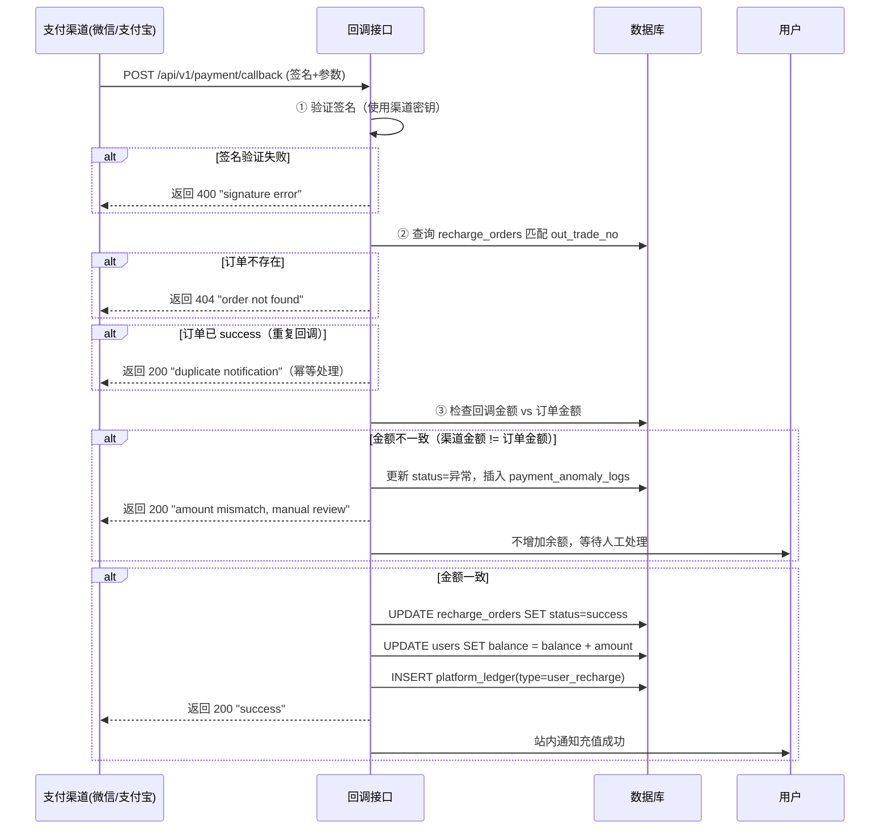

# 充值/退款全链路状态机

> **补充对象**：ref-2.2.6-recharge.md、ref-9.5-refund.md
> **定位**：充值订单状态机、退款流程状态机、三方支付回调处理规则、渠道熔断策略
> **重写参考**：本文件是重写时充值+退款模块的最终规格依据

---

## 一、充值订单状态机

### 1.1 状态定义

| 枚举值 | 含义 | 是否终态 |
|--------|------|---------|
| `pending_payment` | 等待用户支付（扫码/跳转支付场景）| 否 |
| `pending_upload` | 等待用户上传凭证（对公转账场景）| 否 |
| `pending_verify` | 支付成功但待系统验证（异步回调/人工核查）| 否 |
| `pending_confirm` | 对公转账待管理员确认到账 | 否 |
| `success` | 充值成功，余额已到账 | ✅ |
| `failed` | 支付失败/用户取消 | ✅ |
| `expired` | 超时未支付 | ✅ |
| `cancelled` | 用户主动取消 | ✅ |
| `refunding` | 充值退款处理中（原路退回）| 否 |
| `refunded` | 充值已退款 | ✅ |
| `disputed` | 用户发起争议（声称未到账）| ✅ |

### 1.2 完整状态转换图

```
① 在线支付（扫码/跳转）
  pending_payment ──(用户扫码/跳转)──→ pending_payment
       │
       ├──(30分钟超时)──→ expired
       ├──(用户取消)──→ cancelled
       ├──(支付成功回调)──→ pending_verify
       │       └──(验证通过)──→ success
       │       └──(金额不一致/验证失败)──→ 保持 pending_verify + 标记异常 + P0告警
       └──(支付失败回调)──→ failed

② 对公转账
  pending_upload ──(用户上传凭证)──→ pending_confirm
       │
       ├──(管理员确认到账)──→ success
       ├──(管理员驳回)──────→ failed（退回上传，可重新上传）
       └──(72小时未上传)──→ expired

③ 充值后退款
  success ──(财务发起退款)──→ refunding
       │
       ├──(原路退回成功)──→ refunded
       └──(原路退回失败)──→ refunding + 标记异常（更换退款方式或线下处理）

④ 争议处理
  success ──(用户声称未到账)──→ disputed
       │
       ├──(核查发现已到账)──→ success（驳回争议）
       ├──(核查发现未到账)──→ 转入人工退款流程
       └──(72小时未处理)──→ CRITICAL告警
```

### 1.3 每个状态转换的精确副作用

| 转换 | 触发条件 | 数据库操作 | 缓存操作 | 通知/其他 |
|------|---------|-----------|---------|----------|
| `(无)→pending_payment` | 用户发起充值 | INSERT recharge_orders(amount, paymentMethod, status=pending_payment)；生成订单号 | 无 | 无 |
| `pending_payment→expired` | cron 每分钟检查已超过 30min 的订单 | UPDATE recharge_orders SET status=expired WHERE status=pending_payment AND created_at < NOW()-30min | 无 | 无 |
| `pending_payment→success` | 支付回调验证通过 | UPDATE recharge_orders SET status=success, paid_at=NOW(), payment_order_no；UPDATE users SET balance = balance + amount；INSERT platform_ledger(type=user_recharge, direction=in) | 清除用户余额缓存 | 站内通知充值成功 |
| `pending_payment→failed` | 支付回调明确返回支付失败 | UPDATE recharge_orders SET status=failed, fail_reason | 无 | 无 |
| `success→refunding` | 财务发起退款 | UPDATE recharge_orders SET status=refunding；冻结对应金额（不让用户使用）| 无 | 通知用户退款处理中 |
| `refunding→refunded` | 原路退回成功 | UPDATE recharge_orders SET status=refunded, refunded_at；UPDATE users SET balance = balance - amount（如果之前已到账）；INSERT platform_ledger(type=user_refund, direction=out) | 清除用户余额缓存 | 通知用户退款完成 |
| `refunding→refunding(retry)` | 原路退回失败 | UPDATE recharge_orders SET retry_count+=1, last_retry_at=NOW()；若重试 ≥ 3 次则标记 need_manual | 无 | P1 告警：退款失败需人工处理 |
| `success→disputed` | 用户提交争议 | UPDATE recharge_orders SET status=disputed；暂不扣余额 | 无 | 通知客服处理 |

### 1.4 充值订单号规则

```
格式：RE + 日期(8位) + 流水号(6位)
示例：RE20260728000001

规则：
- 每日从 000001 开始
- 使用数据库序列或 Redis INCR 生成（保证全局唯一）
- 对公转账使用相同规则，在前端标注"对公-"+流水号
```

---

## 二、三方支付回调处理规则

### 2.1 回调处理流程



### 2.2 回调幂等处理

```sql
-- 核心：每个 out_trade_no（支付渠道订单号）只能处理一次
-- 实现方式：
-- 1. recharge_orders.payment_order_no 字段建立 UNIQUE 索引
-- 2. 回调处理时先 SELECT FOR UPDATE 锁定该记录
-- 3. 已 success/refunded 的回调直接返回 200（忽略）

-- 数据库中：
payment_order_no: varchar(100) UNIQUE  -- 支付渠道订单号
-- 首次回调写入，重复回调因 UNIQUE 约束失败或主动检查
```

### 2.3 支付渠道参数配置

| 渠道 | 配置项 | 环境变量/DB |
|------|--------|------------|
| 支付宝 | app_id, alipay_public_key, merchant_private_key, notify_url, return_url | site_configs |
| 微信支付 | app_id, mch_id, api_key, cert_p12, notify_url | site_configs |
| 对公转账 | 对公户名、账号、开户行、支持银行列表 | site_configs |

### 2.4 支付超时与重试

| 场景 | 重试策略 |
|------|---------|
| 用户扫码后 30 分钟未支付 | 订单自动 expired，释放支付二维码 |
| 支付回调网络超时（渠道→平台） | 渠道自动重试回调（最多 3 次，间隔递增） |
| 回调处理失败（平台 Bug/数据库异常）| 返回 500，渠道会在 30s/60s/120s 后重试 |
| 支付成功但用户未收到通知 | 用户在充值记录页可手动刷新状态 |

---

## 三、退款流程状态机

### 3.1 退款类型

| 类型 | 触发方 | 金额来源 | 是否需要审核 |
|------|--------|---------|-------------|
| 用户充值退款 | 用户申请/客服发起 | 原路退回支付渠道 | finance_ops 审核 |
| 消费退款（多扣费）| 系统自动/客服发起 | 退回到用户余额 | 自动（系统确认多扣）或 finance_ops |
| 活动优惠扣回 | 运营操作 | 从用户余额扣回 | finance_ops 审核 |

### 3.2 退款状态机

```
refund_requested（退款申请提交）
  │
  ▼
pending_review（待审核）
  │
  ├──(审核通过)──→ refund_processing（退款处理中）
  │       │
  │       ├──(原路退回成功)──→ refund_completed（退款完成）✅
  │       ├──(原路退回失败)──→ refund_manual（需人工处理）
  │       │       └──(线下处理完成)──→ refund_completed
  │       └──(用户余额退款成功)──→ refund_completed
  │
  └──(审核驳回)──→ refund_rejected（退款驳回）✅
```

### 3.3 退款金额计算

```
充值退款：
  退回到原支付渠道
  可退金额 = 该笔充值实际支付金额
  不可退：该笔充值已被消费的部分（按余额流水判断）

消费退款（多扣费）：
  退回到用户余额
  退额 = 用户被多扣金额（申请金额）
  要求：该笔 billing_logs 状态为 settled/reconciled

活动优惠扣回：
  从用户余额扣除
  扣回金额 = 活动优惠额度
  操作权限：仅 super_admin
```

### 3.4 退款约束规则

```sql
-- 充值退款约束
-- 1. 充值后超过 90 天不可原路退回（走线下转账）
-- 2. 该笔充值余额已被消费 ≥ 50% 时，不可全额退款（只退余额剩余部分）
-- 3. 充值退款后，该用户不可再使用该笔充值的剩余余额（系统锁定）

-- 消费退款约束
-- 1. 退款请求必须在消费发生 30 天内提出
-- 2. 同一笔 billing_log 不可重复退款
-- 3. 退款后 billing_log 追加一条 refund_record 记录（不修改原 billing_log 状态）

-- 通用约束
-- 1. 用户余额不足以抵扣退款的，不可退款（从余额扣减的场景）
-- 2. 用户账号已冻结/删除 → 退款处理需人工核实
```

---

## 四、对公转账处理规则

### 4.1 流程

```
1. 用户选择"对公转账"，填写金额
2. 系统显示对公账户信息（户名、账号、开户行）
3. 用户线下转账 → 上传转账凭证（截图/回单）
4. 管理员（finance_ops）在后台查收到账情况
5. 确认到账 → 充值成功
6. 驳回（凭证模糊/金额不符）→ 用户重新上传
```

### 4.2 对公转账确认规则

| 场景 | 处理 |
|------|------|
| 管理员查到银行流水匹配 | 确认充值 success |
| 上传凭证模糊/不完整 | 驳回并要求重新上传 |
| 用户转账金额与订单不一致 | 联系用户确认，以实际到账金额为准 |
| 超过 72 小时未到账 | 订单自动 expired，通知用户 |

### 4.3 安全规则

```
- 对公账户信息不可编辑（由超管在 site_configs 中配置）
- 修改对公账户 → 需超管 + 财务双签
- 对公转账订单生成后，不可修改金额
- 对公转账日限额：¥500,000（可配置）
```

---

## 五、充值渠道熔断规则

### 5.1 自动熔断

| 渠道 | 触发条件 | 熔断动作 | 恢复 |
|------|---------|---------|------|
| 支付宝 | 连续 10 笔回调异常（签名失败/金额不一致） | 自动禁用支付宝渠道 30 分钟 | 30 分钟后自动恢复；或人工手动恢复 |
| 微信支付 | 连续 10 笔回调异常 | 同上 | 同上 |
| 所有渠道 | 所有渠道同时熔断 | 前端隐藏充值按钮，展示"充值系统维护中" | 任一渠道恢复后自动展示 |

### 5.2 渠道健康度

```sql
-- 每个渠道监控指标
-- 1. 成功率 = success_calls / total_calls (24h 滑动窗口)
-- 2. 平均回调延迟 P50/P95/P99
-- 3. 熔断计数：当前是否处于熔断状态

-- 健康度评级
-- 绿色：成功率 ≥ 99%
-- 黄色：95% ≤ 成功率 < 99%
-- 红色：成功率 < 95%（触发熔断阈值）
```

---

## 六、充值数据模型

### 6.1 recharge_orders 表（重写版本）

```typescript
export const rechargeOrders = pgTable("recharge_orders", {
  id: serial("id").primaryKey(),
  orderNo: varchar("order_no", { length: 30 }).notNull().unique(),  // RE20260728000001
  userId: integer("user_id").notNull().references(() => users.id),

  // 金额
  amount: numeric("amount", { precision: 14, scale: 2 }).notNull(),
  paidAmount: numeric("paid_amount", { precision: 14, scale: 2 }),   // 实际支付金额（可能有手续费差异）

  // 支付方式
  paymentMethod: varchar("payment_method", { length: 20 }).notNull(),
    // alipay / wechat / bank_transfer
  paymentChannel: varchar("payment_channel", { length: 30 }),
  paymentOrderNo: varchar("payment_order_no", { length: 100 }).unique(),  // 渠道订单号

  // 对公转账
  bankVoucherUrl: varchar("bank_voucher_url", { length: 500 }),       // 凭证图片URL
  bankRemark: varchar("bank_remark", { length: 500 }),

  // 状态
  status: varchar("status", { length: 20 }).notNull().default("pending_payment"),
    // pending_payment | pending_upload | pending_verify | pending_confirm
    // success | failed | expired | cancelled | refunding | refunded | disputed

  // 第三方回调
  callbackRaw: text("callback_raw"),              // 原始回调报文（JSON）
  callbackVerified: boolean("callback_verified"), // 回调签名验证结果
  callbackReceivedAt: timestamp("callback_received_at"),

  // 优惠
  promotionId: integer("promotion_id"),
  bonusAmount: numeric("bonus_amount", { precision: 14, scale: 2 }).default("0"),

  // 退款
  refundStatus: varchar("refund_status", { length: 20 }),  // none / refunding / refunded
  refundAmount: numeric("refund_amount", { precision: 14, scale: 2 }),
  refundedAt: timestamp("refunded_at"),

  // 元数据
  paidAt: timestamp("paid_at"),
  verifiedAt: timestamp("verified_at"),
  verifiedBy: integer("verified_by").references(() => users.id),
  remark: varchar("remark", { length: 500 }),
  createdAt: timestamp("created_at").defaultNow(),
  updatedAt: timestamp("updated_at").defaultNow(),
});

// 索引
// - idx_order_no: (order_no) UNIQUE
// - idx_user_id: (user_id)
// - idx_payment_order_no: (payment_order_no) UNIQUE
// - idx_status: (status)
// - idx_created_at: (created_at)
```

### 6.2 refund_orders 表（重写版本）

```typescript
export const refundOrders = pgTable("refund_orders", {
  id: serial("id").primaryKey(),
  refundNo: varchar("refund_no", { length: 30 }).notNull().unique(), // RF20260728000001
  rechargeOrderId: integer("recharge_order_id").references(() => rechargeOrders.id),
  billingLogId: integer("billing_log_id").references(() => billingLogs.id),

  userId: integer("user_id").notNull().references(() => users.id),
  refundType: varchar("refund_type", { length: 20 }).notNull(),
    // recharge_refund / consumption_refund / campaign_reclaim

  amount: numeric("amount", { precision: 14, scale: 2 }).notNull(),
  reason: varchar("reason", { length: 500 }),
  
  // 退款方式
  refundMethod: varchar("refund_method", { length: 20 }),
    // original_channel（原路退回）/ balance（退回余额）/ offline（线下）

  // 状态
  status: varchar("status", { length: 20 }).notNull().default("refund_requested"),
    // refund_requested | pending_review | refund_processing
    // refund_completed | refund_rejected | refund_manual

  // 审核
  reviewedBy: integer("reviewed_by").references(() => users.id),
  reviewedAt: timestamp("reviewed_at"),
  reviewRemark: varchar("review_remark", { length: 500 }),

  // 处理
  processedBy: integer("processed_by").references(() => users.id),
  processedAt: timestamp("processed_at"),

  // 重试
  retryCount: integer("retry_count").default(0),
  lastRetryAt: timestamp("last_retry_at"),
  needManual: boolean("need_manual").default(false),

  createdAt: timestamp("created_at").defaultNow(),
  updatedAt: timestamp("updated_at").defaultNow(),
});
```

---

## 七、充值退款异常场景矩阵

| # | 场景 | 检测时机 | 自动处理 | 告警级别 |
|---|------|---------|---------|---------|
| R-001 | 用户付款成功但回调丢失 | 日终对账发现 | 对账脚本检测偏差，自动补登 | WARN |
| R-002 | 回调金额与订单金额不一致 | 回调处理时 | 保持 pending_verify，不增加余额 | P0 告警 |
| R-003 | 重复回调 | 回调处理时 | 幂等处理，直接返回 200 忽略 | 无 |
| R-004 | 原路退回失败 | 退款处理时 | 自动重试（最多 3 次），失败后标记 need_manual | P1 告警 |
| R-005 | 用户充值后未到账（争议）| 用户提交争议 | 状态变为 disputed，通知客服 | P1 通知 |
| R-006 | 对公转账超过 72h 未到账 | cron 每日扫描 | 自动标记 expired，通知用户重新充值 | 站内通知 |
| R-007 | 用户在支付跳转页面关闭浏览器 | 无（自然超时）| 30min 后自动 expired | 无 |
| R-008 | 渠道密钥过期 | 回调签名验证失败 | 记录日志，不中断服务（等待渠道更新密钥）| P0 告警 |
| R-009 | 充值后马上申请退款（未消费）| 人工审核 | 全额原路退回，审核需验证余额未被消耗 | finance_ops 审核 |
| R-010 | 充值后余额已被大量消费 | 退款审核 | 仅退剩余余额部分，不超可退金额 | finance_ops 审核 |
