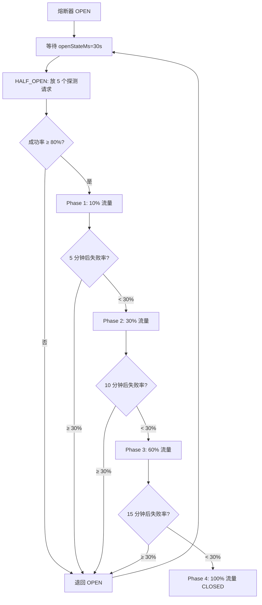

# 路由熔断与恢复梯度策略

> **补充对象**：ref-5.1-routing.md
> **定位**：熔断器完整参数定义、恢复梯度策略（流量渐变）、供应商健康度评级、手动覆盖规则
> **重写参考**：本文件是重写时路由模块的最终规格依据

---

## 一、熔断器三态参数定义

### 1.1 状态定义

| 状态 | 含义 | 请求处理 | 转换条件 |
|------|------|---------|---------|
| `CLOSED` | 关闭（正常）| 请求正常转发 | 无 |
| `OPEN` | 打开（熔断）| 直接快速失败，不转发 | 失败率 > 阈值 |
| `HALF_OPEN` | 半开（试探）| 允许少量探测请求通过 | OPEN 状态超过恢复等待时间 |

### 1.2 熔断参数（可通过 site_configs 配置）

```typescript
// 熔断器配置（site_configs 存储）
interface CircuitBreakerConfig {
  // 触发熔断
  failureThreshold: number;           // 失败率阈值，默认 0.30（30%）
  failureWindowMs: number;            // 统计窗口，默认 60000（1 分钟）
  minRequestCount: number;            // 最少请求数（低于此数不触发熔断），默认 10
  
  // 恢复
  openStateMs: number;                // OPEN 状态最少持续时间，默认 30000（30 秒）
  halfOpenMaxRequests: number;        // HALF_OPEN 时允许通过的请求数，默认 5
  halfOpenSuccessThreshold: number;   // HALF_OPEN 成功率阈值，默认 0.80（80%）
  
  // 降级
  degradationResponseMs: number;      // 降级模式下最大允许延迟，默认 5000（5 秒）
  
  // 梯度恢复
  recoverySteps: RecoveryStep[];      // 恢复阶段定义（见 §二）
}

interface RecoveryStep {
  phase: number;                       // 阶段编号 1~4
  allowedTrafficPercent: number;       // 允许流量的百分比
  durationMs: number;                  // 该阶段持续时间
  healthCheckIntervalMs: number;       // 健康检查间隔
}
```

### 1.3 默认熔断参数

| 参数 | 默认值 | 说明 |
|------|--------|------|
| failureThreshold | 30% | 最近 1 分钟内失败率超过 30% |
| failureWindowMs | 60000 | 统计窗口 1 分钟 |
| minRequestCount | 10 | 至少 10 个请求才评估熔断 |
| openStateMs | 30000 | 熔断后最少等待 30 秒才尝试恢复 |
| halfOpenMaxRequests | 5 | HALF_OPEN 时放 5 个探测请求 |
| halfOpenSuccessThreshold | 80% | 探测请求成功率 ≥ 80% 才恢复 |
| degradationResponseMs | 5000 | 降级模式下请求超时设为 5 秒 |

---

## 二、恢复梯度策略（核心补充）

### 2.1 四阶段梯度恢复

当熔断器从 OPEN 进入 HALF_OPEN，且探测成功后，流量按以下梯度恢复：

```
阶段             流量占比          持续时间          健康检查间隔
Phase 1 (恢复期)   10%             5 分钟            每 30 秒
Phase 2 (观察期)   30%             10 分钟           每 1 分钟
Phase 3 (增长期)   60%             15 分钟           每 2 分钟
Phase 4 (稳定期)   100%            —                 每 5 分钟（常规健康检查频率）
```

### 2.2 梯度恢复流程图



### 2.3 恢复到上一阶段的条件

```
任何阶段中，若失败率再次 ≥ 30%：
  → 不是回到 OPEN（除非连续失败严重）
  → 而是退回上一阶段：
     Phase 3 → Phase 2（降低流量占比）
     Phase 2 → Phase 1
     Phase 1 → OPEN（重新熔断）

退回后重新计时：
  退回 Phase 2：需要重新观察 10 分钟
  退回 Phase 1：需要重新观察 5 分钟
```

### 2.4 快速恢复通道

```
当供应商明确标记为"已修复"（通过管理后台手动操作）：
  → 跳过 Phase 1-3，直接进入 Phase 4
  → 但需在 30 分钟内持续观察，失败率再次超限则立即熔断

适用场景：
  - 供应商发布公告说明故障已修复
  - 运维人员在供应商端确认服务恢复
  - 手动覆盖操作后
```

---

## 三、供应商健康度评级

### 3.1 健康度计算

```typescript
// 基于最近 5 分钟的滑动窗口
interface VendorHealthScore {
  vendorId: number;
  
  // 指标
  successRate: number;           // 成功率（最近 5 分钟）
  avgLatencyMs: number;          // 平均延迟
  p95LatencyMs: number;          // P95 延迟
  errorRate: number;             // 错误率
  circuitBreakerState: string;   // CLOSED / OPEN / HALF_OPEN
  
  // 计算得分（0-100）
  score: number;                 // 综合得分
}

// 评分公式
score = (
  successRate * 50 +             // 成功率权重 50%
  (1 - avgLatencyMs / 5000) * 20 + // 延迟权重 20%（5000ms 为最差）
  (1 - errorRate) * 20 +          // 错误率权重 20%
  (circuitBreakerState === 'CLOSED' ? 10 : 0)  // 断路器状态 10%
);

// 注意：avgLatencyMs > 5000 时，延迟得分 = 0
```

### 3.2 评级定义

| 评级 | 得分范围 | 路由优先级调整 | 颜色标识 |
|------|---------|--------------|---------|
| A（健康）| 90-100 | 保留正常权重 | 🟢 |
| B（良好）| 70-89 | 权重降低 20% | 🟡 |
| C（亚健康）| 50-69 | 权重降低 50% | 🟠 |
| D（不稳定）| 30-49 | 仅作为故障转移候选 | 🔴 |
| E（不可用）| < 30 | 不参与路由 | ⚫ |

### 3.3 路由权重调整

```
每个供应商-模型映射的原始权重 config.weight

实际路由权重 = config.weight × scaleFactor

scaleFactor 根据健康度评级：
  A: 1.0
  B: 0.8
  C: 0.5
  D: 0.2 (仅故障转移时使用)
  E: 0   (不参与路由)

多个竞争供应商的选择概率：
  供应商 A 权重 50  → 调整后 50 × 1.0 = 50
  供应商 B 权重 50  → 调整后 50 × 0.8 = 40
  供应商 C 权重 30  → 调整后 30 × 0.5 = 15
  总调整权重 = 105
  
  A 概率 = 50/105 ≈ 47.6%
  B 概率 = 40/105 ≈ 38.1%
  C 概率 = 15/105 ≈ 14.3%
```

---

## 四、手动覆盖规则

### 4.1 手动覆盖类型

| 类型 | 含义 | 有效期 | 优先级 |
|------|------|-------|-------|
| `manual_pin` | 强制指定供应商 | 最长 4 小时（可手动解除）| 最高 |
| `manual_block` | 屏蔽某供应商 | 最长 4 小时（可手动解除）| 次高 |
| `manual_override_weight` | 手动设置权重 | 持久（直到手动移除）| 覆盖自动权重调整 |

### 4.2 手动覆盖与自动路由的关系

```
1. manual_pin 生效期间：
   - 该模型所有请求定向到指定供应商
   - 熔断器仍然正常工作（如果指定供应商熔断，则请求返回错误）
   - 熔断器触发不影响 manual_pin（仅返回错误，不自动切换到其他供应商）
   - 管理员可在到期前手动解除覆盖

2. manual_block 生效期间：
   - 该供应商被排除在所有路由选择之外
   - 自动熔断器对 blocked 供应商暂停评估
   - 恢复时需手动解除 block，然后进入梯度恢复

3. manual_override_weight 生效期间：
   - 手动设置权重覆盖自动健康评分权重
   - 但熔断器状态仍然生效（OPEN 状态的供应商即使手动权重高也不参与路由）
```

### 4.3 覆盖冲突处理

```
多个覆盖重叠时优先级：
  1. manual_block（屏蔽）> manual_pin（指定）> manual_override_weight（权重）
  
  例：供应商 A 同时被 manual_pin 指定，又被 manual_block 屏蔽
  → manual_block 生效，供应商 A 不可用
  
  例：供应商 A 被 manual_pin 指定，同时供应商 B 被 manual_block
  → manual_pin 让 A 独占流量，B 不可用
```

### 4.4 覆盖状态持久化

```typescript
// route_overrides 表
export const routeOverrides = pgTable("route_overrides", {
  id: serial("id").primaryKey(),
  modelId: integer("model_id").notNull().references(() => models.id),
  vendorId: integer("vendor_id").notNull().references(() => vendors.id),
  
  overrideType: varchar("override_type", { length: 30 }).notNull(),
    // manual_pin / manual_block / manual_override_weight
  
  weight: integer("weight"),           // manual_override_weight 时使用
  
  // 有效期
  expiresAt: timestamp("expires_at"),  // null=永久
  enabled: boolean("enabled").default(true),
  
  // 操作记录
  createdBy: integer("created_by").references(() => users.id),
  createdAt: timestamp("created_at").defaultNow(),
  remark: varchar("remark", { length: 500 }),
});
```

---

## 五、供应商级联故障处理

### 5.1 Key 耗尽场景

```
场景：供应商某个 API Key 耗尽配额，但该供应商其他 Key 仍可用
处理：
  1. 路由引擎检测到该 Key 返回 429/quota_exceeded
  2. 自动降级该 Key（不是降级整个供应商）
  3. 轮询到下一个 Key
  4. 如果该供应商所有 Key 都耗尽 → 降级整个供应商
```

### 5.2 供应商整体不可用

```
场景：供应商服务整体挂掉
处理：
  1. 路由引擎检测到连续 N 次失败（N 根据 minRequestCount 决定）
  2. 熔断器设定为 OPEN
  3. 所有请求切换到其他供应商
  4. 如果所有供应商都不可用 → 返回 503
```

### 5.3 恢复后数据追赶

```
场景：供应商恢复后，积压的请求需要追回
说明：路由引擎不负责重放积压请求（这属于运营操作）
运营可操作：
  1. 手动重放积压请求（通过后台操作面板）
  2. 确认供应商已追回数据
```

---

## 六、健康检查规则

### 6.1 健康检查类型

| 类型 | 频率 | 方式 | 超时 | 健康判定 |
|------|------|------|------|---------|
| 主动探测 | 每 30 秒 | 发送轻量请求（如 models/list）| 5 秒 | 返回 200 |
| 被动探测 | 每笔请求 | 检查响应状态码和延迟 | 正常请求超时 | HTTP 2xx |
| 深度探测 | 每 5 分钟 | 发送实际模型调用 | 30 秒 | 返回正常 tokens |

### 6.2 健康检查结果

```
主动探测成功 → 更新供应商最后存活时间
主动探测失败 → 不立即熔断，继续使用被动探测数据
被动探测失败率 > 阈值 → 触发熔断
深度探测失败 → 降级健康评级
```

---

## 七、路由异常场景矩阵

| # | 场景 | 检测时机 | 自动处理 | 告警级别 |
|---|------|---------|---------|---------|
| R-001 | 单个供应商熔断 | 被动探测失败率 > 30% | OPEN，流量切换到其他供应商。30s 后 HALF_OPEN 试探 | P1 通知 |
| R-002 | 所有供应商熔断 | 全部供应商 OPEN | 返回 503，附带预计恢复时间。每 10s 自动健康探测 | P0 告警（电话）|
| R-003 | 某供应商 Half_Open 探测成功 | HALF_OPEN 测试 | 进入梯度恢复 Phase 1 | 无 |
| R-004 | 某供应商 Half_Open 探测失败 | HALF_OPEN 测试 | 退回 OPEN，延长等待时间（每次+15s，最多 120s）| 无 |
| R-005 | 手动覆盖到期 | cron 每小时扫描 | 自动移除过期覆盖，恢复自动路由 | 无 |
| R-006 | 供应商返回 5xx 连续 N 次 | 被动探测 | 加入熔断统计，但不立即熔断（需要达到阈值）| P2 日志 |
| R-007 | 供应商返回 4xx（非配额）| 被动探测 | 不纳入熔断统计（4xx 通常是请求问题）| P2 日志 |
| R-008 | 供应商返回 429（限流）| 被动探测 | 降级该 Key，切换到同供应商其他 Key | 无 |
| R-009 | 梯度恢复中再次故障 | 被动探测 | 退回上一阶段或直接 OPEN | P1 通知 |
| R-010 | 路由配置不存在 | 请求时 | 使用默认兜底策略或返回 404 | WARN 通知管理员 |
