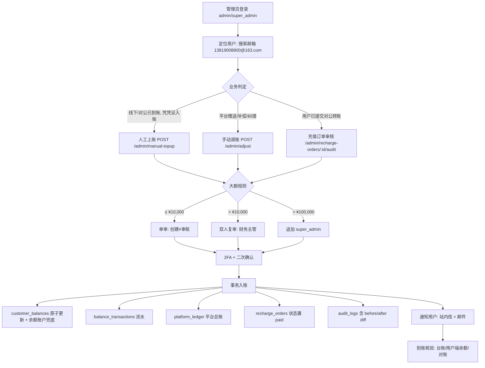

# 整改方案 —— 管理员为用户「充值 ¥1000」业务演练与系统整改建议

> **场景**：管理员给用户 `13819008800@163.com` 充值 ¥1,000.00
> **视角**：管理员（admin / super_admin）完整业务逻辑操作演练
> **产出**：以演练暴露的断点为题材，输出 3cloud 系统整改建议方案

| 字段 | 值 |
|------|-----|
| 文档编号 | RECT-2026-ADMIN-RECHARGE-001 |
| 版本 | v1.0 |
| 日期 | 2026-08-18 |
| 适用项目 | 3cloud（AI API 网关 + 管理后台） |
| 关联文档 | `SPEC-§2-用户体系.md`、`SPEC-§4-管理后台.md`、`SPEC-§20-用户端安全与预算增强.md`、`SPEC-§29-资金与对账管理.md`、`SPEC-§30-权限管理.md`、`docs/ref-2.2.6-recharge.md`、`docs/PRODUCT-DESIGN-PRINCIPLES.md` |
| 现状依据 | 仓库代码：`api/src/routes/recharge.ts`、`api/src/routes/admin-adjust.ts`、`api/src/routes/admin-finance-missing.ts`、`api/src/routes/admin-permissions.ts`、`api/src/services/billing/balance.ts`、`api/src/db/schema/adjustment-records.ts` |

---

## 一、场景与目标

1. **业务场景**：管理员准备给用户 `13819008800@163.com` 充值 ¥1,000.00（平台侧入账，非用户自助支付）。
2. **演练目标**：以管理员视角走通完整业务逻辑 —— 登录鉴权 → 定位用户 → 业务判定（选资金路径）→ 发起 → 审批 → 资金入账 → 通知 → 审计 → 到账核验。
3. **方案目标**：将演练中发现的每一个断点、风险、口径不一致项，整理为分级问题清单，并给出**分阶段、可验收**的整改方案。

> **结论先行**：本次 ¥1,000 充值在当前系统中**可以完成，但只能借道「手动调账」路径**（调增 < ¥10,000 免审批、提交即生效）；语义上最应该走的「人工上账」路径**缺少创建入口**，且两条路径共暴露 4 个 P0、6 个 P1、5 个 P2 缺口（见第三节）。

---

## 二、管理员视角：完整业务操作演练（基于当前实现）

### 2.1 前置条件与权限核对

| 检查项 | 现状（依据代码） | 结论 |
|--------|----------------|------|
| 登录 | 管理后台 JWT 登录 | ✅ |
| 角色门槛 | 资金相关路由 `adminAuth` 仅放行 `admin` / `super_admin`（`recharge.ts:373`、`admin-adjust.ts:28-37`、`admin-finance-missing.ts` 同款） | ✅ 管理员可操作 |
| 权限点 | 权限树中 `finance.topup`（人工上账）授予了 `finance`/`admin`/`super_admin`（`admin-permissions.ts:56-82`） | ⚠️ **假授权**：权限树给了 `finance` 角色，但路由层不放行 `finance`，且路由只比对单一 `users.role` 字段、未按权限点鉴权（见 P0-3） |

### 2.2 步骤 0：登录管理后台

管理员账号登录 → 进入 `/admin`。本场景操作者角色为 `admin` / `super_admin`。

### 2.3 步骤 1：定位用户

```
用户管理 → 搜索「13819008800@163.com」→ 用户详情
核对项：
  ✔ 用户存在性（users 表）
  ✔ 状态：正常 / 禁用 / 冻结（禁用与冻结用户入账前需先解锁）
  ✔ 实名状态（可选，人工上账建议要求已实名）
  ✔ 当前余额（customer_balances）
```

⚠️ **断点预判**：若该用户**没有 `customer_balances` 余额行**（如历史迁移数据、非注册路径创建的用户），后续两条资金路径的 `UPDATE customer_balances ... RETURNING` 都会命中 0 行 → 抛 `404 BALANCE_NOT_FOUND`，充值直接失败（见 P0-2）。

### 2.4 步骤 2：业务判定 —— 选择资金路径

管理员必须先回答"这笔钱为什么进用户账户"，再选路径：

| 业务情形 | 语义正确路径 | 当前系统可用性 |
|---------|-------------|---------------|
| 线下/对公转账已到账，凭凭证入账 | **人工上账**（`recharge_orders` method=`manual`） | ❌ **不可用**：只有列表 `GET /admin/manual-topup` 和审核 `POST /admin/manual-topup/:id/review`，**没有创建端点**（`admin-finance-missing.ts:146-274`；用户端 `ALLOWED_METHODS` 也不含 `manual`，`recharge.ts:82`） |
| 平台赠送 / 补偿 / 客服补单 / 纠错 | **手动调账**（`adjustment_records`） | ✅ 可用：`POST /admin/adjust`，¥1,000 调增 < ¥10,000 → 免审批即生效（`admin-adjust.ts:52-55, 204-205`） |
| 用户已自助提交对公转账，财务确认到账 | **充值订单审核** `POST /admin/recharge-orders/:id/audit` | ⚠️ 可用但仅单步审核，无分级审批（`recharge.ts:373-422`；ref-2.2.6 §7.2.1 要求 >¥10,000 双人复审、>¥100,000 super_admin） |

**本次场景判定**：管理员意图是"充值 ¥1,000"（资金已到平台、需给用户上账）→ 语义上应走**人工上账**；但该路径无创建入口，实际只能**借道手动调账**完成入账。

### 2.5 步骤 3（路径 A）：人工上账 —— 现状断点

```
尝试操作：
  管理后台 → 财务 → 人工上账
  → 只有「待审核列表」，无「发起上账/新增上账」按钮（后端无创建 API）
结论：❌ 路径 A 被阻塞 —— 管理员无法直接发起人工上账订单。
整改后应提供：POST /admin/manual-topup { user_id, amount, note, evidence, transfer_no }
```

### 2.6 步骤 4（路径 B）：手动调账 —— 实际可走通的链路

```
POST /api/v1/admin/adjust
{
  "user_id":  <用户ID>,
  "direction": "increase",
  "amount":    1000,
  "subject":   "充值补偿/赠送",        // 会计科目（自由文本）
  "reason":    "管理员为用户充值 ¥1000",
  "reference_no": "工单号/订单号(可选)"
}
```

系统行为（`admin-adjust.ts:178-265`）：

1. 校验：金额 > 0、`direction` 合法、`reason`/`subject` 必填；**未显式校验用户存在性**（用户不存在会触发外键错误 500，非友好 400）。
2. 审批级别：调增 ¥1,000 < ¥10,000 → `approvalLevel='none'` → **免审批，提交即生效**。
3. 事务内：插入 `adjustment_records` → 原子更新 `customer_balances`（available/total +1000，version+1）→ 插入 `balance_transactions`（type=`adjustment`）。
4. 写审计 `audit_logs`（action=`finance.adjust.create`）。

### 2.7 步骤 5：资金入账与流水

| 写入对象 | 内容 | 现状 |
|---------|------|------|
| `customer_balances` | available/total +¥1,000 | ✅ 事务原子更新 |
| `balance_transactions` | type=`adjustment`，含 balance_after 快照 | ✅ |
| `platform_ledger`（§29 平台总账） | `user_recharge` / `internal_adjust` | ❌ **两条路径均未写入** → 资金流水/对账口径断裂（P1-8） |
| `recharge_orders` | 人工上账应生成 method=`manual` 订单 | ❌ 无创建端点（P0-1） |

### 2.8 步骤 6：审计

- 调账创建/审批均写 `audit_logs` ✅；但 `details` 仅存 `{ status: 'approved' }` 等简略信息，**无 before/after diff**（§12.1 审计台要求差异对比；幸而 `adjustment_records` 自身有 balance_before/after 快照）→ P2-13。

### 2.9 步骤 7：到账核验（收尾）

```
管理员核验：调账台账 GET /admin/adjust/ledger → 记录 status=已生效、balance_after=原余额+1000
用户侧核验：用户登录 → 余额卡片应显示 +¥1,000
```

❌ **用户无任何通知**：入账成功既不发站内信也不发邮件（`user_notifications` 表与 `mailer` 服务已存在但两条路径均未调用）→ P0-4。用户会以为"充值未到账"，直接产生客诉工单。

### 2.10 演练结论

| 维度 | 结论 |
|------|------|
| 能否完成 | ✅ 能（借道「手动调账」，¥1,000 免审批即生效） |
| 语义是否准确 | ❌ 充值应走「人工上账」，该路径创建入口缺失，只能借道调账，财务口径会被污染 |
| 资金安全 | ⚠️ 无 2FA/二次确认后端强制、无分级审批（单步/免审批）、无拆分规避、无幂等 |
| 对账 | ❌ 未写 `platform_ledger`，§29 对账口径断裂 |
| 体验 | ❌ 无入账通知；凭证/审核人未落库 |
| 合规 | ❌ 权限"假授权"；`[?]` 帮助体系未验收（PRODUCT-DESIGN-PRINCIPLES P1） |

---

## 三、演练暴露的问题清单（分级）

> 依据：仓库代码逐行核对 + 现有 SPEC/PRD/ref 文档交叉比对。**P0 = 阻断业务或资损或合规硬伤；P1 = 风控/对账缺口；P2 = 体验/审计/规范。**

### P0（必须立即整改）

| # | 问题 | 证据 | 影响 |
|---|------|------|------|
| **P0-1** | **人工上账无创建入口**：只有列表 + 审核，管理员无法直接发起人工上账订单；用户端 `ALLOWED_METHODS` 也不含 `manual` | `admin-finance-missing.ts:146-274`（仅 GET 列表 + POST review）；`recharge.ts:82` | 管理员"充值"语义无正规通道，只能借道调账；财务口径混乱 |
| **P0-2** | **余额账户缺失无兜底**：入账统一 `UPDATE customer_balances ... RETURNING`，无行即 404；`initBalance` 仅在注册时调用 | `balance.ts:327-335`（仅注册调用，`auth.ts:119`）；`admin-adjust.ts:197-235`、`admin-finance-missing.ts:240-250`、`recharge.ts:387-397` | 历史/异常用户充值直接失败且无自愈；操作员无法自助修复 |
| **P0-3** | **权限"假授权"与按角色硬编码**：权限树授予 `finance.topup`，但路由 `adminAuth` 只放行 `admin/super_admin`，且未按权限点鉴权 | `admin-permissions.ts:56-82` vs `admin-finance-missing.ts`（adminAuth 同款角色白名单） | finance 角色"有权限却操作不了"；权限体系形同虚设，无法细粒度管控 |
| **P0-4** | **入账后无用户通知**：人工上账审核、调账生效、充值订单审核均未触发站内信/邮件 | `admin-finance-missing.ts:231-274`、`admin-adjust.ts:311-360`、`recharge.ts:372-422`（均无通知调用；`user_notifications` + `mailer` 已就绪） | 用户无感知 → "充值未到账"客诉、工单激增、SLA 风险 |

### P1（风控与对账缺口）

| # | 问题 | 证据 | 影响 |
|---|------|------|------|
| **P1-5** | **充值审核/人工上账无分级审批**：单步 approve 即入账，无金额阈值、无双人 | `recharge.ts:373-422`、`admin-finance-missing.ts:210-274`；对照 `ref-2.2.6-recharge.md §7.2.1`（>¥10,000 财务复审、>¥100,000 super_admin） | 大额资金单点放行，舞弊/误操作风险 |
| **P1-6** | **调账免审批阈值可拆分规避**：调增 < ¥10,000 免审批；无操作人/被调用户 24h 累计限额 | `admin-adjust.ts:52-55`（`amount >= 10000 ? level1 : none`） | 9 × ¥9,999 可绕过审批 |
| **P1-7** | **无 2FA + 二次确认后端强制** | `SPEC-§20-用户端安全与预算增强.md` L3（余额调整等写操作需 2FA + 二次确认）；两条路径均无 2FA 校验 | 账号被盗/越权操作可直达资金 |
| **P1-8** | **未写 `platform_ledger`**：人工上账/调账只写 `balance_transactions` | `admin-adjust.ts:239-247`、`admin-finance-missing.ts:252-260`；`SPEC-§29` 平台总账与对账链路 | §29 对账（充值订单→总账、内部调账）口径断裂，差异告警误报/漏报 |
| **P1-9** | **凭证/审核人字段未落库**：`evidence_url`/`transfer_no`/`reviewer_id` 恒为 null；调账 `attachment` 仅存文件名、无上传流 | `admin-finance-missing.ts:195-199`（`evidence_url: null` 契约占位）；`adjustment-records.ts:32-34` | 事后追溯无凭证，财务审计无依据 |
| **P1-10** | **幂等缺失**：`POST /admin/adjust` 无幂等键，双击/网络重试可重复入账；仓库已有 `services/idempotency.ts` 未接入 | `admin-adjust.ts:178-265`（无 Idempotency-Key 处理） | 重复入账 = 资损 |

### P2（体验 / 审计 / 规范）

| # | 问题 | 证据 | 影响 |
|---|------|------|------|
| **P2-11** | 会计科目 `subject` 自由文本，无白名单、无财务科目映射 | `adjustment-records.ts:30`（`varchar` 自由填） | 财务报表无法按科目归集 |
| **P2-12** | 红字冲销直接生效，无独立审批（`approvalLevel='level1'` 但状态直接 `approved`） | `admin-adjust.ts:406-411` | 冲正单点放行 |
| **P2-13** | 审计 `details` 过简，无 before/after diff | `admin-adjust.ts:350-358`（仅 `{status:'approved'}`） | 违反 §12.1 审计台差异对比要求 |
| **P2-14** | **金额阈值口径不统一**：SPEC §2.7 大额充值预警 ¥10,000；调账审批线 ¥10,000；对公转账双档 ¥10,000/¥100,000（ref §7.2.1）；用户端单笔上限代码 1,000,000 vs 文档 50,000 | `recharge.ts:83`（`MAX_AMOUNT = 1_000_000`）vs `ref-2.2.6-recharge.md §4.4`（最高 ¥50,000） | 运营与财务对"大额"理解不一致，风控失效 |
| **P2-15** | 新增页面/按钮未验收 `[?]` 帮助体系（页面级 PageHelp + 按钮级 ButtonHelp） | `PRODUCT-DESIGN-PRINCIPLES.md` P1（不可降级） | 违反平台基础设计原则，SPEC 不得进入开发 |

---

## 四、系统整改建议方案

### 4.1 整改原则

1. **口径统一**：所有资金入口只保留两种语义 —— 「充值订单」（含人工上账）与「调账」，禁止借道。
2. **资金安全三层**：权限点校验 → 分级审批 → 2FA + 二次确认。
3. **可追溯**：入账必写 `balance_transactions` + `platform_ledger` + `audit_logs`（含 diff）。
4. **可恢复**：错误入账一律红冲/冲正（不删除、不编辑）。
5. **体验闭环**：入账必通知（站内信必发、邮件按用户偏好），用户端余额/流水实时可查。

### 4.2 阶段一：P0 止血（约 1 周）

| # | 整改项 | 涉及模块/接口 | 整改动作 | 验收标准 |
|---|--------|--------------|---------|---------|
| R1 | 人工上账创建接口 | `admin-finance-missing.ts` + 财务前端页 | 新增 `POST /admin/manual-topup`：`user_id`+`amount`+`note` 必填；校验金额 > 0、≤ 单笔上限、用户存在；生成 `recharge_orders(method='manual', status='pending')`；支持凭证上传 | 创建后出现在人工上账列表；重复创建同单号被拒 |
| R2 | 余额账户兜底 | `billing/balance.ts` 统一收口 `creditBalance()` | 入账事务内 `INSERT ... ON CONFLICT DO NOTHING`（复用 `initBalance` 语义）后更新；人工上账/调账/充值审核全部改走该收口函数 | 无余额行用户充值成功，不再 404 |
| R3 | 权限点鉴权对齐 | 新增 `requirePerm(key)` 中间件，替换资金路由的 `adminAuth` 角色白名单 | 人工上账 → `finance.topup`（finance 可审）；调账 → `finance.adjust`（仅 admin/super_admin）；越权返回 403 | finance 角色可审核人工上账、不可发起调账；越权请求 403 |
| R4 | 入账通知闭环 | `user_notifications` + `mailer` + `recharge_success` 模板 | 调账生效 / 人工上账通过 / 订单 audit 后：写站内信（必发）+ 按用户偏好发邮件；通知写审计 | 入账后用户收到站内信与邮件；通知记录可查 |

### 4.3 阶段二：P1 风控与对账（约 2~3 周）

| # | 整改项 | 整改动作 | 验收标准 |
|---|--------|---------|---------|
| R5 | 分级审批统一（大额规则可配置） | 引入统一 `large_amount_rules` 配置：人工上账/充值审核 ≤¥10,000 单审、>¥10,000 双人（创建 ≠ 审核）、>¥100,000 追加 super_admin；调账取消"调增免审批"或仅限白名单科目免审 | 各资金端点按金额触发对应审批级别；审批人 ≠ 创建人 |
| R6 | 拆分规避与限额 | 操作人 24h 调增/上账累计、被调用户 24h 累计超阈值 → 强制升级审批；超额直接拒绝 | 9×¥9,999 场景触发审批 |
| R7 | 2FA + 二次确认 | 资金写操作后端强制 2FA 校验（复用 SPEC-§20 2FA 服务）+ 二次确认 token | 未 2FA 请求被拒；前端弹窗与后端校验一致 |
| R8 | platform_ledger 联动 | 入账事务内写 `platform_ledger`（`user_recharge` / `internal_adjust`，含 `operatorId`/`relatedOrderNo`/`paymentChannel`）；§29 自动对账比对 | 对账口径一致；T+1 对账无新增误报 |
| R9 | 凭证落库 | 人工上账/调账凭证上传（OSS/附件表），`evidence_url`/`transfer_no`/`reviewer_id` 必填 | 台账可回看凭证与审核人 |
| R10 | 幂等 | 调账创建、上账创建/审核接入 `services/idempotency.ts`（Idempotency-Key） | 重复请求只生效一次 |

### 4.4 阶段三：P2 体验与合规（约 2 周）

| # | 整改项 | 整改动作 | 验收标准 |
|---|--------|---------|---------|
| R11 | 会计科目字典 | `subject` 白名单（赠送/补偿/纠错/活动/退款冲正/其他）+ 财务科目映射表；非白名单科目拒绝 | 科目与财务报表归集一致 |
| R12 | 红冲审批 | 红冲走一级审批（发起 ≠ 审批），防单点冲正 | 红冲记录含审批人 |
| R13 | 审计增强 | `audit_logs.details` 记录 before/after 金额 diff + 关联单号；审计台支持对 `balance_adjust` 一键回滚（`undo_enabled_types` 已含） | §12.1 审计台展示 diff 并可回滚 |
| R14 | [?] 帮助体系 | 人工上账/调账/充值审核页面补齐 `PageHelp` + 按钮 `ButtonHelp`（PRODUCT-DESIGN-PRINCIPLES P1） | 按 P1 验收清单逐项通过 |
| R15 | 台账导出 | 调账台账/人工上账列表 CSV 导出，含凭证号、审批链、流水号 | 导出字段与页面一致 |

### 4.5 整改后目标流程



### 4.6 排期与分工建议

| 阶段 | 内容 | 工作量 | 建议执行方（按 AGENTS.md 团队） |
|------|------|--------|------------------------------|
| 阶段一 | P0 止血（R1-R4） | 后端 4 人天 + 前端 2 人天 | 产品-agent 出 PRD → 架构-agent 评审 → 后端-agent/前端-agent 开发 → 测试-agent 验证 → review-agent 门禁 |
| 阶段二 | P1 风控（R5-R10） | 后端 6 人天 + 前端 3 人天 | 同上 |
| 阶段三 | P2 合规（R11-R15） | 后端 3 人天 + 前端 4 人天 | 同上 |

> 建议将本方案纳入 `kb/3cloud/development-plan.md` 财务域批次；每个整改项按 `kb/3cloud/spawn-protocol.md` 派发，PRD/SPEC 必须带 `[?] 页面帮助` 与 `[?] 按钮级帮助对照表` 后方可进入开发。

---

## 五、与现有文档/SPEC 映射

| 问题 | 对应文档条款 | 现状 | 整改归属 |
|------|-------------|------|---------|
| P0-1 | `SPEC-§4-管理后台.md` §4.4.2（充值订单/人工上账）、ref-2.2.6 §7.1.3（人工补单 SOP） | 部分实现（仅审核） | R1 |
| P0-2 | `SPEC-§5-核心引擎.md` CORE-006（充值后立即扣款一致性） | 缺兜底 | R2 |
| P0-3 | `SPEC-§30-权限管理.md`（RECHARGE_MANAGE）、`admin-permissions.ts` 权限树 | 假授权 | R3 |
| P0-4 | `SPEC-§2-用户体系.md` §2.7（充值到账触发通知）、`SPEC-§22`（recharge_success 事件） | 未实现 | R4 |
| P1-5 | ref-2.2.6 §7.2.1（对公转账分级）、`SPEC-§2` §2.7（大额充值预警） | 单步 | R5 |
| P1-6 | `admin-adjust.ts` 分级规则（调增≥1万一级） | 可拆分规避 | R6 |
| P1-7 | `SPEC-§20` L3（余额调整/补单 → 2FA+二次确认） | 未实现 | R7 |
| P1-8 | `SPEC-§29` 29.1/29.8（平台总账、充值→消费→对账链路） | 未写入 | R8 |
| P1-9 | `SPEC-§12` 12.1（审计可追溯）、`SPEC-§33`（合规审计留痕） | 字段占位 | R9 |
| P1-10 | `SPEC-§7-非功能需求`（幂等）、仓库 `idempotency.ts` | 未接入 | R10 |
| P2-11 | `SPEC-§9-财务模块增强`（科目余额表） | 自由文本 | R11 |
| P2-12 | `admin-adjust.ts` reverse 端点、`SPEC-§29` 冲正语义 | 直接生效 | R12 |
| P2-13 | `SPEC-§12` 12.1（before/after diff） | details 过简 | R13 |
| P2-14 | `SPEC-§2` §2.7 vs `recharge.ts:83` vs ref-2.2.6 §4.4 | 三处口径不一 | R5/R6 配套统一 |
| P2-15 | `PRODUCT-DESIGN-PRINCIPLES.md` P1（不可降级） | 未验收 | R14 |

---

## 六、验收 Checklist（整改后回归）

- [ ] 管理员可为无余额行用户直接充值 ¥1,000，不再出现 404
- [ ] 人工上账：可创建 → 待审 → 审核通过 → 余额增加 → 用户收到站内信+邮件 → 台账可见
- [ ] finance 角色可按权限审核人工上账；发起调账被 403 拒绝
- [ ] 调增 ≥ ¥10,000 触发一级审批；审批人 ≠ 申请人
- [ ] 同一操作人 24h 内 9 次 ¥9,999 调增触发强制审批
- [ ] 资金写操作未通过 2FA 被后端拒绝
- [ ] `platform_ledger` 出现 `user_recharge`/`internal_adjust` 流水，T+1 对账无差异
- [ ] 凭证/转账单号/审核人全部落库可查
- [ ] 重复提交（双击/重试）只生效一次
- [ ] 错误入账红冲有独立审批，审计含 before/after diff
- [ ] 新页面/按钮全部带 `[?]` 帮助（P1 合规）

---

## 七、[?] 页面帮助 & [?] 按钮级帮助对照表（P1 合规）

> 依据 `PRODUCT-DESIGN-PRINCIPLES.md` P1：每个页面标题旁 `[?]` 弹窗、每个操作按钮旁 `[?]` Tooltip。以下为本次整改涉及页面的帮助内容定义，随 PRD/SPEC 一并交付。

### [?] 页面帮助

**页面名称**：财务 → 人工上账 / 手动调账 / 充值订单审核

**适用角色**：财务（finance，限人工上账/充值审核）、管理员（admin / super_admin）

**功能定位**：管理员/财务为指定用户账户进行资金入账（充值、赠送、补偿、纠错），全过程分级审批、留痕、可冲正。

**核心操作**：
1. 搜索用户（邮箱/ID）→ 核对状态与余额
2. 按业务情形选择「人工上账」或「手动调账」
3. 填写金额、科目、原因、凭证（如适用）→ 提交
4. 按金额触发对应审批级别 → 审批通过后资金入账
5. 用户收到到账通知，管理员可在台账核验

**注意事项**：
- 涉及资金变动，需 2FA + 二次确认
- 审批人不能审批自己发起的单据（职责分离）
- 错误入账通过「红字冲销」纠正，禁止直接修改/删除
- 所有入账写资金流水、平台总账与审计日志

**常见问题**：
Q: 为什么 finance 角色看不到「发起调账」？
A: 调账仅限 admin/super_admin；finance 角色仅可审核人工上账与充值订单。
Q: 入账后用户余额没变？
A: 请检查订单/调账状态：若在待审状态则尚未入账；若已生效仍未变，联系技术排查 `platform_ledger` 与 `balance_transactions` 一致性。

### [?] 按钮级帮助对照表

| 按钮/操作 | 帮助说明 |
|----------|---------|
| 发起上账[?] | 为指定用户创建人工上账订单（需凭证），提交后按金额进入对应审批流程 |
| 发起调账[?] | 为指定用户调增/调减余额（平台赠送/补偿/纠错），需填写会计科目与原因 |
| 审核通过[?] | 确认单据有效，资金进入用户余额；生效后自动通知用户并写流水/总账/审计 |
| 驳回[?] | 拒绝单据，需填写驳回原因，用户可见 |
| 红字冲销[?] | 对已生效的错误调账生成反向记录进行冲正，需独立审批，不删除原记录 |
| 导出台账[?] | 将当前筛选结果导出为 CSV，包含凭证号、审批链与流水号 |
| 到账核验[?] | 跳转用户详情查看余额与资金流水，确认入账结果 |

---

## 八、附录：涉及接口清单（现状 vs 整改后）

| 接口 | 方法 | 现状 | 整改后 |
|------|------|------|--------|
| `/api/v1/admin/manual-topup` | GET | ✅ 列表（含 method=manual 订单） | ✅ 保持 |
| `/api/v1/admin/manual-topup` | POST | ❌ 不存在 | ✅ 新增创建（R1） |
| `/api/v1/admin/manual-topup/:id/review` | POST | ✅ 单步审核 | ✅ 按大额规则分级 + 2FA（R5/R7） |
| `/api/v1/admin/recharge-orders/:id/audit` | POST | ✅ 单步审核 | ✅ 分级 + 2FA + 幂等（R5/R7/R10） |
| `/api/v1/admin/adjust` | POST | ✅ 分级/免审批 | ✅ 取消调增免审批或白名单化 + 幂等 + 2FA（R6/R7/R10） |
| `/api/v1/admin/adjust/:id/reverse` | POST | ✅ 直接生效 | ✅ 红冲需独立审批（R12） |
| `/api/v1/admin/adjust/ledger` | GET | ✅ 台账 | ✅ 增加凭证/审核人/流水号字段 + 导出（R9/R15） |
| `platform_ledger` 写入 | — | ❌ 不写 | ✅ 入账事务内写入（R8） |
| 入账通知 | — | ❌ 无 | ✅ 站内信 + 邮件（R4） |
